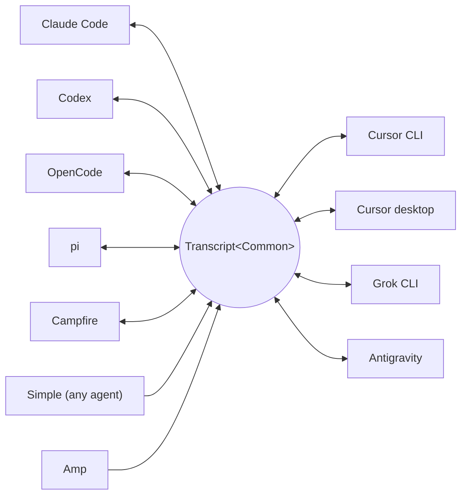

<p align="center">
  <picture>
    <source media="(prefers-color-scheme: dark)" srcset="docs/assets/wordmark-dark.svg">
    
  </picture>
</p>

<p align="center">A library for moving sessions between harnesses</p>

<p align="center">
  English | <a href="README.ja.md">日本語</a> | <a href="README.zh-CN.md">简体中文</a> | <a href="README.zh-TW.md">繁體中文</a> | <a href="README.ko.md">한국어</a> | <a href="README.de.md">Deutsch</a> | <a href="README.es.md">Español</a> | <a href="README.fr.md">Français</a> | <a href="README.it.md">Italiano</a> | <a href="README.pt-BR.md">Português (Brasil)</a> | <a href="README.ru.md">Русский</a> | <a href="README.mr.md">मराठी</a> | <a href="README.ta.md">தமிழ்</a>
</p>

<p align="center">
  <a href="https://crates.io/crates/txcript"></a>
  <a href="https://www.npmjs.com/package/txcript"></a>
  <a href="https://docs.rs/txcript"></a>
  <a href="https://github.com/skillsynchq/txcript/actions/workflows/ci.yml"></a>
  <a href="LICENSE"></a>
</p>

<p align="center">
  <a href="https://claude.com/claude-code"></a>
  &nbsp;&nbsp;&nbsp;&nbsp;
  <a href="https://github.com/openai/codex"></a>
  &nbsp;&nbsp;&nbsp;&nbsp;
  <a href="https://opencode.ai"></a>
  &nbsp;&nbsp;&nbsp;&nbsp;
  <a href="https://pi.dev"></a>
  &nbsp;&nbsp;&nbsp;&nbsp;
  <a href="https://cursor.com"></a>
  &nbsp;&nbsp;&nbsp;&nbsp;
  <a href="https://github.com/xai-org/grok-build"></a>
  &nbsp;&nbsp;&nbsp;&nbsp;
  <a href="https://ampcode.com"></a>
  &nbsp;&nbsp;&nbsp;&nbsp;
  <a href="https://antigravity.google"></a>
</p>

Start a session in Claude Code, hit a usage limit or a wall, and pick it up in Codex with the full conversation, reasoning, and tool history intact:

<p align="center">
  
</p>

txcript maps each harness's native transcript format through a typed common model. Native load/save is byte-lossless; cross-harness conversion preserves messages, reasoning, tool calls, tool results, images, metadata, and usage where available. It ships as a [**CLI**](#cli), a [**Rust crate**](#rust-crate), and an [**npm package**](#npm-package).

## Highlights

- **11 harnesses, one model**: every format converts through `Transcript<Common>`, so adding a harness connects it to all the others.
- **A format for everyone else**: agents txcript has never heard of emit the documented [Simple](docs/formats/simple.md) interchange JSON — a file or a stream, handed to txcript directly — and their transcripts continue in any supported harness.
- **Byte-lossless round-trips**: loading and saving a session in its own format reproduces it exactly.
- **Continue anywhere**: `txcript continue <id> --with <harness>` rewrites a session into another harness's native format and launches it. The original is never modified.
- **Search everything**: fuzzy/substring search across every session on the machine (fzf-style syntax, powered by [nucleo](https://github.com/helix-editor/nucleo)), as a library API, a one-shot CLI query, or an interactive picker.
- **MCP server**: `txcript mcp` exposes read-only `list_sessions`, `search_sessions`, and `read_session` tools, so agents can mine past sessions as context.
- **Documented formats**: every harness's on-disk format is written up in [`docs/formats/`](docs/formats), with provenance for each claim (official docs, source permalinks, or reverse-engineering notes).

## Supported harnesses



Discovery, listing, search, `view`, and native round-trips work for every harness with a local store. The `id` strings are what the CLI and WASM APIs take.

| Harness | id | Sessions on disk | Native format | Convert | Continue into | Doc |
|---|---|---|---|:---:|:---:|---|
| [Claude Code](https://claude.com/claude-code) | `claude_code` | `~/.claude/projects/` | JSONL | ⇄ | ✓ | [spec](docs/formats/claude-code.md) |
| [Codex](https://github.com/openai/codex) | `codex` | `~/.codex/sessions/` | rollout JSONL | ⇄ | ✓ | [spec](docs/formats/codex.md) |
| [OpenCode](https://opencode.ai) | `opencode` | `~/.local/share/opencode/opencode.db` | SQLite | ⇄ | ✓ | [spec](docs/formats/opencode.md) |
| [pi](https://pi.dev) | `pi` | `~/.pi/agent/sessions/` | JSONL | ⇄ | ✓ | [spec](docs/formats/pi.md) |
| [Campfire](docs/formats/campfire.md) | `campfire` | `~/.campfire/agent/sessions/` | JSONL | ⇄ | ✓ | [spec](docs/formats/campfire.md) |
| [Cursor CLI](https://cursor.com/cli) | `cursor` | `~/.cursor/chats/` | SQLite | ⇄ | ✓ | [spec](docs/formats/cursor.md) |
| [Cursor desktop](https://cursor.com) | `cursor_desktop` | `<Cursor User dir>/globalStorage/` | SQLite | ⇄ | ✓ | — |
| [Grok CLI](https://github.com/xai-org/grok-build) | `grok` | `~/.grok/sessions/` | JSON session dir | ⇄ | ✓ | [spec](docs/formats/grok.md) |
| [Amp](https://ampcode.com) | `amp` | `~/.local/share/amp/threads/` | thread JSON | → | — <sup>1</sup> | [spec](docs/formats/amp.md) |
| [Antigravity](https://antigravity.google) | `antigravity` | `~/.gemini/antigravity-cli/` | SQLite | ⇄ | ✓ | [spec](docs/formats/antigravity.md) |
| Simple | `simple` | — <sup>2</sup> | interchange JSON | → | — <sup>2</sup> | [spec](docs/formats/simple.md) |

<sup>1</sup> Amp threads are server-side and the CLI has no import: sessions convert *from* Amp, but can't be continued into it.

<sup>2</sup> Simple is txcript's own interchange format — the on-ramp for any agent not listed above. There is no app and no managed directory: a Simple session is a document (a file, or stdin) handed to `txcript continue` directly, and the continued conversation lives in the target harness from then on.

## Install

**CLI** (installs the `txcript` binary):

```sh
cargo install --git https://github.com/skillsynchq/txcript txcript-cli
# or from a checkout: cargo install --path cli
```

**Rust crate**:

```sh
cargo add txcript
```

**npm package** (prebuilt WASM, no Rust toolchain needed):

```sh
bun add txcript     # or: npm install txcript
```

## CLI

Discover local sessions and continue one in any harness:

```sh
txcript list                             # local sessions across every harness
txcript continue <id>[#range]            # continue <id>, then launch its harness
    [--with <harness>]                    #   ...continuing in <harness> instead
    [--from <harness>]                    #   scope the id lookup to one harness
    [--out <dir>]                         #   write under <dir>; implies --no-resume
    [--no-resume]                         #   write the session but don't launch
txcript view <id>[#range]                # print a session as compact text
    [--from <harness>]                    #   scope the id lookup to one harness
```

`continue` writes the session where the target harness keeps its sessions, then launches that harness on it, handing over the terminal:

- Same-harness: resumes the original in place.
- Cross-harness (`--with`): re-synthesizes the session into the target's native format. What is written is always a copy; the source session is never modified or removed.
- The launch command is per-harness and overridable: set `TRANSCRIPT_<HARNESS>_RESUME_CMD` to a `{id}` template, e.g. `TRANSCRIPT_CODEX_RESUME_CMD="codex resume {id}"`.

`view` prints the session as compact text, each message numbered by a `── #N ──` rule. `#range` selects messages by those printed ordinals, 1-based and inclusive:

- `abc#7`: message 7 only
- `abc#5-12`: messages 5 through 12
- `abc#5-`: message 5 to the end
- `abc#-10`: start through message 10

`continue` accepts the same suffix and continues just those messages as a new session. A range that would cut a tool call away from its result is refused, and the error suggests the nearest valid range.

### Search

```sh
txcript query 'relay bug'                # one-shot: ranked hits, highlighted
txcript query                            # fzf-style picker; Enter continues
    [--from <harness>]                   #   search only <harness> (default: all)
    [--with <harness>]                   #   continue the pick in <harness>
```

The picker is dependency-free (raw-mode ANSI): type to filter with fzf-style fuzzy syntax, arrows / ctrl-p/n to move, Enter to continue the selection in its own harness (or `--with`), Esc to cancel. Every row shows which kind of content matched: user text, assistant text, thinking, tool use, tool output, or session metadata.

### MCP server

```sh
txcript mcp                              # stdio transport
```

Exposes three read-only tools; their optional filters match the CLI:

- `list_sessions(from?, cwd?)`
- `search_sessions(pattern, from?, cwd?)`
- `read_session(id, from?)`

<sub>\* Omitting `from` includes every harness; omitting `cwd` applies no directory filter. Sessions without a recorded working directory match only when `cwd` is omitted.</sub>

### Shell completions

```sh
txcript completion zsh > ~/.zfunc/_txcript      # or wherever your fpath looks
source <(txcript completion bash)               # bash, ad hoc
txcript completion fish > ~/.config/fish/completions/txcript.fish
```

## Rust crate

```toml
[dependencies]
txcript = "0.6"
# Drops the OpenCode SQLite store (rusqlite); the OpenCode codec stays available.
# txcript = { version = "0.6", default-features = false }
```

Three layers, smallest to largest:

- `Codec`: `to_common` / `from_common` per harness; `convert::<A, B>` chains them through the canonical model.
- `TextCodec`: `from_text` / `to_text` to parse and render a harness's native session text, no I/O.
- `Store`: discover/load/save against a real backend (session directories, or SQLite DBs for OpenCode and both Cursors).

Convert in memory (no filesystem):

```rust
use txcript::harness::{claude_code, codex};
use txcript::{Codec, TextCodec, convert};

let claude = claude_code::ClaudeCode::from_text(jsonl_text)?;          // Transcript<ClaudeCode>
let codex = convert::<claude_code::ClaudeCode, codex::Codex>(&claude)?; // Transcript<Codex>
let codex_text = codex::Codex::to_text(&codex)?;                       // native rollout JSONL
```

Or go through disk with a `Store`:

```rust
use txcript::harness::{claude_code, codex};
use txcript::{Store, convert};

let store = claude_code::ClaudeStore::default_root().expect("home dir");
let found = store.discover()?;                       // cheap metadata scan
let claude = store.load(&found[0].reference)?;       // Transcript<ClaudeCode>

let codex = convert::<_, codex::Codex>(&claude)?;
codex::CodexStore::default_root().expect("home dir").save(&codex)?;  // resumable on disk
```

The canonical model is `Transcript<Common>`: `Meta` + `Vec<Message>`, where a `Message` holds typed `Block`s (`Text`, `Thinking`, `ToolUse`, `ToolResult`, `Image`) and a typed `Tool` enum.

Slash commands the user ran at the harness (`/release patch`) are canonical too: a `Tool::Command` call on the user turn, paired with what the command printed back as its `ToolResult`.

### Search (feature `search`, on by default)

`txcript::search` supports fuzzy and substring search over transcripts via [nucleo](https://github.com/helix-editor/nucleo). One-shot search:

```rust
use txcript::search::{Query, search};

let hits = search(&common, &Query::fuzzy("relay bug"));   // fzf syntax: 'exact ^prefix !not
for hit in hits {
    // hit.origin: User | Assistant | Thinking | ToolUse | ToolResult | Meta
    // hit.span addresses the message; hit.highlights are char ranges into hit.line
    let messages = common.fragment(&hit.span);            // zero-copy: Option<&[Message]>
}
```

For picker-style search, build an `Index` once and query it per keystroke:

```rust
use txcript::search::{DocKey, Index, Query};

let mut index = Index::new();
index.insert(DocKey { harness, id }, &common);   // re-insert replaces; caller owns refresh
let matches = index.query(&Query::fuzzy("srch")); // ranked docs, best lines as hits
```

An empty pattern returns documents newest-first. Tool outputs are excluded by default; use `Origin::ALL` to include them. `Query.harnesses`, `Query.limit`, and `Query.hits_per_doc` narrow results.

### Text projection

`txcript::text::to_text(&common)` is the projection behind [`txcript view`](#cli): a one-way, token-conscious rendering of `Transcript<Common>` for use as LLM context. It keeps messages, reasoning text, and compact tool calls/results; replay-only payloads (encrypted reasoning, usage accounting, inline image bytes) are omitted. `to_text_fragment(&common, &span)` renders a `Span` of the body, keeping each message's ordinal in the full session.

## npm package

The npm package ships the codec as prebuilt WASM for Bun, Node, and browsers. The JS host owns all I/O and calls in for the transformation; the `Store` layer (filesystem, SQLite, subprocess) stays native and is excluded from the WASM build.

```ts
import { convert, toCommon, fromCommon, harnesses } from "txcript";
import { readFileSync, writeFileSync } from "node:fs";

const input = readFileSync("rollout.jsonl", "utf8");

// native -> native (e.g. a Codex rollout into Claude Code's JSONL)
writeFileSync("session.jsonl", convert(input, "codex", "claude_code"));

// canonical view, and back
const common = JSON.parse(toCommon(input, "codex"));   // { meta, messages }
const pi = fromCommon(JSON.stringify(common), "pi");

harnesses(); // ["claude_code","codex","opencode","pi","campfire","cursor","cursor_desktop","grok","amp","antigravity","simple"]
```

Text-in / text-out: `input` is the source harness's native session text and the result is the target's. Invalid harness names or unparseable input throw a JS `Error`.

| Harness | Session text |
|---|---|
| `claude_code`, `codex`, `pi`, `campfire` | session JSONL |
| `opencode` | `opencode export` JSON |
| `cursor` | JSON export of the session's `store.db` |
| `cursor_desktop` | JSON dump of the session's `state.vscdb` rows |
| `grok` | JSON bundle of the session directory's files |
| `amp` | `amp threads export` JSON |
| `antigravity` | JSON dump of the conversation database, protobuf blobs hex-encoded |
| `simple` | the [Simple](docs/formats/simple.md) interchange JSON document |

To build the wasm from source instead:

```sh
git clone https://github.com/skillsynchq/txcript.git
cd txcript
bun run setup        # once: wasm target + wasm-bindgen-cli
bun run build        # produces ./pkg
```

## Format documentation

Not all of these transcript formats are documented by their vendors. [`docs/formats/`](docs/formats) has one document per harness covering where sessions live on disk, how discovery finds them, a dissection of every part of the format, and its quirks, each tagged with the provenance of what it claims: official documentation, the harness's own open-source serialization code (cited with commit-pinned permalinks), or reverse engineering.

## Development

```sh
cargo test                                          # native suite
cargo test --no-default-features                    # without the SQLite store
bun run build && bun examples/convert.ts <file> <from> <to>
```

The binary lives in its own workspace crate (`cli/`, package `txcript-cli`) so its dependencies (clap) never touch library consumers.

## License

[Apache-2.0](LICENSE)
