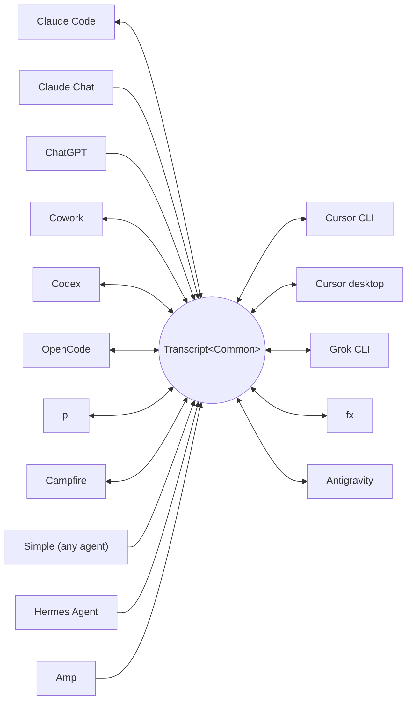

<p align="center">
  <picture>
    <source media="(prefers-color-scheme: dark)" srcset="docs/assets/wordmark-dark.svg">
    
  </picture>
</p>

<p align="center">A library for moving sessions between harnesses</p>

<p align="center">
  English | <a href="docs/translations/README.ja.md">日本語</a> | <a href="docs/translations/README.zh-CN.md">简体中文</a> | <a href="docs/translations/README.zh-TW.md">繁體中文</a> | <a href="docs/translations/README.ko.md">한국어</a> | <a href="docs/translations/README.de.md">Deutsch</a> | <a href="docs/translations/README.es.md">Español</a> | <a href="docs/translations/README.fr.md">Français</a> | <a href="docs/translations/README.it.md">Italiano</a> | <a href="docs/translations/README.pt-BR.md">Português (Brasil)</a> | <a href="docs/translations/README.ru.md">Русский</a> | <a href="docs/translations/README.mr.md">मराठी</a> | <a href="docs/translations/README.ta.md">தமிழ்</a>
</p>

<p align="center">
  <a href="https://crates.io/crates/txcript"></a>
  <a href="https://www.npmjs.com/package/txcript"></a>
  <a href="https://docs.rs/txcript"></a>
  <a href="https://github.com/skillsynchq/txcript/actions/workflows/ci.yml"></a>
  <a href="LICENSE"></a>
</p>

<p align="center">
  <a href="https://claude.com/claude-code"></a>
  &nbsp;&nbsp;&nbsp;&nbsp;
  <a href="https://github.com/openai/codex"></a>
  &nbsp;&nbsp;&nbsp;&nbsp;
  <a href="https://opencode.ai"></a>
  &nbsp;&nbsp;&nbsp;&nbsp;
  <a href="https://pi.dev"></a>
  &nbsp;&nbsp;&nbsp;&nbsp;
  <a href="https://cursor.com"></a>
  &nbsp;&nbsp;&nbsp;&nbsp;
  <a href="https://github.com/xai-org/grok-build"></a>
  &nbsp;&nbsp;&nbsp;&nbsp;
  <a href="https://ampcode.com"></a>
  &nbsp;&nbsp;&nbsp;&nbsp;
  <a href="https://antigravity.google"></a>
</p>

Start a session in Claude Code, hit a usage limit or a wall, and pick it up in Codex with the full conversation, reasoning, and tool history intact:

<p align="center">
  
</p>

txcript maps each harness's native transcript format through a typed common model. Native load/save is byte-lossless; cross-harness conversion preserves messages, reasoning, tool calls, tool results, images, metadata, and usage where available. It ships as a [**CLI**](#cli), a [**Rust crate**](#rust-crate), and an [**npm package**](#npm-package).

## Highlights

- **16 harnesses, one model**: every format converts through `Transcript<Common>`, so adding a harness connects it to all the others.
- **A format for everyone else**: agents txcript has never heard of emit the documented [Simple](docs/formats/simple.md) interchange JSON — a file or a stream, handed to txcript directly — and their transcripts continue in any supported harness.
- **Byte-lossless round-trips**: loading and saving a session in its own format reproduces it exactly.
- **Continue anywhere**: `txcript continue <id> --with <harness>` rewrites a session into another harness's native format and launches it. The original is never modified.
- **Read and carry sessions**: `txcript view` opens any session in a built-in pager, images included on terminals that draw them; `txcript export` writes it as a Simple document that `continue` picks up on another machine.
- **Search everything**: literal, case-insensitive search across every session on the machine, as a library API, a one-shot CLI query, or an interactive picker.
- **MCP server**: `txcript mcp` exposes read-only `list_sessions`, `search_sessions`, and `read_session` tools, so agents can mine past sessions as context.
- **Documented formats**: every harness's on-disk format is written up in [`docs/formats/`](docs/formats), with provenance for each claim (official docs, source permalinks, or reverse-engineering notes).

## Supported harnesses



Discovery, listing, search, and `view` work for every harness with a backing store. The `id` strings are what the CLI and WASM APIs take.

| Harness | id | Sessions on disk | Native format | Convert | Continue into | Doc |
|---|---|---|---|:---:|:---:|---|
| [Claude Code](https://claude.com/claude-code) | `claude_code` | `~/.claude/projects/` | JSONL | ⇄ | ✓ | [spec](docs/formats/claude-code.md) |
| [Claude Chat](https://claude.ai) | `claude_chat` | live `claude.ai` account <sup>4</sup> | private web API | → | — <sup>4</sup> | [spec](docs/formats/claude-chat.md) |
| [ChatGPT](https://chatgpt.com) | `chatgpt` | live `chatgpt.com` account <sup>5</sup> | private web API | → | — <sup>5</sup> | [spec](docs/formats/chatgpt.md) |
| [Cowork](https://claude.com/product/cowork) | `cowork` | `<Claude app data>/local-agent-mode-sessions/` | session record + Claude Code JSONL | ⇄ | ✓ | [spec](docs/formats/cowork.md) |
| [Codex](https://github.com/openai/codex) | `codex` | `~/.codex/sessions/` | rollout JSONL | ⇄ | ✓ | [spec](docs/formats/codex.md) |
| [OpenCode](https://opencode.ai) | `opencode` | `~/.local/share/opencode/opencode.db` | SQLite | ⇄ | ✓ | [spec](docs/formats/opencode.md) |
| [pi](https://pi.dev) | `pi` | `~/.pi/agent/sessions/` | JSONL | ⇄ | ✓ | [spec](docs/formats/pi.md) |
| [Campfire](docs/formats/campfire.md) | `campfire` | `~/.campfire/agent/sessions/` | JSONL | ⇄ | ✓ | [spec](docs/formats/campfire.md) |
| [Cursor CLI](https://cursor.com/cli) | `cursor` | `~/.cursor/chats/` | SQLite | ⇄ | ✓ | [spec](docs/formats/cursor.md) |
| [Cursor desktop](https://cursor.com) | `cursor_desktop` | `<Cursor User dir>/globalStorage/` | SQLite | ⇄ | ✓ | [spec](docs/formats/cursor-desktop.md) |
| [Grok CLI](https://github.com/xai-org/grok-build) | `grok` | `~/.grok/sessions/` | JSON session dir | ⇄ | ✓ | [spec](docs/formats/grok.md) |
| [fx](https://fx.sh) | `fx` | `~/.fx/sessions/` | event-log session dir | ⇄ | ✓ | [spec](docs/formats/fx.md) |
| Hermes Agent | `hermes` | `~/.hermes/state.db` | SQLite | → | — <sup>3</sup> | [spec](docs/formats/hermes.md) |
| [Amp](https://ampcode.com) | `amp` | `~/.local/share/amp/threads/` | thread JSON | → | — <sup>1</sup> | [spec](docs/formats/amp.md) |
| [Antigravity](https://antigravity.google) | `antigravity` | `~/.gemini/antigravity-cli/` | SQLite | ⇄ | ✓ | [spec](docs/formats/antigravity.md) |
| Simple | `simple` | — <sup>2</sup> | interchange JSON | → | — <sup>2</sup> | [spec](docs/formats/simple.md) |

<sup>1</sup> Amp threads are server-side and the CLI has no import: sessions convert *from* Amp, but can't be continued into it.

<sup>2</sup> Simple is txcript's own interchange format — the on-ramp for any agent not listed above. There is no app and no managed directory: a Simple session is a document (a file, or stdin) handed to `txcript continue` directly, and the continued conversation lives in the target harness from then on.

<sup>3</sup> Hermes's `state.db` is read-only in txcript and Hermes has no session-import command: sessions convert *from* Hermes, but can't be continued into it.

<sup>4</sup> Claude Chat is a live, pull-only source. On macOS, explicitly selecting `--from claude_chat` reuses the signed-in Claude Desktop session automatically; aggregate discovery does not contact Claude Chat. Credentials passed through environment variables are not accepted. An optional `TXCRIPT_CLAUDE_CHAT_ORGANIZATION_UUID` restricts discovery to one organization; otherwise the app's active organization is used. Claude Chat has no supported conversation API: txcript reads a private endpoint that Anthropic can observe or restrict, and the Rust crate warns at build time wherever discovery is called directly. txcript only reads: it refuses save, delete, same-harness continue, and `--with claude_chat`. Files Claude generated in the conversation come along; continued into Claude Code, they are written beside the new session and appear as Claude Code artifacts. Claude's data-export ZIP and `conversations.json` are not supported.

<sup>5</sup> ChatGPT is a live, pull-only source. Like Claude Chat reuses Claude Desktop, explicitly selecting `--from chatgpt` automatically reuses the ChatGPT login managed by Codex at `CODEX_HOME/auth.json` or `~/.codex/auth.json`; the account may differ from the one signed in through a browser. txcript only reads that credential file and never refreshes or rewrites it. Aggregate discovery does not contact ChatGPT, while an exact conversation UUID can be read directly without enumerating the account. txcript only reads: it refuses save, delete, same-harness continue, and `--with chatgpt`. ChatGPT has no supported conversation API, so this access may change or be restricted. ChatGPT data-export archives are not supported.

## Install

**CLI** (installs the `txcript` binary):

```sh
cargo install --git https://github.com/skillsynchq/txcript txcript-cli
# or from a checkout: cargo install --path cli
```

**Rust crate**:

```sh
cargo add txcript
```

**npm package** (prebuilt WASM, no Rust toolchain needed):

```sh
bun add txcript     # or: npm install txcript
```

## CLI

Discover local sessions and continue one in any harness:

```sh
txcript list                             # local sessions across every harness
    [--from <harness>]                    #   only this harness's sessions
    [--cwd <dir>]                         #   only sessions recorded under <dir>
    [-n <N>]                              #   at most N sessions
    [--since <when>] [--until <when>]     #   bound the session start time
txcript continue <id>[#range]            # continue <id>, then launch its harness
    [--with <harness>]                    #   ...continuing in <harness> instead
    [--from <harness>]                    #   scope the id lookup to one harness
    [--out <dir>]                         #   write under <dir>; implies --no-resume
    [--no-resume]                         #   write the session but don't launch
txcript continue <file|->[#range]        # continue a Simple document instead:
    --with <harness> [...]                #   a file, or stdin (`-`), from any agent
txcript crop <id>[#range]                # interactively cut messages and save a copy
    [--with <harness>]                    #   optionally convert the cropped copy
    [--from <harness>]                    #   scope the source lookup
txcript view <id>[#range]                # view a session; compact text when piped
    [--from <harness>]                    #   scope the id lookup to one harness
    [--no-pager]                          #   print the terminal view directly
txcript export <id>[#range]              # write a session as a Simple document
    [--from <harness>]                    #   scope the id lookup to one harness
    [--out <file>]                        #   write to <file> instead of stdout
```

A session id is any unambiguous prefix of the full id, or the session's exact title. `txcript resume` is an alias for `continue`. `--since` and `--until` take RFC 3339 timestamps or bare `YYYY-MM-DD` dates.

`continue` writes the session where the target harness keeps its sessions, then launches that harness on it, handing over the terminal:

- Same-harness: resumes the original in place.
- Cross-harness (`--with`): rewrites the session into the target's native format. What is written is always a copy; the source session is never modified or removed.
- A [Simple](docs/formats/simple.md) document instead of an id — `txcript continue ./run.json --with claude_code`, or `my-agent | txcript continue - --with claude_code` — brings any agent's transcript in the same way; `--with` is required since a document has no harness of its own.
- The launch command is per-harness and overridable: set `TRANSCRIPT_<HARNESS>_RESUME_CMD` to a `{id}` template, e.g. `TRANSCRIPT_CODEX_RESUME_CMD="codex resume {id}"`.

`view` in a terminal opens a built-in pager: `u`, `a`, `t`, and `r` hide or show user messages, assistant messages, tool calls, and reasoning; `]` and `[` jump between messages; `/` searches what is shown. Images are drawn inline on terminals that can show them (Ghostty, kitty, WezTerm, Konsole). Set `TXCRIPT_PAGER` to use an external pager instead, or pass `--no-pager` to print the view directly. Piped or redirected, `view` prints the same compact text the MCP server serves. Either way each message is numbered by a `── #N ──` rule, and `#range` selects messages by those printed ordinals, 1-based and inclusive:

- `abc#7`: message 7 only
- `abc#5-12`: messages 5 through 12
- `abc#5-`: message 5 to the end
- `abc#-10`: start through message 10

`continue` accepts the same suffix and continues just those messages as a new session. `crop` opens an interactive editor over the session, in the spirit of a video editor's timeline: every message starts out kept, and you remove the ones you don't want from anywhere in the conversation, not just the ends. Move with `j`/`k` or the arrow keys and press Space to remove the message under the cursor (or restore it). To work on a stretch at once, press `v`, move to the other end, then `x` to remove it, `r` to restore it, or `t` to keep only that stretch; `:3-10` selects a range by number and `:42` jumps to a message. `e` opens the message under the cursor in your editor (`$VISUAL`, `$EDITOR`, or `vi`) as plain text, one heading per block: change the text, trim a tool result, or empty a block to drop it, then save and quit to apply. A terminal editor runs in a pane beside or under the transcript; `E` gives it the whole terminal instead, and an editor that opens its own window is waited for. `u` undoes, `U` redoes, `?` lists every key. Removed messages collapse to their header, edited ones say so, and an overview of the whole session, one cell per message, runs down the right edge or along the bottom depending on the window's shape. Enter saves the kept messages, edits included, as a new session; `q` leaves without saving. A `#range` is optional and opens the editor with only that range kept. The copy defaults to the source harness unless `--with` selects another one, and the source is never modified. A tool call and its result are always removed or restored together, so the saved copy never splits them.

`export` writes the session as a [Simple](docs/formats/simple.md) document, to stdout or `--out <file>`. The document is the full rendering of the canonical model — everything `continue` carries between harnesses — detached from any harness's store, so it moves between machines as a file:

```sh
txcript export 0dc114bf --out session.json       # on this machine
txcript continue ./session.json --with claude_code   # on the other one
```

The recorded working directory is kept when it exists on the importing machine and otherwise replaced by the directory `continue` runs in. `export` accepts the same `#range` suffix and `--from` scope as `view`.

### Search

```sh
txcript query 'relay bug'                # one-shot: ranked hits, highlighted
txcript query                            # interactive picker; Enter continues
    [--from <harness>]                   #   search only <harness> (default: all)
    [--with <harness>]                   #   continue the pick in <harness>
    [--cwd <dir>]                        #   only sessions recorded under <dir>
```

A pattern matches literally and case-insensitively: `relay bug` finds lines containing that exact text, spaces and all.

In the picker, type to filter, arrows / ctrl-p/n to move, Enter to continue the selection in its own harness (or `--with`), Esc to cancel. Every row shows which kind of content matched: user text, assistant text, thinking, tool use, tool output, or session metadata.

Without a cache, every run re-reads every session. Pass `--cache <path>` (or set `TXCRIPT_CACHE`) to keep a persistent search cache at that path, so `query` and the MCP search tool re-read only the sessions that changed since the last run. The flag is accepted by every subcommand.

### MCP server

```sh
txcript mcp                              # stdio transport
```

Exposes three read-only tools; their optional filters match the CLI:

- `list_sessions(from?, cwd?, limit?, offset?)`
- `search_sessions(pattern, from?, cwd?)`
- `read_session(id, from?)`

<sub>\* Omitting `from` includes every harness; omitting `cwd` applies no directory filter. Sessions without a recorded working directory match only when `cwd` is omitted.</sub>

`list_sessions` pages with `limit` and `offset` and reports the total before paging; the live Claude Chat and ChatGPT sources are never listed. `read_session` takes the same `#range` suffix as `view` and returns the same compact text; a read too large to return whole is refused with suggested sub-ranges. `--cache` applies to the server too.

### Shell integration

```sh
eval "$(txcript init zsh)"                      # in ~/.zshrc; or: txcript init bash
```

`init` prints completions plus a ctrl+shift+r binding that opens the picker scoped to sessions recorded in the current folder. For completions alone, `completion` covers bash, elvish, fish, powershell, and zsh:

```sh
txcript completion zsh > ~/.zfunc/_txcript      # or wherever your fpath looks
source <(txcript completion bash)               # bash, ad hoc
txcript completion fish > ~/.config/fish/completions/txcript.fish
```

## Rust crate

```toml
[dependencies]
txcript = "0.12"
# Codecs only: drops the SQLite-backed stores, the live Claude Chat and
# ChatGPT sources, and search. Every codec stays available.
# txcript = { version = "0.12", default-features = false }
```

Default features: `opencode` (the SQLite stores: OpenCode, both Cursors, Antigravity), `hermes`, `claude_chat`, `chatgpt`, and `search`.

Three layers, smallest to largest:

- `Codec`: `to_common` / `from_common` per harness; `convert::<A, B>` chains them through the canonical model.
- `TextCodec`: `from_text` / `to_text` to parse and render a harness's native session text, no I/O.
- `Store`: discover/load/save against a real backend (session directories, or SQLite DBs for OpenCode, Hermes, both Cursors, and Antigravity).

Convert in memory (no filesystem):

```rust
use txcript::harness::{claude_code, codex};
use txcript::{Codec, TextCodec, convert};

let claude = claude_code::ClaudeCode::from_text(jsonl_text)?;          // Transcript<ClaudeCode>
let codex = convert::<claude_code::ClaudeCode, codex::Codex>(&claude)?; // Transcript<Codex>
let codex_text = codex::Codex::to_text(&codex)?;                       // native rollout JSONL
```

Or go through disk with a `Store`:

```rust
use txcript::harness::{claude_code, codex};
use txcript::{Store, convert};

let store = claude_code::ClaudeStore::default_root().expect("home dir");
let found = store.discover()?;                       // cheap metadata scan
let claude = store.load(&found[0].reference)?;       // Transcript<ClaudeCode>

let codex = convert::<_, codex::Codex>(&claude)?;
codex::CodexStore::default_root().expect("home dir").save(&codex)?;  // resumable on disk
```

The canonical model is `Transcript<Common>`: `Meta` + `Vec<Message>`, where a `Message` holds typed `Block`s (`Text`, `Thinking`, `ToolUse`, `ToolResult`, `Image`) and a typed `Tool` enum.

Crop a canonical transcript in memory without changing the source:

```rust
use txcript::{Span, Transcript, Common};

let cropped: Transcript<Common> = common.crop(&Span(4..12))?;
let spliced: Transcript<Common> = common.crop_to(&[Span(0..2), Span(10..40)])?;
```

`Span` is zero-based and half-open in the Rust API. `crop` keeps one range;
`crop_to` keeps the union of several, in order, closing the cuts between
them. Both preserve metadata, copy only the selected messages, reject empty
or out-of-bounds ranges, and refuse to separate a complete tool call from its
result. `CropError` exposes the nearest valid span when expanding the
selection can preserve that pair, and `tool_pairs` lists the call/result
pairs so an editor can keep them together up front.

Slash commands the user ran at the harness (`/release patch`) are canonical too: a `Tool::Command` call on the user turn, paired with what the command printed back as its `ToolResult`.

### Search (feature `search`, on by default)

`txcript::search` supports fuzzy (fzf-style syntax) and substring search over transcripts. One-shot search:

```rust
use txcript::search::{Query, search};

let hits = search(&common, &Query::substring("relay bug"));  // or Query::fuzzy for fzf syntax
for hit in hits {
    // hit.origin: User | Assistant | Thinking | ToolUse | ToolResult | Meta
    // hit.span addresses the message; hit.highlights are char ranges into hit.line
    let messages = common.fragment(&hit.span);            // zero-copy: Option<&[Message]>
}
```

For picker-style search, build an `Index` once and query it per keystroke:

```rust
use txcript::search::{DocKey, Index, Query};

let mut index = Index::new();
index.insert(DocKey { harness, id }, &common);   // re-insert replaces; caller owns refresh
let matches = index.query(&Query::fuzzy("srch")); // ranked docs, best lines as hits
```

An empty pattern returns documents newest-first. Tool outputs are excluded by default; use `Origin::ALL` to include them. `Query.harnesses`, `Query.limit`, and `Query.hits_per_doc` narrow results.

### Text projection

`txcript::text::to_text(&common)` is the projection behind [`txcript view`](#cli): a one-way, token-conscious rendering of `Transcript<Common>` for use as LLM context. It keeps messages, reasoning text, and compact tool calls/results; replay-only payloads (encrypted reasoning, usage accounting, inline image bytes) are omitted. `to_text_fragment(&common, &span)` renders a `Span` of the body, keeping each message's ordinal in the full session.

## npm package

The npm package ships the codec as prebuilt WASM for Bun and Node. It converts session text in memory; discovering, reading, and writing sessions on disk is the caller's job, so the package has no `Store`.

```ts
import { convert, toCommon, fromCommon, harnesses } from "txcript";
import { readFileSync, writeFileSync } from "node:fs";

const input = readFileSync("rollout.jsonl", "utf8");

// native -> native (e.g. a Codex rollout into Claude Code's JSONL)
writeFileSync("session.jsonl", convert(input, "codex", "claude_code"));

// canonical view, and back
const common = JSON.parse(toCommon(input, "codex"));   // { meta, messages }
const pi = fromCommon(JSON.stringify(common), "pi");

harnesses(); // ["claude_code","claude_chat","chatgpt","codex","opencode","pi","campfire","cursor","cursor_desktop","grok","fx","hermes","amp","antigravity","simple","cowork"]
```

Text-in / text-out: `input` is the source harness's native session text and the result is the target's. Invalid harness names or unparseable input throw a JS `Error`.

Search ships too. A query is the JSON form of the crate's `Query`: only `pattern` is required, and `mode` is `"fuzzy"` unless set to `"substring"`:

```ts
import { searchTranscript, Searcher } from "txcript";

// one session, one shot: a JSON array of hits
const hits = JSON.parse(searchTranscript(input, "codex", JSON.stringify({ pattern: "relay bug", mode: "substring" })));

// picker-style: index once, query per keystroke
const index = new Searcher();
index.insert("codex", "0dc114bf", input);          // re-insert replaces
const matches = JSON.parse(index.query(JSON.stringify({ pattern: "relay bug" })));
```

| Harness | Session text |
|---|---|
| `claude_code`, `codex`, `pi`, `campfire` | session JSONL |
| `claude_chat` | one live conversation detail response (source-only; no account export arrays) |
| `chatgpt` | one live conversation detail response (source-only; no account export arrays) |
| `opencode` | `opencode export` JSON |
| `cursor` | JSON export of the session's `store.db` |
| `cursor_desktop` | JSON dump of the session's `state.vscdb` rows |
| `grok` | JSON bundle of the session directory's files |
| `fx` | JSON bundle of the session directory's files |
| `hermes` | `hermes sessions export` JSON object |
| `amp` | `amp threads export` JSON |
| `antigravity` | JSON dump of the conversation database, protobuf blobs hex-encoded |
| `simple` | the [Simple](docs/formats/simple.md) interchange JSON document |
| `cowork` | JSON bundle of the session record, Claude Code transcript, and audit log |

To build the wasm from source instead:

```sh
git clone https://github.com/skillsynchq/txcript.git
cd txcript
bun run setup        # once: wasm target + wasm-bindgen-cli
bun run build        # produces ./pkg
```

## Format documentation

Not all of these transcript formats are documented by their vendors. [`docs/formats/`](docs/formats) has one document per harness covering where sessions live on disk, how discovery finds them, a dissection of every part of the format, and its quirks, each tagged with the provenance of what it claims: official documentation, the harness's own open-source serialization code (cited with commit-pinned permalinks), or reverse engineering.

## Development

```sh
cargo test --workspace --all-features               # what CI runs
cargo test -p txcript --no-default-features         # codecs only: no SQLite or live stores
bun run build && bun examples/convert.ts <file> <from> <to>
git config core.hooksPath .githooks                 # pre-push runs the CI checks
```

The binary lives in its own workspace crate (`cli/`, package `txcript-cli`); the library at the root carries none of its dependencies.

## License

[Apache-2.0](LICENSE)
