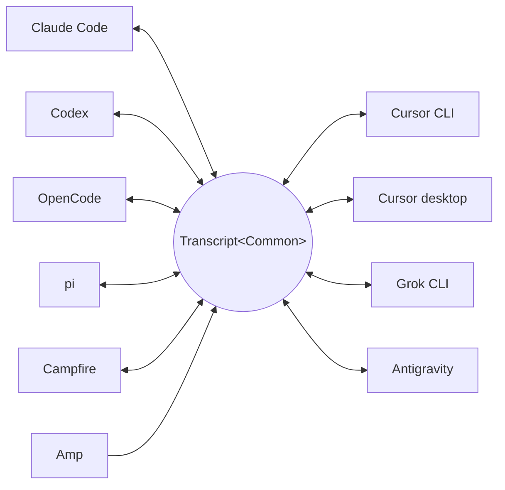

<p align="center">
  <picture>
    <source media="(prefers-color-scheme: dark)" srcset="../assets/wordmark-dark.svg">
    
  </picture>
</p>

<p align="center">Eine Bibliothek zum Umziehen von Sessions zwischen Harnesses</p>

<p align="center">
  <a href="../../README.md">English</a> | <a href="README.ja.md">日本語</a> | <a href="README.zh-CN.md">简体中文</a> | <a href="README.zh-TW.md">繁體中文</a> | <a href="README.ko.md">한국어</a> | Deutsch | <a href="README.es.md">Español</a> | <a href="README.fr.md">Français</a> | <a href="README.it.md">Italiano</a> | <a href="README.pt-BR.md">Português (Brasil)</a> | <a href="README.ru.md">Русский</a> | <a href="README.mr.md">मराठी</a> | <a href="README.ta.md">தமிழ்</a>
</p>

<p align="center">
  <a href="https://crates.io/crates/txcript"></a>
  <a href="https://www.npmjs.com/package/txcript"></a>
  <a href="https://docs.rs/txcript"></a>
  <a href="https://github.com/skillsynchq/txcript/actions/workflows/ci.yml"></a>
  <a href="../../LICENSE"></a>
</p>

<p align="center">
  <a href="https://claude.com/claude-code"></a>
  &nbsp;&nbsp;&nbsp;&nbsp;
  <a href="https://github.com/openai/codex"></a>
  &nbsp;&nbsp;&nbsp;&nbsp;
  <a href="https://opencode.ai"></a>
  &nbsp;&nbsp;&nbsp;&nbsp;
  <a href="https://pi.dev"></a>
  &nbsp;&nbsp;&nbsp;&nbsp;
  <a href="https://cursor.com"></a>
  &nbsp;&nbsp;&nbsp;&nbsp;
  <a href="https://github.com/xai-org/grok-build"></a>
  &nbsp;&nbsp;&nbsp;&nbsp;
  <a href="https://ampcode.com"></a>
  &nbsp;&nbsp;&nbsp;&nbsp;
  <a href="https://antigravity.google"></a>
</p>

Starte eine Session in Claude Code, stoße an ein Nutzungslimit oder eine Wand, und setze sie in Codex fort — mit vollständiger Konversation, Reasoning und Tool-Historie intakt:

<p align="center">
  
</p>

txcript bildet das native Transkriptformat jedes Harness über ein typisiertes gemeinsames Modell ab. Natives Laden/Speichern ist byte-verlustfrei; die Konvertierung zwischen Harnesses erhält Nachrichten, Reasoning, Tool-Aufrufe, Tool-Ergebnisse, Bilder, Metadaten und Usage-Daten, soweit verfügbar. Es wird als [**CLI**](#cli), als [**Rust-Crate**](#rust-crate) und als [**npm-Paket**](#npm-paket) ausgeliefert.

## Highlights

- **10 Harnesses, ein Modell**: jedes Format konvertiert über `Transcript<Common>`, sodass ein neu hinzugefügter Harness sofort mit allen anderen verbunden ist.
- **Byte-verlustfreie Round-Trips**: eine Session im eigenen Format zu laden und zu speichern reproduziert sie exakt.
- **Überall fortsetzen**: `txcript continue <id> --with <harness>` schreibt eine Session in das native Format eines anderen Harness um und startet ihn. Das Original wird nie verändert.
- **Alles durchsuchen**: Fuzzy-/Substring-Suche über jede Session auf dem Rechner (fzf-artige Syntax, angetrieben von [nucleo](https://github.com/helix-editor/nucleo)), als Bibliotheks-API, als einmalige CLI-Abfrage oder als interaktiver Picker.
- **MCP-Server**: `txcript mcp` stellt die schreibgeschützten Tools `list_sessions`, `search_sessions` und `read_session` bereit, sodass Agents vergangene Sessions als Kontext auswerten können.
- **Dokumentierte Formate**: das On-Disk-Format jedes Harness ist in [`docs/formats/`](../formats) beschrieben, mit Provenienz für jede Aussage (offizielle Dokumentation, Quellcode-Permalinks oder Reverse-Engineering-Notizen).

## Unterstützte Harnesses



Discovery, Auflistung, Suche, `view` und native Round-Trips funktionieren für jeden Harness. Die `id`-Strings sind das, was CLI und WASM-APIs entgegennehmen.

| Harness | id | Sessions auf der Festplatte | Natives Format | Konvertieren | Fortsetzen in | Doku |
|---|---|---|---|:---:|:---:|---|
| [Claude Code](https://claude.com/claude-code) | `claude_code` | `~/.claude/projects/` | JSONL | ⇄ | ✓ | [Spec](../formats/claude-code.md) |
| [Codex](https://github.com/openai/codex) | `codex` | `~/.codex/sessions/` | Rollout-JSONL | ⇄ | ✓ | [Spec](../formats/codex.md) |
| [OpenCode](https://opencode.ai) | `opencode` | `~/.local/share/opencode/opencode.db` | SQLite | ⇄ | ✓ | [Spec](../formats/opencode.md) |
| [pi](https://pi.dev) | `pi` | `~/.pi/agent/sessions/` | JSONL | ⇄ | ✓ | [Spec](../formats/pi.md) |
| [Campfire](../formats/campfire.md) | `campfire` | `~/.campfire/agent/sessions/` | JSONL | ⇄ | ✓ | [Spec](../formats/campfire.md) |
| [Cursor CLI](https://cursor.com/cli) | `cursor` | `~/.cursor/chats/` | SQLite | ⇄ | ✓ | [Spec](../formats/cursor.md) |
| [Cursor desktop](https://cursor.com) | `cursor_desktop` | `<Cursor User dir>/globalStorage/` | SQLite | ⇄ | ✓ | [Spec](../formats/cursor-desktop.md) |
| [Grok CLI](https://github.com/xai-org/grok-build) | `grok` | `~/.grok/sessions/` | JSON-Session-Verzeichnis | ⇄ | ✓ | [Spec](../formats/grok.md) |
| [Amp](https://ampcode.com) | `amp` | `~/.local/share/amp/threads/` | Thread-JSON | → | — <sup>1</sup> | [Spec](../formats/amp.md) |
| [Antigravity](https://antigravity.google) | `antigravity` | `~/.gemini/antigravity-cli/` | SQLite | ⇄ | ✓ | [Spec](../formats/antigravity.md) |

<sup>1</sup> Amp-Threads liegen serverseitig, und die CLI hat keinen Import: Sessions lassen sich *aus* Amp konvertieren, aber nicht in Amp fortsetzen.

## Installation

**CLI** (installiert das Binary `txcript`):

```sh
cargo install --git https://github.com/skillsynchq/txcript txcript-cli
# or from a checkout: cargo install --path cli
```

**Rust-Crate**:

```sh
cargo add txcript
```

**npm-Paket** (vorgebautes WASM, keine Rust-Toolchain nötig):

```sh
bun add txcript     # or: npm install txcript
```

## CLI

Lokale Sessions entdecken und eine davon in einem beliebigen Harness fortsetzen:

```sh
txcript list                             # local sessions across every harness
txcript continue <id>[#range]            # continue <id>, then launch its harness
    [--with <harness>]                    #   ...continuing in <harness> instead
    [--from <harness>]                    #   scope the id lookup to one harness
    [--out <dir>]                         #   write under <dir>; implies --no-resume
    [--no-resume]                         #   write the session but don't launch
txcript view <id>[#range]                # print a session as compact text
    [--from <harness>]                    #   scope the id lookup to one harness
txcript export <id>[#range]              # write a session as a Simple document
    [--from <harness>]                    #   scope the id lookup to one harness
    [--out <file>]                        #   write to <file> instead of stdout
```

`continue` schreibt die Session dorthin, wo der Ziel-Harness seine Sessions aufbewahrt, und startet anschließend diesen Harness darauf, wobei das Terminal übergeben wird:

- Gleicher Harness: setzt das Original an Ort und Stelle fort.
- Harness-übergreifend (`--with`): synthetisiert die Session neu in das native Format des Ziels. Geschrieben wird immer eine Kopie; die Quell-Session wird nie verändert oder entfernt.
- Der Startbefehl ist pro Harness überschreibbar: `TRANSCRIPT_<HARNESS>_RESUME_CMD` auf ein `{id}`-Template setzen, z. B. `TRANSCRIPT_CODEX_RESUME_CMD="codex resume {id}"`.

`view` gibt die Session als kompakten Text aus, wobei jede Nachricht durch eine `── #N ──`-Linie nummeriert wird. `#range` wählt Nachrichten anhand dieser ausgegebenen Ordinalzahlen aus, 1-basiert und inklusive:

- `abc#7`: nur Nachricht 7
- `abc#5-12`: Nachrichten 5 bis 12
- `abc#5-`: Nachricht 5 bis zum Ende
- `abc#-10`: Anfang bis Nachricht 10

`continue` akzeptiert dasselbe Suffix und setzt nur diese Nachrichten als neue Session fort. Ein Bereich, der einen Tool-Aufruf von seinem Ergebnis trennen würde, wird abgelehnt, und die Fehlermeldung schlägt den nächstgelegenen gültigen Bereich vor.

`export` schreibt die Session als [Simple](../formats/simple.md)-Dokument, nach stdout oder mit `--out <file>`. Das Dokument ist die vollständige Darstellung des kanonischen Modells — alles, was `continue` zwischen Harnesses mitführt — unabhängig davon, wo ein Harness seine Sessions aufbewahrt, sodass es sich als Datei von einer Maschine zur anderen bewegen lässt:

```sh
txcript export 0dc114bf --out session.json       # on this machine
txcript continue ./session.json --with claude_code   # on the other one
```

Das aufgezeichnete Arbeitsverzeichnis wird beibehalten, wenn es auf der importierenden Maschine existiert, und andernfalls durch das Verzeichnis ersetzt, in dem `continue` läuft. `export` akzeptiert dasselbe `#range`-Suffix und denselben `--from`-Scope wie `view`.

### Suche

```sh
txcript query 'relay bug'                # one-shot: ranked hits, highlighted
txcript query                            # fzf-style picker; Enter continues
    [--from <harness>]                   #   search only <harness> (default: all)
    [--with <harness>]                   #   continue the pick in <harness>
```

Der Picker kommt ohne Abhängigkeiten aus (Raw-Mode-ANSI): Tippen filtert mit fzf-artiger Fuzzy-Syntax, Pfeiltasten / ctrl-p/n bewegen die Auswahl, Enter setzt die Auswahl im eigenen Harness fort (oder per `--with`), Esc bricht ab. Jede Zeile zeigt, welche Art von Inhalt getroffen hat: User-Text, Assistant-Text, Thinking, Tool-Nutzung, Tool-Ausgabe oder Session-Metadaten.

### MCP-Server

```sh
txcript mcp                              # stdio transport
```

Stellt drei schreibgeschützte Tools bereit; ihre optionalen Filter entsprechen der CLI:

- `list_sessions(from?, cwd?)`
- `search_sessions(pattern, from?, cwd?)`
- `read_session(id, from?)`

<sub>\* Wird `from` weggelassen, sind alle Harnesses eingeschlossen; wird `cwd` weggelassen, wird kein Verzeichnisfilter angewandt. Sessions ohne aufgezeichnetes Arbeitsverzeichnis matchen nur, wenn `cwd` weggelassen wird.</sub>

### Shell-Completions

```sh
txcript completion zsh > ~/.zfunc/_txcript      # or wherever your fpath looks
source <(txcript completion bash)               # bash, ad hoc
txcript completion fish > ~/.config/fish/completions/txcript.fish
```

## Rust-Crate

```toml
[dependencies]
txcript = "0.6"
# Drops the OpenCode SQLite store (rusqlite); the OpenCode codec stays available.
# txcript = { version = "0.6", default-features = false }
```

Drei Schichten, von der kleinsten zur größten:

- `Codec`: `to_common` / `from_common` pro Harness; `convert::<A, B>` verkettet sie über das kanonische Modell.
- `TextCodec`: `from_text` / `to_text` zum Parsen und Rendern des nativen Session-Texts eines Harness, ohne I/O.
- `Store`: Discover/Load/Save gegen ein echtes Backend (Session-Verzeichnisse oder SQLite-Datenbanken für OpenCode und beide Cursors).

Im Speicher konvertieren (ohne Dateisystem):

```rust
use txcript::harness::{claude_code, codex};
use txcript::{Codec, TextCodec, convert};

let claude = claude_code::ClaudeCode::from_text(jsonl_text)?;          // Transcript<ClaudeCode>
let codex = convert::<claude_code::ClaudeCode, codex::Codex>(&claude)?; // Transcript<Codex>
let codex_text = codex::Codex::to_text(&codex)?;                       // native rollout JSONL
```

Oder über die Festplatte mit einem `Store`:

```rust
use txcript::harness::{claude_code, codex};
use txcript::{Store, convert};

let store = claude_code::ClaudeStore::default_root().expect("home dir");
let found = store.discover()?;                       // cheap metadata scan
let claude = store.load(&found[0].reference)?;       // Transcript<ClaudeCode>

let codex = convert::<_, codex::Codex>(&claude)?;
codex::CodexStore::default_root().expect("home dir").save(&codex)?;  // resumable on disk
```

Das kanonische Modell ist `Transcript<Common>`: `Meta` + `Vec<Message>`, wobei eine `Message` typisierte `Block`s enthält (`Text`, `Thinking`, `ToolUse`, `ToolResult`, `Image`) sowie ein typisiertes `Tool`-Enum.

Slash-Commands, die der User am Harness ausgeführt hat (`/release patch`), sind ebenfalls kanonisch: ein `Tool::Command`-Aufruf auf dem User-Turn, gepaart mit dem, was der Command als `ToolResult` zurückgegeben hat.

### Suche (Feature `search`, standardmäßig aktiviert)

`txcript::search` unterstützt Fuzzy- und Substring-Suche über Transkripte via [nucleo](https://github.com/helix-editor/nucleo). Einmalige Suche:

```rust
use txcript::search::{Query, search};

let hits = search(&common, &Query::fuzzy("relay bug"));   // fzf syntax: 'exact ^prefix !not
for hit in hits {
    // hit.origin: User | Assistant | Thinking | ToolUse | ToolResult | Meta
    // hit.span addresses the message; hit.highlights are char ranges into hit.line
    let messages = common.fragment(&hit.span);            // zero-copy: Option<&[Message]>
}
```

Für Picker-artige Suche wird einmal ein `Index` aufgebaut und pro Tastendruck abgefragt:

```rust
use txcript::search::{DocKey, Index, Query};

let mut index = Index::new();
index.insert(DocKey { harness, id }, &common);   // re-insert replaces; caller owns refresh
let matches = index.query(&Query::fuzzy("srch")); // ranked docs, best lines as hits
```

Ein leeres Pattern liefert Dokumente, neueste zuerst. Tool-Ausgaben sind standardmäßig ausgeschlossen; mit `Origin::ALL` werden sie einbezogen. `Query.harnesses`, `Query.limit` und `Query.hits_per_doc` grenzen die Ergebnisse ein.

### Textprojektion

`txcript::text::to_text(&common)` ist die Projektion hinter [`txcript view`](#cli): eine einseitige, token-bewusste Darstellung von `Transcript<Common>` zur Verwendung als LLM-Kontext. Sie behält Nachrichten, Reasoning-Text und kompakte Tool-Aufrufe/-Ergebnisse; Replay-only-Payloads (verschlüsseltes Reasoning, Usage-Accounting, eingebettete Bildbytes) werden weggelassen. `to_text_fragment(&common, &span)` rendert einen `Span` des Bodys und behält dabei die Ordinalzahl jeder Nachricht in der vollständigen Session.

## npm-Paket

Das npm-Paket liefert den Codec als vorgebautes WASM für Bun, Node und Browser aus. Der JS-Host übernimmt sämtliches I/O und ruft nur für die Transformation hinein; die `Store`-Schicht (Dateisystem, SQLite, Subprozess) bleibt nativ und ist vom WASM-Build ausgeschlossen.

```ts
import { convert, toCommon, fromCommon, harnesses } from "txcript";
import { readFileSync, writeFileSync } from "node:fs";

const input = readFileSync("rollout.jsonl", "utf8");

// native -> native (e.g. a Codex rollout into Claude Code's JSONL)
writeFileSync("session.jsonl", convert(input, "codex", "claude_code"));

// canonical view, and back
const common = JSON.parse(toCommon(input, "codex"));   // { meta, messages }
const pi = fromCommon(JSON.stringify(common), "pi");

harnesses(); // ["claude_code","codex","opencode","pi","campfire","cursor","cursor_desktop","grok","amp","antigravity"]
```

Text rein / Text raus: `input` ist der native Session-Text des Quell-Harness, und das Ergebnis ist der des Ziels. Ungültige Harness-Namen oder nicht parsbare Eingaben werfen einen JS-`Error`.

| Harness | Session-Text |
|---|---|
| `claude_code`, `codex`, `pi`, `campfire` | Session-JSONL |
| `opencode` | `opencode export`-JSON |
| `cursor` | JSON-Export der `store.db` der Session |
| `cursor_desktop` | JSON-Dump der `state.vscdb`-Zeilen der Session |
| `grok` | JSON-Bundle der Dateien des Session-Verzeichnisses |
| `amp` | `amp threads export`-JSON |
| `antigravity` | JSON-Dump der Konversationsdatenbank, Protobuf-Blobs hex-codiert |

Um das WASM stattdessen aus dem Quellcode zu bauen:

```sh
git clone https://github.com/skillsynchq/txcript.git
cd txcript
bun run setup        # once: wasm target + wasm-bindgen-cli
bun run build        # produces ./pkg
```

## Formatdokumentation

Nicht alle dieser Transkriptformate sind von ihren Anbietern dokumentiert. [`docs/formats/`](../formats) enthält ein Dokument pro Harness, das abdeckt, wo Sessions auf der Festplatte liegen, wie die Discovery sie findet, eine Sezierung jedes Teils des Formats sowie seine Eigenheiten, jeweils versehen mit der Provenienz des Behaupteten: offizielle Dokumentation, der eigene Open-Source-Serialisierungscode des Harness (zitiert mit commit-gepinnten Permalinks), oder Reverse Engineering.

## Entwicklung

```sh
cargo test                                          # native suite
cargo test --no-default-features                    # without the SQLite store
bun run build && bun examples/convert.ts <file> <from> <to>
```

Das Binary lebt in einem eigenen Workspace-Crate (`cli/`, Paket `txcript-cli`), damit seine Abhängigkeiten (clap) Bibliotheksnutzer nie berühren.

## Lizenz

[Apache-2.0](../../LICENSE)
