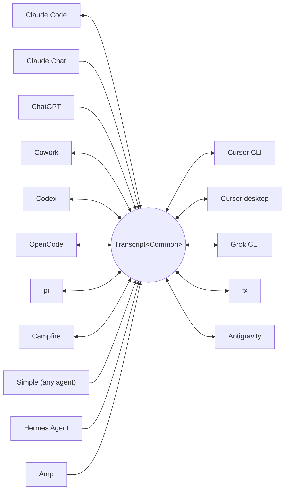

<p align="center">
  <picture>
    <source media="(prefers-color-scheme: dark)" srcset="../assets/wordmark-dark.svg">
    
  </picture>
</p>

<p align="center">Eine Bibliothek zum Umziehen von Sessions zwischen Harnesses</p>

<p align="center">
  <a href="../../README.md">English</a> | <a href="README.ja.md">日本語</a> | <a href="README.zh-CN.md">简体中文</a> | <a href="README.zh-TW.md">繁體中文</a> | <a href="README.ko.md">한국어</a> | Deutsch | <a href="README.es.md">Español</a> | <a href="README.fr.md">Français</a> | <a href="README.it.md">Italiano</a> | <a href="README.pt-BR.md">Português (Brasil)</a> | <a href="README.ru.md">Русский</a> | <a href="README.mr.md">मराठी</a> | <a href="README.ta.md">தமிழ்</a>
</p>

<p align="center">
  <a href="https://crates.io/crates/txcript"></a>
  <a href="https://www.npmjs.com/package/txcript"></a>
  <a href="https://docs.rs/txcript"></a>
  <a href="https://github.com/skillsynchq/txcript/actions/workflows/ci.yml"></a>
  <a href="../../LICENSE"></a>
</p>

<p align="center">
  <a href="https://claude.com/claude-code"></a>
  &nbsp;&nbsp;&nbsp;&nbsp;
  <a href="https://github.com/openai/codex"></a>
  &nbsp;&nbsp;&nbsp;&nbsp;
  <a href="https://opencode.ai"></a>
  &nbsp;&nbsp;&nbsp;&nbsp;
  <a href="https://pi.dev"></a>
  &nbsp;&nbsp;&nbsp;&nbsp;
  <a href="https://cursor.com"></a>
  &nbsp;&nbsp;&nbsp;&nbsp;
  <a href="https://github.com/xai-org/grok-build"></a>
  &nbsp;&nbsp;&nbsp;&nbsp;
  <a href="https://ampcode.com"></a>
  &nbsp;&nbsp;&nbsp;&nbsp;
  <a href="https://antigravity.google"></a>
</p>

Starte eine Session in Claude Code, stoße an ein Nutzungslimit oder eine Wand, und setze sie in Codex fort — mit vollständiger Konversation, Reasoning und Tool-Historie intakt:

<p align="center">
  
</p>

txcript bildet das native Transkriptformat jedes Harness über ein typisiertes gemeinsames Modell ab. Natives Laden/Speichern ist byte-verlustfrei; die Konvertierung zwischen Harnesses erhält Nachrichten, Reasoning, Tool-Aufrufe, Tool-Ergebnisse, Bilder, Metadaten und Usage-Daten, soweit verfügbar. Es wird als [**CLI**](#cli), als [**Rust-Crate**](#rust-crate) und als [**npm-Paket**](#npm-paket) ausgeliefert.

## Highlights

- **16 Harnesses, ein Modell**: jedes Format konvertiert über `Transcript<Common>`, sodass ein neu hinzugefügter Harness sofort mit allen anderen verbunden ist.
- **Ein Format für alle anderen**: Agents, von denen txcript nie gehört hat, geben das dokumentierte [Simple](../formats/simple.md)-Austausch-JSON aus — eine Datei oder ein Stream, direkt an txcript übergeben — und ihre Transkripte werden in jedem unterstützten Harness fortgesetzt.
- **Byte-verlustfreie Round-Trips**: eine Session im eigenen Format zu laden und zu speichern reproduziert sie exakt.
- **Überall fortsetzen**: `txcript continue <id> --with <harness>` schreibt eine Session in das native Format eines anderen Harness um und startet ihn. Das Original wird nie verändert.
- **Sessions lesen und mitnehmen**: `txcript view` öffnet jede Session in einem eingebauten Pager, auf Terminals, die Bilder darstellen, samt Bildern; `txcript export` schreibt sie als Simple-Dokument, das `continue` auf einer anderen Maschine aufgreift.
- **Alles durchsuchen**: literale Suche ohne Beachtung der Groß-/Kleinschreibung über jede Session auf dem Rechner, als Bibliotheks-API, als einmalige CLI-Abfrage oder als interaktiver Picker.
- **MCP-Server**: `txcript mcp` stellt die schreibgeschützten Tools `list_sessions`, `search_sessions` und `read_session` bereit, sodass Agents vergangene Sessions als Kontext auswerten können.
- **Dokumentierte Formate**: das On-Disk-Format jedes Harness ist in [`docs/formats/`](../formats) beschrieben, mit Provenienz für jede Aussage (offizielle Dokumentation, Quellcode-Permalinks oder Reverse-Engineering-Notizen).

## Unterstützte Harnesses



Discovery, Auflistung, Suche und `view` funktionieren für jeden Harness mit einem dahinterliegenden Store. Die `id`-Strings sind das, was CLI und WASM-APIs entgegennehmen.

| Harness | id | Sessions auf der Festplatte | Natives Format | Konvertieren | Fortsetzen in | Doku |
|---|---|---|---|:---:|:---:|---|
| [Claude Code](https://claude.com/claude-code) | `claude_code` | `~/.claude/projects/` | JSONL | ⇄ | ✓ | [Spec](../formats/claude-code.md) |
| [Claude Chat](https://claude.ai) | `claude_chat` | aktives `claude.ai`-Konto <sup>4</sup> | private Web-API | → | — <sup>4</sup> | [Spec](../formats/claude-chat.md) |
| [ChatGPT](https://chatgpt.com) | `chatgpt` | aktives `chatgpt.com`-Konto <sup>5</sup> | private Web-API | → | — <sup>5</sup> | [Spec](../formats/chatgpt.md) |
| [Cowork](https://claude.com/product/cowork) | `cowork` | `<Claude app data>/local-agent-mode-sessions/` | Session-Datensatz + Claude-Code-JSONL | ⇄ | ✓ | [Spec](../formats/cowork.md) |
| [Codex](https://github.com/openai/codex) | `codex` | `~/.codex/sessions/` | Rollout-JSONL | ⇄ | ✓ | [Spec](../formats/codex.md) |
| [OpenCode](https://opencode.ai) | `opencode` | `~/.local/share/opencode/opencode.db` | SQLite | ⇄ | ✓ | [Spec](../formats/opencode.md) |
| [pi](https://pi.dev) | `pi` | `~/.pi/agent/sessions/` | JSONL | ⇄ | ✓ | [Spec](../formats/pi.md) |
| [Campfire](../formats/campfire.md) | `campfire` | `~/.campfire/agent/sessions/` | JSONL | ⇄ | ✓ | [Spec](../formats/campfire.md) |
| [Cursor CLI](https://cursor.com/cli) | `cursor` | `~/.cursor/chats/` | SQLite | ⇄ | ✓ | [Spec](../formats/cursor.md) |
| [Cursor desktop](https://cursor.com) | `cursor_desktop` | `<Cursor User dir>/globalStorage/` | SQLite | ⇄ | ✓ | [Spec](../formats/cursor-desktop.md) |
| [Grok CLI](https://github.com/xai-org/grok-build) | `grok` | `~/.grok/sessions/` | JSON-Session-Verzeichnis | ⇄ | ✓ | [Spec](../formats/grok.md) |
| [fx](https://fx.sh) | `fx` | `~/.fx/sessions/` | Event-Log-Session-Verzeichnis | ⇄ | ✓ | [Spec](../formats/fx.md) |
| Hermes Agent | `hermes` | `~/.hermes/state.db` | SQLite | → | — <sup>3</sup> | [Spec](../formats/hermes.md) |
| [Amp](https://ampcode.com) | `amp` | `~/.local/share/amp/threads/` | Thread-JSON | → | — <sup>1</sup> | [Spec](../formats/amp.md) |
| [Antigravity](https://antigravity.google) | `antigravity` | `~/.gemini/antigravity-cli/` | SQLite | ⇄ | ✓ | [Spec](../formats/antigravity.md) |
| Simple | `simple` | — <sup>2</sup> | Austausch-JSON | → | — <sup>2</sup> | [Spec](../formats/simple.md) |

<sup>1</sup> Amp-Threads liegen serverseitig, und die CLI hat keinen Import: Sessions lassen sich *aus* Amp konvertieren, aber nicht in Amp fortsetzen.

<sup>2</sup> Simple ist txcripts eigenes Austauschformat — der Einstieg für jeden oben nicht aufgeführten Agent. Es gibt keine App und kein verwaltetes Verzeichnis: eine Simple-Session ist ein Dokument (eine Datei oder stdin), das direkt an `txcript continue` übergeben wird, und die fortgesetzte Konversation lebt von da an im Ziel-Harness.

<sup>3</sup> Die `state.db` von Hermes ist in txcript schreibgeschützt, und Hermes hat keinen Befehl zum Session-Import: Sessions lassen sich *aus* Hermes konvertieren, aber nicht in Hermes fortsetzen.

<sup>4</sup> Claude Chat ist eine Live-Quelle, aus der nur abgerufen wird. Unter macOS verwendet die explizite Auswahl von `--from claude_chat` automatisch die angemeldete Claude-Desktop-Session wieder; die aggregierte Discovery kontaktiert Claude Chat nicht. Über Umgebungsvariablen übergebene Anmeldedaten werden nicht akzeptiert. Ein optionales `TXCRIPT_CLAUDE_CHAT_ORGANIZATION_UUID` beschränkt die Discovery auf eine Organisation; andernfalls wird die aktive Organisation der App verwendet. Claude Chat hat keine unterstützte Konversations-API: txcript liest einen privaten Endpunkt, den Anthropic beobachten oder einschränken kann, und das Rust-Crate warnt beim Build überall dort, wo die Discovery direkt aufgerufen wird. txcript liest nur: es verweigert Speichern, Löschen, das Fortsetzen im selben Harness und `--with claude_chat`. Dateien, die Claude in der Konversation generiert hat, kommen mit; in Claude Code fortgesetzt, werden sie neben die neue Session geschrieben und erscheinen als Claude-Code-Artifacts. Claudes Datenexport-ZIP und `conversations.json` werden nicht unterstützt.

<sup>5</sup> ChatGPT ist eine Live-Quelle, aus der nur abgerufen wird. So wie Claude Chat Claude Desktop wiederverwendet, verwendet die explizite Auswahl von `--from chatgpt` automatisch den von Codex verwalteten ChatGPT-Login unter `CODEX_HOME/auth.json` oder `~/.codex/auth.json` wieder; das Konto kann von dem im Browser angemeldeten abweichen. txcript liest diese Anmeldedatei nur und aktualisiert oder überschreibt sie nie. Die aggregierte Discovery kontaktiert ChatGPT nicht, während eine exakte Konversations-UUID direkt gelesen werden kann, ohne das Konto zu enumerieren. txcript liest nur: es verweigert Speichern, Löschen, das Fortsetzen im selben Harness und `--with chatgpt`. ChatGPT hat keine unterstützte Konversations-API, daher kann sich dieser Zugriff ändern oder eingeschränkt werden. ChatGPT-Datenexport-Archive werden nicht unterstützt.

## Installation

**CLI** (installiert das Binary `txcript`):

```sh
cargo install --git https://github.com/skillsynchq/txcript txcript-cli
# or from a checkout: cargo install --path cli
```

**Rust-Crate**:

```sh
cargo add txcript
```

**npm-Paket** (vorgebautes WASM, keine Rust-Toolchain nötig):

```sh
bun add txcript     # or: npm install txcript
```

## CLI

Lokale Sessions entdecken und eine davon in einem beliebigen Harness fortsetzen:

```sh
txcript list                             # local sessions across every harness
    [--from <harness>]                    #   only this harness's sessions
    [--cwd <dir>]                         #   only sessions recorded under <dir>
    [-n <N>]                              #   at most N sessions
    [--since <when>] [--until <when>]     #   bound the session start time
txcript continue <id>[#range]            # continue <id>, then launch its harness
    [--with <harness>]                    #   ...continuing in <harness> instead
    [--from <harness>]                    #   scope the id lookup to one harness
    [--out <dir>]                         #   write under <dir>; implies --no-resume
    [--no-resume]                         #   write the session but don't launch
txcript continue <file|->[#range]        # continue a Simple document instead:
    --with <harness> [...]                #   a file, or stdin (`-`), from any agent
txcript view <id>[#range]                # view a session; compact text when piped
    [--from <harness>]                    #   scope the id lookup to one harness
    [--no-pager]                          #   print the terminal view directly
txcript export <id>[#range]              # write a session as a Simple document
    [--from <harness>]                    #   scope the id lookup to one harness
    [--out <file>]                        #   write to <file> instead of stdout
```

Eine Session-ID ist ein beliebiges eindeutiges Präfix der vollständigen ID oder der exakte Titel der Session. `txcript resume` ist ein Alias für `continue`. `--since` und `--until` nehmen RFC-3339-Zeitstempel oder bloße `YYYY-MM-DD`-Daten entgegen.

`continue` schreibt die Session dorthin, wo der Ziel-Harness seine Sessions aufbewahrt, und startet anschließend diesen Harness darauf, wobei das Terminal übergeben wird:

- Gleicher Harness: setzt das Original an Ort und Stelle fort.
- Harness-übergreifend (`--with`): schreibt die Session in das native Format des Ziels um. Geschrieben wird immer eine Kopie; die Quell-Session wird nie verändert oder entfernt.
- Ein [Simple](../formats/simple.md)-Dokument statt einer ID — `txcript continue ./run.json --with claude_code` oder `my-agent | txcript continue - --with claude_code` — bringt das Transkript jedes Agents auf dieselbe Weise herein; `--with` ist erforderlich, da ein Dokument keinen eigenen Harness hat.
- Der Startbefehl ist pro Harness überschreibbar: `TRANSCRIPT_<HARNESS>_RESUME_CMD` auf ein `{id}`-Template setzen, z. B. `TRANSCRIPT_CODEX_RESUME_CMD="codex resume {id}"`.

`view` öffnet im Terminal einen eingebauten Pager: `u`, `a`, `t` und `r` blenden User-Nachrichten, Assistant-Nachrichten, Tool-Aufrufe und Reasoning aus oder ein; `]` und `[` springen zwischen Nachrichten; `/` durchsucht das Angezeigte. Bilder werden auf Terminals, die sie darstellen können (Ghostty, kitty, WezTerm, Konsole), inline gezeichnet. `TXCRIPT_PAGER` setzen, um stattdessen einen externen Pager zu verwenden, oder `--no-pager` übergeben, um die Ansicht direkt auszugeben. Per Pipe oder Umleitung gibt `view` denselben kompakten Text aus, den der MCP-Server liefert. In beiden Fällen wird jede Nachricht durch eine `── #N ──`-Linie nummeriert, und `#range` wählt Nachrichten anhand dieser ausgegebenen Ordinalzahlen aus, 1-basiert und inklusive:

- `abc#7`: nur Nachricht 7
- `abc#5-12`: Nachrichten 5 bis 12
- `abc#5-`: Nachricht 5 bis zum Ende
- `abc#-10`: Anfang bis Nachricht 10

`continue` akzeptiert dasselbe Suffix und setzt nur diese Nachrichten als neue Session fort. Ein Bereich, der einen Tool-Aufruf von seinem Ergebnis trennen würde, wird abgelehnt, und die Fehlermeldung schlägt den nächstgelegenen gültigen Bereich vor.

`export` schreibt die Session als [Simple](../formats/simple.md)-Dokument, nach stdout oder mit `--out <file>`. Das Dokument ist die vollständige Darstellung des kanonischen Modells — alles, was `continue` zwischen Harnesses mitführt — unabhängig davon, wo ein Harness seine Sessions aufbewahrt, sodass es sich als Datei von einer Maschine zur anderen bewegen lässt:

```sh
txcript export 0dc114bf --out session.json       # on this machine
txcript continue ./session.json --with claude_code   # on the other one
```

Das aufgezeichnete Arbeitsverzeichnis wird beibehalten, wenn es auf der importierenden Maschine existiert, und andernfalls durch das Verzeichnis ersetzt, in dem `continue` läuft. `export` akzeptiert dasselbe `#range`-Suffix und denselben `--from`-Scope wie `view`.

### Suche

```sh
txcript query 'relay bug'                # one-shot: ranked hits, highlighted
txcript query                            # interactive picker; Enter continues
    [--from <harness>]                   #   search only <harness> (default: all)
    [--with <harness>]                   #   continue the pick in <harness>
    [--cwd <dir>]                        #   only sessions recorded under <dir>
```

Ein Pattern matcht literal und ohne Beachtung der Groß-/Kleinschreibung: `relay bug` findet Zeilen, die genau diesen Text enthalten, Leerzeichen eingeschlossen.

Im Picker filtert Tippen, Pfeiltasten / ctrl-p/n bewegen die Auswahl, Enter setzt die Auswahl im eigenen Harness fort (oder per `--with`), Esc bricht ab. Jede Zeile zeigt, welche Art von Inhalt getroffen hat: User-Text, Assistant-Text, Thinking, Tool-Nutzung, Tool-Ausgabe oder Session-Metadaten.

Ohne Cache liest jeder Lauf jede Session erneut. Mit `--cache <path>` (oder gesetztem `TXCRIPT_CACHE`) wird unter diesem Pfad ein persistenter Such-Cache gehalten, sodass `query` und das MCP-Suchtool nur die Sessions erneut lesen, die sich seit dem letzten Lauf geändert haben. Das Flag wird von jedem Unterbefehl akzeptiert.

### MCP-Server

```sh
txcript mcp                              # stdio transport
```

Stellt drei schreibgeschützte Tools bereit; ihre optionalen Filter entsprechen der CLI:

- `list_sessions(from?, cwd?, limit?, offset?)`
- `search_sessions(pattern, from?, cwd?)`
- `read_session(id, from?)`

<sub>\* Wird `from` weggelassen, sind alle Harnesses eingeschlossen; wird `cwd` weggelassen, wird kein Verzeichnisfilter angewandt. Sessions ohne aufgezeichnetes Arbeitsverzeichnis matchen nur, wenn `cwd` weggelassen wird.</sub>

`list_sessions` blättert mit `limit` und `offset` und meldet die Gesamtzahl vor dem Blättern; die Live-Quellen Claude Chat und ChatGPT werden nie aufgelistet. `read_session` nimmt dasselbe `#range`-Suffix wie `view` entgegen und liefert denselben kompakten Text; ein Lesen, das zu groß ist, um im Ganzen zurückgegeben zu werden, wird mit vorgeschlagenen Teilbereichen abgelehnt. `--cache` gilt auch für den Server.

### Shell-Integration

```sh
eval "$(txcript init zsh)"                      # in ~/.zshrc; or: txcript init bash
```

`init` gibt Completions plus eine ctrl+shift+r-Belegung aus, die den Picker eingegrenzt auf die im aktuellen Ordner aufgezeichneten Sessions öffnet. Für Completions allein deckt `completion` bash, elvish, fish, powershell und zsh ab:

```sh
txcript completion zsh > ~/.zfunc/_txcript      # or wherever your fpath looks
source <(txcript completion bash)               # bash, ad hoc
txcript completion fish > ~/.config/fish/completions/txcript.fish
```

## Rust-Crate

```toml
[dependencies]
txcript = "0.12"
# Codecs only: drops the SQLite-backed stores, the live Claude Chat and
# ChatGPT sources, and search. Every codec stays available.
# txcript = { version = "0.12", default-features = false }
```

Standard-Features: `opencode` (die SQLite-Stores: OpenCode, beide Cursors, Antigravity), `hermes`, `claude_chat`, `chatgpt` und `search`.

Drei Schichten, von der kleinsten zur größten:

- `Codec`: `to_common` / `from_common` pro Harness; `convert::<A, B>` verkettet sie über das kanonische Modell.
- `TextCodec`: `from_text` / `to_text` zum Parsen und Rendern des nativen Session-Texts eines Harness, ohne I/O.
- `Store`: Discover/Load/Save gegen ein echtes Backend (Session-Verzeichnisse oder SQLite-Datenbanken für OpenCode, Hermes, beide Cursors und Antigravity).

Im Speicher konvertieren (ohne Dateisystem):

```rust
use txcript::harness::{claude_code, codex};
use txcript::{Codec, TextCodec, convert};

let claude = claude_code::ClaudeCode::from_text(jsonl_text)?;          // Transcript<ClaudeCode>
let codex = convert::<claude_code::ClaudeCode, codex::Codex>(&claude)?; // Transcript<Codex>
let codex_text = codex::Codex::to_text(&codex)?;                       // native rollout JSONL
```

Oder über die Festplatte mit einem `Store`:

```rust
use txcript::harness::{claude_code, codex};
use txcript::{Store, convert};

let store = claude_code::ClaudeStore::default_root().expect("home dir");
let found = store.discover()?;                       // cheap metadata scan
let claude = store.load(&found[0].reference)?;       // Transcript<ClaudeCode>

let codex = convert::<_, codex::Codex>(&claude)?;
codex::CodexStore::default_root().expect("home dir").save(&codex)?;  // resumable on disk
```

Das kanonische Modell ist `Transcript<Common>`: `Meta` + `Vec<Message>`, wobei eine `Message` typisierte `Block`s enthält (`Text`, `Thinking`, `ToolUse`, `ToolResult`, `Image`) sowie ein typisiertes `Tool`-Enum.

Slash-Commands, die der User am Harness ausgeführt hat (`/release patch`), sind ebenfalls kanonisch: ein `Tool::Command`-Aufruf auf dem User-Turn, gepaart mit dem, was der Command als `ToolResult` zurückgegeben hat.

### Suche (Feature `search`, standardmäßig aktiviert)

`txcript::search` unterstützt Fuzzy-Suche (fzf-artige Syntax) und Substring-Suche über Transkripte. Einmalige Suche:

```rust
use txcript::search::{Query, search};

let hits = search(&common, &Query::substring("relay bug"));  // or Query::fuzzy for fzf syntax
for hit in hits {
    // hit.origin: User | Assistant | Thinking | ToolUse | ToolResult | Meta
    // hit.span addresses the message; hit.highlights are char ranges into hit.line
    let messages = common.fragment(&hit.span);            // zero-copy: Option<&[Message]>
}
```

Für Picker-artige Suche wird einmal ein `Index` aufgebaut und pro Tastendruck abgefragt:

```rust
use txcript::search::{DocKey, Index, Query};

let mut index = Index::new();
index.insert(DocKey { harness, id }, &common);   // re-insert replaces; caller owns refresh
let matches = index.query(&Query::fuzzy("srch")); // ranked docs, best lines as hits
```

Ein leeres Pattern liefert Dokumente, neueste zuerst. Tool-Ausgaben sind standardmäßig ausgeschlossen; mit `Origin::ALL` werden sie einbezogen. `Query.harnesses`, `Query.limit` und `Query.hits_per_doc` grenzen die Ergebnisse ein.

### Textprojektion

`txcript::text::to_text(&common)` ist die Projektion hinter [`txcript view`](#cli): eine einseitige, token-bewusste Darstellung von `Transcript<Common>` zur Verwendung als LLM-Kontext. Sie behält Nachrichten, Reasoning-Text und kompakte Tool-Aufrufe/-Ergebnisse; Replay-only-Payloads (verschlüsseltes Reasoning, Usage-Accounting, eingebettete Bildbytes) werden weggelassen. `to_text_fragment(&common, &span)` rendert einen `Span` des Bodys und behält dabei die Ordinalzahl jeder Nachricht in der vollständigen Session.

## npm-Paket

Das npm-Paket liefert den Codec als vorgebautes WASM für Bun und Node aus. Es konvertiert Session-Text im Speicher; Sessions auf der Festplatte zu entdecken, zu lesen und zu schreiben ist Sache des Aufrufers, daher hat das Paket keinen `Store`.

```ts
import { convert, toCommon, fromCommon, harnesses } from "txcript";
import { readFileSync, writeFileSync } from "node:fs";

const input = readFileSync("rollout.jsonl", "utf8");

// native -> native (e.g. a Codex rollout into Claude Code's JSONL)
writeFileSync("session.jsonl", convert(input, "codex", "claude_code"));

// canonical view, and back
const common = JSON.parse(toCommon(input, "codex"));   // { meta, messages }
const pi = fromCommon(JSON.stringify(common), "pi");

harnesses(); // ["claude_code","claude_chat","chatgpt","codex","opencode","pi","campfire","cursor","cursor_desktop","grok","fx","hermes","amp","antigravity","simple","cowork"]
```

Text rein / Text raus: `input` ist der native Session-Text des Quell-Harness, und das Ergebnis ist der des Ziels. Ungültige Harness-Namen oder nicht parsbare Eingaben werfen einen JS-`Error`.

Die Suche wird ebenfalls mitgeliefert. Eine Abfrage ist die JSON-Form der `Query` des Crates: nur `pattern` ist erforderlich, und `mode` ist `"fuzzy"`, sofern nicht auf `"substring"` gesetzt:

```ts
import { searchTranscript, Searcher } from "txcript";

// one session, one shot: a JSON array of hits
const hits = JSON.parse(searchTranscript(input, "codex", JSON.stringify({ pattern: "relay bug", mode: "substring" })));

// picker-style: index once, query per keystroke
const index = new Searcher();
index.insert("codex", "0dc114bf", input);          // re-insert replaces
const matches = JSON.parse(index.query(JSON.stringify({ pattern: "relay bug" })));
```

| Harness | Session-Text |
|---|---|
| `claude_code`, `codex`, `pi`, `campfire` | Session-JSONL |
| `claude_chat` | eine Live-Antwort mit den Konversationsdetails (nur als Quelle; keine Konto-Export-Arrays) |
| `chatgpt` | eine Live-Antwort mit den Konversationsdetails (nur als Quelle; keine Konto-Export-Arrays) |
| `opencode` | `opencode export`-JSON |
| `cursor` | JSON-Export der `store.db` der Session |
| `cursor_desktop` | JSON-Dump der `state.vscdb`-Zeilen der Session |
| `grok` | JSON-Bundle der Dateien des Session-Verzeichnisses |
| `fx` | JSON-Bundle der Dateien des Session-Verzeichnisses |
| `hermes` | `hermes sessions export`-JSON-Objekt |
| `amp` | `amp threads export`-JSON |
| `antigravity` | JSON-Dump der Konversationsdatenbank, Protobuf-Blobs hex-codiert |
| `simple` | das [Simple](../formats/simple.md)-Austausch-JSON-Dokument |
| `cowork` | JSON-Bundle aus Session-Datensatz, Claude-Code-Transkript und Audit-Log |

Um das WASM stattdessen aus dem Quellcode zu bauen:

```sh
git clone https://github.com/skillsynchq/txcript.git
cd txcript
bun run setup        # once: wasm target + wasm-bindgen-cli
bun run build        # produces ./pkg
```

## Formatdokumentation

Nicht alle dieser Transkriptformate sind von ihren Anbietern dokumentiert. [`docs/formats/`](../formats) enthält ein Dokument pro Harness, das abdeckt, wo Sessions auf der Festplatte liegen, wie die Discovery sie findet, eine Sezierung jedes Teils des Formats sowie seine Eigenheiten, jeweils versehen mit der Provenienz des Behaupteten: offizielle Dokumentation, der eigene Open-Source-Serialisierungscode des Harness (zitiert mit commit-gepinnten Permalinks), oder Reverse Engineering.

## Entwicklung

```sh
cargo test --workspace --all-features               # what CI runs
cargo test -p txcript --no-default-features         # codecs only: no SQLite or live stores
bun run build && bun examples/convert.ts <file> <from> <to>
git config core.hooksPath .githooks                 # pre-push runs the CI checks
```

Das Binary lebt in einem eigenen Workspace-Crate (`cli/`, Paket `txcript-cli`); die Bibliothek im Wurzelverzeichnis trägt keine seiner Abhängigkeiten.

## Lizenz

[Apache-2.0](../../LICENSE)
