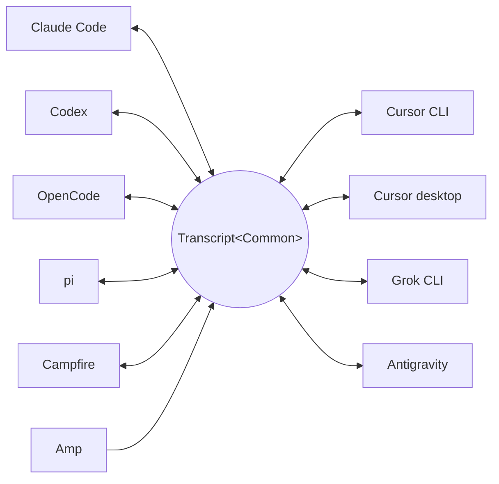

<p align="center">
  <picture>
    <source media="(prefers-color-scheme: dark)" srcset="../assets/wordmark-dark.svg">
    
  </picture>
</p>

<p align="center">Una biblioteca para mover sesiones entre harnesses</p>

<p align="center">
  <a href="../../README.md">English</a> | <a href="README.ja.md">日本語</a> | <a href="README.zh-CN.md">简体中文</a> | <a href="README.zh-TW.md">繁體中文</a> | <a href="README.ko.md">한국어</a> | <a href="README.de.md">Deutsch</a> | Español | <a href="README.fr.md">Français</a> | <a href="README.it.md">Italiano</a> | <a href="README.pt-BR.md">Português (Brasil)</a> | <a href="README.ru.md">Русский</a> | <a href="README.mr.md">मराठी</a> | <a href="README.ta.md">தமிழ்</a>
</p>

<p align="center">
  <a href="https://crates.io/crates/txcript"></a>
  <a href="https://www.npmjs.com/package/txcript"></a>
  <a href="https://docs.rs/txcript"></a>
  <a href="https://github.com/skillsynchq/txcript/actions/workflows/ci.yml"></a>
  <a href="../../LICENSE"></a>
</p>

<p align="center">
  <a href="https://claude.com/claude-code"></a>
  &nbsp;&nbsp;&nbsp;&nbsp;
  <a href="https://github.com/openai/codex"></a>
  &nbsp;&nbsp;&nbsp;&nbsp;
  <a href="https://opencode.ai"></a>
  &nbsp;&nbsp;&nbsp;&nbsp;
  <a href="https://pi.dev"></a>
  &nbsp;&nbsp;&nbsp;&nbsp;
  <a href="https://cursor.com"></a>
  &nbsp;&nbsp;&nbsp;&nbsp;
  <a href="https://github.com/xai-org/grok-build"></a>
  &nbsp;&nbsp;&nbsp;&nbsp;
  <a href="https://ampcode.com"></a>
  &nbsp;&nbsp;&nbsp;&nbsp;
  <a href="https://antigravity.google"></a>
</p>

Empieza una sesión en Claude Code, alcanza un límite de uso o un muro, y retómala en Codex con toda la conversación, el razonamiento y el historial de herramientas intactos:

<p align="center">
  
</p>

txcript mapea el formato nativo de transcripción de cada harness a través de un modelo común tipado. La carga/guardado nativo es sin pérdida a nivel de bytes; la conversión entre harnesses preserva mensajes, razonamiento, llamadas a herramientas, resultados de herramientas, imágenes, metadatos y uso cuando está disponible. Se distribuye como una [**CLI**](#cli), un [**crate de Rust**](#crate-de-rust) y un [**paquete npm**](#paquete-npm).

## Puntos destacados

- **10 harnesses, un solo modelo**: cada formato se convierte a través de `Transcript<Common>`, así que añadir un harness lo conecta con todos los demás.
- **Ida y vuelta sin pérdida a nivel de bytes**: cargar y guardar una sesión en su propio formato la reproduce exactamente.
- **Continúa donde quieras**: `txcript continue <id> --with <harness>` reescribe una sesión al formato nativo de otro harness y lo lanza. El original nunca se modifica.
- **Busca en todo**: búsqueda difusa/por subcadena en todas las sesiones de la máquina (sintaxis estilo fzf, impulsada por [nucleo](https://github.com/helix-editor/nucleo)), como API de biblioteca, consulta puntual desde la CLI o selector interactivo.
- **Servidor MCP**: `txcript mcp` expone las herramientas de solo lectura `list_sessions`, `search_sessions` y `read_session`, para que los agentes puedan explotar sesiones pasadas como contexto.
- **Formatos documentados**: el formato en disco de cada harness está descrito en [`docs/formats/`](../formats), con la procedencia de cada afirmación (documentación oficial, permalinks al código fuente o notas de ingeniería inversa).

## Harnesses compatibles



El descubrimiento, el listado, la búsqueda, `view` y las idas y vueltas nativas funcionan para todos los harnesses. Las cadenas de `id` son las que usan la CLI y las APIs de WASM.

| Harness | id | Sesiones en disco | Formato nativo | Conversión | Continuar hacia | Doc |
|---|---|---|---|:---:|:---:|---|
| [Claude Code](https://claude.com/claude-code) | `claude_code` | `~/.claude/projects/` | JSONL | ⇄ | ✓ | [spec](../formats/claude-code.md) |
| [Codex](https://github.com/openai/codex) | `codex` | `~/.codex/sessions/` | rollout JSONL | ⇄ | ✓ | [spec](../formats/codex.md) |
| [OpenCode](https://opencode.ai) | `opencode` | `~/.local/share/opencode/opencode.db` | SQLite | ⇄ | ✓ | [spec](../formats/opencode.md) |
| [pi](https://pi.dev) | `pi` | `~/.pi/agent/sessions/` | JSONL | ⇄ | ✓ | [spec](../formats/pi.md) |
| [Campfire](../formats/campfire.md) | `campfire` | `~/.campfire/agent/sessions/` | JSONL | ⇄ | ✓ | [spec](../formats/campfire.md) |
| [Cursor CLI](https://cursor.com/cli) | `cursor` | `~/.cursor/chats/` | SQLite | ⇄ | ✓ | [spec](../formats/cursor.md) |
| [Cursor desktop](https://cursor.com) | `cursor_desktop` | `<Cursor User dir>/globalStorage/` | SQLite | ⇄ | ✓ | [spec](../formats/cursor-desktop.md) |
| [Grok CLI](https://github.com/xai-org/grok-build) | `grok` | `~/.grok/sessions/` | directorio de sesión (JSON) | ⇄ | ✓ | [spec](../formats/grok.md) |
| [Amp](https://ampcode.com) | `amp` | `~/.local/share/amp/threads/` | JSON del hilo | → | — <sup>1</sup> | [spec](../formats/amp.md) |
| [Antigravity](https://antigravity.google) | `antigravity` | `~/.gemini/antigravity-cli/` | SQLite | ⇄ | ✓ | [spec](../formats/antigravity.md) |

<sup>1</sup> Los hilos de Amp residen en el servidor y la CLI no tiene importación: las sesiones se convierten *desde* Amp, pero no pueden continuarse en él.

## Instalación

**CLI** (instala el binario `txcript`):

```sh
cargo install --git https://github.com/skillsynchq/txcript txcript-cli
# or from a checkout: cargo install --path cli
```

**Crate de Rust**:

```sh
cargo add txcript
```

**Paquete npm** (WASM precompilado, no requiere toolchain de Rust):

```sh
bun add txcript     # or: npm install txcript
```

## CLI

Descubre sesiones locales y continúa una en cualquier harness:

```sh
txcript list                             # local sessions across every harness
txcript continue <id>[#range]            # continue <id>, then launch its harness
    [--with <harness>]                    #   ...continuing in <harness> instead
    [--from <harness>]                    #   scope the id lookup to one harness
    [--out <dir>]                         #   write under <dir>; implies --no-resume
    [--no-resume]                         #   write the session but don't launch
txcript view <id>[#range]                # print a session as compact text
    [--from <harness>]                    #   scope the id lookup to one harness
txcript export <id>[#range]              # write a session as a Simple document
    [--from <harness>]                    #   scope the id lookup to one harness
    [--out <file>]                        #   write to <file> instead of stdout
```

`continue` escribe la sesión donde el harness de destino guarda sus sesiones, y luego lo lanza sobre ella, cediéndole la terminal:

- Mismo harness: reanuda el original en su sitio.
- Entre harnesses (`--with`): re-sintetiza la sesión al formato nativo del destino. Lo que se escribe es siempre una copia; la sesión de origen nunca se modifica ni se elimina.
- El comando de lanzamiento es específico de cada harness y se puede sobrescribir: define `TRANSCRIPT_<HARNESS>_RESUME_CMD` con una plantilla `{id}`, p. ej. `TRANSCRIPT_CODEX_RESUME_CMD="codex resume {id}"`.

`view` imprime la sesión como texto compacto, numerando cada mensaje con una regla `── #N ──`. `#range` selecciona mensajes por esos ordinales impresos, con base 1 e inclusivos:

- `abc#7`: solo el mensaje 7
- `abc#5-12`: los mensajes del 5 al 12
- `abc#5-`: del mensaje 5 hasta el final
- `abc#-10`: desde el inicio hasta el mensaje 10

`continue` acepta el mismo sufijo y continúa solo esos mensajes como una sesión nueva. Un rango que separaría una llamada a herramienta de su resultado se rechaza, y el error sugiere el rango válido más cercano.

`export` escribe la sesión como un documento [Simple](../formats/simple.md), a stdout o a `--out <file>`. El documento es el renderizado completo del modelo canónico — todo lo que `continue` transporta entre harnesses — independiente de dónde guarda sus sesiones cada harness, así que se mueve de una máquina a otra como un archivo:

```sh
txcript export 0dc114bf --out session.json       # on this machine
txcript continue ./session.json --with claude_code   # on the other one
```

El directorio de trabajo registrado se conserva cuando existe en la máquina de importación, y en caso contrario se reemplaza por el directorio en el que se ejecuta `continue`. `export` acepta el mismo sufijo `#range` y el mismo alcance `--from` que `view`.

### Búsqueda

```sh
txcript query 'relay bug'                # one-shot: ranked hits, highlighted
txcript query                            # fzf-style picker; Enter continues
    [--from <harness>]                   #   search only <harness> (default: all)
    [--with <harness>]                   #   continue the pick in <harness>
```

El selector no tiene dependencias (ANSI en modo raw): escribe para filtrar con sintaxis difusa estilo fzf, flechas / ctrl-p/n para moverte, Enter para continuar la selección en su propio harness (o `--with`), Esc para cancelar. Cada fila muestra qué tipo de contenido coincidió: texto de usuario, texto de asistente, razonamiento, uso de herramientas, salida de herramientas o metadatos de la sesión.

### Servidor MCP

```sh
txcript mcp                              # stdio transport
```

Expone tres herramientas de solo lectura; sus filtros opcionales coinciden con los de la CLI:

- `list_sessions(from?, cwd?)`
- `search_sessions(pattern, from?, cwd?)`
- `read_session(id, from?)`

<sub>\* Omitir `from` incluye todos los harnesses; omitir `cwd` no aplica ningún filtro de directorio. Las sesiones sin directorio de trabajo registrado solo coinciden cuando se omite `cwd`.</sub>

### Autocompletado de shell

```sh
txcript completion zsh > ~/.zfunc/_txcript      # or wherever your fpath looks
source <(txcript completion bash)               # bash, ad hoc
txcript completion fish > ~/.config/fish/completions/txcript.fish
```

## Crate de Rust

```toml
[dependencies]
txcript = "0.6"
# Drops the OpenCode SQLite store (rusqlite); the OpenCode codec stays available.
# txcript = { version = "0.6", default-features = false }
```

Tres capas, de menor a mayor:

- `Codec`: `to_common` / `from_common` por harness; `convert::<A, B>` los encadena a través del modelo canónico.
- `TextCodec`: `from_text` / `to_text` para parsear y renderizar el texto de sesión nativo de un harness, sin I/O.
- `Store`: descubre/carga/guarda contra un backend real (directorios de sesiones, o bases de datos SQLite para OpenCode y las dos variantes de Cursor).

Convierte en memoria (sin sistema de archivos):

```rust
use txcript::harness::{claude_code, codex};
use txcript::{Codec, TextCodec, convert};

let claude = claude_code::ClaudeCode::from_text(jsonl_text)?;          // Transcript<ClaudeCode>
let codex = convert::<claude_code::ClaudeCode, codex::Codex>(&claude)?; // Transcript<Codex>
let codex_text = codex::Codex::to_text(&codex)?;                       // native rollout JSONL
```

O pasa por disco con un `Store`:

```rust
use txcript::harness::{claude_code, codex};
use txcript::{Store, convert};

let store = claude_code::ClaudeStore::default_root().expect("home dir");
let found = store.discover()?;                       // cheap metadata scan
let claude = store.load(&found[0].reference)?;       // Transcript<ClaudeCode>

let codex = convert::<_, codex::Codex>(&claude)?;
codex::CodexStore::default_root().expect("home dir").save(&codex)?;  // resumable on disk
```

El modelo canónico es `Transcript<Common>`: `Meta` + `Vec<Message>`, donde un `Message` contiene `Block`s tipados (`Text`, `Thinking`, `ToolUse`, `ToolResult`, `Image`) y un enum `Tool` tipado.

Los slash commands que el usuario ejecutó en el harness (`/release patch`) también son canónicos: una llamada `Tool::Command` en el turno del usuario, emparejada con lo que el comando devolvió como su `ToolResult`.

### Búsqueda (feature `search`, activada por defecto)

`txcript::search` soporta búsqueda difusa y por subcadena sobre transcripciones mediante [nucleo](https://github.com/helix-editor/nucleo). Búsqueda puntual:

```rust
use txcript::search::{Query, search};

let hits = search(&common, &Query::fuzzy("relay bug"));   // fzf syntax: 'exact ^prefix !not
for hit in hits {
    // hit.origin: User | Assistant | Thinking | ToolUse | ToolResult | Meta
    // hit.span addresses the message; hit.highlights are char ranges into hit.line
    let messages = common.fragment(&hit.span);            // zero-copy: Option<&[Message]>
}
```

Para búsquedas tipo selector, construye un `Index` una vez y consúltalo con cada pulsación de tecla:

```rust
use txcript::search::{DocKey, Index, Query};

let mut index = Index::new();
index.insert(DocKey { harness, id }, &common);   // re-insert replaces; caller owns refresh
let matches = index.query(&Query::fuzzy("srch")); // ranked docs, best lines as hits
```

Un patrón vacío devuelve los documentos ordenados del más reciente al más antiguo. Las salidas de herramientas se excluyen por defecto; usa `Origin::ALL` para incluirlas. `Query.harnesses`, `Query.limit` y `Query.hits_per_doc` acotan los resultados.

### Proyección de texto

`txcript::text::to_text(&common)` es la proyección detrás de [`txcript view`](#cli): un renderizado unidireccional y consciente de tokens de `Transcript<Common>` para usar como contexto de LLM. Conserva los mensajes, el texto de razonamiento y llamadas/resultados de herramientas compactos; las cargas útiles solo de reproducción (razonamiento cifrado, contabilidad de uso, bytes de imágenes en línea) se omiten. `to_text_fragment(&common, &span)` renderiza un `Span` del cuerpo, conservando el ordinal de cada mensaje en la sesión completa.

## Paquete npm

El paquete npm distribuye el codec como WASM precompilado para Bun, Node y navegadores. El host de JS es dueño de todo el I/O y llama para la transformación; la capa `Store` (sistema de archivos, SQLite, subprocesos) permanece nativa y queda excluida del build WASM.

```ts
import { convert, toCommon, fromCommon, harnesses } from "txcript";
import { readFileSync, writeFileSync } from "node:fs";

const input = readFileSync("rollout.jsonl", "utf8");

// native -> native (e.g. a Codex rollout into Claude Code's JSONL)
writeFileSync("session.jsonl", convert(input, "codex", "claude_code"));

// canonical view, and back
const common = JSON.parse(toCommon(input, "codex"));   // { meta, messages }
const pi = fromCommon(JSON.stringify(common), "pi");

harnesses(); // ["claude_code","codex","opencode","pi","campfire","cursor","cursor_desktop","grok","amp","antigravity"]
```

Texto de entrada / texto de salida: `input` es el texto de sesión nativo del harness de origen y el resultado es el del destino. Los nombres de harness inválidos o la entrada no parseable lanzan un `Error` de JS.

| Harness | Texto de sesión |
|---|---|
| `claude_code`, `codex`, `pi`, `campfire` | JSONL de sesión |
| `opencode` | JSON de `opencode export` |
| `cursor` | export JSON del `store.db` de la sesión |
| `cursor_desktop` | volcado JSON de las filas `state.vscdb` de la sesión |
| `grok` | bundle JSON de los archivos del directorio de sesión |
| `amp` | JSON de `amp threads export` |
| `antigravity` | volcado JSON de la base de datos de conversaciones, blobs protobuf codificados en hexadecimal |

Para compilar el wasm desde el código fuente:

```sh
git clone https://github.com/skillsynchq/txcript.git
cd txcript
bun run setup        # once: wasm target + wasm-bindgen-cli
bun run build        # produces ./pkg
```

## Documentación de formatos

No todos estos formatos de transcripción están documentados por sus proveedores. [`docs/formats/`](../formats) tiene un documento por harness que cubre dónde viven las sesiones en disco, cómo las encuentra el descubrimiento, una disección de cada parte del formato y sus particularidades, cada uno etiquetado con la procedencia de lo que afirma: documentación oficial, el propio código de serialización open source del harness (citado con permalinks fijados a un commit) o ingeniería inversa.

## Desarrollo

```sh
cargo test                                          # native suite
cargo test --no-default-features                    # without the SQLite store
bun run build && bun examples/convert.ts <file> <from> <to>
```

El binario vive en su propio crate del workspace (`cli/`, paquete `txcript-cli`), así que sus dependencias (clap) nunca afectan a los consumidores de la biblioteca.

## Licencia

[Apache-2.0](../../LICENSE)
