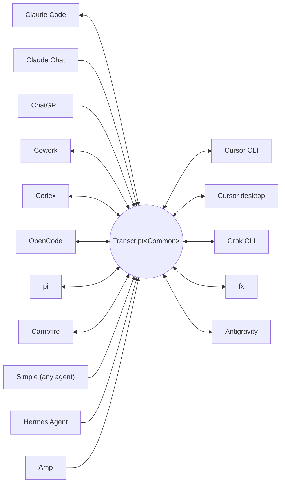

<p align="center">
  <picture>
    <source media="(prefers-color-scheme: dark)" srcset="../assets/wordmark-dark.svg">
    
  </picture>
</p>

<p align="center">Una biblioteca para mover sesiones entre harnesses</p>

<p align="center">
  <a href="../../README.md">English</a> | <a href="README.ja.md">日本語</a> | <a href="README.zh-CN.md">简体中文</a> | <a href="README.zh-TW.md">繁體中文</a> | <a href="README.ko.md">한국어</a> | <a href="README.de.md">Deutsch</a> | Español | <a href="README.fr.md">Français</a> | <a href="README.it.md">Italiano</a> | <a href="README.pt-BR.md">Português (Brasil)</a> | <a href="README.ru.md">Русский</a> | <a href="README.mr.md">मराठी</a> | <a href="README.ta.md">தமிழ்</a>
</p>

<p align="center">
  <a href="https://crates.io/crates/txcript"></a>
  <a href="https://www.npmjs.com/package/txcript"></a>
  <a href="https://docs.rs/txcript"></a>
  <a href="https://github.com/skillsynchq/txcript/actions/workflows/ci.yml"></a>
  <a href="../../LICENSE"></a>
</p>

<p align="center">
  <a href="https://claude.com/claude-code"></a>
  &nbsp;&nbsp;&nbsp;&nbsp;
  <a href="https://github.com/openai/codex"></a>
  &nbsp;&nbsp;&nbsp;&nbsp;
  <a href="https://opencode.ai"></a>
  &nbsp;&nbsp;&nbsp;&nbsp;
  <a href="https://pi.dev"></a>
  &nbsp;&nbsp;&nbsp;&nbsp;
  <a href="https://cursor.com"></a>
  &nbsp;&nbsp;&nbsp;&nbsp;
  <a href="https://github.com/xai-org/grok-build"></a>
  &nbsp;&nbsp;&nbsp;&nbsp;
  <a href="https://ampcode.com"></a>
  &nbsp;&nbsp;&nbsp;&nbsp;
  <a href="https://antigravity.google"></a>
</p>

Empieza una sesión en Claude Code, alcanza un límite de uso o un muro, y retómala en Codex con toda la conversación, el razonamiento y el historial de herramientas intactos:

<p align="center">
  
</p>

txcript mapea el formato nativo de transcripción de cada harness a través de un modelo común tipado. La carga/guardado nativo es sin pérdida a nivel de bytes; la conversión entre harnesses preserva mensajes, razonamiento, llamadas a herramientas, resultados de herramientas, imágenes, metadatos y uso cuando está disponible. Se distribuye como una [**CLI**](#cli), un [**crate de Rust**](#crate-de-rust) y un [**paquete npm**](#paquete-npm).

## Puntos destacados

- **16 harnesses, un solo modelo**: cada formato se convierte a través de `Transcript<Common>`, así que añadir un harness lo conecta con todos los demás.
- **Un formato para todos los demás**: los agentes que txcript no conoce emiten el JSON de intercambio documentado [Simple](../formats/simple.md) — un archivo o un flujo, entregado directamente a txcript — y sus transcripciones continúan en cualquier harness compatible.
- **Ida y vuelta sin pérdida a nivel de bytes**: cargar y guardar una sesión en su propio formato la reproduce exactamente.
- **Continúa donde quieras**: `txcript continue <id> --with <harness>` reescribe una sesión al formato nativo de otro harness y lo lanza. El original nunca se modifica.
- **Lee y lleva sesiones contigo**: `txcript view` abre cualquier sesión en un paginador integrado, imágenes incluidas en las terminales que las dibujan; `txcript export` la escribe como un documento Simple que `continue` recoge en otra máquina.
- **Busca en todo**: búsqueda literal y sin distinguir mayúsculas en todas las sesiones de la máquina, como API de biblioteca, consulta puntual desde la CLI o selector interactivo.
- **Servidor MCP**: `txcript mcp` expone las herramientas de solo lectura `list_sessions`, `search_sessions` y `read_session`, para que los agentes puedan explotar sesiones pasadas como contexto.
- **Formatos documentados**: el formato en disco de cada harness está descrito en [`docs/formats/`](../formats), con la procedencia de cada afirmación (documentación oficial, permalinks al código fuente o notas de ingeniería inversa).

## Harnesses compatibles



El descubrimiento, el listado, la búsqueda y `view` funcionan para todos los harnesses con un store de respaldo. Las cadenas de `id` son las que usan la CLI y las APIs de WASM.

| Harness | id | Sesiones en disco | Formato nativo | Conversión | Continuar hacia | Doc |
|---|---|---|---|:---:|:---:|---|
| [Claude Code](https://claude.com/claude-code) | `claude_code` | `~/.claude/projects/` | JSONL | ⇄ | ✓ | [spec](../formats/claude-code.md) |
| [Claude Chat](https://claude.ai) | `claude_chat` | cuenta activa de `claude.ai` <sup>4</sup> | API web privada | → | — <sup>4</sup> | [spec](../formats/claude-chat.md) |
| [ChatGPT](https://chatgpt.com) | `chatgpt` | cuenta activa de `chatgpt.com` <sup>5</sup> | API web privada | → | — <sup>5</sup> | [spec](../formats/chatgpt.md) |
| [Cowork](https://claude.com/product/cowork) | `cowork` | `<Claude app data>/local-agent-mode-sessions/` | registro de sesión + JSONL de Claude Code | ⇄ | ✓ | [spec](../formats/cowork.md) |
| [Codex](https://github.com/openai/codex) | `codex` | `~/.codex/sessions/` | rollout JSONL | ⇄ | ✓ | [spec](../formats/codex.md) |
| [OpenCode](https://opencode.ai) | `opencode` | `~/.local/share/opencode/opencode.db` | SQLite | ⇄ | ✓ | [spec](../formats/opencode.md) |
| [pi](https://pi.dev) | `pi` | `~/.pi/agent/sessions/` | JSONL | ⇄ | ✓ | [spec](../formats/pi.md) |
| [Campfire](../formats/campfire.md) | `campfire` | `~/.campfire/agent/sessions/` | JSONL | ⇄ | ✓ | [spec](../formats/campfire.md) |
| [Cursor CLI](https://cursor.com/cli) | `cursor` | `~/.cursor/chats/` | SQLite | ⇄ | ✓ | [spec](../formats/cursor.md) |
| [Cursor desktop](https://cursor.com) | `cursor_desktop` | `<Cursor User dir>/globalStorage/` | SQLite | ⇄ | ✓ | [spec](../formats/cursor-desktop.md) |
| [Grok CLI](https://github.com/xai-org/grok-build) | `grok` | `~/.grok/sessions/` | directorio de sesión (JSON) | ⇄ | ✓ | [spec](../formats/grok.md) |
| [fx](https://fx.sh) | `fx` | `~/.fx/sessions/` | directorio de sesión (registro de eventos) | ⇄ | ✓ | [spec](../formats/fx.md) |
| Hermes Agent | `hermes` | `~/.hermes/state.db` | SQLite | → | — <sup>3</sup> | [spec](../formats/hermes.md) |
| [Amp](https://ampcode.com) | `amp` | `~/.local/share/amp/threads/` | JSON del hilo | → | — <sup>1</sup> | [spec](../formats/amp.md) |
| [Antigravity](https://antigravity.google) | `antigravity` | `~/.gemini/antigravity-cli/` | SQLite | ⇄ | ✓ | [spec](../formats/antigravity.md) |
| Simple | `simple` | — <sup>2</sup> | JSON de intercambio | → | — <sup>2</sup> | [spec](../formats/simple.md) |

<sup>1</sup> Los hilos de Amp residen en el servidor y la CLI no tiene importación: las sesiones se convierten *desde* Amp, pero no pueden continuarse en él.

<sup>2</sup> Simple es el formato de intercambio propio de txcript — la vía de entrada para cualquier agente que no aparezca arriba. No hay aplicación ni directorio gestionado: una sesión Simple es un documento (un archivo, o stdin) entregado directamente a `txcript continue`, y a partir de ahí la conversación continuada vive en el harness de destino.

<sup>3</sup> El `state.db` de Hermes es de solo lectura en txcript y Hermes no tiene comando de importación de sesiones: las sesiones se convierten *desde* Hermes, pero no pueden continuarse en él.

<sup>4</sup> Claude Chat es una fuente activa y de solo extracción. En macOS, seleccionar explícitamente `--from claude_chat` reutiliza automáticamente la sesión iniciada en Claude Desktop; el descubrimiento agregado no contacta con Claude Chat. Las credenciales pasadas mediante variables de entorno no se aceptan. Un `TXCRIPT_CLAUDE_CHAT_ORGANIZATION_UUID` opcional restringe el descubrimiento a una organización; en caso contrario se usa la organización activa de la aplicación. Claude Chat no tiene ninguna API de conversaciones oficial: txcript lee un endpoint privado que Anthropic puede observar o restringir, y el crate de Rust avisa en tiempo de compilación allí donde el descubrimiento se llama directamente. txcript solo lee: rechaza guardar, eliminar, continuar en el mismo harness y `--with claude_chat`. Los archivos que Claude generó en la conversación vienen incluidos; al continuar en Claude Code, se escriben junto a la sesión nueva y aparecen como artefactos de Claude Code. El ZIP de exportación de datos de Claude y `conversations.json` no son compatibles.

<sup>5</sup> ChatGPT es una fuente activa y de solo extracción. Igual que Claude Chat reutiliza Claude Desktop, seleccionar explícitamente `--from chatgpt` reutiliza automáticamente el inicio de sesión de ChatGPT gestionado por Codex en `CODEX_HOME/auth.json` o `~/.codex/auth.json`; la cuenta puede diferir de la iniciada desde un navegador. txcript solo lee ese archivo de credenciales y nunca lo refresca ni lo reescribe. El descubrimiento agregado no contacta con ChatGPT, mientras que un UUID de conversación exacto puede leerse directamente sin enumerar la cuenta. txcript solo lee: rechaza guardar, eliminar, continuar en el mismo harness y `--with chatgpt`. ChatGPT no tiene ninguna API de conversaciones oficial, así que este acceso puede cambiar o restringirse. Los archivos de exportación de datos de ChatGPT no son compatibles.

## Instalación

**CLI** (instala el binario `txcript`):

```sh
cargo install --git https://github.com/skillsynchq/txcript txcript-cli
# or from a checkout: cargo install --path cli
```

**Crate de Rust**:

```sh
cargo add txcript
```

**Paquete npm** (WASM precompilado, no requiere toolchain de Rust):

```sh
bun add txcript     # or: npm install txcript
```

## CLI

Descubre sesiones locales y continúa una en cualquier harness:

```sh
txcript list                             # local sessions across every harness
    [--from <harness>]                    #   only this harness's sessions
    [--cwd <dir>]                         #   only sessions recorded under <dir>
    [-n <N>]                              #   at most N sessions
    [--since <when>] [--until <when>]     #   bound the session start time
txcript continue <id>[#range]            # continue <id>, then launch its harness
    [--with <harness>]                    #   ...continuing in <harness> instead
    [--from <harness>]                    #   scope the id lookup to one harness
    [--out <dir>]                         #   write under <dir>; implies --no-resume
    [--no-resume]                         #   write the session but don't launch
txcript continue <file|->[#range]        # continue a Simple document instead:
    --with <harness> [...]                #   a file, or stdin (`-`), from any agent
txcript view <id>[#range]                # view a session; compact text when piped
    [--from <harness>]                    #   scope the id lookup to one harness
    [--no-pager]                          #   print the terminal view directly
txcript export <id>[#range]              # write a session as a Simple document
    [--from <harness>]                    #   scope the id lookup to one harness
    [--out <file>]                        #   write to <file> instead of stdout
```

Un id de sesión es cualquier prefijo no ambiguo del id completo, o el título exacto de la sesión. `txcript resume` es un alias de `continue`. `--since` y `--until` aceptan marcas de tiempo RFC 3339 o fechas simples `YYYY-MM-DD`.

`continue` escribe la sesión donde el harness de destino guarda sus sesiones, y luego lo lanza sobre ella, cediéndole la terminal:

- Mismo harness: reanuda el original en su sitio.
- Entre harnesses (`--with`): reescribe la sesión al formato nativo del destino. Lo que se escribe es siempre una copia; la sesión de origen nunca se modifica ni se elimina.
- Un documento [Simple](../formats/simple.md) en lugar de un id — `txcript continue ./run.json --with claude_code`, o `my-agent | txcript continue - --with claude_code` — trae la transcripción de cualquier agente de la misma manera; `--with` es obligatorio, ya que un documento no tiene harness propio.
- El comando de lanzamiento es específico de cada harness y se puede sobrescribir: define `TRANSCRIPT_<HARNESS>_RESUME_CMD` con una plantilla `{id}`, p. ej. `TRANSCRIPT_CODEX_RESUME_CMD="codex resume {id}"`.

`view` en una terminal abre un paginador integrado: `u`, `a`, `t` y `r` ocultan o muestran los mensajes de usuario, los mensajes de asistente, las llamadas a herramientas y el razonamiento; `]` y `[` saltan entre mensajes; `/` busca en lo que se muestra. Las imágenes se dibujan en línea en las terminales que pueden mostrarlas (Ghostty, kitty, WezTerm, Konsole). Define `TXCRIPT_PAGER` para usar un paginador externo, o pasa `--no-pager` para imprimir la vista directamente. Con la salida por tubería o redirigida, `view` imprime el mismo texto compacto que sirve el servidor MCP. En ambos casos cada mensaje se numera con una regla `── #N ──`, y `#range` selecciona mensajes por esos ordinales impresos, con base 1 e inclusivos:

- `abc#7`: solo el mensaje 7
- `abc#5-12`: los mensajes del 5 al 12
- `abc#5-`: del mensaje 5 hasta el final
- `abc#-10`: desde el inicio hasta el mensaje 10

`continue` acepta el mismo sufijo y continúa solo esos mensajes como una sesión nueva. Un rango que separaría una llamada a herramienta de su resultado se rechaza, y el error sugiere el rango válido más cercano.

`export` escribe la sesión como un documento [Simple](../formats/simple.md), a stdout o a `--out <file>`. El documento es el renderizado completo del modelo canónico — todo lo que `continue` transporta entre harnesses — independiente de dónde guarda sus sesiones cada harness, así que se mueve de una máquina a otra como un archivo:

```sh
txcript export 0dc114bf --out session.json       # on this machine
txcript continue ./session.json --with claude_code   # on the other one
```

El directorio de trabajo registrado se conserva cuando existe en la máquina de importación, y en caso contrario se reemplaza por el directorio en el que se ejecuta `continue`. `export` acepta el mismo sufijo `#range` y el mismo alcance `--from` que `view`.

### Búsqueda

```sh
txcript query 'relay bug'                # one-shot: ranked hits, highlighted
txcript query                            # interactive picker; Enter continues
    [--from <harness>]                   #   search only <harness> (default: all)
    [--with <harness>]                   #   continue the pick in <harness>
    [--cwd <dir>]                        #   only sessions recorded under <dir>
```

Un patrón coincide de forma literal y sin distinguir mayúsculas: `relay bug` encuentra las líneas que contienen exactamente ese texto, espacios incluidos.

En el selector, escribe para filtrar, flechas / ctrl-p/n para moverte, Enter para continuar la selección en su propio harness (o `--with`), Esc para cancelar. Cada fila muestra qué tipo de contenido coincidió: texto de usuario, texto de asistente, razonamiento, uso de herramientas, salida de herramientas o metadatos de la sesión.

Sin caché, cada ejecución relee todas las sesiones. Pasa `--cache <path>` (o define `TXCRIPT_CACHE`) para mantener una caché de búsqueda persistente en esa ruta, de modo que `query` y la herramienta de búsqueda del MCP solo relean las sesiones que cambiaron desde la última ejecución. Todos los subcomandos aceptan el flag.

### Servidor MCP

```sh
txcript mcp                              # stdio transport
```

Expone tres herramientas de solo lectura; sus filtros opcionales coinciden con los de la CLI:

- `list_sessions(from?, cwd?, limit?, offset?)`
- `search_sessions(pattern, from?, cwd?)`
- `read_session(id, from?)`

<sub>\* Omitir `from` incluye todos los harnesses; omitir `cwd` no aplica ningún filtro de directorio. Las sesiones sin directorio de trabajo registrado solo coinciden cuando se omite `cwd`.</sub>

`list_sessions` pagina con `limit` y `offset` e informa del total antes de paginar; las fuentes activas Claude Chat y ChatGPT nunca se listan. `read_session` acepta el mismo sufijo `#range` que `view` y devuelve el mismo texto compacto; una lectura demasiado grande para devolverse entera se rechaza con subrangos sugeridos. `--cache` también se aplica al servidor.

### Integración con el shell

```sh
eval "$(txcript init zsh)"                      # in ~/.zshrc; or: txcript init bash
```

`init` imprime el autocompletado más un atajo ctrl+shift+r que abre el selector acotado a las sesiones registradas en la carpeta actual. Solo para el autocompletado, `completion` cubre bash, elvish, fish, powershell y zsh:

```sh
txcript completion zsh > ~/.zfunc/_txcript      # or wherever your fpath looks
source <(txcript completion bash)               # bash, ad hoc
txcript completion fish > ~/.config/fish/completions/txcript.fish
```

## Crate de Rust

```toml
[dependencies]
txcript = "0.12"
# Codecs only: drops the SQLite-backed stores, the live Claude Chat and
# ChatGPT sources, and search. Every codec stays available.
# txcript = { version = "0.12", default-features = false }
```

Features por defecto: `opencode` (los stores SQLite: OpenCode, las dos variantes de Cursor, Antigravity), `hermes`, `claude_chat`, `chatgpt` y `search`.

Tres capas, de menor a mayor:

- `Codec`: `to_common` / `from_common` por harness; `convert::<A, B>` los encadena a través del modelo canónico.
- `TextCodec`: `from_text` / `to_text` para parsear y renderizar el texto de sesión nativo de un harness, sin I/O.
- `Store`: descubre/carga/guarda contra un backend real (directorios de sesiones, o bases de datos SQLite para OpenCode, Hermes, las dos variantes de Cursor y Antigravity).

Convierte en memoria (sin sistema de archivos):

```rust
use txcript::harness::{claude_code, codex};
use txcript::{Codec, TextCodec, convert};

let claude = claude_code::ClaudeCode::from_text(jsonl_text)?;          // Transcript<ClaudeCode>
let codex = convert::<claude_code::ClaudeCode, codex::Codex>(&claude)?; // Transcript<Codex>
let codex_text = codex::Codex::to_text(&codex)?;                       // native rollout JSONL
```

O pasa por disco con un `Store`:

```rust
use txcript::harness::{claude_code, codex};
use txcript::{Store, convert};

let store = claude_code::ClaudeStore::default_root().expect("home dir");
let found = store.discover()?;                       // cheap metadata scan
let claude = store.load(&found[0].reference)?;       // Transcript<ClaudeCode>

let codex = convert::<_, codex::Codex>(&claude)?;
codex::CodexStore::default_root().expect("home dir").save(&codex)?;  // resumable on disk
```

El modelo canónico es `Transcript<Common>`: `Meta` + `Vec<Message>`, donde un `Message` contiene `Block`s tipados (`Text`, `Thinking`, `ToolUse`, `ToolResult`, `Image`) y un enum `Tool` tipado.

Los slash commands que el usuario ejecutó en el harness (`/release patch`) también son canónicos: una llamada `Tool::Command` en el turno del usuario, emparejada con lo que el comando devolvió como su `ToolResult`.

### Búsqueda (feature `search`, activada por defecto)

`txcript::search` soporta búsqueda difusa (sintaxis estilo fzf) y por subcadena sobre transcripciones. Búsqueda puntual:

```rust
use txcript::search::{Query, search};

let hits = search(&common, &Query::substring("relay bug"));  // or Query::fuzzy for fzf syntax
for hit in hits {
    // hit.origin: User | Assistant | Thinking | ToolUse | ToolResult | Meta
    // hit.span addresses the message; hit.highlights are char ranges into hit.line
    let messages = common.fragment(&hit.span);            // zero-copy: Option<&[Message]>
}
```

Para búsquedas tipo selector, construye un `Index` una vez y consúltalo con cada pulsación de tecla:

```rust
use txcript::search::{DocKey, Index, Query};

let mut index = Index::new();
index.insert(DocKey { harness, id }, &common);   // re-insert replaces; caller owns refresh
let matches = index.query(&Query::fuzzy("srch")); // ranked docs, best lines as hits
```

Un patrón vacío devuelve los documentos ordenados del más reciente al más antiguo. Las salidas de herramientas se excluyen por defecto; usa `Origin::ALL` para incluirlas. `Query.harnesses`, `Query.limit` y `Query.hits_per_doc` acotan los resultados.

### Proyección de texto

`txcript::text::to_text(&common)` es la proyección detrás de [`txcript view`](#cli): un renderizado unidireccional y consciente de tokens de `Transcript<Common>` para usar como contexto de LLM. Conserva los mensajes, el texto de razonamiento y llamadas/resultados de herramientas compactos; las cargas útiles solo de reproducción (razonamiento cifrado, contabilidad de uso, bytes de imágenes en línea) se omiten. `to_text_fragment(&common, &span)` renderiza un `Span` del cuerpo, conservando el ordinal de cada mensaje en la sesión completa.

## Paquete npm

El paquete npm distribuye el codec como WASM precompilado para Bun y Node. Convierte el texto de sesión en memoria; descubrir, leer y escribir sesiones en disco es tarea de quien lo llama, así que el paquete no tiene `Store`.

```ts
import { convert, toCommon, fromCommon, harnesses } from "txcript";
import { readFileSync, writeFileSync } from "node:fs";

const input = readFileSync("rollout.jsonl", "utf8");

// native -> native (e.g. a Codex rollout into Claude Code's JSONL)
writeFileSync("session.jsonl", convert(input, "codex", "claude_code"));

// canonical view, and back
const common = JSON.parse(toCommon(input, "codex"));   // { meta, messages }
const pi = fromCommon(JSON.stringify(common), "pi");

harnesses(); // ["claude_code","claude_chat","chatgpt","codex","opencode","pi","campfire","cursor","cursor_desktop","grok","fx","hermes","amp","antigravity","simple","cowork"]
```

Texto de entrada / texto de salida: `input` es el texto de sesión nativo del harness de origen y el resultado es el del destino. Los nombres de harness inválidos o la entrada no parseable lanzan un `Error` de JS.

La búsqueda también se incluye. Una consulta es la forma JSON del `Query` del crate: solo `pattern` es obligatorio, y `mode` es `"fuzzy"` salvo que se establezca en `"substring"`:

```ts
import { searchTranscript, Searcher } from "txcript";

// one session, one shot: a JSON array of hits
const hits = JSON.parse(searchTranscript(input, "codex", JSON.stringify({ pattern: "relay bug", mode: "substring" })));

// picker-style: index once, query per keystroke
const index = new Searcher();
index.insert("codex", "0dc114bf", input);          // re-insert replaces
const matches = JSON.parse(index.query(JSON.stringify({ pattern: "relay bug" })));
```

| Harness | Texto de sesión |
|---|---|
| `claude_code`, `codex`, `pi`, `campfire` | JSONL de sesión |
| `claude_chat` | una respuesta de detalle de conversación en vivo (solo como origen; sin arrays de exportación de cuenta) |
| `chatgpt` | una respuesta de detalle de conversación en vivo (solo como origen; sin arrays de exportación de cuenta) |
| `opencode` | JSON de `opencode export` |
| `cursor` | export JSON del `store.db` de la sesión |
| `cursor_desktop` | volcado JSON de las filas `state.vscdb` de la sesión |
| `grok` | bundle JSON de los archivos del directorio de sesión |
| `fx` | bundle JSON de los archivos del directorio de sesión |
| `hermes` | objeto JSON de `hermes sessions export` |
| `amp` | JSON de `amp threads export` |
| `antigravity` | volcado JSON de la base de datos de conversaciones, blobs protobuf codificados en hexadecimal |
| `simple` | el documento JSON de intercambio [Simple](../formats/simple.md) |
| `cowork` | bundle JSON del registro de sesión, la transcripción de Claude Code y el registro de auditoría |

Para compilar el wasm desde el código fuente:

```sh
git clone https://github.com/skillsynchq/txcript.git
cd txcript
bun run setup        # once: wasm target + wasm-bindgen-cli
bun run build        # produces ./pkg
```

## Documentación de formatos

No todos estos formatos de transcripción están documentados por sus proveedores. [`docs/formats/`](../formats) tiene un documento por harness que cubre dónde viven las sesiones en disco, cómo las encuentra el descubrimiento, una disección de cada parte del formato y sus particularidades, cada uno etiquetado con la procedencia de lo que afirma: documentación oficial, el propio código de serialización open source del harness (citado con permalinks fijados a un commit) o ingeniería inversa.

## Desarrollo

```sh
cargo test --workspace --all-features               # what CI runs
cargo test -p txcript --no-default-features         # codecs only: no SQLite or live stores
bun run build && bun examples/convert.ts <file> <from> <to>
git config core.hooksPath .githooks                 # pre-push runs the CI checks
```

El binario vive en su propio crate del workspace (`cli/`, paquete `txcript-cli`); la biblioteca en la raíz no carga con ninguna de sus dependencias.

## Licencia

[Apache-2.0](../../LICENSE)
