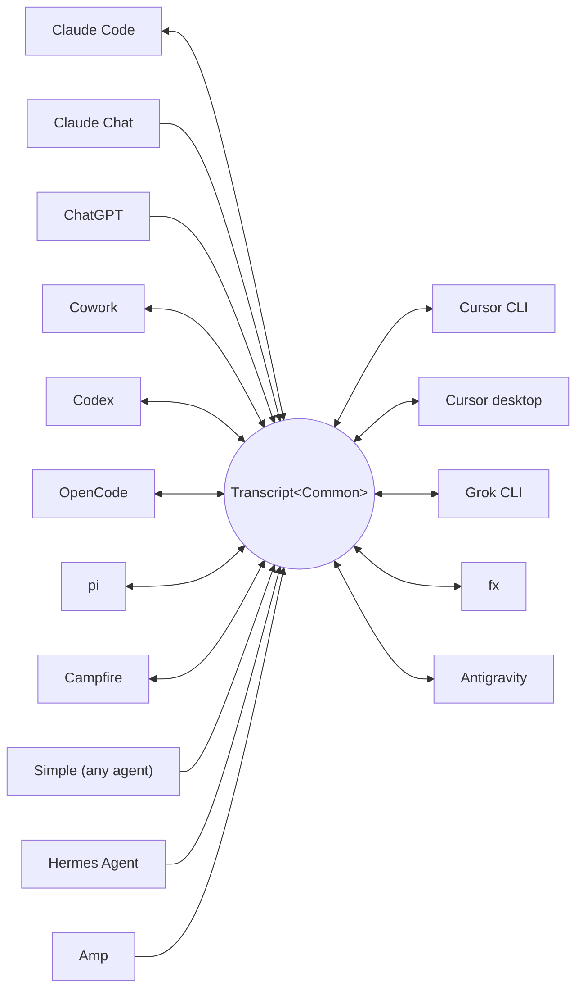

<p align="center">
  <picture>
    <source media="(prefers-color-scheme: dark)" srcset="../assets/wordmark-dark.svg">
    
  </picture>
</p>

<p align="center">Une bibliothèque pour déplacer des sessions entre harnais</p>

<p align="center">
  <a href="../../README.md">English</a> | <a href="README.ja.md">日本語</a> | <a href="README.zh-CN.md">简体中文</a> | <a href="README.zh-TW.md">繁體中文</a> | <a href="README.ko.md">한국어</a> | <a href="README.de.md">Deutsch</a> | <a href="README.es.md">Español</a> | Français | <a href="README.it.md">Italiano</a> | <a href="README.pt-BR.md">Português (Brasil)</a> | <a href="README.ru.md">Русский</a> | <a href="README.mr.md">मराठी</a> | <a href="README.ta.md">தமிழ்</a>
</p>

<p align="center">
  <a href="https://crates.io/crates/txcript"></a>
  <a href="https://www.npmjs.com/package/txcript"></a>
  <a href="https://docs.rs/txcript"></a>
  <a href="https://github.com/skillsynchq/txcript/actions/workflows/ci.yml"></a>
  <a href="../../LICENSE"></a>
</p>

<p align="center">
  <a href="https://claude.com/claude-code"></a>
  &nbsp;&nbsp;&nbsp;&nbsp;
  <a href="https://github.com/openai/codex"></a>
  &nbsp;&nbsp;&nbsp;&nbsp;
  <a href="https://opencode.ai"></a>
  &nbsp;&nbsp;&nbsp;&nbsp;
  <a href="https://pi.dev"></a>
  &nbsp;&nbsp;&nbsp;&nbsp;
  <a href="https://cursor.com"></a>
  &nbsp;&nbsp;&nbsp;&nbsp;
  <a href="https://github.com/xai-org/grok-build"></a>
  &nbsp;&nbsp;&nbsp;&nbsp;
  <a href="https://ampcode.com"></a>
  &nbsp;&nbsp;&nbsp;&nbsp;
  <a href="https://antigravity.google"></a>
</p>

Démarrez une session dans Claude Code, atteignez une limite d'utilisation ou une impasse, puis reprenez-la dans Codex avec l'intégralité de la conversation, du raisonnement et de l'historique des outils :

<p align="center">
  
</p>

txcript fait passer le format de transcription natif de chaque harnais par un modèle commun typé. Le chargement/enregistrement natif est sans perte à l'octet près ; la conversion entre harnais préserve les messages, le raisonnement, les appels d'outils, les résultats d'outils, les images, les métadonnées et l'usage lorsqu'ils sont disponibles. Il est distribué sous forme de [**CLI**](#cli), de [**crate Rust**](#crate-rust) et de [**paquet npm**](#paquet-npm).

## Points forts

- **16 harnais, un seul modèle** — chaque format se convertit via `Transcript<Common>`, si bien qu'ajouter un harnais le connecte à tous les autres.
- **Un format pour tous les autres** — les agents que txcript n'a jamais rencontrés émettent le JSON d'échange [Simple](../formats/simple.md) documenté — un fichier ou un flux, transmis directement à txcript — et leurs transcriptions se poursuivent dans n'importe quel harnais pris en charge.
- **Allers-retours sans perte à l'octet près** — charger puis enregistrer une session dans son propre format la reproduit à l'identique.
- **Continuez n'importe où** — `txcript continue <id> --with <harness>` réécrit une session dans le format natif d'un autre harnais et le lance. L'original n'est jamais modifié.
- **Lisez et transportez des sessions** — `txcript view` ouvre n'importe quelle session dans un pager intégré, images comprises sur les terminaux qui les dessinent ; `txcript export` l'écrit comme document Simple que `continue` récupère sur une autre machine.
- **Cherchez dans tout** — recherche littérale et insensible à la casse dans toutes les sessions de la machine, sous forme d'API de bibliothèque, de requête CLI ponctuelle ou de sélecteur interactif.
- **Serveur MCP** — `txcript mcp` expose les outils en lecture seule `list_sessions`, `search_sessions` et `read_session`, pour que les agents puissent exploiter les sessions passées comme contexte.
- **Formats documentés** — le format sur disque de chaque harnais est décrit dans [`docs/formats/`](../formats), avec la provenance de chaque affirmation (documentation officielle, permaliens vers le code source ou notes de rétro-ingénierie).

## Harnais pris en charge



La découverte, le listage, la recherche et `view` fonctionnent pour chaque harnais doté d'un store sous-jacent. Les chaînes `id` sont celles qu'acceptent la CLI et les API WASM.

| Harnais | id | Sessions sur disque | Format natif | Conversion | Continuer vers | Doc |
|---|---|---|---|:---:|:---:|---|
| [Claude Code](https://claude.com/claude-code) | `claude_code` | `~/.claude/projects/` | JSONL | ⇄ | ✓ | [spec](../formats/claude-code.md) |
| [Claude Chat](https://claude.ai) | `claude_chat` | compte `claude.ai` en direct <sup>4</sup> | API web privée | → | — <sup>4</sup> | [spec](../formats/claude-chat.md) |
| [ChatGPT](https://chatgpt.com) | `chatgpt` | compte `chatgpt.com` en direct <sup>5</sup> | API web privée | → | — <sup>5</sup> | [spec](../formats/chatgpt.md) |
| [Cowork](https://claude.com/product/cowork) | `cowork` | `<Claude app data>/local-agent-mode-sessions/` | enregistrement de session + JSONL Claude Code | ⇄ | ✓ | [spec](../formats/cowork.md) |
| [Codex](https://github.com/openai/codex) | `codex` | `~/.codex/sessions/` | rollout JSONL | ⇄ | ✓ | [spec](../formats/codex.md) |
| [OpenCode](https://opencode.ai) | `opencode` | `~/.local/share/opencode/opencode.db` | SQLite | ⇄ | ✓ | [spec](../formats/opencode.md) |
| [pi](https://pi.dev) | `pi` | `~/.pi/agent/sessions/` | JSONL | ⇄ | ✓ | [spec](../formats/pi.md) |
| [Campfire](../formats/campfire.md) | `campfire` | `~/.campfire/agent/sessions/` | JSONL | ⇄ | ✓ | [spec](../formats/campfire.md) |
| [Cursor CLI](https://cursor.com/cli) | `cursor` | `~/.cursor/chats/` | SQLite | ⇄ | ✓ | [spec](../formats/cursor.md) |
| [Cursor desktop](https://cursor.com) | `cursor_desktop` | `<Cursor User dir>/globalStorage/` | SQLite | ⇄ | ✓ | [spec](../formats/cursor-desktop.md) |
| [Grok CLI](https://github.com/xai-org/grok-build) | `grok` | `~/.grok/sessions/` | répertoire de session (JSON) | ⇄ | ✓ | [spec](../formats/grok.md) |
| [fx](https://fx.sh) | `fx` | `~/.fx/sessions/` | répertoire de session (journal d'événements) | ⇄ | ✓ | [spec](../formats/fx.md) |
| Hermes Agent | `hermes` | `~/.hermes/state.db` | SQLite | → | — <sup>3</sup> | [spec](../formats/hermes.md) |
| [Amp](https://ampcode.com) | `amp` | `~/.local/share/amp/threads/` | JSON de thread | → | — <sup>1</sup> | [spec](../formats/amp.md) |
| [Antigravity](https://antigravity.google) | `antigravity` | `~/.gemini/antigravity-cli/` | SQLite | ⇄ | ✓ | [spec](../formats/antigravity.md) |
| Simple | `simple` | — <sup>2</sup> | JSON d'échange | → | — <sup>2</sup> | [spec](../formats/simple.md) |

<sup>1</sup> Les threads Amp sont côté serveur et la CLI n'a pas d'import : les sessions se convertissent *depuis* Amp, mais ne peuvent pas y être poursuivies.

<sup>2</sup> Simple est le format d'échange propre à txcript — la porte d'entrée pour tout agent absent de la liste ci-dessus. Il n'y a ni application ni répertoire géré : une session Simple est un document (un fichier, ou stdin) transmis directement à `txcript continue`, et la conversation poursuivie vit dès lors dans le harnais cible.

<sup>3</sup> Le `state.db` de Hermes est en lecture seule dans txcript et Hermes n'a pas de commande d'import de session : les sessions se convertissent *depuis* Hermes, mais ne peuvent pas y être poursuivies.

<sup>4</sup> Claude Chat est une source en direct, accessible en lecture seule. Sur macOS, sélectionner explicitement `--from claude_chat` réutilise automatiquement la session Claude Desktop connectée ; la découverte agrégée ne contacte pas Claude Chat. Les identifiants passés par variables d'environnement ne sont pas acceptés. Une variable optionnelle `TXCRIPT_CLAUDE_CHAT_ORGANIZATION_UUID` restreint la découverte à une seule organisation ; sinon, l'organisation active de l'application est utilisée. Claude Chat n'a pas d'API de conversation prise en charge : txcript lit un point de terminaison privé qu'Anthropic peut observer ou restreindre, et le crate Rust émet un avertissement à la compilation partout où la découverte est appelée directement. txcript ne fait que lire : il refuse l'enregistrement, la suppression, la poursuite dans le même harnais et `--with claude_chat`. Les fichiers que Claude a générés dans la conversation sont transportés avec elle ; poursuivis dans Claude Code, ils sont écrits à côté de la nouvelle session et apparaissent comme des artefacts Claude Code. Le ZIP d'export de données de Claude et `conversations.json` ne sont pas pris en charge.

<sup>5</sup> ChatGPT est une source en direct, accessible en lecture seule. De même que Claude Chat réutilise Claude Desktop, sélectionner explicitement `--from chatgpt` réutilise automatiquement la connexion ChatGPT gérée par Codex dans `CODEX_HOME/auth.json` ou `~/.codex/auth.json` ; le compte peut différer de celui connecté via un navigateur. txcript ne fait que lire ce fichier d'identifiants et ne le rafraîchit ni ne le réécrit jamais. La découverte agrégée ne contacte pas ChatGPT, tandis qu'un UUID de conversation exact peut être lu directement sans énumérer le compte. txcript ne fait que lire : il refuse l'enregistrement, la suppression, la poursuite dans le même harnais et `--with chatgpt`. ChatGPT n'a pas d'API de conversation prise en charge, si bien que cet accès peut changer ou être restreint. Les archives d'export de données ChatGPT ne sont pas prises en charge.

## Installation

**CLI** (installe le binaire `txcript`) :

```sh
cargo install --git https://github.com/skillsynchq/txcript txcript-cli
# or from a checkout: cargo install --path cli
```

**Crate Rust** :

```sh
cargo add txcript
```

**Paquet npm** (WASM précompilé, aucune toolchain Rust requise) :

```sh
bun add txcript     # or: npm install txcript
```

## CLI

Découvrez les sessions locales et poursuivez-en une dans n'importe quel harnais :

```sh
txcript list                             # local sessions across every harness
    [--from <harness>]                    #   only this harness's sessions
    [--cwd <dir>]                         #   only sessions recorded under <dir>
    [-n <N>]                              #   at most N sessions
    [--since <when>] [--until <when>]     #   bound the session start time
txcript continue <id>[#range]            # continue <id>, then launch its harness
    [--with <harness>]                    #   ...continuing in <harness> instead
    [--from <harness>]                    #   scope the id lookup to one harness
    [--out <dir>]                         #   write under <dir>; implies --no-resume
    [--no-resume]                         #   write the session but don't launch
txcript continue <file|->[#range]        # continue a Simple document instead:
    --with <harness> [...]                #   a file, or stdin (`-`), from any agent
txcript view <id>[#range]                # view a session; compact text when piped
    [--from <harness>]                    #   scope the id lookup to one harness
    [--no-pager]                          #   print the terminal view directly
txcript export <id>[#range]              # write a session as a Simple document
    [--from <harness>]                    #   scope the id lookup to one harness
    [--out <file>]                        #   write to <file> instead of stdout
```

Un id de session est n'importe quel préfixe non ambigu de l'id complet, ou le titre exact de la session. `txcript resume` est un alias de `continue`. `--since` et `--until` acceptent des horodatages RFC 3339 ou des dates nues `YYYY-MM-DD`.

`continue` écrit la session là où le harnais cible conserve ses sessions, puis lance ce harnais dessus, en lui cédant le terminal :

- Même harnais : reprend l'original en place.
- Inter-harnais (`--with`) : réécrit la session dans le format natif de la cible. Ce qui est écrit est toujours une copie ; la session source n'est jamais modifiée ni supprimée.
- Un document [Simple](../formats/simple.md) à la place d'un id — `txcript continue ./run.json --with claude_code`, ou `my-agent | txcript continue - --with claude_code` — apporte la transcription de n'importe quel agent de la même manière ; `--with` est obligatoire puisqu'un document n'a pas de harnais propre.
- La commande de lancement est propre à chaque harnais et modifiable : définissez `TRANSCRIPT_<HARNESS>_RESUME_CMD` avec un gabarit `{id}`, p. ex. `TRANSCRIPT_CODEX_RESUME_CMD="codex resume {id}"`.

`view` dans un terminal ouvre un pager intégré : `u`, `a`, `t` et `r` masquent ou affichent les messages utilisateur, les messages assistant, les appels d'outils et le raisonnement ; `]` et `[` sautent d'un message à l'autre ; `/` cherche dans ce qui est affiché. Les images sont dessinées en ligne sur les terminaux capables de les afficher (Ghostty, kitty, WezTerm, Konsole). Définissez `TXCRIPT_PAGER` pour utiliser un pager externe à la place, ou passez `--no-pager` pour imprimer la vue directement. En pipe ou redirigé, `view` imprime le même texte compact que sert le serveur MCP. Dans les deux cas, chaque message est numéroté par un filet `── #N ──`, et `#range` sélectionne des messages selon ces ordinaux imprimés, à base 1 et inclusifs :

- `abc#7` : le message 7 uniquement
- `abc#5-12` : les messages 5 à 12
- `abc#5-` : du message 5 jusqu'à la fin
- `abc#-10` : du début jusqu'au message 10

`continue` accepte le même suffixe et ne poursuit que ces messages en tant que nouvelle session. Une plage qui séparerait un appel d'outil de son résultat est refusée, et l'erreur suggère la plage valide la plus proche.

`export` écrit la session comme document [Simple](../formats/simple.md), sur stdout ou dans `--out <file>`. Le document est le rendu complet du modèle canonique — tout ce que `continue` transporte entre les harnais — indépendant de l'endroit où un harnais conserve ses sessions, si bien qu'il se déplace d'une machine à l'autre comme un fichier :

```sh
txcript export 0dc114bf --out session.json       # on this machine
txcript continue ./session.json --with claude_code   # on the other one
```

Le répertoire de travail enregistré est conservé lorsqu'il existe sur la machine d'importation, et sinon remplacé par le répertoire dans lequel `continue` s'exécute. `export` accepte le même suffixe `#range` et la même portée `--from` que `view`.

### Recherche

```sh
txcript query 'relay bug'                # one-shot: ranked hits, highlighted
txcript query                            # interactive picker; Enter continues
    [--from <harness>]                   #   search only <harness> (default: all)
    [--with <harness>]                   #   continue the pick in <harness>
    [--cwd <dir>]                        #   only sessions recorded under <dir>
```

Un motif correspond littéralement et sans distinction de casse : `relay bug` trouve les lignes qui contiennent exactement ce texte, espaces comprises.

Dans le sélecteur, tapez pour filtrer, flèches / ctrl-p/n pour naviguer, Entrée pour poursuivre la sélection dans son propre harnais (ou `--with`), Échap pour annuler. Chaque ligne indique le type de contenu qui a correspondu : texte utilisateur, texte assistant, raisonnement, usage d'outil, sortie d'outil ou métadonnées de session.

Sans cache, chaque exécution relit toutes les sessions. Passez `--cache <path>` (ou définissez `TXCRIPT_CACHE`) pour conserver un cache de recherche persistant à cet emplacement, afin que `query` et l'outil de recherche MCP ne relisent que les sessions modifiées depuis la dernière exécution. Le flag est accepté par toutes les sous-commandes.

### Serveur MCP

```sh
txcript mcp                              # stdio transport
```

Expose trois outils en lecture seule ; leurs filtres optionnels correspondent à ceux de la CLI :

- `list_sessions(from?, cwd?, limit?, offset?)`
- `search_sessions(pattern, from?, cwd?)`
- `read_session(id, from?)`

<sub>\* Omettre `from` inclut tous les harnais ; omettre `cwd` n'applique aucun filtre de répertoire. Les sessions sans répertoire de travail enregistré correspondent uniquement quand `cwd` est omis.</sub>

`list_sessions` pagine avec `limit` et `offset` et rapporte le total avant la pagination ; les sources en direct Claude Chat et ChatGPT ne sont jamais listées. `read_session` accepte le même suffixe `#range` que `view` et renvoie le même texte compact ; une lecture trop volumineuse pour être renvoyée en entier est refusée avec des sous-plages suggérées. `--cache` s'applique aussi au serveur.

### Intégration shell

```sh
eval "$(txcript init zsh)"                      # in ~/.zshrc; or: txcript init bash
```

`init` imprime les complétions ainsi qu'un raccourci ctrl+shift+r qui ouvre le sélecteur restreint aux sessions enregistrées dans le dossier courant. Pour les complétions seules, `completion` couvre bash, elvish, fish, powershell et zsh :

```sh
txcript completion zsh > ~/.zfunc/_txcript      # or wherever your fpath looks
source <(txcript completion bash)               # bash, ad hoc
txcript completion fish > ~/.config/fish/completions/txcript.fish
```

## Crate Rust

```toml
[dependencies]
txcript = "0.12"
# Codecs only: drops the SQLite-backed stores, the live Claude Chat and
# ChatGPT sources, and search. Every codec stays available.
# txcript = { version = "0.12", default-features = false }
```

Features par défaut : `opencode` (les stores SQLite : OpenCode, les deux Cursor, Antigravity), `hermes`, `claude_chat`, `chatgpt` et `search`.

Trois couches, de la plus petite à la plus grande :

- `Codec` : `to_common` / `from_common` par harnais ; `convert::<A, B>` les enchaîne via le modèle canonique.
- `TextCodec` : `from_text` / `to_text` pour analyser et produire le texte de session natif d'un harnais, sans E/S.
- `Store` : découvre/charge/enregistre sur un vrai backend (répertoires de sessions, ou bases SQLite pour OpenCode, Hermes, les deux Cursor et Antigravity).

Convertissez en mémoire (sans système de fichiers) :

```rust
use txcript::harness::{claude_code, codex};
use txcript::{Codec, TextCodec, convert};

let claude = claude_code::ClaudeCode::from_text(jsonl_text)?;          // Transcript<ClaudeCode>
let codex = convert::<claude_code::ClaudeCode, codex::Codex>(&claude)?; // Transcript<Codex>
let codex_text = codex::Codex::to_text(&codex)?;                       // native rollout JSONL
```

Ou passez par le disque avec un `Store` :

```rust
use txcript::harness::{claude_code, codex};
use txcript::{Store, convert};

let store = claude_code::ClaudeStore::default_root().expect("home dir");
let found = store.discover()?;                       // cheap metadata scan
let claude = store.load(&found[0].reference)?;       // Transcript<ClaudeCode>

let codex = convert::<_, codex::Codex>(&claude)?;
codex::CodexStore::default_root().expect("home dir").save(&codex)?;  // resumable on disk
```

Le modèle canonique est `Transcript<Common>` : `Meta` + `Vec<Message>`, où un `Message` contient des `Block`s typés (`Text`, `Thinking`, `ToolUse`, `ToolResult`, `Image`) et un enum `Tool` typé.

Les slash commands que l'utilisateur a lancées dans le harnais (`/release patch`) sont elles aussi canoniques : un appel `Tool::Command` sur le tour utilisateur, associé à ce que la commande a renvoyé en tant que `ToolResult`.

### Recherche (feature `search`, activée par défaut)

`txcript::search` prend en charge la recherche floue (syntaxe façon fzf) et par sous-chaîne sur les transcriptions. Recherche ponctuelle :

```rust
use txcript::search::{Query, search};

let hits = search(&common, &Query::substring("relay bug"));  // or Query::fuzzy for fzf syntax
for hit in hits {
    // hit.origin: User | Assistant | Thinking | ToolUse | ToolResult | Meta
    // hit.span addresses the message; hit.highlights are char ranges into hit.line
    let messages = common.fragment(&hit.span);            // zero-copy: Option<&[Message]>
}
```

Pour une recherche façon sélecteur, construisez un `Index` une fois et interrogez-le à chaque frappe :

```rust
use txcript::search::{DocKey, Index, Query};

let mut index = Index::new();
index.insert(DocKey { harness, id }, &common);   // re-insert replaces; caller owns refresh
let matches = index.query(&Query::fuzzy("srch")); // ranked docs, best lines as hits
```

Un motif vide renvoie les documents du plus récent au plus ancien. Les sorties d'outils sont exclues par défaut ; utilisez `Origin::ALL` pour les inclure. `Query.harnesses`, `Query.limit` et `Query.hits_per_doc` restreignent les résultats.

### Projection texte

`txcript::text::to_text(&common)` est la projection derrière [`txcript view`](#cli) : un rendu à sens unique et économe en tokens de `Transcript<Common>`, destiné à servir de contexte LLM. Elle conserve les messages, le texte de raisonnement et des appels/résultats d'outils compacts ; les charges utiles réservées au rejeu (raisonnement chiffré, comptabilité d'usage, octets d'images en ligne) sont omises. `to_text_fragment(&common, &span)` rend un `Span` du corps, en conservant l'ordinal de chaque message dans la session complète.

## Paquet npm

Le paquet npm distribue le codec sous forme de WASM précompilé pour Bun et Node. Il convertit le texte de session en mémoire ; découvrir, lire et écrire les sessions sur disque revient à l'appelant, si bien que le paquet n'a pas de `Store`.

```ts
import { convert, toCommon, fromCommon, harnesses } from "txcript";
import { readFileSync, writeFileSync } from "node:fs";

const input = readFileSync("rollout.jsonl", "utf8");

// native -> native (e.g. a Codex rollout into Claude Code's JSONL)
writeFileSync("session.jsonl", convert(input, "codex", "claude_code"));

// canonical view, and back
const common = JSON.parse(toCommon(input, "codex"));   // { meta, messages }
const pi = fromCommon(JSON.stringify(common), "pi");

harnesses(); // ["claude_code","claude_chat","chatgpt","codex","opencode","pi","campfire","cursor","cursor_desktop","grok","fx","hermes","amp","antigravity","simple","cowork"]
```

Texte en entrée / texte en sortie : `input` est le texte de session natif du harnais source, et le résultat est celui de la cible. Un nom de harnais invalide ou une entrée non analysable lève une `Error` JS.

La recherche est également incluse. Une requête est la forme JSON du `Query` du crate : seul `pattern` est obligatoire, et `mode` vaut `"fuzzy"` sauf s'il est défini à `"substring"` :

```ts
import { searchTranscript, Searcher } from "txcript";

// one session, one shot: a JSON array of hits
const hits = JSON.parse(searchTranscript(input, "codex", JSON.stringify({ pattern: "relay bug", mode: "substring" })));

// picker-style: index once, query per keystroke
const index = new Searcher();
index.insert("codex", "0dc114bf", input);          // re-insert replaces
const matches = JSON.parse(index.query(JSON.stringify({ pattern: "relay bug" })));
```

| Harnais | Texte de session |
|---|---|
| `claude_code`, `codex`, `pi`, `campfire` | JSONL de session |
| `claude_chat` | une réponse de détail de conversation en direct (source uniquement ; pas de tableaux d'export de compte) |
| `chatgpt` | une réponse de détail de conversation en direct (source uniquement ; pas de tableaux d'export de compte) |
| `opencode` | JSON `opencode export` |
| `cursor` | export JSON du `store.db` de la session |
| `cursor_desktop` | dump JSON des lignes `state.vscdb` de la session |
| `grok` | bundle JSON des fichiers du répertoire de session |
| `fx` | bundle JSON des fichiers du répertoire de session |
| `hermes` | objet JSON `hermes sessions export` |
| `amp` | JSON `amp threads export` |
| `antigravity` | dump JSON de la base de conversations, blobs protobuf encodés en hexadécimal |
| `simple` | le document JSON d'échange [Simple](../formats/simple.md) |
| `cowork` | bundle JSON de l'enregistrement de session, de la transcription Claude Code et du journal d'audit |

Pour compiler le wasm depuis les sources :

```sh
git clone https://github.com/skillsynchq/txcript.git
cd txcript
bun run setup        # once: wasm target + wasm-bindgen-cli
bun run build        # produces ./pkg
```

## Documentation des formats

Tous ces formats de transcription ne sont pas documentés par leurs éditeurs. [`docs/formats/`](../formats) contient un document par harnais couvrant où les sessions vivent sur disque, comment la découverte les trouve, une dissection de chaque partie du format et ses particularités, chacun étiqueté avec la provenance de ce qu'il affirme : documentation officielle, le propre code de sérialisation open source du harnais (cité avec des permaliens épinglés à un commit), ou rétro-ingénierie.

## Développement

```sh
cargo test --workspace --all-features               # what CI runs
cargo test -p txcript --no-default-features         # codecs only: no SQLite or live stores
bun run build && bun examples/convert.ts <file> <from> <to>
git config core.hooksPath .githooks                 # pre-push runs the CI checks
```

Le binaire vit dans son propre crate du workspace (`cli/`, paquet `txcript-cli`) ; la bibliothèque à la racine ne porte aucune de ses dépendances.

## Licence

[Apache-2.0](../../LICENSE)
