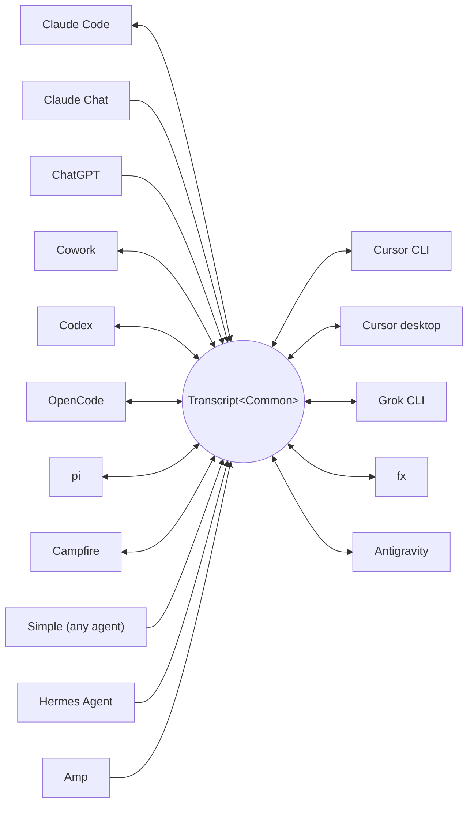

<p align="center">
  <picture>
    <source media="(prefers-color-scheme: dark)" srcset="../assets/wordmark-dark.svg">
    
  </picture>
</p>

<p align="center">Una libreria per spostare sessioni tra harness</p>

<p align="center">
  <a href="../../README.md">English</a> | <a href="README.ja.md">日本語</a> | <a href="README.zh-CN.md">简体中文</a> | <a href="README.zh-TW.md">繁體中文</a> | <a href="README.ko.md">한국어</a> | <a href="README.de.md">Deutsch</a> | <a href="README.es.md">Español</a> | <a href="README.fr.md">Français</a> | Italiano | <a href="README.pt-BR.md">Português (Brasil)</a> | <a href="README.ru.md">Русский</a> | <a href="README.mr.md">मराठी</a> | <a href="README.ta.md">தமிழ்</a>
</p>

<p align="center">
  <a href="https://crates.io/crates/txcript"></a>
  <a href="https://www.npmjs.com/package/txcript"></a>
  <a href="https://docs.rs/txcript"></a>
  <a href="https://github.com/skillsynchq/txcript/actions/workflows/ci.yml"></a>
  <a href="../../LICENSE"></a>
</p>

<p align="center">
  <a href="https://claude.com/claude-code"></a>
  &nbsp;&nbsp;&nbsp;&nbsp;
  <a href="https://github.com/openai/codex"></a>
  &nbsp;&nbsp;&nbsp;&nbsp;
  <a href="https://opencode.ai"></a>
  &nbsp;&nbsp;&nbsp;&nbsp;
  <a href="https://pi.dev"></a>
  &nbsp;&nbsp;&nbsp;&nbsp;
  <a href="https://cursor.com"></a>
  &nbsp;&nbsp;&nbsp;&nbsp;
  <a href="https://github.com/xai-org/grok-build"></a>
  &nbsp;&nbsp;&nbsp;&nbsp;
  <a href="https://ampcode.com"></a>
  &nbsp;&nbsp;&nbsp;&nbsp;
  <a href="https://antigravity.google"></a>
</p>

Inizia una sessione in Claude Code, raggiungi un limite di utilizzo o un punto morto, e riprendila in Codex con l'intera conversazione, il reasoning e la cronologia degli strumenti intatti:

<p align="center">
  
</p>

txcript mappa il formato di trascrizione nativo di ogni harness attraverso un modello comune tipizzato. Il caricamento/salvataggio nativo è lossless al byte; la conversione tra harness preserva messaggi, reasoning, chiamate agli strumenti, risultati degli strumenti, immagini, metadati e dati di utilizzo ove disponibili. Viene distribuito come [**CLI**](#cli), [**crate Rust**](#crate-rust) e [**pacchetto npm**](#pacchetto-npm).

## In evidenza

- **16 harness, un solo modello**: ogni formato converte attraverso `Transcript<Common>`, quindi aggiungere un harness lo collega a tutti gli altri.
- **Un formato per tutti gli altri**: gli agenti che txcript non conosce emettono il JSON di interscambio [Simple](../formats/simple.md) documentato — un file o uno stream, passato direttamente a txcript — e le loro trascrizioni continuano in qualsiasi harness supportato.
- **Round-trip lossless al byte**: caricare e salvare una sessione nel suo stesso formato la riproduce esattamente.
- **Continua ovunque**: `txcript continue <id> --with <harness>` riscrive una sessione nel formato nativo di un altro harness e lo lancia. L'originale non viene mai modificato.
- **Leggi e trasporta le sessioni**: `txcript view` apre qualsiasi sessione in un pager integrato, immagini incluse sui terminali che le disegnano; `txcript export` la scrive come documento Simple che `continue` riprende su un'altra macchina.
- **Cerca in tutto**: ricerca letterale e senza distinzione tra maiuscole e minuscole su ogni sessione della macchina, come API di libreria, query CLI one-shot o picker interattivo.
- **Server MCP**: `txcript mcp` espone gli strumenti in sola lettura `list_sessions`, `search_sessions` e `read_session`, così gli agenti possono attingere alle sessioni passate come contesto.
- **Formati documentati**: il formato su disco di ogni harness è descritto in [`docs/formats/`](../formats), con la provenienza di ogni affermazione (documentazione ufficiale, permalink ai sorgenti o note di reverse engineering).

## Harness supportati



Discovery, elenco, ricerca e `view` funzionano per ogni harness dotato di uno store di supporto. Le stringhe `id` sono quelle richieste dalla CLI e dalle API WASM.

| Harness | id | Sessioni su disco | Formato nativo | Conversione | Continua in | Doc |
|---|---|---|---|:---:|:---:|---|
| [Claude Code](https://claude.com/claude-code) | `claude_code` | `~/.claude/projects/` | JSONL | ⇄ | ✓ | [spec](../formats/claude-code.md) |
| [Claude Chat](https://claude.ai) | `claude_chat` | account `claude.ai` live <sup>4</sup> | API web privata | → | — <sup>4</sup> | [spec](../formats/claude-chat.md) |
| [ChatGPT](https://chatgpt.com) | `chatgpt` | account `chatgpt.com` live <sup>5</sup> | API web privata | → | — <sup>5</sup> | [spec](../formats/chatgpt.md) |
| [Cowork](https://claude.com/product/cowork) | `cowork` | `<Claude app data>/local-agent-mode-sessions/` | record di sessione + JSONL di Claude Code | ⇄ | ✓ | [spec](../formats/cowork.md) |
| [Codex](https://github.com/openai/codex) | `codex` | `~/.codex/sessions/` | JSONL di rollout | ⇄ | ✓ | [spec](../formats/codex.md) |
| [OpenCode](https://opencode.ai) | `opencode` | `~/.local/share/opencode/opencode.db` | SQLite | ⇄ | ✓ | [spec](../formats/opencode.md) |
| [pi](https://pi.dev) | `pi` | `~/.pi/agent/sessions/` | JSONL | ⇄ | ✓ | [spec](../formats/pi.md) |
| [Campfire](../formats/campfire.md) | `campfire` | `~/.campfire/agent/sessions/` | JSONL | ⇄ | ✓ | [spec](../formats/campfire.md) |
| [Cursor CLI](https://cursor.com/cli) | `cursor` | `~/.cursor/chats/` | SQLite | ⇄ | ✓ | [spec](../formats/cursor.md) |
| [Cursor desktop](https://cursor.com) | `cursor_desktop` | `<Cursor User dir>/globalStorage/` | SQLite | ⇄ | ✓ | [spec](../formats/cursor-desktop.md) |
| [Grok CLI](https://github.com/xai-org/grok-build) | `grok` | `~/.grok/sessions/` | directory di sessione (JSON) | ⇄ | ✓ | [spec](../formats/grok.md) |
| [fx](https://fx.sh) | `fx` | `~/.fx/sessions/` | directory di sessione (event log) | ⇄ | ✓ | [spec](../formats/fx.md) |
| Hermes Agent | `hermes` | `~/.hermes/state.db` | SQLite | → | — <sup>3</sup> | [spec](../formats/hermes.md) |
| [Amp](https://ampcode.com) | `amp` | `~/.local/share/amp/threads/` | JSON del thread | → | — <sup>1</sup> | [spec](../formats/amp.md) |
| [Antigravity](https://antigravity.google) | `antigravity` | `~/.gemini/antigravity-cli/` | SQLite | ⇄ | ✓ | [spec](../formats/antigravity.md) |
| Simple | `simple` | — <sup>2</sup> | JSON di interscambio | → | — <sup>2</sup> | [spec](../formats/simple.md) |

<sup>1</sup> I thread di Amp risiedono lato server e la CLI non ha importazione: le sessioni convertono *da* Amp, ma non possono essere continuate verso di esso.

<sup>2</sup> Simple è il formato di interscambio proprio di txcript — la rampa d'accesso per qualsiasi agente non elencato sopra. Non c'è alcuna app né alcuna directory gestita: una sessione Simple è un documento (un file, o stdin) passato direttamente a `txcript continue`, e da quel momento la conversazione continuata vive nell'harness di destinazione.

<sup>3</sup> Lo `state.db` di Hermes è in sola lettura in txcript e Hermes non ha un comando di importazione delle sessioni: le sessioni convertono *da* Hermes, ma non possono essere continuate verso di esso.

<sup>4</sup> Claude Chat è una sorgente live, di solo prelievo. Su macOS, selezionare esplicitamente `--from claude_chat` riutilizza automaticamente la sessione di Claude Desktop con cui si è connessi; la discovery aggregata non contatta Claude Chat. Le credenziali passate tramite variabili d'ambiente non vengono accettate. Una variabile opzionale `TXCRIPT_CLAUDE_CHAT_ORGANIZATION_UUID` restringe la discovery a una sola organizzazione; altrimenti viene usata l'organizzazione attiva dell'app. Claude Chat non ha un'API di conversazione supportata: txcript legge un endpoint privato che Anthropic può osservare o limitare, e il crate Rust avvisa in fase di build ovunque la discovery venga chiamata direttamente. txcript si limita a leggere: rifiuta salvataggio, eliminazione, continue nello stesso harness e `--with claude_chat`. I file generati da Claude nella conversazione vengono portati con sé; continuati in Claude Code, vengono scritti accanto alla nuova sessione e appaiono come artifact di Claude Code. Lo ZIP di esportazione dati di Claude e `conversations.json` non sono supportati.

<sup>5</sup> ChatGPT è una sorgente live, di solo prelievo. Come Claude Chat riutilizza Claude Desktop, selezionare esplicitamente `--from chatgpt` riutilizza automaticamente il login ChatGPT gestito da Codex in `CODEX_HOME/auth.json` o `~/.codex/auth.json`; l'account può differire da quello con cui si è connessi tramite browser. txcript si limita a leggere quel file di credenziali e non lo aggiorna né lo riscrive mai. La discovery aggregata non contatta ChatGPT, mentre un UUID di conversazione esatto può essere letto direttamente senza enumerare l'account. txcript si limita a leggere: rifiuta salvataggio, eliminazione, continue nello stesso harness e `--with chatgpt`. ChatGPT non ha un'API di conversazione supportata, quindi questo accesso può cambiare o essere limitato. Gli archivi di esportazione dati di ChatGPT non sono supportati.

## Installazione

**CLI** (installa il binario `txcript`):

```sh
cargo install --git https://github.com/skillsynchq/txcript txcript-cli
# or from a checkout: cargo install --path cli
```

**Crate Rust**:

```sh
cargo add txcript
```

**Pacchetto npm** (WASM precompilato, nessuna toolchain Rust necessaria):

```sh
bun add txcript     # or: npm install txcript
```

## CLI

Scopri le sessioni locali e continuane una in qualsiasi harness:

```sh
txcript list                             # local sessions across every harness
    [--from <harness>]                    #   only this harness's sessions
    [--cwd <dir>]                         #   only sessions recorded under <dir>
    [-n <N>]                              #   at most N sessions
    [--since <when>] [--until <when>]     #   bound the session start time
txcript continue <id>[#range]            # continue <id>, then launch its harness
    [--with <harness>]                    #   ...continuing in <harness> instead
    [--from <harness>]                    #   scope the id lookup to one harness
    [--out <dir>]                         #   write under <dir>; implies --no-resume
    [--no-resume]                         #   write the session but don't launch
txcript continue <file|->[#range]        # continue a Simple document instead:
    --with <harness> [...]                #   a file, or stdin (`-`), from any agent
txcript view <id>[#range]                # view a session; compact text when piped
    [--from <harness>]                    #   scope the id lookup to one harness
    [--no-pager]                          #   print the terminal view directly
txcript export <id>[#range]              # write a session as a Simple document
    [--from <harness>]                    #   scope the id lookup to one harness
    [--out <file>]                        #   write to <file> instead of stdout
```

Un id di sessione è un qualsiasi prefisso non ambiguo dell'id completo, oppure il titolo esatto della sessione. `txcript resume` è un alias di `continue`. `--since` e `--until` accettano timestamp RFC 3339 o semplici date `YYYY-MM-DD`.

`continue` scrive la sessione dove l'harness di destinazione conserva le proprie sessioni, poi lo lancia su di essa, cedendogli il terminale:

- Stesso harness: riprende l'originale sul posto.
- Cross-harness (`--with`): riscrive la sessione nel formato nativo di destinazione. Ciò che viene scritto è sempre una copia; la sessione sorgente non viene mai modificata né rimossa.
- Un documento [Simple](../formats/simple.md) al posto di un id — `txcript continue ./run.json --with claude_code`, o `my-agent | txcript continue - --with claude_code` — porta la trascrizione di qualsiasi agente nello stesso modo; `--with` è obbligatorio perché un documento non ha un harness proprio.
- Il comando di lancio è specifico per harness e sovrascrivibile: imposta `TRANSCRIPT_<HARNESS>_RESUME_CMD` con un template `{id}`, ad es. `TRANSCRIPT_CODEX_RESUME_CMD="codex resume {id}"`.

`view` in un terminale apre un pager integrato: `u`, `a`, `t` e `r` nascondono o mostrano messaggi utente, messaggi assistente, chiamate agli strumenti e reasoning; `]` e `[` saltano tra i messaggi; `/` cerca in ciò che è mostrato. Le immagini vengono disegnate inline sui terminali in grado di mostrarle (Ghostty, kitty, WezTerm, Konsole). Imposta `TXCRIPT_PAGER` per usare invece un pager esterno, o passa `--no-pager` per stampare direttamente la vista. In pipe o rediretto, `view` stampa lo stesso testo compatto che serve il server MCP. In entrambi i casi ogni messaggio è numerato da una riga `── #N ──`, e `#range` seleziona i messaggi in base a quegli ordinali stampati, 1-based e inclusivi:

- `abc#7`: solo il messaggio 7
- `abc#5-12`: messaggi da 5 a 12
- `abc#5-`: dal messaggio 5 alla fine
- `abc#-10`: dall'inizio al messaggio 10

`continue` accetta lo stesso suffisso e continua solo quei messaggi come nuova sessione. Un intervallo che separerebbe una chiamata a uno strumento dal suo risultato viene rifiutato, e l'errore suggerisce l'intervallo valido più vicino.

`export` scrive la sessione come documento [Simple](../formats/simple.md), su stdout o in `--out <file>`. Il documento è il rendering completo del modello canonico — tutto ciò che `continue` porta con sé tra harness — indipendente da dove un harness conserva le proprie sessioni, così si sposta da una macchina all'altra come file:

```sh
txcript export 0dc114bf --out session.json       # on this machine
txcript continue ./session.json --with claude_code   # on the other one
```

La working directory registrata viene mantenuta quando esiste sulla macchina di importazione, altrimenti viene sostituita dalla directory in cui `continue` viene eseguito. `export` accetta lo stesso suffisso `#range` e lo stesso ambito `--from` di `view`.

### Ricerca

```sh
txcript query 'relay bug'                # one-shot: ranked hits, highlighted
txcript query                            # interactive picker; Enter continues
    [--from <harness>]                   #   search only <harness> (default: all)
    [--with <harness>]                   #   continue the pick in <harness>
    [--cwd <dir>]                        #   only sessions recorded under <dir>
```

Un pattern corrisponde in modo letterale e senza distinzione tra maiuscole e minuscole: `relay bug` trova le righe che contengono esattamente quel testo, spazi inclusi.

Nel picker, digita per filtrare, frecce / ctrl-p/n per spostarti, Invio per continuare la selezione nel suo harness (o con `--with`), Esc per annullare. Ogni riga mostra quale tipo di contenuto ha prodotto la corrispondenza: testo utente, testo assistente, thinking, uso di strumenti, output di strumenti o metadati di sessione.

Senza una cache, ogni esecuzione rilegge ogni sessione. Passa `--cache <path>` (o imposta `TXCRIPT_CACHE`) per mantenere una cache di ricerca persistente in quel percorso, così `query` e lo strumento di ricerca MCP rileggono solo le sessioni cambiate dall'ultima esecuzione. Il flag è accettato da ogni sottocomando.

### Server MCP

```sh
txcript mcp                              # stdio transport
```

Espone tre strumenti in sola lettura; i loro filtri opzionali corrispondono a quelli della CLI:

- `list_sessions(from?, cwd?, limit?, offset?)`
- `search_sessions(pattern, from?, cwd?)`
- `read_session(id, from?)`

<sub>\* Omettendo `from` si includono tutti gli harness; omettendo `cwd` non si applica alcun filtro di directory. Le sessioni senza una working directory registrata corrispondono solo quando `cwd` viene omesso.</sub>

`list_sessions` pagina con `limit` e `offset` e riporta il totale prima della paginazione; le sorgenti live Claude Chat e ChatGPT non vengono mai elencate. `read_session` accetta lo stesso suffisso `#range` di `view` e restituisce lo stesso testo compatto; una lettura troppo grande per essere restituita per intero viene rifiutata con sotto-intervalli suggeriti. `--cache` si applica anche al server.

### Integrazione con la shell

```sh
eval "$(txcript init zsh)"                      # in ~/.zshrc; or: txcript init bash
```

`init` stampa i completamenti più un binding ctrl+shift+r che apre il picker limitato alle sessioni registrate nella cartella corrente. Per i soli completamenti, `completion` copre bash, elvish, fish, powershell e zsh:

```sh
txcript completion zsh > ~/.zfunc/_txcript      # or wherever your fpath looks
source <(txcript completion bash)               # bash, ad hoc
txcript completion fish > ~/.config/fish/completions/txcript.fish
```

## Crate Rust

```toml
[dependencies]
txcript = "0.12"
# Codecs only: drops the SQLite-backed stores, the live Claude Chat and
# ChatGPT sources, and search. Every codec stays available.
# txcript = { version = "0.12", default-features = false }
```

Feature di default: `opencode` (gli store SQLite: OpenCode, entrambi i Cursor, Antigravity), `hermes`, `claude_chat`, `chatgpt` e `search`.

Tre livelli, dal più piccolo al più grande:

- `Codec`: `to_common` / `from_common` per harness; `convert::<A, B>` li concatena attraverso il modello canonico.
- `TextCodec`: `from_text` / `to_text` per analizzare e renderizzare il testo di sessione nativo di un harness, senza I/O.
- `Store`: discovery/caricamento/salvataggio su un backend reale (directory di sessione, o DB SQLite per OpenCode, Hermes, entrambi i Cursor e Antigravity).

Converti in memoria (senza filesystem):

```rust
use txcript::harness::{claude_code, codex};
use txcript::{Codec, TextCodec, convert};

let claude = claude_code::ClaudeCode::from_text(jsonl_text)?;          // Transcript<ClaudeCode>
let codex = convert::<claude_code::ClaudeCode, codex::Codex>(&claude)?; // Transcript<Codex>
let codex_text = codex::Codex::to_text(&codex)?;                       // native rollout JSONL
```

Oppure passa dal disco con uno `Store`:

```rust
use txcript::harness::{claude_code, codex};
use txcript::{Store, convert};

let store = claude_code::ClaudeStore::default_root().expect("home dir");
let found = store.discover()?;                       // cheap metadata scan
let claude = store.load(&found[0].reference)?;       // Transcript<ClaudeCode>

let codex = convert::<_, codex::Codex>(&claude)?;
codex::CodexStore::default_root().expect("home dir").save(&codex)?;  // resumable on disk
```

Il modello canonico è `Transcript<Common>`: `Meta` + `Vec<Message>`, dove un `Message` contiene `Block` tipizzati (`Text`, `Thinking`, `ToolUse`, `ToolResult`, `Image`) e un enum `Tool` tipizzato.

Anche i comandi slash eseguiti dall'utente nell'harness (`/release patch`) sono canonici: una chiamata `Tool::Command` sul turno utente, associata a ciò che il comando ha restituito come `ToolResult`.

### Ricerca (feature `search`, attiva di default)

`txcript::search` supporta la ricerca fuzzy (sintassi in stile fzf) e per sottostringa sulle trascrizioni. Ricerca one-shot:

```rust
use txcript::search::{Query, search};

let hits = search(&common, &Query::substring("relay bug"));  // or Query::fuzzy for fzf syntax
for hit in hits {
    // hit.origin: User | Assistant | Thinking | ToolUse | ToolResult | Meta
    // hit.span addresses the message; hit.highlights are char ranges into hit.line
    let messages = common.fragment(&hit.span);            // zero-copy: Option<&[Message]>
}
```

Per una ricerca in stile picker, costruisci un `Index` una volta sola e interrogalo a ogni pressione di tasto:

```rust
use txcript::search::{DocKey, Index, Query};

let mut index = Index::new();
index.insert(DocKey { harness, id }, &common);   // re-insert replaces; caller owns refresh
let matches = index.query(&Query::fuzzy("srch")); // ranked docs, best lines as hits
```

Un pattern vuoto restituisce i documenti dal più recente al più vecchio. Gli output degli strumenti sono esclusi di default; usa `Origin::ALL` per includerli. `Query.harnesses`, `Query.limit` e `Query.hits_per_doc` restringono i risultati.

### Proiezione testuale

`txcript::text::to_text(&common)` è la proiezione dietro [`txcript view`](#cli): un rendering unidirezionale e parsimonioso in token di `Transcript<Common>` da usare come contesto per LLM. Mantiene i messaggi, il testo di reasoning e chiamate/risultati compatti degli strumenti; i payload utili solo al replay (reasoning cifrato, contabilità dell'utilizzo, byte delle immagini inline) vengono omessi. `to_text_fragment(&common, &span)` renderizza uno `Span` del corpo, mantenendo l'ordinale di ogni messaggio nella sessione completa.

## Pacchetto npm

Il pacchetto npm distribuisce il codec come WASM precompilato per Bun e Node. Converte il testo di sessione in memoria; scoprire, leggere e scrivere le sessioni su disco spetta al chiamante, quindi il pacchetto non ha alcuno `Store`.

```ts
import { convert, toCommon, fromCommon, harnesses } from "txcript";
import { readFileSync, writeFileSync } from "node:fs";

const input = readFileSync("rollout.jsonl", "utf8");

// native -> native (e.g. a Codex rollout into Claude Code's JSONL)
writeFileSync("session.jsonl", convert(input, "codex", "claude_code"));

// canonical view, and back
const common = JSON.parse(toCommon(input, "codex"));   // { meta, messages }
const pi = fromCommon(JSON.stringify(common), "pi");

harnesses(); // ["claude_code","claude_chat","chatgpt","codex","opencode","pi","campfire","cursor","cursor_desktop","grok","fx","hermes","amp","antigravity","simple","cowork"]
```

Testo in ingresso / testo in uscita: `input` è il testo di sessione nativo dell'harness sorgente e il risultato è quello di destinazione. Nomi di harness non validi o input non analizzabile sollevano un `Error` JS.

Anche la ricerca è inclusa. Una query è la forma JSON della `Query` del crate: solo `pattern` è obbligatorio, e `mode` è `"fuzzy"` a meno che non sia impostato su `"substring"`:

```ts
import { searchTranscript, Searcher } from "txcript";

// one session, one shot: a JSON array of hits
const hits = JSON.parse(searchTranscript(input, "codex", JSON.stringify({ pattern: "relay bug", mode: "substring" })));

// picker-style: index once, query per keystroke
const index = new Searcher();
index.insert("codex", "0dc114bf", input);          // re-insert replaces
const matches = JSON.parse(index.query(JSON.stringify({ pattern: "relay bug" })));
```

| Harness | Testo di sessione |
|---|---|
| `claude_code`, `codex`, `pi`, `campfire` | JSONL di sessione |
| `claude_chat` | una risposta live di dettaglio della conversazione (solo come sorgente; nessun array di esportazione dell'account) |
| `chatgpt` | una risposta live di dettaglio della conversazione (solo come sorgente; nessun array di esportazione dell'account) |
| `opencode` | JSON di `opencode export` |
| `cursor` | export JSON dello `store.db` della sessione |
| `cursor_desktop` | dump JSON delle righe `state.vscdb` della sessione |
| `grok` | bundle JSON dei file della directory di sessione |
| `fx` | bundle JSON dei file della directory di sessione |
| `hermes` | oggetto JSON di `hermes sessions export` |
| `amp` | JSON di `amp threads export` |
| `antigravity` | dump JSON del database delle conversazioni, blob protobuf codificati in esadecimale |
| `simple` | il documento JSON di interscambio [Simple](../formats/simple.md) |
| `cowork` | bundle JSON del record di sessione, della trascrizione Claude Code e del log di audit |

Per compilare invece il wasm dai sorgenti:

```sh
git clone https://github.com/skillsynchq/txcript.git
cd txcript
bun run setup        # once: wasm target + wasm-bindgen-cli
bun run build        # produces ./pkg
```

## Documentazione dei formati

Non tutti questi formati di trascrizione sono documentati dai rispettivi vendor. [`docs/formats/`](../formats) contiene un documento per harness che copre dove vivono le sessioni su disco, come la discovery le trova, una dissezione di ogni parte del formato e le sue stranezze, ciascuno etichettato con la provenienza di ciò che afferma: documentazione ufficiale, il codice di serializzazione open source dell'harness stesso (citato con permalink ancorati al commit), o reverse engineering.

## Sviluppo

```sh
cargo test --workspace --all-features               # what CI runs
cargo test -p txcript --no-default-features         # codecs only: no SQLite or live stores
bun run build && bun examples/convert.ts <file> <from> <to>
git config core.hooksPath .githooks                 # pre-push runs the CI checks
```

Il binario vive in un proprio crate workspace (`cli/`, pacchetto `txcript-cli`); la libreria alla radice non porta con sé nessuna delle sue dipendenze.

## Licenza

[Apache-2.0](../../LICENSE)
