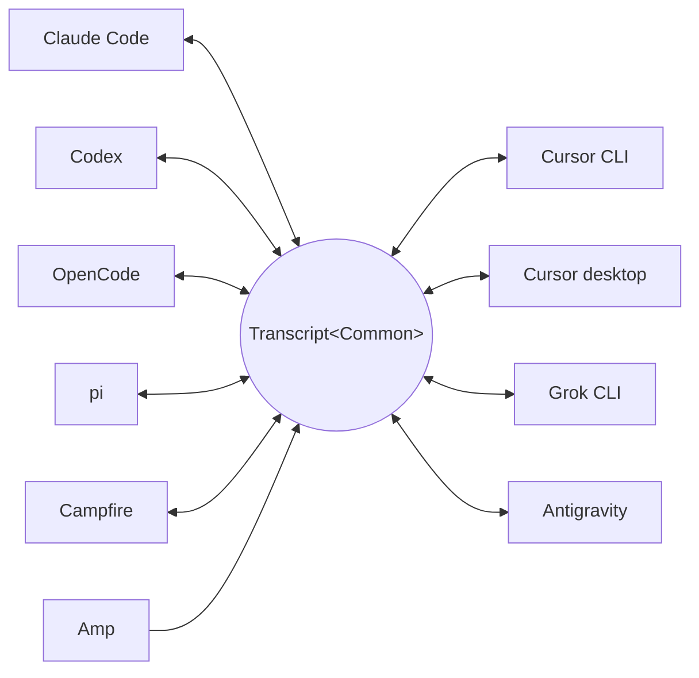

<p align="center">
  <picture>
    <source media="(prefers-color-scheme: dark)" srcset="../assets/wordmark-dark.svg">
    
  </picture>
</p>

<p align="center">ハーネス間でセッションを移動するためのライブラリ</p>

<p align="center">
  <a href="../../README.md">English</a> | 日本語 | <a href="README.zh-CN.md">简体中文</a> | <a href="README.zh-TW.md">繁體中文</a> | <a href="README.ko.md">한국어</a> | <a href="README.de.md">Deutsch</a> | <a href="README.es.md">Español</a> | <a href="README.fr.md">Français</a> | <a href="README.it.md">Italiano</a> | <a href="README.pt-BR.md">Português (Brasil)</a> | <a href="README.ru.md">Русский</a> | <a href="README.mr.md">मराठी</a> | <a href="README.ta.md">தமிழ்</a>
</p>

<p align="center">
  <a href="https://crates.io/crates/txcript"></a>
  <a href="https://www.npmjs.com/package/txcript"></a>
  <a href="https://docs.rs/txcript"></a>
  <a href="https://github.com/skillsynchq/txcript/actions/workflows/ci.yml"></a>
  <a href="../../LICENSE"></a>
</p>

<p align="center">
  <a href="https://claude.com/claude-code"></a>
  &nbsp;&nbsp;&nbsp;&nbsp;
  <a href="https://github.com/openai/codex"></a>
  &nbsp;&nbsp;&nbsp;&nbsp;
  <a href="https://opencode.ai"></a>
  &nbsp;&nbsp;&nbsp;&nbsp;
  <a href="https://pi.dev"></a>
  &nbsp;&nbsp;&nbsp;&nbsp;
  <a href="https://cursor.com"></a>
  &nbsp;&nbsp;&nbsp;&nbsp;
  <a href="https://github.com/xai-org/grok-build"></a>
  &nbsp;&nbsp;&nbsp;&nbsp;
  <a href="https://ampcode.com"></a>
  &nbsp;&nbsp;&nbsp;&nbsp;
  <a href="https://antigravity.google"></a>
</p>

Claude Code でセッションを始め、使用量制限や行き詰まりに突き当たったら、会話・推論・ツール履歴をすべて保ったまま Codex で続きから再開できます:

<p align="center">
  
</p>

txcript は各ハーネスのネイティブなトランスクリプト形式を、型付きの共通モデルを介してマッピングします。ネイティブ形式のロード/セーブはバイト単位で無損失であり、ハーネス間の変換ではメッセージ、推論、ツール呼び出し、ツール結果、画像、メタデータ、使用量情報を（利用可能な範囲で）保持します。[**CLI**](#cli)、[**Rust crate**](#rust-crate)、[**npm package**](#npm-package) として提供されます。

## ハイライト

- **10 のハーネス、1 つのモデル** — すべての形式は `Transcript<Common>` を介して変換されるため、ハーネスを 1 つ追加すれば他のすべてとつながります。
- **バイト無損失のラウンドトリップ** — セッションを自身の形式でロードして保存すると、元と完全に一致するものが再現されます。
- **どこでも続行** — `txcript continue <id> --with <harness>` はセッションを別のハーネスのネイティブ形式に書き直して起動します。元のセッションが変更されることはありません。
- **すべてを検索** — マシン上のすべてのセッションを対象にしたファジー/部分文字列検索（fzf 流の構文、[nucleo](https://github.com/helix-editor/nucleo) を採用）。ライブラリ API、ワンショットの CLI クエリ、対話型ピッカーのいずれでも利用できます。
- **MCP サーバー** — `txcript mcp` は読み取り専用の `list_sessions`、`search_sessions`、`read_session` ツールを公開し、エージェントが過去のセッションをコンテキストとして掘り起こせるようにします。
- **文書化されたフォーマット** — 各ハーネスのオンディスク形式は [`docs/formats/`](../formats) にまとめられており、各記述には出典（公式ドキュメント、ソースへのパーマリンク、またはリバースエンジニアリングのメモ）が付記されています。

## 対応ハーネス



ディスカバリ、一覧表示、検索、`view`、そしてネイティブなラウンドトリップは、すべてのハーネスで動作します。`id` の文字列が、CLI と WASM API に渡す値です。

| ハーネス | id | ディスク上のセッション | ネイティブ形式 | 変換 | 続行先 | ドキュメント |
|---|---|---|---|:---:|:---:|---|
| [Claude Code](https://claude.com/claude-code) | `claude_code` | `~/.claude/projects/` | JSONL | ⇄ | ✓ | [仕様](../formats/claude-code.md) |
| [Codex](https://github.com/openai/codex) | `codex` | `~/.codex/sessions/` | ロールアウト JSONL | ⇄ | ✓ | [仕様](../formats/codex.md) |
| [OpenCode](https://opencode.ai) | `opencode` | `~/.local/share/opencode/opencode.db` | SQLite | ⇄ | ✓ | [仕様](../formats/opencode.md) |
| [pi](https://pi.dev) | `pi` | `~/.pi/agent/sessions/` | JSONL | ⇄ | ✓ | [仕様](../formats/pi.md) |
| [Campfire](../formats/campfire.md) | `campfire` | `~/.campfire/agent/sessions/` | JSONL | ⇄ | ✓ | [仕様](../formats/campfire.md) |
| [Cursor CLI](https://cursor.com/cli) | `cursor` | `~/.cursor/chats/` | SQLite | ⇄ | ✓ | [仕様](../formats/cursor.md) |
| [Cursor desktop](https://cursor.com) | `cursor_desktop` | `<Cursor User dir>/globalStorage/` | SQLite | ⇄ | ✓ | [仕様](../formats/cursor-desktop.md) |
| [Grok CLI](https://github.com/xai-org/grok-build) | `grok` | `~/.grok/sessions/` | セッションディレクトリ（JSON） | ⇄ | ✓ | [仕様](../formats/grok.md) |
| [Amp](https://ampcode.com) | `amp` | `~/.local/share/amp/threads/` | スレッド JSON | → | — <sup>1</sup> | [仕様](../formats/amp.md) |
| [Antigravity](https://antigravity.google) | `antigravity` | `~/.gemini/antigravity-cli/` | SQLite | ⇄ | ✓ | [仕様](../formats/antigravity.md) |

<sup>1</sup> Amp のスレッドはサーバー側にあり、CLI にはインポート機能がありません: セッションは Amp *から*変換できますが、Amp へ続行することはできません。

## インストール

**CLI**（`txcript` バイナリをインストール）:

```sh
cargo install --git https://github.com/skillsynchq/txcript txcript-cli
# or from a checkout: cargo install --path cli
```

**Rust crate**:

```sh
cargo add txcript
```

**npm package**（ビルド済み WASM、Rust ツールチェーン不要）:

```sh
bun add txcript     # or: npm install txcript
```

## CLI

ローカルのセッションを見つけて、任意のハーネスで続行します:

```sh
txcript list                             # local sessions across every harness
txcript continue <id>[#range]            # continue <id>, then launch its harness
    [--with <harness>]                    #   ...continuing in <harness> instead
    [--from <harness>]                    #   scope the id lookup to one harness
    [--out <dir>]                         #   write under <dir>; implies --no-resume
    [--no-resume]                         #   write the session but don't launch
txcript view <id>[#range]                # print a session as compact text
    [--from <harness>]                    #   scope the id lookup to one harness
txcript export <id>[#range]              # write a session as a Simple document
    [--from <harness>]                    #   scope the id lookup to one harness
    [--out <file>]                        #   write to <file> instead of stdout
```

`continue` はセッションをターゲットハーネスがセッションを保存している場所に書き出し、続けてそのハーネスを起動してターミナルを引き渡します:

- 同一ハーネス: 元のセッションをその場で再開します。
- ハーネスをまたぐ場合（`--with`）: セッションをターゲットのネイティブ形式に再合成します。書き出されるのは常にコピーであり、ソースのセッションが変更・削除されることはありません。
- 起動コマンドはハーネスごとに上書きできます。`TRANSCRIPT_<HARNESS>_RESUME_CMD` を `{id}` テンプレートとして設定します。例: `TRANSCRIPT_CODEX_RESUME_CMD="codex resume {id}"`。

`view` はセッションをコンパクトなテキストとして出力し、各メッセージには `── #N ──` の区切り線で番号が振られます。`#range` は、その出力に表示される序数（1 始まり・両端含み）でメッセージを選択します:

- `abc#7`: メッセージ 7 のみ
- `abc#5-12`: メッセージ 5 から 12 まで
- `abc#5-`: メッセージ 5 から末尾まで
- `abc#-10`: 先頭からメッセージ 10 まで

`continue` も同じサフィックスを受け付け、その範囲のメッセージだけを新しいセッションとして続行します。ツール呼び出しをその結果から切り離してしまう範囲は拒否され、エラーには最も近い有効な範囲が提案されます。

`export` はセッションを [Simple](../formats/simple.md) ドキュメントとして、stdout または `--out <file>` に書き出します。このドキュメントは正準モデルの完全なレンダリング — `continue` がハーネス間で運ぶものすべて — であり、どのハーネスの保存場所からも切り離されているため、1 つのファイルとしてマシン間を移動できます:

```sh
txcript export 0dc114bf --out session.json       # on this machine
txcript continue ./session.json --with claude_code   # on the other one
```

記録された作業ディレクトリは、インポート先のマシンに存在すればそれを保持し、存在しなければ `continue` の実行ディレクトリに置き換えられます。`export` は `view` と同じ `#range` サフィックスと `--from` スコープを受け付けます。

### 検索

```sh
txcript query 'relay bug'                # one-shot: ranked hits, highlighted
txcript query                            # fzf-style picker; Enter continues
    [--from <harness>]                   #   search only <harness> (default: all)
    [--with <harness>]                   #   continue the pick in <harness>
```

ピッカーは依存関係なし（raw モードの ANSI）で動作します。文字を入力すると fzf 流のファジー構文でフィルタされ、矢印キーまたは ctrl-p/n で移動、Enter で選択したセッションを元のハーネス（または `--with` で指定したハーネス）で続行、Esc でキャンセルします。各行には、どの種類のコンテンツがマッチしたか — ユーザーテキスト、アシスタントテキスト、思考、ツール使用、ツール出力、セッションメタデータ — が表示されます。

### MCP サーバー

```sh
txcript mcp                              # stdio transport
```

読み取り専用のツールを 3 つ公開します。オプションのフィルタは CLI と同じです:

- `list_sessions(from?, cwd?)`
- `search_sessions(pattern, from?, cwd?)`
- `read_session(id, from?)`

<sub>\* `from` を省略するとすべてのハーネスが対象になります。`cwd` を省略するとディレクトリによるフィルタは行われません。作業ディレクトリが記録されていないセッションは、`cwd` を省略した場合にのみマッチします。</sub>

### シェル補完

```sh
txcript completion zsh > ~/.zfunc/_txcript      # or wherever your fpath looks
source <(txcript completion bash)               # bash, ad hoc
txcript completion fish > ~/.config/fish/completions/txcript.fish
```

## Rust crate

```toml
[dependencies]
txcript = "0.6"
# Drops the OpenCode SQLite store (rusqlite); the OpenCode codec stays available.
# txcript = { version = "0.6", default-features = false }
```

小さい順に 3 つのレイヤーがあります:

- `Codec` — ハーネスごとの `to_common` / `from_common`。`convert::<A, B>` はそれらを正準モデル経由で連結します。
- `TextCodec` — `from_text` / `to_text` でハーネスのネイティブなセッションテキストをパース/レンダリングします。I/O は発生しません。
- `Store` — 実際のバックエンド（セッションディレクトリ、または OpenCode と両方の Cursor 用の SQLite DB）に対して発見/ロード/保存を行います。

メモリ内で変換する場合（ファイルシステム不要）:

```rust
use txcript::harness::{claude_code, codex};
use txcript::{Codec, TextCodec, convert};

let claude = claude_code::ClaudeCode::from_text(jsonl_text)?;          // Transcript<ClaudeCode>
let codex = convert::<claude_code::ClaudeCode, codex::Codex>(&claude)?; // Transcript<Codex>
let codex_text = codex::Codex::to_text(&codex)?;                       // native rollout JSONL
```

または `Store` でディスクを経由する場合:

```rust
use txcript::harness::{claude_code, codex};
use txcript::{Store, convert};

let store = claude_code::ClaudeStore::default_root().expect("home dir");
let found = store.discover()?;                       // cheap metadata scan
let claude = store.load(&found[0].reference)?;       // Transcript<ClaudeCode>

let codex = convert::<_, codex::Codex>(&claude)?;
codex::CodexStore::default_root().expect("home dir").save(&codex)?;  // resumable on disk
```

正準モデルは `Transcript<Common>` — `Meta` + `Vec<Message>` で、`Message` は型付きの `Block`（`Text`、`Thinking`、`ToolUse`、`ToolResult`、`Image`）と型付きの `Tool` enum を保持します。

ユーザーがハーネス上で実行したスラッシュコマンド（`/release patch`）も正準的に表現されます: ユーザーターン上の `Tool::Command` 呼び出しとして扱われ、コマンドが出力として返したものが対になる `ToolResult` になります。

### 検索（`search` フィーチャー、デフォルトで有効）

`txcript::search` は [nucleo](https://github.com/helix-editor/nucleo) を用いた、トランスクリプトに対するファジー検索と部分文字列検索をサポートします。ワンショット検索:

```rust
use txcript::search::{Query, search};

let hits = search(&common, &Query::fuzzy("relay bug"));   // fzf syntax: 'exact ^prefix !not
for hit in hits {
    // hit.origin: User | Assistant | Thinking | ToolUse | ToolResult | Meta
    // hit.span addresses the message; hit.highlights are char ranges into hit.line
    let messages = common.fragment(&hit.span);            // zero-copy: Option<&[Message]>
}
```

ピッカー型の検索では、`Index` を一度構築してキーストロークごとにクエリします:

```rust
use txcript::search::{DocKey, Index, Query};

let mut index = Index::new();
index.insert(DocKey { harness, id }, &common);   // re-insert replaces; caller owns refresh
let matches = index.query(&Query::fuzzy("srch")); // ranked docs, best lines as hits
```

空のパターンはドキュメントを新しい順に返します。ツール出力はデフォルトで除外されます。含めるには `Origin::ALL` を使います。`Query.harnesses`、`Query.limit`、`Query.hits_per_doc` で結果を絞り込めます。

### テキスト射影

`txcript::text::to_text(&common)` は [`txcript view`](#cli) の裏にある射影です — `Transcript<Common>` を LLM のコンテキストとして使うための、一方向でトークン量を意識したレンダリングです。メッセージ、推論テキスト、コンパクトなツール呼び出し/結果を保持しつつ、暗号化された推論、使用量の計上、インライン画像バイトといった再生専用のペイロードは省きます。`to_text_fragment(&common, &span)` は本文の `Span` をレンダリングし、セッション全体における各メッセージの序数を保持します。

## npm package

npm パッケージは、Bun・Node・ブラウザ向けにビルド済みの WASM としてコーデックを提供します。I/O はすべて JS ホスト側が担い、変換処理だけを呼び出します。`Store` レイヤー（ファイルシステム、SQLite、サブプロセス）はネイティブのままで、WASM ビルドには含まれません。

```ts
import { convert, toCommon, fromCommon, harnesses } from "txcript";
import { readFileSync, writeFileSync } from "node:fs";

const input = readFileSync("rollout.jsonl", "utf8");

// native -> native (e.g. a Codex rollout into Claude Code's JSONL)
writeFileSync("session.jsonl", convert(input, "codex", "claude_code"));

// canonical view, and back
const common = JSON.parse(toCommon(input, "codex"));   // { meta, messages }
const pi = fromCommon(JSON.stringify(common), "pi");

harnesses(); // ["claude_code","codex","opencode","pi","campfire","cursor","cursor_desktop","grok","amp","antigravity"]
```

テキスト入力・テキスト出力: `input` はソースハーネスのネイティブなセッションテキストで、結果はターゲットのものになります。不正なハーネス名やパースできない入力は JS の `Error` を投げます。

| ハーネス | セッションテキスト |
|---|---|
| `claude_code`、`codex`、`pi`、`campfire` | セッション JSONL |
| `opencode` | `opencode export` の JSON |
| `cursor` | セッションの `store.db` の JSON エクスポート |
| `cursor_desktop` | セッションの `state.vscdb` 行の JSON ダンプ |
| `grok` | セッションディレクトリ内ファイルの JSON バンドル |
| `amp` | `amp threads export` の JSON |
| `antigravity` | 会話データベースの JSON ダンプ（protobuf blob は 16 進エンコード） |

代わりにソースから wasm をビルドする場合:

```sh
git clone https://github.com/skillsynchq/txcript.git
cd txcript
bun run setup        # once: wasm target + wasm-bindgen-cli
bun run build        # produces ./pkg
```

## フォーマットドキュメント

これらのトランスクリプト形式のすべてがベンダーによって文書化されているわけではありません。[`docs/formats/`](../formats) にはハーネスごとに 1 つのドキュメントがあります — セッションがディスク上のどこにあるか、ディスカバリがそれをどう見つけるか、フォーマットの各部分の解剖、そしてその癖 — そして各記述には出典がタグ付けされています: 公式ドキュメント、ハーネス自身のオープンソースのシリアライズコード（コミット固定のパーマリンク付きで引用）、またはリバースエンジニアリングです。

## 開発

```sh
cargo test                                          # native suite
cargo test --no-default-features                    # without the SQLite store
bun run build && bun examples/convert.ts <file> <from> <to>
```

バイナリは独立したワークスペースクレート（`cli/`、パッケージ `txcript-cli`）に置かれているため、その依存関係（clap）がライブラリ利用者に影響することはありません。

## ライセンス

[Apache-2.0](../../LICENSE)
