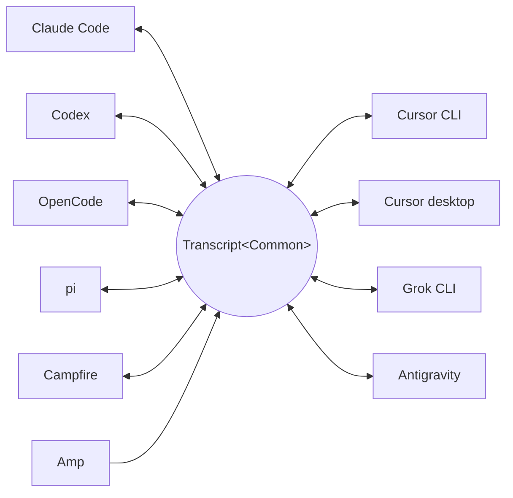

<p align="center">
  <picture>
    <source media="(prefers-color-scheme: dark)" srcset="../assets/wordmark-dark.svg">
    
  </picture>
</p>

<p align="center">하네스 간에 세션을 옮기기 위한 라이브러리</p>

<p align="center">
  <a href="../../README.md">English</a> | <a href="README.ja.md">日本語</a> | <a href="README.zh-CN.md">简体中文</a> | <a href="README.zh-TW.md">繁體中文</a> | 한국어 | <a href="README.de.md">Deutsch</a> | <a href="README.es.md">Español</a> | <a href="README.fr.md">Français</a> | <a href="README.it.md">Italiano</a> | <a href="README.pt-BR.md">Português (Brasil)</a> | <a href="README.ru.md">Русский</a> | <a href="README.mr.md">मराठी</a> | <a href="README.ta.md">தமிழ்</a>
</p>

<p align="center">
  <a href="https://crates.io/crates/txcript"></a>
  <a href="https://www.npmjs.com/package/txcript"></a>
  <a href="https://docs.rs/txcript"></a>
  <a href="https://github.com/skillsynchq/txcript/actions/workflows/ci.yml"></a>
  <a href="../../LICENSE"></a>
</p>

<p align="center">
  <a href="https://claude.com/claude-code"></a>
  &nbsp;&nbsp;&nbsp;&nbsp;
  <a href="https://github.com/openai/codex"></a>
  &nbsp;&nbsp;&nbsp;&nbsp;
  <a href="https://opencode.ai"></a>
  &nbsp;&nbsp;&nbsp;&nbsp;
  <a href="https://pi.dev"></a>
  &nbsp;&nbsp;&nbsp;&nbsp;
  <a href="https://cursor.com"></a>
  &nbsp;&nbsp;&nbsp;&nbsp;
  <a href="https://github.com/xai-org/grok-build"></a>
  &nbsp;&nbsp;&nbsp;&nbsp;
  <a href="https://ampcode.com"></a>
  &nbsp;&nbsp;&nbsp;&nbsp;
  <a href="https://antigravity.google"></a>
</p>

Claude Code에서 세션을 시작했다가 사용량 한도나 막다른 길에 부딪히면, Codex에서 그대로 이어가세요 — 대화, 추론, 도구 히스토리를 전부 유지한 채로:

<p align="center">
  
</p>

txcript는 각 하네스의 네이티브 트랜스크립트 형식을 타입이 지정된 공통 모델을 통해 매핑합니다. 네이티브 로드/저장은 바이트 단위로 무손실이며, 하네스 간 변환은 메시지, 추론, 도구 호출, 도구 결과, 이미지, 메타데이터, 그리고 가능한 경우 사용량 정보를 보존합니다. [**CLI**](#cli), [**Rust 크레이트**](#rust-크레이트), [**npm 패키지**](#npm-패키지)로 제공됩니다.

## 주요 특징

- **하네스 10개, 모델 하나**: 모든 형식이 `Transcript<Common>`을 거쳐 변환되므로, 하네스를 하나 추가하면 나머지 전부와 연결됩니다.
- **바이트 무손실 왕복 변환**: 세션을 자기 자신의 형식으로 로드했다가 저장하면 원본과 정확히 일치하게 재현됩니다.
- **어디서든 이어가기**: `txcript continue <id> --with <harness>`는 세션을 다른 하네스의 네이티브 형식으로 다시 써서 실행합니다. 원본은 절대 수정되지 않습니다.
- **전부 검색**: 머신에 있는 모든 세션을 대상으로 하는 퍼지/부분 문자열 검색(fzf 스타일 문법, [nucleo](https://github.com/helix-editor/nucleo) 기반)을 라이브러리 API, 원샷 CLI 쿼리, 대화형 피커로 사용할 수 있습니다.
- **MCP 서버**: `txcript mcp`는 읽기 전용 `list_sessions`, `search_sessions`, `read_session` 도구를 노출해, 에이전트가 과거 세션을 컨텍스트로 캐낼 수 있게 합니다.
- **문서화된 형식**: 각 하네스의 온디스크 형식은 [`docs/formats/`](../formats)에 정리되어 있으며, 각 서술마다 출처(공식 문서, 소스 퍼머링크, 또는 리버스 엔지니어링 노트)가 붙어 있습니다.

## 지원 하네스



탐색, 목록 표시, 검색, `view`, 그리고 네이티브 왕복 변환은 모든 하네스에서 동작합니다. 이 `id` 문자열이 CLI와 WASM API에 전달하는 값입니다.

| 하네스 | id | 디스크의 세션 위치 | 네이티브 형식 | 변환 | 이어가기 대상 | 문서 |
|---|---|---|---|:---:|:---:|---|
| [Claude Code](https://claude.com/claude-code) | `claude_code` | `~/.claude/projects/` | JSONL | ⇄ | ✓ | [스펙](../formats/claude-code.md) |
| [Codex](https://github.com/openai/codex) | `codex` | `~/.codex/sessions/` | 롤아웃 JSONL | ⇄ | ✓ | [스펙](../formats/codex.md) |
| [OpenCode](https://opencode.ai) | `opencode` | `~/.local/share/opencode/opencode.db` | SQLite | ⇄ | ✓ | [스펙](../formats/opencode.md) |
| [pi](https://pi.dev) | `pi` | `~/.pi/agent/sessions/` | JSONL | ⇄ | ✓ | [스펙](../formats/pi.md) |
| [Campfire](../formats/campfire.md) | `campfire` | `~/.campfire/agent/sessions/` | JSONL | ⇄ | ✓ | [스펙](../formats/campfire.md) |
| [Cursor CLI](https://cursor.com/cli) | `cursor` | `~/.cursor/chats/` | SQLite | ⇄ | ✓ | [스펙](../formats/cursor.md) |
| [Cursor desktop](https://cursor.com) | `cursor_desktop` | `<Cursor User dir>/globalStorage/` | SQLite | ⇄ | ✓ | [스펙](../formats/cursor-desktop.md) |
| [Grok CLI](https://github.com/xai-org/grok-build) | `grok` | `~/.grok/sessions/` | 세션 디렉터리 JSON | ⇄ | ✓ | [스펙](../formats/grok.md) |
| [Amp](https://ampcode.com) | `amp` | `~/.local/share/amp/threads/` | 스레드 JSON | → | — <sup>1</sup> | [스펙](../formats/amp.md) |
| [Antigravity](https://antigravity.google) | `antigravity` | `~/.gemini/antigravity-cli/` | SQLite | ⇄ | ✓ | [스펙](../formats/antigravity.md) |

<sup>1</sup> Amp 스레드는 서버 측에 있고 CLI에 가져오기 기능이 없습니다: 세션을 Amp*에서* 변환해 올 수는 있지만, Amp로 이어갈 수는 없습니다.

## 설치

**CLI** (`txcript` 바이너리를 설치합니다):

```sh
cargo install --git https://github.com/skillsynchq/txcript txcript-cli
# or from a checkout: cargo install --path cli
```

**Rust 크레이트**:

```sh
cargo add txcript
```

**npm 패키지** (사전 빌드된 WASM, Rust 툴체인 불필요):

```sh
bun add txcript     # or: npm install txcript
```

## CLI

로컬 세션을 찾아서 아무 하네스에서나 이어갑니다:

```sh
txcript list                             # local sessions across every harness
txcript continue <id>[#range]            # continue <id>, then launch its harness
    [--with <harness>]                    #   ...continuing in <harness> instead
    [--from <harness>]                    #   scope the id lookup to one harness
    [--out <dir>]                         #   write under <dir>; implies --no-resume
    [--no-resume]                         #   write the session but don't launch
txcript view <id>[#range]                # print a session as compact text
    [--from <harness>]                    #   scope the id lookup to one harness
txcript export <id>[#range]              # write a session as a Simple document
    [--from <harness>]                    #   scope the id lookup to one harness
    [--out <file>]                        #   write to <file> instead of stdout
```

`continue`는 대상 하네스가 세션을 보관하는 위치에 세션을 기록한 다음, 그 하네스를 실행하며 터미널을 넘깁니다:

- 같은 하네스: 원본 세션을 그 자리에서 재개합니다.
- 다른 하네스(`--with`): 세션을 대상 하네스의 네이티브 형식으로 다시 합성합니다. 기록되는 것은 언제나 복사본이며, 원본 세션은 절대 수정되거나 삭제되지 않습니다.
- 실행 명령은 하네스별로 재정의할 수 있습니다: `TRANSCRIPT_<HARNESS>_RESUME_CMD`를 `{id}` 템플릿으로 설정하면 됩니다. 예: `TRANSCRIPT_CODEX_RESUME_CMD="codex resume {id}"`.

`view`는 세션을 압축된 텍스트로 출력하며, 각 메시지에는 `── #N ──` 구분선으로 번호가 매겨집니다. `#range`는 그 출력된 서수를 기준으로 메시지를 선택하며, 1부터 시작하고 양 끝을 포함합니다:

- `abc#7`: 메시지 7만
- `abc#5-12`: 메시지 5부터 12까지
- `abc#5-`: 메시지 5부터 끝까지
- `abc#-10`: 처음부터 메시지 10까지

`continue`도 같은 접미사를 받아 해당 메시지들만 새 세션으로 이어갑니다. 도구 호출을 그 결과와 갈라놓는 범위는 거부되며, 오류 메시지가 가장 가까운 유효한 범위를 제안합니다.

`export`는 세션을 [Simple](../formats/simple.md) 문서로, stdout 또는 `--out <file>`에 기록합니다. 이 문서는 정준 모델의 완전한 렌더링 — `continue`가 하네스 사이에서 옮기는 모든 것 — 이며, 어떤 하네스가 세션을 보관하는 위치와도 분리되어 있어 파일 하나로 이 머신에서 저 머신으로 옮길 수 있습니다:

```sh
txcript export 0dc114bf --out session.json       # on this machine
txcript continue ./session.json --with claude_code   # on the other one
```

기록된 작업 디렉터리는 가져오는 머신에 존재하면 그대로 유지되고, 그렇지 않으면 `continue`가 실행되는 디렉터리로 대체됩니다. `export`는 `view`와 같은 `#range` 접미사와 `--from` 범위를 받습니다.

### 검색

```sh
txcript query 'relay bug'                # one-shot: ranked hits, highlighted
txcript query                            # fzf-style picker; Enter continues
    [--from <harness>]                   #   search only <harness> (default: all)
    [--with <harness>]                   #   continue the pick in <harness>
```

피커는 의존성 없이(raw 모드 ANSI) 동작합니다: 입력하면 fzf 스타일 퍼지 문법으로 필터링되고, 방향키 또는 ctrl-p/n으로 이동, Enter로 선택 항목을 원래 하네스(또는 `--with`로 지정한 하네스)에서 이어가며, Esc로 취소합니다. 각 행에는 어떤 종류의 콘텐츠가 매칭됐는지 — 사용자 텍스트, 어시스턴트 텍스트, 사고 과정, 도구 사용, 도구 출력, 세션 메타데이터 — 가 표시됩니다.

### MCP 서버

```sh
txcript mcp                              # stdio transport
```

읽기 전용 도구 세 개를 노출합니다. 선택적 필터는 CLI와 동일합니다:

- `list_sessions(from?, cwd?)`
- `search_sessions(pattern, from?, cwd?)`
- `read_session(id, from?)`

<sub>\* `from`을 생략하면 모든 하네스가 포함되고, `cwd`를 생략하면 디렉터리 필터가 적용되지 않습니다. 작업 디렉터리가 기록되지 않은 세션은 `cwd`를 생략했을 때만 매칭됩니다.</sub>

### 셸 자동 완성

```sh
txcript completion zsh > ~/.zfunc/_txcript      # or wherever your fpath looks
source <(txcript completion bash)               # bash, ad hoc
txcript completion fish > ~/.config/fish/completions/txcript.fish
```

## Rust 크레이트

```toml
[dependencies]
txcript = "0.6"
# Drops the OpenCode SQLite store (rusqlite); the OpenCode codec stays available.
# txcript = { version = "0.6", default-features = false }
```

작은 것부터 큰 것 순으로 세 개의 계층이 있습니다:

- `Codec`: 하네스별 `to_common` / `from_common`. `convert::<A, B>`가 이를 정준 모델을 거쳐 연결합니다.
- `TextCodec`: `from_text` / `to_text`로 하네스의 네이티브 세션 텍스트를 파싱/렌더링합니다. I/O는 없습니다.
- `Store`: 실제 백엔드(세션 디렉터리, 또는 OpenCode와 두 Cursor의 SQLite DB)를 대상으로 탐색/로드/저장을 수행합니다.

메모리에서 변환하기(파일시스템 불필요):

```rust
use txcript::harness::{claude_code, codex};
use txcript::{Codec, TextCodec, convert};

let claude = claude_code::ClaudeCode::from_text(jsonl_text)?;          // Transcript<ClaudeCode>
let codex = convert::<claude_code::ClaudeCode, codex::Codex>(&claude)?; // Transcript<Codex>
let codex_text = codex::Codex::to_text(&codex)?;                       // native rollout JSONL
```

또는 `Store`로 디스크를 경유하기:

```rust
use txcript::harness::{claude_code, codex};
use txcript::{Store, convert};

let store = claude_code::ClaudeStore::default_root().expect("home dir");
let found = store.discover()?;                       // cheap metadata scan
let claude = store.load(&found[0].reference)?;       // Transcript<ClaudeCode>

let codex = convert::<_, codex::Codex>(&claude)?;
codex::CodexStore::default_root().expect("home dir").save(&codex)?;  // resumable on disk
```

정준 모델은 `Transcript<Common>` — `Meta` + `Vec<Message>`이며, `Message`는 타입이 지정된 `Block`(`Text`, `Thinking`, `ToolUse`, `ToolResult`, `Image`)과 타입이 지정된 `Tool` enum을 담습니다.

사용자가 하네스에서 실행한 슬래시 커맨드(`/release patch`)도 정준으로 표현됩니다: 사용자 턴의 `Tool::Command` 호출과, 그 커맨드가 되돌려 출력한 내용을 담은 `ToolResult`가 짝을 이룹니다.

### 검색 (`search` 기능, 기본 활성화)

`txcript::search`는 [nucleo](https://github.com/helix-editor/nucleo)를 통해 트랜스크립트에 대한 퍼지 및 부분 문자열 검색을 지원합니다. 원샷 검색:

```rust
use txcript::search::{Query, search};

let hits = search(&common, &Query::fuzzy("relay bug"));   // fzf syntax: 'exact ^prefix !not
for hit in hits {
    // hit.origin: User | Assistant | Thinking | ToolUse | ToolResult | Meta
    // hit.span addresses the message; hit.highlights are char ranges into hit.line
    let messages = common.fragment(&hit.span);            // zero-copy: Option<&[Message]>
}
```

피커 스타일 검색이라면 `Index`를 한 번 만들어 두고 키 입력마다 쿼리합니다:

```rust
use txcript::search::{DocKey, Index, Query};

let mut index = Index::new();
index.insert(DocKey { harness, id }, &common);   // re-insert replaces; caller owns refresh
let matches = index.query(&Query::fuzzy("srch")); // ranked docs, best lines as hits
```

빈 패턴은 문서를 최신순으로 반환합니다. 도구 출력은 기본적으로 제외되며, 포함하려면 `Origin::ALL`을 사용하세요. `Query.harnesses`, `Query.limit`, `Query.hits_per_doc`으로 결과를 좁힐 수 있습니다.

### 텍스트 프로젝션

`txcript::text::to_text(&common)`은 [`txcript view`](#cli)의 배후에 있는 프로젝션입니다: LLM 컨텍스트로 쓰기 위한, `Transcript<Common>`의 단방향이며 토큰 사용을 의식한 렌더링입니다. 메시지, 추론 텍스트, 간결한 도구 호출/결과는 유지하고, 재생 전용 페이로드(암호화된 추론, 사용량 집계, 인라인 이미지 바이트)는 생략합니다. `to_text_fragment(&common, &span)`은 본문의 `Span`을 렌더링하며, 전체 세션에서 각 메시지가 갖는 서수를 유지합니다.

## npm 패키지

npm 패키지는 코덱을 Bun, Node, 브라우저용 사전 빌드 WASM으로 제공합니다. I/O는 전부 JS 호스트가 소유하고 변환 작업만 호출해 들어갑니다. `Store` 계층(파일시스템, SQLite, 서브프로세스)은 네이티브로 남으며 WASM 빌드에서는 제외됩니다.

```ts
import { convert, toCommon, fromCommon, harnesses } from "txcript";
import { readFileSync, writeFileSync } from "node:fs";

const input = readFileSync("rollout.jsonl", "utf8");

// native -> native (e.g. a Codex rollout into Claude Code's JSONL)
writeFileSync("session.jsonl", convert(input, "codex", "claude_code"));

// canonical view, and back
const common = JSON.parse(toCommon(input, "codex"));   // { meta, messages }
const pi = fromCommon(JSON.stringify(common), "pi");

harnesses(); // ["claude_code","codex","opencode","pi","campfire","cursor","cursor_desktop","grok","amp","antigravity"]
```

텍스트 입력 / 텍스트 출력: `input`은 소스 하네스의 네이티브 세션 텍스트이며, 결과는 대상 하네스의 것입니다. 잘못된 하네스 이름이나 파싱할 수 없는 입력은 JS `Error`를 던집니다.

| 하네스 | 세션 텍스트 |
|---|---|
| `claude_code`, `codex`, `pi`, `campfire` | session JSONL |
| `opencode` | `opencode export` JSON |
| `cursor` | 세션의 `store.db`를 JSON으로 내보낸 것 |
| `cursor_desktop` | 세션의 `state.vscdb` 행을 JSON으로 덤프한 것 |
| `grok` | 세션 디렉터리 파일들의 JSON 번들 |
| `amp` | `amp threads export` JSON |
| `antigravity` | 대화 데이터베이스의 JSON 덤프(protobuf blob은 16진수로 인코딩) |

소스에서 직접 wasm을 빌드하려면:

```sh
git clone https://github.com/skillsynchq/txcript.git
cd txcript
bun run setup        # once: wasm target + wasm-bindgen-cli
bun run build        # produces ./pkg
```

## 형식 문서

이 트랜스크립트 형식들이 전부 벤더에 의해 문서화되어 있는 것은 아닙니다. [`docs/formats/`](../formats)에는 하네스마다 문서가 하나씩 있으며, 세션이 디스크 어디에 저장되는지, 탐색이 이를 어떻게 찾는지, 형식의 모든 부분에 대한 해부, 그리고 그 형식의 별난 점들을 다룹니다. 각 서술에는 그 주장의 출처가 태그로 붙어 있습니다: 공식 문서, 하네스 자신의 오픈소스 직렬화 코드(커밋에 고정된 퍼머링크로 인용), 또는 리버스 엔지니어링.

## 개발

```sh
cargo test                                          # native suite
cargo test --no-default-features                    # without the SQLite store
bun run build && bun examples/convert.ts <file> <from> <to>
```

바이너리는 별도의 워크스페이스 크레이트(`cli/`, 패키지 `txcript-cli`)에 있으므로 그 의존성(clap)이 라이브러리 사용자에게 영향을 주는 일은 없습니다.

## 라이선스

[Apache-2.0](../../LICENSE)
