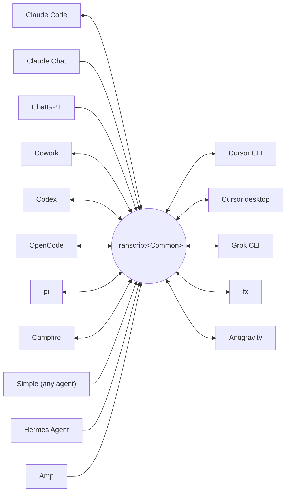

<p align="center">
  <picture>
    <source media="(prefers-color-scheme: dark)" srcset="../assets/wordmark-dark.svg">
    
  </picture>
</p>

<p align="center">하네스 간에 세션을 옮기기 위한 라이브러리</p>

<p align="center">
  <a href="../../README.md">English</a> | <a href="README.ja.md">日本語</a> | <a href="README.zh-CN.md">简体中文</a> | <a href="README.zh-TW.md">繁體中文</a> | 한국어 | <a href="README.de.md">Deutsch</a> | <a href="README.es.md">Español</a> | <a href="README.fr.md">Français</a> | <a href="README.it.md">Italiano</a> | <a href="README.pt-BR.md">Português (Brasil)</a> | <a href="README.ru.md">Русский</a> | <a href="README.mr.md">मराठी</a> | <a href="README.ta.md">தமிழ்</a>
</p>

<p align="center">
  <a href="https://crates.io/crates/txcript"></a>
  <a href="https://www.npmjs.com/package/txcript"></a>
  <a href="https://docs.rs/txcript"></a>
  <a href="https://github.com/skillsynchq/txcript/actions/workflows/ci.yml"></a>
  <a href="../../LICENSE"></a>
</p>

<p align="center">
  <a href="https://claude.com/claude-code"></a>
  &nbsp;&nbsp;&nbsp;&nbsp;
  <a href="https://github.com/openai/codex"></a>
  &nbsp;&nbsp;&nbsp;&nbsp;
  <a href="https://opencode.ai"></a>
  &nbsp;&nbsp;&nbsp;&nbsp;
  <a href="https://pi.dev"></a>
  &nbsp;&nbsp;&nbsp;&nbsp;
  <a href="https://cursor.com"></a>
  &nbsp;&nbsp;&nbsp;&nbsp;
  <a href="https://github.com/xai-org/grok-build"></a>
  &nbsp;&nbsp;&nbsp;&nbsp;
  <a href="https://ampcode.com"></a>
  &nbsp;&nbsp;&nbsp;&nbsp;
  <a href="https://antigravity.google"></a>
</p>

Claude Code에서 세션을 시작했다가 사용량 한도나 막다른 길에 부딪히면, Codex에서 그대로 이어가세요 — 대화, 추론, 도구 히스토리를 전부 유지한 채로:

<p align="center">
  
</p>

txcript는 각 하네스의 네이티브 트랜스크립트 형식을 타입이 지정된 공통 모델을 통해 매핑합니다. 네이티브 로드/저장은 바이트 단위로 무손실이며, 하네스 간 변환은 메시지, 추론, 도구 호출, 도구 결과, 이미지, 메타데이터, 그리고 가능한 경우 사용량 정보를 보존합니다. [**CLI**](#cli), [**Rust 크레이트**](#rust-크레이트), [**npm 패키지**](#npm-패키지)로 제공됩니다.

## 주요 특징

- **하네스 16개, 모델 하나**: 모든 형식이 `Transcript<Common>`을 거쳐 변환되므로, 하네스를 하나 추가하면 나머지 전부와 연결됩니다.
- **나머지 모두를 위한 형식**: txcript가 들어본 적 없는 에이전트도 문서화된 [Simple](../formats/simple.md) 교환 JSON — 파일이나 스트림으로, txcript에 직접 전달 — 을 내보내면, 그 트랜스크립트를 지원되는 어떤 하네스에서든 이어갈 수 있습니다.
- **바이트 무손실 왕복 변환**: 세션을 자기 자신의 형식으로 로드했다가 저장하면 원본과 정확히 일치하게 재현됩니다.
- **어디서든 이어가기**: `txcript continue <id> --with <harness>`는 세션을 다른 하네스의 네이티브 형식으로 다시 써서 실행합니다. 원본은 절대 수정되지 않습니다.
- **세션 읽기와 휴대**: `txcript view`는 어떤 세션이든 내장 페이저로 열며, 이미지를 그릴 수 있는 터미널에서는 이미지도 함께 표시합니다. `txcript export`는 세션을 Simple 문서로 기록해, 다른 머신에서 `continue`가 그대로 받아 이어갑니다.
- **전부 검색**: 머신에 있는 모든 세션을 대상으로 하는 리터럴, 대소문자 무시 검색을 라이브러리 API, 원샷 CLI 쿼리, 대화형 피커로 사용할 수 있습니다.
- **MCP 서버**: `txcript mcp`는 읽기 전용 `list_sessions`, `search_sessions`, `read_session` 도구를 노출해, 에이전트가 과거 세션을 컨텍스트로 캐낼 수 있게 합니다.
- **문서화된 형식**: 각 하네스의 온디스크 형식은 [`docs/formats/`](../formats)에 정리되어 있으며, 각 서술마다 출처(공식 문서, 소스 퍼머링크, 또는 리버스 엔지니어링 노트)가 붙어 있습니다.

## 지원 하네스



탐색, 목록 표시, 검색, `view`는 백킹 스토어가 있는 모든 하네스에서 동작합니다. 이 `id` 문자열이 CLI와 WASM API에 전달하는 값입니다.

| 하네스 | id | 디스크의 세션 위치 | 네이티브 형식 | 변환 | 이어가기 대상 | 문서 |
|---|---|---|---|:---:|:---:|---|
| [Claude Code](https://claude.com/claude-code) | `claude_code` | `~/.claude/projects/` | JSONL | ⇄ | ✓ | [스펙](../formats/claude-code.md) |
| [Claude Chat](https://claude.ai) | `claude_chat` | 라이브 `claude.ai` 계정 <sup>4</sup> | 비공개 웹 API | → | — <sup>4</sup> | [스펙](../formats/claude-chat.md) |
| [ChatGPT](https://chatgpt.com) | `chatgpt` | 라이브 `chatgpt.com` 계정 <sup>5</sup> | 비공개 웹 API | → | — <sup>5</sup> | [스펙](../formats/chatgpt.md) |
| [Cowork](https://claude.com/product/cowork) | `cowork` | `<Claude app data>/local-agent-mode-sessions/` | 세션 레코드 + Claude Code JSONL | ⇄ | ✓ | [스펙](../formats/cowork.md) |
| [Codex](https://github.com/openai/codex) | `codex` | `~/.codex/sessions/` | 롤아웃 JSONL | ⇄ | ✓ | [스펙](../formats/codex.md) |
| [OpenCode](https://opencode.ai) | `opencode` | `~/.local/share/opencode/opencode.db` | SQLite | ⇄ | ✓ | [스펙](../formats/opencode.md) |
| [pi](https://pi.dev) | `pi` | `~/.pi/agent/sessions/` | JSONL | ⇄ | ✓ | [스펙](../formats/pi.md) |
| [Campfire](../formats/campfire.md) | `campfire` | `~/.campfire/agent/sessions/` | JSONL | ⇄ | ✓ | [스펙](../formats/campfire.md) |
| [Cursor CLI](https://cursor.com/cli) | `cursor` | `~/.cursor/chats/` | SQLite | ⇄ | ✓ | [스펙](../formats/cursor.md) |
| [Cursor desktop](https://cursor.com) | `cursor_desktop` | `<Cursor User dir>/globalStorage/` | SQLite | ⇄ | ✓ | [스펙](../formats/cursor-desktop.md) |
| [Grok CLI](https://github.com/xai-org/grok-build) | `grok` | `~/.grok/sessions/` | 세션 디렉터리 JSON | ⇄ | ✓ | [스펙](../formats/grok.md) |
| [fx](https://fx.sh) | `fx` | `~/.fx/sessions/` | 이벤트 로그 세션 디렉터리 | ⇄ | ✓ | [스펙](../formats/fx.md) |
| Hermes Agent | `hermes` | `~/.hermes/state.db` | SQLite | → | — <sup>3</sup> | [스펙](../formats/hermes.md) |
| [Amp](https://ampcode.com) | `amp` | `~/.local/share/amp/threads/` | 스레드 JSON | → | — <sup>1</sup> | [스펙](../formats/amp.md) |
| [Antigravity](https://antigravity.google) | `antigravity` | `~/.gemini/antigravity-cli/` | SQLite | ⇄ | ✓ | [스펙](../formats/antigravity.md) |
| Simple | `simple` | — <sup>2</sup> | 교환 JSON | → | — <sup>2</sup> | [스펙](../formats/simple.md) |

<sup>1</sup> Amp 스레드는 서버 측에 있고 CLI에 가져오기 기능이 없습니다: 세션을 Amp*에서* 변환해 올 수는 있지만, Amp로 이어갈 수는 없습니다.

<sup>2</sup> Simple은 txcript 자체의 교환 형식으로, 위에 나열되지 않은 모든 에이전트를 위한 진입점입니다. 앱도 관리되는 디렉터리도 없습니다: Simple 세션은 `txcript continue`에 직접 전달되는 문서(파일 또는 stdin)이며, 이어진 대화는 그 시점부터 대상 하네스에 존재합니다.

<sup>3</sup> Hermes의 `state.db`는 txcript에서 읽기 전용이며 Hermes에는 세션 가져오기 명령이 없습니다: 세션을 Hermes*에서* 변환해 올 수는 있지만, Hermes로 이어갈 수는 없습니다.

<sup>4</sup> Claude Chat은 라이브 풀 전용 소스입니다. macOS에서 `--from claude_chat`을 명시적으로 선택하면 로그인된 Claude Desktop 세션을 자동으로 재사용하며, 집계 탐색은 Claude Chat에 접속하지 않습니다. 환경 변수로 전달된 자격 증명은 받지 않습니다. 선택 사항인 `TXCRIPT_CLAUDE_CHAT_ORGANIZATION_UUID`는 탐색을 한 조직으로 제한하며, 지정하지 않으면 앱의 활성 조직이 사용됩니다. Claude Chat에는 지원되는 대화 API가 없습니다: txcript는 Anthropic이 관찰하거나 제한할 수 있는 비공개 엔드포인트를 읽으며, Rust 크레이트는 탐색을 직접 호출하는 모든 곳에서 빌드 시점에 경고를 냅니다. txcript는 읽기만 합니다: 저장, 삭제, 같은 하네스로의 이어가기, `--with claude_chat`을 거부합니다. 대화에서 Claude가 생성한 파일도 함께 옮겨지며, Claude Code로 이어가면 새 세션 옆에 기록되어 Claude Code 아티팩트로 나타납니다. Claude의 데이터 내보내기 ZIP과 `conversations.json`은 지원되지 않습니다.

<sup>5</sup> ChatGPT는 라이브 풀 전용 소스입니다. Claude Chat이 Claude Desktop을 재사용하는 것과 마찬가지로, `--from chatgpt`를 명시적으로 선택하면 Codex가 `CODEX_HOME/auth.json` 또는 `~/.codex/auth.json`에서 관리하는 ChatGPT 로그인을 자동으로 재사용합니다. 이 계정은 브라우저로 로그인한 계정과 다를 수 있습니다. txcript는 그 자격 증명 파일을 읽기만 하며 갱신하거나 다시 쓰지 않습니다. 집계 탐색은 ChatGPT에 접속하지 않지만, 정확한 대화 UUID는 계정을 열거하지 않고 직접 읽을 수 있습니다. txcript는 읽기만 합니다: 저장, 삭제, 같은 하네스로의 이어가기, `--with chatgpt`를 거부합니다. ChatGPT에는 지원되는 대화 API가 없으므로, 이 접근 방식은 변경되거나 제한될 수 있습니다. ChatGPT 데이터 내보내기 아카이브는 지원되지 않습니다.

## 설치

**CLI** (`txcript` 바이너리를 설치합니다):

```sh
cargo install --git https://github.com/skillsynchq/txcript txcript-cli
# or from a checkout: cargo install --path cli
```

**Rust 크레이트**:

```sh
cargo add txcript
```

**npm 패키지** (사전 빌드된 WASM, Rust 툴체인 불필요):

```sh
bun add txcript     # or: npm install txcript
```

## CLI

로컬 세션을 찾아서 아무 하네스에서나 이어갑니다:

```sh
txcript list                             # local sessions across every harness
    [--from <harness>]                    #   only this harness's sessions
    [--cwd <dir>]                         #   only sessions recorded under <dir>
    [-n <N>]                              #   at most N sessions
    [--since <when>] [--until <when>]     #   bound the session start time
txcript continue <id>[#range]            # continue <id>, then launch its harness
    [--with <harness>]                    #   ...continuing in <harness> instead
    [--from <harness>]                    #   scope the id lookup to one harness
    [--out <dir>]                         #   write under <dir>; implies --no-resume
    [--no-resume]                         #   write the session but don't launch
txcript continue <file|->[#range]        # continue a Simple document instead:
    --with <harness> [...]                #   a file, or stdin (`-`), from any agent
txcript view <id>[#range]                # view a session; compact text when piped
    [--from <harness>]                    #   scope the id lookup to one harness
    [--no-pager]                          #   print the terminal view directly
txcript export <id>[#range]              # write a session as a Simple document
    [--from <harness>]                    #   scope the id lookup to one harness
    [--out <file>]                        #   write to <file> instead of stdout
```

세션 id는 전체 id의 모호하지 않은 접두사 아무것이나, 또는 세션의 정확한 제목입니다. `txcript resume`은 `continue`의 별칭입니다. `--since`와 `--until`은 RFC 3339 타임스탬프 또는 `YYYY-MM-DD` 날짜만 받습니다.

`continue`는 대상 하네스가 세션을 보관하는 위치에 세션을 기록한 다음, 그 하네스를 실행하며 터미널을 넘깁니다:

- 같은 하네스: 원본 세션을 그 자리에서 재개합니다.
- 다른 하네스(`--with`): 세션을 대상 하네스의 네이티브 형식으로 다시 씁니다. 기록되는 것은 언제나 복사본이며, 원본 세션은 절대 수정되거나 삭제되지 않습니다.
- id 대신 [Simple](../formats/simple.md) 문서 — `txcript continue ./run.json --with claude_code`, 또는 `my-agent | txcript continue - --with claude_code` — 를 넘기면 어떤 에이전트의 트랜스크립트든 같은 방식으로 들어옵니다. 문서에는 자기 하네스가 없으므로 `--with`가 필수입니다.
- 실행 명령은 하네스별로 재정의할 수 있습니다: `TRANSCRIPT_<HARNESS>_RESUME_CMD`를 `{id}` 템플릿으로 설정하면 됩니다. 예: `TRANSCRIPT_CODEX_RESUME_CMD="codex resume {id}"`.

터미널에서 `view`는 내장 페이저를 엽니다: `u`, `a`, `t`, `r`은 사용자 메시지, 어시스턴트 메시지, 도구 호출, 추론을 숨기거나 표시하고, `]`와 `[`는 메시지 사이를 이동하며, `/`는 표시된 내용을 검색합니다. 이미지를 표시할 수 있는 터미널(Ghostty, kitty, WezTerm, Konsole)에서는 이미지가 인라인으로 그려집니다. 외부 페이저를 대신 쓰려면 `TXCRIPT_PAGER`를 설정하고, 뷰를 바로 출력하려면 `--no-pager`를 넘기세요. 파이프나 리디렉션을 거치면 `view`는 MCP 서버가 제공하는 것과 같은 압축된 텍스트를 출력합니다. 어느 경우든 각 메시지에는 `── #N ──` 구분선으로 번호가 매겨지며, `#range`는 그 출력된 서수를 기준으로 메시지를 선택하고, 1부터 시작하며 양 끝을 포함합니다:

- `abc#7`: 메시지 7만
- `abc#5-12`: 메시지 5부터 12까지
- `abc#5-`: 메시지 5부터 끝까지
- `abc#-10`: 처음부터 메시지 10까지

`continue`도 같은 접미사를 받아 해당 메시지들만 새 세션으로 이어갑니다. 도구 호출을 그 결과와 갈라놓는 범위는 거부되며, 오류 메시지가 가장 가까운 유효한 범위를 제안합니다.

`export`는 세션을 [Simple](../formats/simple.md) 문서로, stdout 또는 `--out <file>`에 기록합니다. 이 문서는 정준 모델의 완전한 렌더링 — `continue`가 하네스 사이에서 옮기는 모든 것 — 이며, 어떤 하네스가 세션을 보관하는 위치와도 분리되어 있어 파일 하나로 이 머신에서 저 머신으로 옮길 수 있습니다:

```sh
txcript export 0dc114bf --out session.json       # on this machine
txcript continue ./session.json --with claude_code   # on the other one
```

기록된 작업 디렉터리는 가져오는 머신에 존재하면 그대로 유지되고, 그렇지 않으면 `continue`가 실행되는 디렉터리로 대체됩니다. `export`는 `view`와 같은 `#range` 접미사와 `--from` 범위를 받습니다.

### 검색

```sh
txcript query 'relay bug'                # one-shot: ranked hits, highlighted
txcript query                            # interactive picker; Enter continues
    [--from <harness>]                   #   search only <harness> (default: all)
    [--with <harness>]                   #   continue the pick in <harness>
    [--cwd <dir>]                        #   only sessions recorded under <dir>
```

패턴은 리터럴로, 대소문자를 구분하지 않고 매칭됩니다: `relay bug`는 공백까지 포함해 정확히 그 텍스트를 담은 줄을 찾습니다.

피커에서는 입력하면 필터링되고, 방향키 또는 ctrl-p/n으로 이동, Enter로 선택 항목을 원래 하네스(또는 `--with`로 지정한 하네스)에서 이어가며, Esc로 취소합니다. 각 행에는 어떤 종류의 콘텐츠가 매칭됐는지 — 사용자 텍스트, 어시스턴트 텍스트, 사고 과정, 도구 사용, 도구 출력, 세션 메타데이터 — 가 표시됩니다.

캐시가 없으면 매 실행마다 모든 세션을 다시 읽습니다. `--cache <path>`를 넘기면(또는 `TXCRIPT_CACHE`를 설정하면) 그 경로에 영속적인 검색 캐시를 유지하므로, `query`와 MCP 검색 도구는 마지막 실행 이후 변경된 세션만 다시 읽습니다. 이 플래그는 모든 서브커맨드에서 받습니다.

### MCP 서버

```sh
txcript mcp                              # stdio transport
```

읽기 전용 도구 세 개를 노출합니다. 선택적 필터는 CLI와 동일합니다:

- `list_sessions(from?, cwd?, limit?, offset?)`
- `search_sessions(pattern, from?, cwd?)`
- `read_session(id, from?)`

<sub>\* `from`을 생략하면 모든 하네스가 포함되고, `cwd`를 생략하면 디렉터리 필터가 적용되지 않습니다. 작업 디렉터리가 기록되지 않은 세션은 `cwd`를 생략했을 때만 매칭됩니다.</sub>

`list_sessions`는 `limit`과 `offset`으로 페이지를 나누며, 페이지를 나누기 전의 전체 개수를 보고합니다. 라이브 Claude Chat 및 ChatGPT 소스는 목록에 절대 포함되지 않습니다. `read_session`은 `view`와 같은 `#range` 접미사를 받아 같은 압축된 텍스트를 반환하며, 한 번에 반환하기에 너무 큰 읽기는 하위 범위 제안과 함께 거부됩니다. `--cache`는 서버에도 적용됩니다.

### 셸 통합

```sh
eval "$(txcript init zsh)"                      # in ~/.zshrc; or: txcript init bash
```

`init`은 자동 완성과 함께, 현재 폴더에 기록된 세션으로 범위를 좁힌 피커를 여는 ctrl+shift+r 바인딩을 출력합니다. 자동 완성만 필요하다면 `completion`이 bash, elvish, fish, powershell, zsh를 지원합니다:

```sh
txcript completion zsh > ~/.zfunc/_txcript      # or wherever your fpath looks
source <(txcript completion bash)               # bash, ad hoc
txcript completion fish > ~/.config/fish/completions/txcript.fish
```

## Rust 크레이트

```toml
[dependencies]
txcript = "0.12"
# Codecs only: drops the SQLite-backed stores, the live Claude Chat and
# ChatGPT sources, and search. Every codec stays available.
# txcript = { version = "0.12", default-features = false }
```

기본 기능: `opencode`(SQLite 스토어: OpenCode, 두 Cursor, Antigravity), `hermes`, `claude_chat`, `chatgpt`, `search`.

작은 것부터 큰 것 순으로 세 개의 계층이 있습니다:

- `Codec`: 하네스별 `to_common` / `from_common`. `convert::<A, B>`가 이를 정준 모델을 거쳐 연결합니다.
- `TextCodec`: `from_text` / `to_text`로 하네스의 네이티브 세션 텍스트를 파싱/렌더링합니다. I/O는 없습니다.
- `Store`: 실제 백엔드(세션 디렉터리, 또는 OpenCode, Hermes, 두 Cursor, Antigravity의 SQLite DB)를 대상으로 탐색/로드/저장을 수행합니다.

메모리에서 변환하기(파일시스템 불필요):

```rust
use txcript::harness::{claude_code, codex};
use txcript::{Codec, TextCodec, convert};

let claude = claude_code::ClaudeCode::from_text(jsonl_text)?;          // Transcript<ClaudeCode>
let codex = convert::<claude_code::ClaudeCode, codex::Codex>(&claude)?; // Transcript<Codex>
let codex_text = codex::Codex::to_text(&codex)?;                       // native rollout JSONL
```

또는 `Store`로 디스크를 경유하기:

```rust
use txcript::harness::{claude_code, codex};
use txcript::{Store, convert};

let store = claude_code::ClaudeStore::default_root().expect("home dir");
let found = store.discover()?;                       // cheap metadata scan
let claude = store.load(&found[0].reference)?;       // Transcript<ClaudeCode>

let codex = convert::<_, codex::Codex>(&claude)?;
codex::CodexStore::default_root().expect("home dir").save(&codex)?;  // resumable on disk
```

정준 모델은 `Transcript<Common>` — `Meta` + `Vec<Message>`이며, `Message`는 타입이 지정된 `Block`(`Text`, `Thinking`, `ToolUse`, `ToolResult`, `Image`)과 타입이 지정된 `Tool` enum을 담습니다.

사용자가 하네스에서 실행한 슬래시 커맨드(`/release patch`)도 정준으로 표현됩니다: 사용자 턴의 `Tool::Command` 호출과, 그 커맨드가 되돌려 출력한 내용을 담은 `ToolResult`가 짝을 이룹니다.

### 검색 (`search` 기능, 기본 활성화)

`txcript::search`는 트랜스크립트에 대한 퍼지(fzf 스타일 문법) 및 부분 문자열 검색을 지원합니다. 원샷 검색:

```rust
use txcript::search::{Query, search};

let hits = search(&common, &Query::substring("relay bug"));  // or Query::fuzzy for fzf syntax
for hit in hits {
    // hit.origin: User | Assistant | Thinking | ToolUse | ToolResult | Meta
    // hit.span addresses the message; hit.highlights are char ranges into hit.line
    let messages = common.fragment(&hit.span);            // zero-copy: Option<&[Message]>
}
```

피커 스타일 검색이라면 `Index`를 한 번 만들어 두고 키 입력마다 쿼리합니다:

```rust
use txcript::search::{DocKey, Index, Query};

let mut index = Index::new();
index.insert(DocKey { harness, id }, &common);   // re-insert replaces; caller owns refresh
let matches = index.query(&Query::fuzzy("srch")); // ranked docs, best lines as hits
```

빈 패턴은 문서를 최신순으로 반환합니다. 도구 출력은 기본적으로 제외되며, 포함하려면 `Origin::ALL`을 사용하세요. `Query.harnesses`, `Query.limit`, `Query.hits_per_doc`으로 결과를 좁힐 수 있습니다.

### 텍스트 프로젝션

`txcript::text::to_text(&common)`은 [`txcript view`](#cli)의 배후에 있는 프로젝션입니다: LLM 컨텍스트로 쓰기 위한, `Transcript<Common>`의 단방향이며 토큰 사용을 의식한 렌더링입니다. 메시지, 추론 텍스트, 간결한 도구 호출/결과는 유지하고, 재생 전용 페이로드(암호화된 추론, 사용량 집계, 인라인 이미지 바이트)는 생략합니다. `to_text_fragment(&common, &span)`은 본문의 `Span`을 렌더링하며, 전체 세션에서 각 메시지가 갖는 서수를 유지합니다.

## npm 패키지

npm 패키지는 코덱을 Bun과 Node용 사전 빌드 WASM으로 제공합니다. 세션 텍스트를 메모리에서 변환합니다. 디스크의 세션을 찾고 읽고 쓰는 일은 호출자의 몫이므로, 이 패키지에는 `Store`가 없습니다.

```ts
import { convert, toCommon, fromCommon, harnesses } from "txcript";
import { readFileSync, writeFileSync } from "node:fs";

const input = readFileSync("rollout.jsonl", "utf8");

// native -> native (e.g. a Codex rollout into Claude Code's JSONL)
writeFileSync("session.jsonl", convert(input, "codex", "claude_code"));

// canonical view, and back
const common = JSON.parse(toCommon(input, "codex"));   // { meta, messages }
const pi = fromCommon(JSON.stringify(common), "pi");

harnesses(); // ["claude_code","claude_chat","chatgpt","codex","opencode","pi","campfire","cursor","cursor_desktop","grok","fx","hermes","amp","antigravity","simple","cowork"]
```

텍스트 입력 / 텍스트 출력: `input`은 소스 하네스의 네이티브 세션 텍스트이며, 결과는 대상 하네스의 것입니다. 잘못된 하네스 이름이나 파싱할 수 없는 입력은 JS `Error`를 던집니다.

검색도 함께 제공됩니다. 쿼리는 크레이트 `Query`의 JSON 형태입니다: `pattern`만 필수이며, `mode`는 `"substring"`으로 설정하지 않으면 `"fuzzy"`입니다:

```ts
import { searchTranscript, Searcher } from "txcript";

// one session, one shot: a JSON array of hits
const hits = JSON.parse(searchTranscript(input, "codex", JSON.stringify({ pattern: "relay bug", mode: "substring" })));

// picker-style: index once, query per keystroke
const index = new Searcher();
index.insert("codex", "0dc114bf", input);          // re-insert replaces
const matches = JSON.parse(index.query(JSON.stringify({ pattern: "relay bug" })));
```

| 하네스 | 세션 텍스트 |
|---|---|
| `claude_code`, `codex`, `pi`, `campfire` | session JSONL |
| `claude_chat` | 라이브 대화 상세 응답 하나(소스 전용, 계정 내보내기 배열은 불가) |
| `chatgpt` | 라이브 대화 상세 응답 하나(소스 전용, 계정 내보내기 배열은 불가) |
| `opencode` | `opencode export` JSON |
| `cursor` | 세션의 `store.db`를 JSON으로 내보낸 것 |
| `cursor_desktop` | 세션의 `state.vscdb` 행을 JSON으로 덤프한 것 |
| `grok` | 세션 디렉터리 파일들의 JSON 번들 |
| `fx` | 세션 디렉터리 파일들의 JSON 번들 |
| `hermes` | `hermes sessions export` JSON 객체 |
| `amp` | `amp threads export` JSON |
| `antigravity` | 대화 데이터베이스의 JSON 덤프(protobuf blob은 16진수로 인코딩) |
| `simple` | [Simple](../formats/simple.md) 교환 JSON 문서 |
| `cowork` | 세션 레코드, Claude Code 트랜스크립트, 감사 로그의 JSON 번들 |

소스에서 직접 wasm을 빌드하려면:

```sh
git clone https://github.com/skillsynchq/txcript.git
cd txcript
bun run setup        # once: wasm target + wasm-bindgen-cli
bun run build        # produces ./pkg
```

## 형식 문서

이 트랜스크립트 형식들이 전부 벤더에 의해 문서화되어 있는 것은 아닙니다. [`docs/formats/`](../formats)에는 하네스마다 문서가 하나씩 있으며, 세션이 디스크 어디에 저장되는지, 탐색이 이를 어떻게 찾는지, 형식의 모든 부분에 대한 해부, 그리고 그 형식의 별난 점들을 다룹니다. 각 서술에는 그 주장의 출처가 태그로 붙어 있습니다: 공식 문서, 하네스 자신의 오픈소스 직렬화 코드(커밋에 고정된 퍼머링크로 인용), 또는 리버스 엔지니어링.

## 개발

```sh
cargo test --workspace --all-features               # what CI runs
cargo test -p txcript --no-default-features         # codecs only: no SQLite or live stores
bun run build && bun examples/convert.ts <file> <from> <to>
git config core.hooksPath .githooks                 # pre-push runs the CI checks
```

바이너리는 별도의 워크스페이스 크레이트(`cli/`, 패키지 `txcript-cli`)에 있으며, 루트의 라이브러리는 그 의존성을 전혀 가지지 않습니다.

## 라이선스

[Apache-2.0](../../LICENSE)
