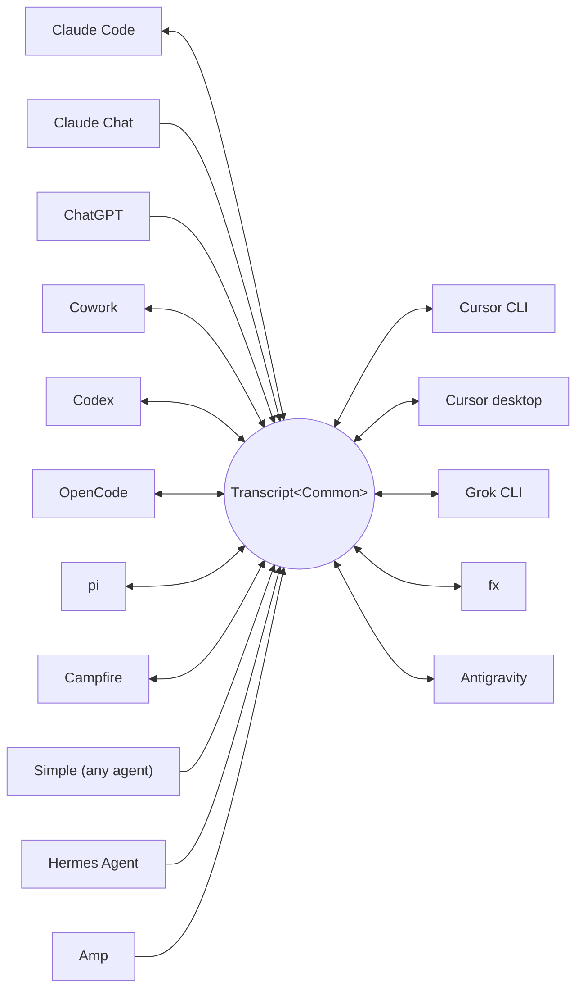

<p align="center">
  <picture>
    <source media="(prefers-color-scheme: dark)" srcset="../assets/wordmark-dark.svg">
    
  </picture>
</p>

<p align="center">हार्नेसमधील सेशन्स हलवण्यासाठीची लायब्ररी</p>

<p align="center">
  <a href="../../README.md">English</a> | <a href="README.ja.md">日本語</a> | <a href="README.zh-CN.md">简体中文</a> | <a href="README.zh-TW.md">繁體中文</a> | <a href="README.ko.md">한국어</a> | <a href="README.de.md">Deutsch</a> | <a href="README.es.md">Español</a> | <a href="README.fr.md">Français</a> | <a href="README.it.md">Italiano</a> | <a href="README.pt-BR.md">Português (Brasil)</a> | <a href="README.ru.md">Русский</a> | मराठी | <a href="README.ta.md">தமிழ்</a>
</p>

<p align="center">
  <a href="https://crates.io/crates/txcript"></a>
  <a href="https://www.npmjs.com/package/txcript"></a>
  <a href="https://docs.rs/txcript"></a>
  <a href="https://github.com/skillsynchq/txcript/actions/workflows/ci.yml"></a>
  <a href="../../LICENSE"></a>
</p>

<p align="center">
  <a href="https://claude.com/claude-code"></a>
  &nbsp;&nbsp;&nbsp;&nbsp;
  <a href="https://github.com/openai/codex"></a>
  &nbsp;&nbsp;&nbsp;&nbsp;
  <a href="https://opencode.ai"></a>
  &nbsp;&nbsp;&nbsp;&nbsp;
  <a href="https://pi.dev"></a>
  &nbsp;&nbsp;&nbsp;&nbsp;
  <a href="https://cursor.com"></a>
  &nbsp;&nbsp;&nbsp;&nbsp;
  <a href="https://github.com/xai-org/grok-build"></a>
  &nbsp;&nbsp;&nbsp;&nbsp;
  <a href="https://ampcode.com"></a>
  &nbsp;&nbsp;&nbsp;&nbsp;
  <a href="https://antigravity.google"></a>
</p>

Claude Code मध्ये सेशन सुरू करा; usage limit लागली किंवा काम अडलं, की संपूर्ण संभाषण, reasoning आणि टूल हिस्ट्रीसह तेच सेशन Codex मध्ये जसंच्या तसं पुढे चालू ठेवा:

<p align="center">
  
</p>

txcript प्रत्येक हार्नेसचा नेटिव्ह ट्रान्सक्रिप्ट फॉरमॅट एका टाइप्ड कॉमन मॉडेलमधून मॅप करते. नेटिव्ह load/save बाइट-न्-बाइट लॉसलेस आहे; एका हार्नेसमधून दुसऱ्या हार्नेसमध्ये रूपांतर करताना मेसेजेस, reasoning, टूल कॉल्स, टूल रिझल्ट्स, इमेजेस, मेटाडेटा आणि usage (जिथे उपलब्ध असेल तिथे) जपले जातात. हे [**CLI**](#cli), [**Rust crate**](#rust-crate) आणि [**npm package**](#npm-package) या तीन रूपांत मिळते.

## ठळक वैशिष्ट्ये

- **16 हार्नेस, एकच मॉडेल**: प्रत्येक फॉरमॅट `Transcript<Common>` मधून रूपांतरित होतो, त्यामुळे नवीन हार्नेस जोडला की तो आपोआप बाकी सगळ्यांशी जोडला जातो.
- **बाकी सगळ्यांसाठी एक फॉरमॅट**: txcript ने कधीही न ऐकलेले एजंट्स डॉक्युमेंट केलेला [Simple](../formats/simple.md) इंटरचेंज JSON लिहितात — एक फाइल किंवा एक स्ट्रीम, थेट txcript ला दिलेला — आणि त्यांचे ट्रान्सक्रिप्ट कोणत्याही समर्थित हार्नेसमध्ये पुढे चालू राहतात.
- **बाइट-लॉसलेस राउंड-ट्रिप**: सेशन त्याच्या स्वतःच्या फॉरमॅटमध्ये लोड करून सेव्ह केल्यास ते जसंच्या तसं परत मिळतं.
- **कुठेही पुढे चालू ठेवा**: `txcript continue <id> --with <harness>` सेशन दुसऱ्या हार्नेसच्या नेटिव्ह फॉरमॅटमध्ये पुन्हा लिहून तो हार्नेस लाँच करते. मूळ सेशनला कधीही धक्का लागत नाही.
- **सेशन्स वाचा आणि सोबत न्या**: `txcript view` कोणतेही सेशन बिल्ट-इन पेजरमध्ये उघडते, आणि इमेज दाखवू शकणाऱ्या टर्मिनलवर इमेजेससुद्धा दिसतात; `txcript export` ते Simple डॉक्युमेंट म्हणून लिहिते, जे `continue` दुसऱ्या मशीनवर उचलते.
- **सगळं शोधा**: मशीनवरील प्रत्येक सेशनवर literal, केस-इनसेन्सिटिव्ह शोध — लायब्ररी API, वन-शॉट CLI क्वेरी किंवा इंटरॅक्टिव्ह पिकर म्हणून.
- **MCP सर्व्हर**: `txcript mcp` रीड-ओन्ली `list_sessions`, `search_sessions` आणि `read_session` टूल्स उपलब्ध करून देते, त्यामुळे एजंट्स जुनी सेशन्स कॉन्टेक्स्ट म्हणून वापरू शकतात.
- **डॉक्युमेंट केलेले फॉरमॅट्स**: प्रत्येक हार्नेसचा ऑन-डिस्क फॉरमॅट [`docs/formats/`](../formats) मध्ये सविस्तर लिहिलेला आहे, आणि प्रत्येक विधानाला त्याचा पुरावा जोडलेला आहे (अधिकृत डॉक्स, source permalinks किंवा reverse-engineering नोट्स).

## समर्थित हार्नेस



डिस्कव्हरी, लिस्टिंग, शोध आणि `view` ज्या हार्नेसला स्वतःचा store आहे अशा प्रत्येक हार्नेससाठी चालतात. हेच `id` स्ट्रिंग्स CLI आणि WASM API ला द्यायचे असतात.

| हार्नेस | id | डिस्कवरील सेशन्स | नेटिव्ह फॉरमॅट | रूपांतर | पुढे चालू | डॉक |
|---|---|---|---|:---:|:---:|---|
| [Claude Code](https://claude.com/claude-code) | `claude_code` | `~/.claude/projects/` | JSONL | ⇄ | ✓ | [स्पेक](../formats/claude-code.md) |
| [Claude Chat](https://claude.ai) | `claude_chat` | लाइव्ह `claude.ai` अकाउंट <sup>4</sup> | खाजगी वेब API | → | — <sup>4</sup> | [स्पेक](../formats/claude-chat.md) |
| [ChatGPT](https://chatgpt.com) | `chatgpt` | लाइव्ह `chatgpt.com` अकाउंट <sup>5</sup> | खाजगी वेब API | → | — <sup>5</sup> | [स्पेक](../formats/chatgpt.md) |
| [Cowork](https://claude.com/product/cowork) | `cowork` | `<Claude app data>/local-agent-mode-sessions/` | सेशन रेकॉर्ड + Claude Code JSONL | ⇄ | ✓ | [स्पेक](../formats/cowork.md) |
| [Codex](https://github.com/openai/codex) | `codex` | `~/.codex/sessions/` | rollout JSONL | ⇄ | ✓ | [स्पेक](../formats/codex.md) |
| [OpenCode](https://opencode.ai) | `opencode` | `~/.local/share/opencode/opencode.db` | SQLite | ⇄ | ✓ | [स्पेक](../formats/opencode.md) |
| [pi](https://pi.dev) | `pi` | `~/.pi/agent/sessions/` | JSONL | ⇄ | ✓ | [स्पेक](../formats/pi.md) |
| [Campfire](../formats/campfire.md) | `campfire` | `~/.campfire/agent/sessions/` | JSONL | ⇄ | ✓ | [स्पेक](../formats/campfire.md) |
| [Cursor CLI](https://cursor.com/cli) | `cursor` | `~/.cursor/chats/` | SQLite | ⇄ | ✓ | [स्पेक](../formats/cursor.md) |
| [Cursor desktop](https://cursor.com) | `cursor_desktop` | `<Cursor User dir>/globalStorage/` | SQLite | ⇄ | ✓ | [स्पेक](../formats/cursor-desktop.md) |
| [Grok CLI](https://github.com/xai-org/grok-build) | `grok` | `~/.grok/sessions/` | सेशन डिरेक्टरी (JSON) | ⇄ | ✓ | [स्पेक](../formats/grok.md) |
| [fx](https://fx.sh) | `fx` | `~/.fx/sessions/` | सेशन डिरेक्टरी (इव्हेंट-लॉग) | ⇄ | ✓ | [स्पेक](../formats/fx.md) |
| Hermes Agent | `hermes` | `~/.hermes/state.db` | SQLite | → | — <sup>3</sup> | [स्पेक](../formats/hermes.md) |
| [Amp](https://ampcode.com) | `amp` | `~/.local/share/amp/threads/` | थ्रेड JSON | → | — <sup>1</sup> | [स्पेक](../formats/amp.md) |
| [Antigravity](https://antigravity.google) | `antigravity` | `~/.gemini/antigravity-cli/` | SQLite | ⇄ | ✓ | [स्पेक](../formats/antigravity.md) |
| Simple | `simple` | — <sup>2</sup> | इंटरचेंज JSON | → | — <sup>2</sup> | [स्पेक](../formats/simple.md) |

<sup>1</sup> Amp चे थ्रेड्स सर्व्हर-साइड असतात आणि CLI मध्ये import नाही: सेशन्स Amp *मधून* रूपांतरित होतात, पण Amp मध्ये पुढे चालू ठेवता येत नाहीत.

<sup>2</sup> Simple हा txcript चा स्वतःचा इंटरचेंज फॉरमॅट आहे — वर न दिलेल्या कोणत्याही एजंटसाठीचा प्रवेशमार्ग. याला कोणतेही ॲप नाही आणि कोणतीही व्यवस्थापित डिरेक्टरी नाही: Simple सेशन म्हणजे एक डॉक्युमेंट (फाइल किंवा stdin), जे थेट `txcript continue` ला दिले जाते, आणि पुढे चालू ठेवलेले संभाषण तेव्हापासून टार्गेट हार्नेसमध्ये राहते.

<sup>3</sup> Hermes चा `state.db` txcript मध्ये रीड-ओन्ली आहे आणि Hermes कडे सेशन import करणारी कमांड नाही: सेशन्स Hermes *मधून* रूपांतरित होतात, पण Hermes मध्ये पुढे चालू ठेवता येत नाहीत.

<sup>4</sup> Claude Chat हा लाइव्ह, फक्त-pull सोर्स आहे. macOS वर `--from claude_chat` स्पष्टपणे निवडल्यास साइन-इन केलेले Claude Desktop सेशन आपोआप पुन्हा वापरले जाते; एकत्रित डिस्कव्हरी Claude Chat शी संपर्क करत नाही. एन्व्हायर्नमेंट व्हेरिएबल्समधून दिलेली क्रेडेन्शियल्स स्वीकारली जात नाहीत. ऐच्छिक `TXCRIPT_CLAUDE_CHAT_ORGANIZATION_UUID` डिस्कव्हरी एका organization पुरती मर्यादित करते; एरवी ॲपची सक्रिय organization वापरली जाते. Claude Chat ला कोणतेही समर्थित conversation API नाही: txcript एक खाजगी endpoint वाचते, जो Anthropic पाहू किंवा मर्यादित करू शकते, आणि जिथे डिस्कव्हरी थेट कॉल केली जाते तिथे Rust crate बिल्डच्या वेळी warning देते. txcript फक्त वाचते: save, delete, त्याच हार्नेसमध्ये continue आणि `--with claude_chat` नाकारते. संभाषणात Claude ने तयार केलेल्या फाइल्स सोबत येतात; Claude Code मध्ये पुढे चालू ठेवल्यावर त्या नवीन सेशनच्या शेजारी लिहिल्या जातात आणि Claude Code artifacts म्हणून दिसतात. Claude चे data-export ZIP आणि `conversations.json` समर्थित नाहीत.

<sup>5</sup> ChatGPT हा लाइव्ह, फक्त-pull सोर्स आहे. Claude Chat जसे Claude Desktop पुन्हा वापरते, तसेच `--from chatgpt` स्पष्टपणे निवडल्यास Codex ने `CODEX_HOME/auth.json` किंवा `~/.codex/auth.json` इथे सांभाळलेले ChatGPT लॉगिन आपोआप पुन्हा वापरले जाते; हे अकाउंट ब्राउझरमधून साइन-इन केलेल्या अकाउंटपेक्षा वेगळे असू शकते. txcript ती क्रेडेन्शियल फाइल फक्त वाचते, कधीही refresh किंवा पुन्हा लिहीत नाही. एकत्रित डिस्कव्हरी ChatGPT शी संपर्क करत नाही, पण नेमका conversation UUID दिल्यास अकाउंटची यादी न काढता तो थेट वाचता येतो. txcript फक्त वाचते: save, delete, त्याच हार्नेसमध्ये continue आणि `--with chatgpt` नाकारते. ChatGPT ला कोणतेही समर्थित conversation API नाही, त्यामुळे हा ॲक्सेस बदलू किंवा मर्यादित होऊ शकतो. ChatGPT चे data-export archives समर्थित नाहीत.

## इन्स्टॉलेशन

**CLI** (`txcript` बायनरी इन्स्टॉल होते):

```sh
cargo install --git https://github.com/skillsynchq/txcript txcript-cli
# or from a checkout: cargo install --path cli
```

**Rust crate**:

```sh
cargo add txcript
```

**npm package** (आधीच बिल्ड केलेलं WASM, Rust टूलचेनची गरज नाही):

```sh
bun add txcript     # or: npm install txcript
```

## CLI

लोकल सेशन्स शोधा आणि कोणत्याही हार्नेसमध्ये पुढे चालू ठेवा:

```sh
txcript list                             # local sessions across every harness
    [--from <harness>]                    #   only this harness's sessions
    [--cwd <dir>]                         #   only sessions recorded under <dir>
    [-n <N>]                              #   at most N sessions
    [--since <when>] [--until <when>]     #   bound the session start time
txcript continue <id>[#range]            # continue <id>, then launch its harness
    [--with <harness>]                    #   ...continuing in <harness> instead
    [--from <harness>]                    #   scope the id lookup to one harness
    [--out <dir>]                         #   write under <dir>; implies --no-resume
    [--no-resume]                         #   write the session but don't launch
txcript continue <file|->[#range]        # continue a Simple document instead:
    --with <harness> [...]                #   a file, or stdin (`-`), from any agent
txcript view <id>[#range]                # view a session; compact text when piped
    [--from <harness>]                    #   scope the id lookup to one harness
    [--no-pager]                          #   print the terminal view directly
txcript export <id>[#range]              # write a session as a Simple document
    [--from <harness>]                    #   scope the id lookup to one harness
    [--out <file>]                        #   write to <file> instead of stdout
```

सेशन id म्हणून पूर्ण id चा कोणताही असंदिग्ध prefix किंवा सेशनचे नेमके शीर्षक चालते. `txcript resume` हा `continue` चा alias आहे. `--since` आणि `--until` RFC 3339 टाइमस्टॅम्प किंवा नुसत्या `YYYY-MM-DD` तारखा घेतात.

`continue` टार्गेट हार्नेस जिथे सेशन्स ठेवतो तिथे सेशन लिहिते, आणि मग त्या सेशनवर तो हार्नेस लाँच करून टर्मिनल त्याच्या हवाली करते:

- एकाच हार्नेसमध्ये: मूळ सेशन जागच्या जागी resume होते.
- हार्नेस बदलताना (`--with`): सेशन टार्गेटच्या नेटिव्ह फॉरमॅटमध्ये पुन्हा लिहिले जाते. लिहिली जाते ती नेहमी एक कॉपीच; मूळ सेशन कधीही बदलले किंवा हटवले जात नाही.
- id ऐवजी [Simple](../formats/simple.md) डॉक्युमेंट — `txcript continue ./run.json --with claude_code`, किंवा `my-agent | txcript continue - --with claude_code` — कोणत्याही एजंटचे ट्रान्सक्रिप्ट त्याच पद्धतीने आणते; डॉक्युमेंटला स्वतःचा हार्नेस नसल्याने `--with` आवश्यक आहे.
- लाँच कमांड हार्नेसनुसार असते आणि बदलता येते: `TRANSCRIPT_<HARNESS>_RESUME_CMD` ला `{id}` टेम्प्लेट द्या, उदा. `TRANSCRIPT_CODEX_RESUME_CMD="codex resume {id}"`.

टर्मिनलमध्ये `view` बिल्ट-इन पेजर उघडते: `u`, `a`, `t` आणि `r` युजर मेसेजेस, असिस्टंट मेसेजेस, टूल कॉल्स आणि reasoning लपवतात किंवा दाखवतात; `]` आणि `[` एका मेसेजवरून पुढच्या किंवा मागच्या मेसेजवर नेतात; `/` जे दिसते आहे त्यात शोधते. इमेज दाखवू शकणाऱ्या टर्मिनलवर (Ghostty, kitty, WezTerm, Konsole) इमेजेस इनलाइन दिसतात. बाहेरचा पेजर वापरायचा असल्यास `TXCRIPT_PAGER` सेट करा, किंवा view थेट छापण्यासाठी `--no-pager` द्या. pipe किंवा redirect केल्यावर `view` MCP सर्व्हर देतो तोच कॉम्पॅक्ट टेक्स्ट छापते. दोन्ही बाबतीत प्रत्येक मेसेजला `── #N ──` अशा रेषेने क्रमांक मिळतो, आणि `#range` त्या छापलेल्या क्रमांकांनुसार मेसेज निवडते — 1 पासून सुरू, दोन्ही टोकं धरून:

- `abc#7`: फक्त मेसेज 7
- `abc#5-12`: मेसेज 5 ते 12
- `abc#5-`: मेसेज 5 पासून शेवटपर्यंत
- `abc#-10`: सुरुवातीपासून मेसेज 10 पर्यंत

`continue` ला हाच suffix चालतो, आणि तेवढेच मेसेज नवीन सेशन म्हणून पुढे चालू होतात. टूल कॉलला त्याच्या रिझल्टपासून तोडणारी रेंज नाकारली जाते, आणि एररमध्ये सर्वात जवळची वैध रेंज सुचवली जाते.

`export` सेशनला [Simple](../formats/simple.md) डॉक्युमेंट म्हणून, stdout वर किंवा `--out <file>` मध्ये लिहिते. हा डॉक्युमेंट canonical मॉडेलचं पूर्ण रेंडरिंग आहे — `continue` एका हार्नेसमधून दुसऱ्या हार्नेसमध्ये जे काही घेऊन जातो ते सगळं — आणि कोणताही हार्नेस त्याची सेशन्स जिथे ठेवतो तिथून तो वेगळा असतो, त्यामुळे तो एका मशीनवरून दुसऱ्या मशीनवर एक फाइल म्हणून नेता येतो:

```sh
txcript export 0dc114bf --out session.json       # on this machine
txcript continue ./session.json --with claude_code   # on the other one
```

इम्पोर्ट करणाऱ्या मशीनवर रेकॉर्ड केलेली working directory अस्तित्वात असेल तर ती तशीच ठेवली जाते, नाहीतर `continue` ज्या डिरेक्टरीत चालते तिने बदलली जाते. `export` ला `view` सारखाच `#range` suffix आणि `--from` scope चालतो.

### शोध

```sh
txcript query 'relay bug'                # one-shot: ranked hits, highlighted
txcript query                            # interactive picker; Enter continues
    [--from <harness>]                   #   search only <harness> (default: all)
    [--with <harness>]                   #   continue the pick in <harness>
    [--cwd <dir>]                        #   only sessions recorded under <dir>
```

पॅटर्न literal आणि केस-इनसेन्सिटिव्ह पद्धतीने जुळतो: `relay bug` दिल्यास नेमका तोच मजकूर — स्पेसेससकट — असलेल्या ओळी सापडतात.

पिकरमध्ये टाइप करताच फिल्टर होते, arrow keys किंवा ctrl-p/n ने वर-खाली, Enter ने निवडलेले सेशन त्याच्याच हार्नेसमध्ये (किंवा `--with` दिलेल्या हार्नेसमध्ये) पुढे चालू, Esc ने रद्द. कोणत्या प्रकारच्या कंटेंटमध्ये मॅच सापडला — युजर टेक्स्ट, असिस्टंट टेक्स्ट, thinking, टूल यूज, टूल आउटपुट की सेशन मेटाडेटा — हे प्रत्येक ओळीत दिसते.

cache नसेल तर प्रत्येक run मध्ये प्रत्येक सेशन पुन्हा वाचले जाते. `--cache <path>` द्या (किंवा `TXCRIPT_CACHE` सेट करा) म्हणजे त्या path वर कायमस्वरूपी शोध cache ठेवली जाते, आणि `query` व MCP शोध टूल मागच्या run नंतर बदललेली सेशन्सच पुन्हा वाचतात. हा फ्लॅग प्रत्येक subcommand ला चालतो.

### MCP सर्व्हर

```sh
txcript mcp                              # stdio transport
```

तीन रीड-ओन्ली टूल्स उपलब्ध करून देते; त्यांचे ऑप्शनल फिल्टर CLI सारखेच:

- `list_sessions(from?, cwd?, limit?, offset?)`
- `search_sessions(pattern, from?, cwd?)`
- `read_session(id, from?)`

<sub>\* `from` वगळल्यास सर्व हार्नेस धरले जातात; `cwd` वगळल्यास डिरेक्टरीचा फिल्टर लागत नाही. ज्या सेशनमध्ये working directory नोंदलेली नाही, ती फक्त `cwd` वगळल्यावरच मॅच होतात.</sub>

`list_sessions` `limit` आणि `offset` ने पेजिंग करते आणि पेजिंगच्या आधीची एकूण संख्या कळवते; लाइव्ह Claude Chat आणि ChatGPT सोर्स कधीही लिस्ट होत नाहीत. `read_session` ला `view` सारखाच `#range` suffix चालतो आणि तोच कॉम्पॅक्ट टेक्स्ट परत देते; एका वेळी पूर्ण परत देता येणार नाही इतके मोठे वाचन नाकारले जाते आणि सब-रेंज सुचवल्या जातात. `--cache` सर्व्हरलाही लागू होते.

### शेल इंटिग्रेशन

```sh
eval "$(txcript init zsh)"                      # in ~/.zshrc; or: txcript init bash
```

`init` कम्प्लीशन्स छापते, आणि सोबत एक ctrl+shift+r बाइंडिंग देते जे सध्याच्या फोल्डरमध्ये नोंदलेल्या सेशन्सपुरता मर्यादित पिकर उघडते. फक्त कम्प्लीशन्स हव्या असल्यास `completion` bash, elvish, fish, powershell आणि zsh साठी चालते:

```sh
txcript completion zsh > ~/.zfunc/_txcript      # or wherever your fpath looks
source <(txcript completion bash)               # bash, ad hoc
txcript completion fish > ~/.config/fish/completions/txcript.fish
```

## Rust crate

```toml
[dependencies]
txcript = "0.12"
# Codecs only: drops the SQLite-backed stores, the live Claude Chat and
# ChatGPT sources, and search. Every codec stays available.
# txcript = { version = "0.12", default-features = false }
```

डीफॉल्ट फीचर्स: `opencode` (SQLite stores: OpenCode, दोन्ही Cursor, Antigravity), `hermes`, `claude_chat`, `chatgpt` आणि `search`.

लहानापासून मोठ्यापर्यंत तीन लेयर:

- `Codec`: प्रत्येक हार्नेससाठी `to_common` / `from_common`; `convert::<A, B>` त्यांना canonical मॉडेलमधून साखळीने जोडते.
- `TextCodec`: `from_text` / `to_text` — हार्नेसचा नेटिव्ह सेशन टेक्स्ट पार्स आणि रेंडर करण्यासाठी, कोणताही I/O न करता.
- `Store`: खऱ्या बॅकएंडवर (सेशन डिरेक्टरीज, किंवा OpenCode, Hermes, दोन्ही Cursor आणि Antigravity साठी SQLite DB) discover/load/save.

मेमरीतच रूपांतर (फाइलसिस्टम नाही):

```rust
use txcript::harness::{claude_code, codex};
use txcript::{Codec, TextCodec, convert};

let claude = claude_code::ClaudeCode::from_text(jsonl_text)?;          // Transcript<ClaudeCode>
let codex = convert::<claude_code::ClaudeCode, codex::Codex>(&claude)?; // Transcript<Codex>
let codex_text = codex::Codex::to_text(&codex)?;                       // native rollout JSONL
```

किंवा `Store` मार्फत डिस्कवरून:

```rust
use txcript::harness::{claude_code, codex};
use txcript::{Store, convert};

let store = claude_code::ClaudeStore::default_root().expect("home dir");
let found = store.discover()?;                       // cheap metadata scan
let claude = store.load(&found[0].reference)?;       // Transcript<ClaudeCode>

let codex = convert::<_, codex::Codex>(&claude)?;
codex::CodexStore::default_root().expect("home dir").save(&codex)?;  // resumable on disk
```

canonical मॉडेल म्हणजे `Transcript<Common>`: `Meta` + `Vec<Message>`, जिथे `Message` मध्ये टाइप्ड `Block` (`Text`, `Thinking`, `ToolUse`, `ToolResult`, `Image`) आणि टाइप्ड `Tool` enum असतो.

युजरने हार्नेसवर चालवलेल्या स्लॅश कमांड्ससुद्धा (`/release patch`) canonical आहेत: युजर टर्नवर एक `Tool::Command` कॉल येतो, आणि कमांडने परत छापलेलं आउटपुट त्याचा `ToolResult` बनतं.

### शोध (`search` फीचर, डीफॉल्ट चालू)

`txcript::search` ट्रान्सक्रिप्टवर fuzzy (fzf-शैलीचा सिंटॅक्स) आणि substring शोध देते. वन-शॉट शोध:

```rust
use txcript::search::{Query, search};

let hits = search(&common, &Query::substring("relay bug"));  // or Query::fuzzy for fzf syntax
for hit in hits {
    // hit.origin: User | Assistant | Thinking | ToolUse | ToolResult | Meta
    // hit.span addresses the message; hit.highlights are char ranges into hit.line
    let messages = common.fragment(&hit.span);            // zero-copy: Option<&[Message]>
}
```

पिकर-शैलीच्या शोधासाठी `Index` एकदाच बांधा आणि प्रत्येक keystroke ला क्वेरी करा:

```rust
use txcript::search::{DocKey, Index, Query};

let mut index = Index::new();
index.insert(DocKey { harness, id }, &common);   // re-insert replaces; caller owns refresh
let matches = index.query(&Query::fuzzy("srch")); // ranked docs, best lines as hits
```

रिकामा पॅटर्न दिल्यास सगळ्यात नवीन डॉक्युमेंट्स आधी मिळतात. टूल आउटपुट डीफॉल्ट वगळले जातात; ते हवे असल्यास `Origin::ALL` वापरा. `Query.harnesses`, `Query.limit` आणि `Query.hits_per_doc` ने निकाल मर्यादित करता येतात.

### टेक्स्ट प्रोजेक्शन

`txcript::text::to_text(&common)` हे [`txcript view`](#cli) च्या मागचं प्रोजेक्शन आहे: `Transcript<Common>` चं LLM कॉन्टेक्स्ट म्हणून वापरण्यासाठीचं वन-वे, टोकनांची काटकसर करणारं रेंडरिंग. मेसेजेस, reasoning टेक्स्ट आणि कॉम्पॅक्ट टूल कॉल/रिझल्ट ठेवले जातात; फक्त replay साठी लागणारे payload (एन्क्रिप्टेड reasoning, usage अकाउंटिंग, इनलाइन इमेज बाइट्स) वगळले जातात. `to_text_fragment(&common, &span)` सेशन कंटेंटचा एक `Span` रेंडर करते, आणि प्रत्येक मेसेजचा पूर्ण सेशनमधला क्रमांक तसाच ठेवते.

## npm package

npm पॅकेज कोडेक Bun आणि Node साठी आधीच बिल्ड केलेलं WASM म्हणून देते. ते सेशन टेक्स्ट मेमरीतच रूपांतरित करते; डिस्कवरील सेशन्स शोधणे, वाचणे आणि लिहिणे हे कॉल करणाऱ्याचे काम आहे, त्यामुळे पॅकेजमध्ये `Store` नाही.

```ts
import { convert, toCommon, fromCommon, harnesses } from "txcript";
import { readFileSync, writeFileSync } from "node:fs";

const input = readFileSync("rollout.jsonl", "utf8");

// native -> native (e.g. a Codex rollout into Claude Code's JSONL)
writeFileSync("session.jsonl", convert(input, "codex", "claude_code"));

// canonical view, and back
const common = JSON.parse(toCommon(input, "codex"));   // { meta, messages }
const pi = fromCommon(JSON.stringify(common), "pi");

harnesses(); // ["claude_code","claude_chat","chatgpt","codex","opencode","pi","campfire","cursor","cursor_desktop","grok","fx","hermes","amp","antigravity","simple","cowork"]
```

टेक्स्ट-इन / टेक्स्ट-आउट: `input` म्हणजे सोर्स हार्नेसचा नेटिव्ह सेशन टेक्स्ट, आणि रिझल्ट टार्गेटचा. चुकीची हार्नेस नावं किंवा पार्स न होणारे इनपुट JS `Error` फेकतात.

शोधसुद्धा सोबत येतो. क्वेरी म्हणजे crate च्या `Query` चं JSON रूप: फक्त `pattern` आवश्यक आहे, आणि `mode` `"substring"` असं सेट केलं नसल्यास ते `"fuzzy"` असतं:

```ts
import { searchTranscript, Searcher } from "txcript";

// one session, one shot: a JSON array of hits
const hits = JSON.parse(searchTranscript(input, "codex", JSON.stringify({ pattern: "relay bug", mode: "substring" })));

// picker-style: index once, query per keystroke
const index = new Searcher();
index.insert("codex", "0dc114bf", input);          // re-insert replaces
const matches = JSON.parse(index.query(JSON.stringify({ pattern: "relay bug" })));
```

| हार्नेस | सेशन टेक्स्ट |
|---|---|
| `claude_code`, `codex`, `pi`, `campfire` | सेशन JSONL |
| `claude_chat` | एका लाइव्ह conversation चा detail response (फक्त सोर्स म्हणून; अकाउंट export arrays नाहीत) |
| `chatgpt` | एका लाइव्ह conversation चा detail response (फक्त सोर्स म्हणून; अकाउंट export arrays नाहीत) |
| `opencode` | `opencode export` चे JSON |
| `cursor` | सेशनच्या `store.db` चा JSON एक्स्पोर्ट |
| `cursor_desktop` | सेशनच्या `state.vscdb` पंक्तींचा JSON डम्प |
| `grok` | सेशन डिरेक्टरीतील फाइल्सचा JSON बंडल |
| `fx` | सेशन डिरेक्टरीतील फाइल्सचा JSON बंडल |
| `hermes` | `hermes sessions export` चा JSON ऑब्जेक्ट |
| `amp` | `amp threads export` चे JSON |
| `antigravity` | संभाषण डेटाबेसचा JSON डम्प, protobuf blob हेक्स-एन्कोडेड |
| `simple` | [Simple](../formats/simple.md) इंटरचेंज JSON डॉक्युमेंट |
| `cowork` | सेशन रेकॉर्ड, Claude Code ट्रान्सक्रिप्ट आणि audit log यांचा JSON बंडल |

त्याऐवजी wasm सोर्सपासून बिल्ड करायचे असल्यास:

```sh
git clone https://github.com/skillsynchq/txcript.git
cd txcript
bun run setup        # once: wasm target + wasm-bindgen-cli
bun run build        # produces ./pkg
```

## फॉरमॅट डॉक्युमेंटेशन

प्रत्येक ट्रान्सक्रिप्ट फॉरमॅटचं त्याच्या व्हेंडरकडून डॉक्युमेंटेशन असतंच असं नाही. [`docs/formats/`](../formats) मध्ये प्रत्येक हार्नेससाठी एक डॉक्युमेंट आहे: सेशन्स डिस्कवर कुठे राहतात, डिस्कव्हरी ती कशी शोधते, फॉरमॅटच्या प्रत्येक भागाचं सविस्तर विश्लेषण आणि त्याच्या खोडी — आणि प्रत्येक विधानाला त्याचा पुरावा जोडलेला आहे: अधिकृत डॉक्युमेंटेशन, हार्नेसचाच ओपन-सोर्स serialization कोड (commit-pinned permalinks सह) किंवा reverse engineering.

## डेव्हलपमेंट

```sh
cargo test --workspace --all-features               # what CI runs
cargo test -p txcript --no-default-features         # codecs only: no SQLite or live stores
bun run build && bun examples/convert.ts <file> <from> <to>
git config core.hooksPath .githooks                 # pre-push runs the CI checks
```

बायनरी स्वतःच्या वेगळ्या workspace क्रेटमध्ये (`cli/`, पॅकेज `txcript-cli`) राहते; रूटमधील लायब्ररीवर तिच्या dependencies पैकी एकही येत नाही.

## लायसन्स

[Apache-2.0](../../LICENSE)
