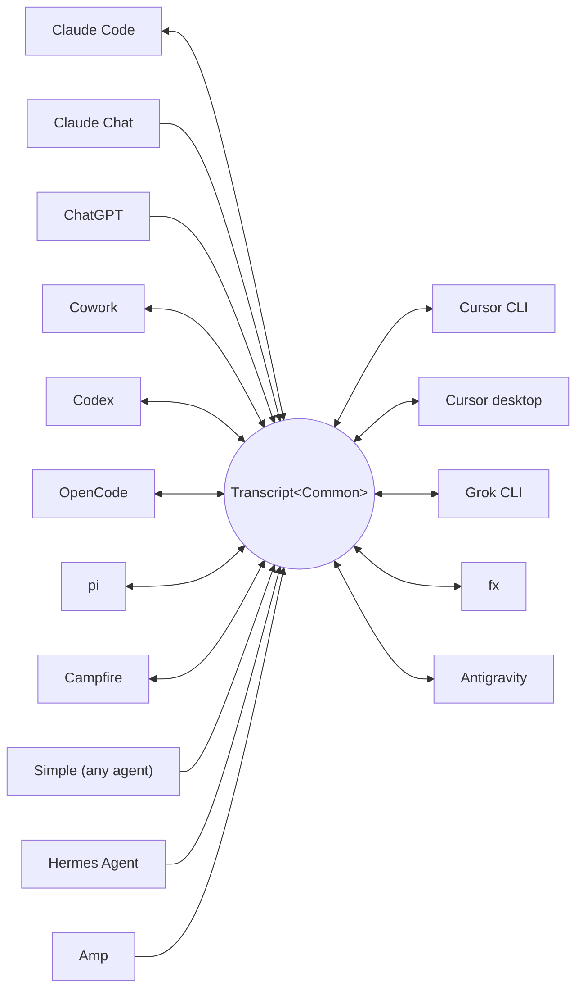

<p align="center">
  <picture>
    <source media="(prefers-color-scheme: dark)" srcset="../assets/wordmark-dark.svg">
    
  </picture>
</p>

<p align="center">Uma biblioteca para mover sessões entre harnesses</p>

<p align="center">
  <a href="../../README.md">English</a> | <a href="README.ja.md">日本語</a> | <a href="README.zh-CN.md">简体中文</a> | <a href="README.zh-TW.md">繁體中文</a> | <a href="README.ko.md">한국어</a> | <a href="README.de.md">Deutsch</a> | <a href="README.es.md">Español</a> | <a href="README.fr.md">Français</a> | <a href="README.it.md">Italiano</a> | Português (Brasil) | <a href="README.ru.md">Русский</a> | <a href="README.mr.md">मराठी</a> | <a href="README.ta.md">தமிழ்</a>
</p>

<p align="center">
  <a href="https://crates.io/crates/txcript"></a>
  <a href="https://www.npmjs.com/package/txcript"></a>
  <a href="https://docs.rs/txcript"></a>
  <a href="https://github.com/skillsynchq/txcript/actions/workflows/ci.yml"></a>
  <a href="../../LICENSE"></a>
</p>

<p align="center">
  <a href="https://claude.com/claude-code"></a>
  &nbsp;&nbsp;&nbsp;&nbsp;
  <a href="https://github.com/openai/codex"></a>
  &nbsp;&nbsp;&nbsp;&nbsp;
  <a href="https://opencode.ai"></a>
  &nbsp;&nbsp;&nbsp;&nbsp;
  <a href="https://pi.dev"></a>
  &nbsp;&nbsp;&nbsp;&nbsp;
  <a href="https://cursor.com"></a>
  &nbsp;&nbsp;&nbsp;&nbsp;
  <a href="https://github.com/xai-org/grok-build"></a>
  &nbsp;&nbsp;&nbsp;&nbsp;
  <a href="https://ampcode.com"></a>
  &nbsp;&nbsp;&nbsp;&nbsp;
  <a href="https://antigravity.google"></a>
</p>

Comece uma sessão no Claude Code, atinja um limite de uso ou um beco sem saída, e retome-a no Codex com toda a conversa, o raciocínio e o histórico de ferramentas intactos:

<p align="center">
  
</p>

O txcript mapeia o formato de transcrição nativo de cada harness por meio de um modelo comum tipado. Carregar/salvar nativo é lossless byte a byte; a conversão entre harnesses preserva mensagens, raciocínio, chamadas de ferramentas, resultados de ferramentas, imagens, metadados e dados de uso, quando disponíveis. É distribuído como [**CLI**](#cli), [**crate Rust**](#crate-rust) e [**pacote npm**](#pacote-npm).

## Destaques

- **16 harnesses, um único modelo**: cada formato converte por meio de `Transcript<Common>`, então adicionar um harness o conecta a todos os outros.
- **Um formato para todos os outros**: agentes que o txcript nunca viu emitem o JSON de intercâmbio [Simple](../formats/simple.md) documentado — um arquivo ou um stream, entregue diretamente ao txcript — e suas transcrições continuam em qualquer harness suportado.
- **Round-trips lossless byte a byte**: carregar e salvar uma sessão em seu próprio formato a reproduz exatamente.
- **Continue em qualquer lugar**: `txcript continue <id> --with <harness>` reescreve uma sessão no formato nativo de outro harness e o inicia. O original nunca é modificado.
- **Leia e leve sessões**: `txcript view` abre qualquer sessão em um pager embutido, com imagens incluídas em terminais que as desenham; `txcript export` a grava como documento Simple que `continue` recupera em outra máquina.
- **Pesquise tudo**: busca literal, sem distinção de maiúsculas e minúsculas, em todas as sessões da máquina, como API de biblioteca, consulta única na CLI ou seletor interativo.
- **Servidor MCP**: `txcript mcp` expõe as ferramentas somente leitura `list_sessions`, `search_sessions` e `read_session`, para que agentes possam explorar sessões passadas como contexto.
- **Formatos documentados**: o formato em disco de cada harness está descrito em [`docs/formats/`](../formats), com a proveniência de cada afirmação (documentação oficial, permalinks para o código-fonte ou notas de engenharia reversa).

## Harnesses suportados



Descoberta, listagem, pesquisa e `view` funcionam para todos os harnesses com um store por trás. As strings de `id` são o que a CLI e as APIs WASM aceitam.

| Harness | id | Sessões em disco | Formato nativo | Conversão | Continuar para | Doc |
|---|---|---|---|:---:|:---:|---|
| [Claude Code](https://claude.com/claude-code) | `claude_code` | `~/.claude/projects/` | JSONL | ⇄ | ✓ | [spec](../formats/claude-code.md) |
| [Claude Chat](https://claude.ai) | `claude_chat` | conta `claude.ai` online <sup>4</sup> | API web privada | → | — <sup>4</sup> | [spec](../formats/claude-chat.md) |
| [ChatGPT](https://chatgpt.com) | `chatgpt` | conta `chatgpt.com` online <sup>5</sup> | API web privada | → | — <sup>5</sup> | [spec](../formats/chatgpt.md) |
| [Cowork](https://claude.com/product/cowork) | `cowork` | `<Claude app data>/local-agent-mode-sessions/` | registro de sessão + JSONL do Claude Code | ⇄ | ✓ | [spec](../formats/cowork.md) |
| [Codex](https://github.com/openai/codex) | `codex` | `~/.codex/sessions/` | JSONL de rollout | ⇄ | ✓ | [spec](../formats/codex.md) |
| [OpenCode](https://opencode.ai) | `opencode` | `~/.local/share/opencode/opencode.db` | SQLite | ⇄ | ✓ | [spec](../formats/opencode.md) |
| [pi](https://pi.dev) | `pi` | `~/.pi/agent/sessions/` | JSONL | ⇄ | ✓ | [spec](../formats/pi.md) |
| [Campfire](../formats/campfire.md) | `campfire` | `~/.campfire/agent/sessions/` | JSONL | ⇄ | ✓ | [spec](../formats/campfire.md) |
| [Cursor CLI](https://cursor.com/cli) | `cursor` | `~/.cursor/chats/` | SQLite | ⇄ | ✓ | [spec](../formats/cursor.md) |
| [Cursor desktop](https://cursor.com) | `cursor_desktop` | `<Cursor User dir>/globalStorage/` | SQLite | ⇄ | ✓ | [spec](../formats/cursor-desktop.md) |
| [Grok CLI](https://github.com/xai-org/grok-build) | `grok` | `~/.grok/sessions/` | diretório de sessão (JSON) | ⇄ | ✓ | [spec](../formats/grok.md) |
| [fx](https://fx.sh) | `fx` | `~/.fx/sessions/` | diretório de sessão (log de eventos) | ⇄ | ✓ | [spec](../formats/fx.md) |
| Hermes Agent | `hermes` | `~/.hermes/state.db` | SQLite | → | — <sup>3</sup> | [spec](../formats/hermes.md) |
| [Amp](https://ampcode.com) | `amp` | `~/.local/share/amp/threads/` | JSON da thread | → | — <sup>1</sup> | [spec](../formats/amp.md) |
| [Antigravity](https://antigravity.google) | `antigravity` | `~/.gemini/antigravity-cli/` | SQLite | ⇄ | ✓ | [spec](../formats/antigravity.md) |
| Simple | `simple` | — <sup>2</sup> | JSON de intercâmbio | → | — <sup>2</sup> | [spec](../formats/simple.md) |

<sup>1</sup> As threads do Amp ficam no servidor e a CLI não tem importação: as sessões convertem *a partir do* Amp, mas não podem ser continuadas para ele.

<sup>2</sup> O Simple é o formato de intercâmbio do próprio txcript — a porta de entrada para qualquer agente não listado acima. Não há aplicativo nem diretório gerenciado: uma sessão Simple é um documento (um arquivo, ou stdin) entregue diretamente a `txcript continue`, e a conversa continuada vive no harness de destino daí em diante.

<sup>3</sup> O `state.db` do Hermes é somente leitura no txcript e o Hermes não tem comando de importação de sessões: as sessões convertem *a partir do* Hermes, mas não podem ser continuadas para ele.

<sup>4</sup> O Claude Chat é uma fonte online, somente pull. No macOS, selecionar explicitamente `--from claude_chat` reutiliza automaticamente a sessão autenticada do Claude Desktop; a descoberta agregada não contata o Claude Chat. Credenciais passadas por variáveis de ambiente não são aceitas. Um `TXCRIPT_CLAUDE_CHAT_ORGANIZATION_UUID` opcional restringe a descoberta a uma organização; caso contrário, a organização ativa do aplicativo é usada. O Claude Chat não tem API de conversas suportada: o txcript lê um endpoint privado que a Anthropic pode observar ou restringir, e o crate Rust emite um aviso em tempo de build onde quer que a descoberta seja chamada diretamente. O txcript apenas lê: recusa save, delete, continue no mesmo harness e `--with claude_chat`. Arquivos que o Claude gerou na conversa vêm junto; continuados no Claude Code, são gravados ao lado da nova sessão e aparecem como artefatos do Claude Code. O ZIP de exportação de dados do Claude e o `conversations.json` não são suportados.

<sup>5</sup> O ChatGPT é uma fonte online, somente pull. Assim como o Claude Chat reutiliza o Claude Desktop, selecionar explicitamente `--from chatgpt` reutiliza automaticamente o login do ChatGPT gerenciado pelo Codex em `CODEX_HOME/auth.json` ou `~/.codex/auth.json`; a conta pode ser diferente daquela autenticada pelo navegador. O txcript apenas lê esse arquivo de credenciais e nunca o renova nem o reescreve. A descoberta agregada não contata o ChatGPT, mas o UUID exato de uma conversa pode ser lido diretamente sem enumerar a conta. O txcript apenas lê: recusa save, delete, continue no mesmo harness e `--with chatgpt`. O ChatGPT não tem API de conversas suportada, então esse acesso pode mudar ou ser restringido. Arquivos de exportação de dados do ChatGPT não são suportados.

## Instalação

**CLI** (instala o binário `txcript`):

```sh
cargo install --git https://github.com/skillsynchq/txcript txcript-cli
# or from a checkout: cargo install --path cli
```

**Crate Rust**:

```sh
cargo add txcript
```

**Pacote npm** (WASM pré-compilado, sem necessidade de toolchain Rust):

```sh
bun add txcript     # or: npm install txcript
```

## CLI

Descubra sessões locais e continue uma delas em qualquer harness:

```sh
txcript list                             # local sessions across every harness
    [--from <harness>]                    #   only this harness's sessions
    [--cwd <dir>]                         #   only sessions recorded under <dir>
    [-n <N>]                              #   at most N sessions
    [--since <when>] [--until <when>]     #   bound the session start time
txcript continue <id>[#range]            # continue <id>, then launch its harness
    [--with <harness>]                    #   ...continuing in <harness> instead
    [--from <harness>]                    #   scope the id lookup to one harness
    [--out <dir>]                         #   write under <dir>; implies --no-resume
    [--no-resume]                         #   write the session but don't launch
txcript continue <file|->[#range]        # continue a Simple document instead:
    --with <harness> [...]                #   a file, or stdin (`-`), from any agent
txcript view <id>[#range]                # view a session; compact text when piped
    [--from <harness>]                    #   scope the id lookup to one harness
    [--no-pager]                          #   print the terminal view directly
txcript export <id>[#range]              # write a session as a Simple document
    [--from <harness>]                    #   scope the id lookup to one harness
    [--out <file>]                        #   write to <file> instead of stdout
```

Um id de sessão é qualquer prefixo não ambíguo do id completo, ou o título exato da sessão. `txcript resume` é um alias de `continue`. `--since` e `--until` aceitam timestamps RFC 3339 ou datas simples no formato `YYYY-MM-DD`.

`continue` grava a sessão onde o harness de destino mantém suas sessões, depois inicia esse harness nela, entregando o terminal:

- Mesmo harness: retoma o original no próprio lugar.
- Entre harnesses (`--with`): reescreve a sessão no formato nativo do destino. O que é gravado é sempre uma cópia; a sessão de origem nunca é modificada nem removida.
- Um documento [Simple](../formats/simple.md) no lugar de um id — `txcript continue ./run.json --with claude_code`, ou `my-agent | txcript continue - --with claude_code` — traz a transcrição de qualquer agente da mesma forma; `--with` é obrigatório, já que um documento não tem harness próprio.
- O comando de inicialização é por harness e pode ser sobrescrito: defina `TRANSCRIPT_<HARNESS>_RESUME_CMD` como um template `{id}`, por exemplo `TRANSCRIPT_CODEX_RESUME_CMD="codex resume {id}"`.

`view` em um terminal abre um pager embutido: `u`, `a`, `t` e `r` ocultam ou mostram mensagens do usuário, mensagens do assistente, chamadas de ferramentas e raciocínio; `]` e `[` saltam entre mensagens; `/` pesquisa no que está sendo exibido. Imagens são desenhadas inline em terminais que conseguem exibi-las (Ghostty, kitty, WezTerm, Konsole). Defina `TXCRIPT_PAGER` para usar um pager externo, ou passe `--no-pager` para imprimir a visualização diretamente. Com pipe ou redirecionamento, `view` imprime o mesmo texto compacto que o servidor MCP serve. Em ambos os casos cada mensagem é numerada por uma régua `── #N ──`, e `#range` seleciona mensagens por esses ordinais impressos, baseados em 1 e inclusivos:

- `abc#7`: apenas a mensagem 7
- `abc#5-12`: mensagens 5 a 12
- `abc#5-`: da mensagem 5 até o final
- `abc#-10`: do início até a mensagem 10

`continue` aceita o mesmo sufixo e continua apenas essas mensagens como uma nova sessão. Um intervalo que separaria uma chamada de ferramenta do seu resultado é recusado, e o erro sugere o intervalo válido mais próximo.

`export` grava a sessão como documento [Simple](../formats/simple.md), em stdout ou em `--out <file>`. O documento é a renderização completa do modelo canônico — tudo que `continue` carrega entre harnesses — independente de onde um harness mantém suas sessões, então ele se move de uma máquina para outra como um arquivo:

```sh
txcript export 0dc114bf --out session.json       # on this machine
txcript continue ./session.json --with claude_code   # on the other one
```

O diretório de trabalho registrado é mantido quando existe na máquina de importação e, caso contrário, substituído pelo diretório em que `continue` é executado. `export` aceita o mesmo sufixo `#range` e o mesmo escopo `--from` que `view`.

### Pesquisa

```sh
txcript query 'relay bug'                # one-shot: ranked hits, highlighted
txcript query                            # interactive picker; Enter continues
    [--from <harness>]                   #   search only <harness> (default: all)
    [--with <harness>]                   #   continue the pick in <harness>
    [--cwd <dir>]                        #   only sessions recorded under <dir>
```

Um padrão corresponde literalmente e sem distinção de maiúsculas e minúsculas: `relay bug` encontra as linhas que contêm exatamente esse texto, espaços inclusos.

No seletor, digite para filtrar, setas / ctrl-p/n para navegar, Enter para continuar a seleção no seu próprio harness (ou com `--with`), Esc para cancelar. Cada linha mostra que tipo de conteúdo teve correspondência: texto do usuário, texto do assistente, thinking, uso de ferramenta, saída de ferramenta ou metadados da sessão.

Sem cache, cada execução relê todas as sessões. Passe `--cache <path>` (ou defina `TXCRIPT_CACHE`) para manter um cache de pesquisa persistente nesse caminho, de modo que `query` e a ferramenta de pesquisa do MCP releiam apenas as sessões que mudaram desde a última execução. A flag é aceita por todos os subcomandos.

### Servidor MCP

```sh
txcript mcp                              # stdio transport
```

Expõe três ferramentas somente leitura; seus filtros opcionais correspondem aos da CLI:

- `list_sessions(from?, cwd?, limit?, offset?)`
- `search_sessions(pattern, from?, cwd?)`
- `read_session(id, from?)`

<sub>\* Omitir `from` inclui todos os harnesses; omitir `cwd` não aplica nenhum filtro de diretório. Sessões sem um diretório de trabalho registrado só correspondem quando `cwd` é omitido.</sub>

`list_sessions` pagina com `limit` e `offset` e informa o total antes de paginar; as fontes online Claude Chat e ChatGPT nunca são listadas. `read_session` aceita o mesmo sufixo `#range` que `view` e retorna o mesmo texto compacto; uma leitura grande demais para ser retornada inteira é recusada com sugestões de sub-intervalos. `--cache` também se aplica ao servidor.

### Integração com o shell

```sh
eval "$(txcript init zsh)"                      # in ~/.zshrc; or: txcript init bash
```

`init` imprime completions mais um atalho ctrl+shift+r que abre o seletor restrito às sessões registradas na pasta atual. Para apenas completions, `completion` cobre bash, elvish, fish, powershell e zsh:

```sh
txcript completion zsh > ~/.zfunc/_txcript      # or wherever your fpath looks
source <(txcript completion bash)               # bash, ad hoc
txcript completion fish > ~/.config/fish/completions/txcript.fish
```

## Crate Rust

```toml
[dependencies]
txcript = "0.12"
# Codecs only: drops the SQLite-backed stores, the live Claude Chat and
# ChatGPT sources, and search. Every codec stays available.
# txcript = { version = "0.12", default-features = false }
```

Features padrão: `opencode` (os stores SQLite: OpenCode, os dois Cursors, Antigravity), `hermes`, `claude_chat`, `chatgpt` e `search`.

Três camadas, da menor para a maior:

- `Codec`: `to_common` / `from_common` por harness; `convert::<A, B>` os encadeia através do modelo canônico.
- `TextCodec`: `from_text` / `to_text` para fazer parse e renderizar o texto de sessão nativo de um harness, sem I/O.
- `Store`: descoberta/carregamento/salvamento em um backend real (diretórios de sessão, ou bancos SQLite para OpenCode, Hermes, os dois Cursors e Antigravity).

Converta em memória (sem sistema de arquivos):

```rust
use txcript::harness::{claude_code, codex};
use txcript::{Codec, TextCodec, convert};

let claude = claude_code::ClaudeCode::from_text(jsonl_text)?;          // Transcript<ClaudeCode>
let codex = convert::<claude_code::ClaudeCode, codex::Codex>(&claude)?; // Transcript<Codex>
let codex_text = codex::Codex::to_text(&codex)?;                       // native rollout JSONL
```

Ou passe pelo disco com um `Store`:

```rust
use txcript::harness::{claude_code, codex};
use txcript::{Store, convert};

let store = claude_code::ClaudeStore::default_root().expect("home dir");
let found = store.discover()?;                       // cheap metadata scan
let claude = store.load(&found[0].reference)?;       // Transcript<ClaudeCode>

let codex = convert::<_, codex::Codex>(&claude)?;
codex::CodexStore::default_root().expect("home dir").save(&codex)?;  // resumable on disk
```

O modelo canônico é `Transcript<Common>`: `Meta` + `Vec<Message>`, em que uma `Message` contém `Block`s tipados (`Text`, `Thinking`, `ToolUse`, `ToolResult`, `Image`) e um enum `Tool` tipado.

Comandos de barra que o usuário executou no harness (`/release patch`) também são canônicos: uma chamada `Tool::Command` no turno do usuário, pareada com o que o comando imprimiu de volta como seu `ToolResult`.

### Pesquisa (feature `search`, ativada por padrão)

`txcript::search` oferece busca fuzzy (sintaxe no estilo fzf) e por substring em transcrições. Busca única:

```rust
use txcript::search::{Query, search};

let hits = search(&common, &Query::substring("relay bug"));  // or Query::fuzzy for fzf syntax
for hit in hits {
    // hit.origin: User | Assistant | Thinking | ToolUse | ToolResult | Meta
    // hit.span addresses the message; hit.highlights are char ranges into hit.line
    let messages = common.fragment(&hit.span);            // zero-copy: Option<&[Message]>
}
```

Para busca no estilo seletor, construa um `Index` uma vez e consulte-o a cada tecla digitada:

```rust
use txcript::search::{DocKey, Index, Query};

let mut index = Index::new();
index.insert(DocKey { harness, id }, &common);   // re-insert replaces; caller owns refresh
let matches = index.query(&Query::fuzzy("srch")); // ranked docs, best lines as hits
```

Um padrão vazio retorna os documentos do mais recente para o mais antigo. Saídas de ferramentas são excluídas por padrão; use `Origin::ALL` para incluí-las. `Query.harnesses`, `Query.limit` e `Query.hits_per_doc` restringem os resultados.

### Projeção de texto

`txcript::text::to_text(&common)` é a projeção por trás de [`txcript view`](#cli): uma renderização unidirecional e econômica em tokens de `Transcript<Common>` para uso como contexto de LLM. Mantém mensagens, texto de raciocínio e chamadas/resultados compactos de ferramentas; payloads que só servem para replay (raciocínio criptografado, contabilidade de uso, bytes de imagens inline) são omitidos. `to_text_fragment(&common, &span)` renderiza um `Span` do corpo, mantendo o ordinal de cada mensagem na sessão completa.

## Pacote npm

O pacote npm distribui o codec como WASM pré-compilado para Bun e Node. Ele converte texto de sessão em memória; descobrir, ler e gravar sessões em disco é tarefa de quem chama, então o pacote não tem `Store`.

```ts
import { convert, toCommon, fromCommon, harnesses } from "txcript";
import { readFileSync, writeFileSync } from "node:fs";

const input = readFileSync("rollout.jsonl", "utf8");

// native -> native (e.g. a Codex rollout into Claude Code's JSONL)
writeFileSync("session.jsonl", convert(input, "codex", "claude_code"));

// canonical view, and back
const common = JSON.parse(toCommon(input, "codex"));   // { meta, messages }
const pi = fromCommon(JSON.stringify(common), "pi");

harnesses(); // ["claude_code","claude_chat","chatgpt","codex","opencode","pi","campfire","cursor","cursor_desktop","grok","fx","hermes","amp","antigravity","simple","cowork"]
```

Texto entra / texto sai: `input` é o texto de sessão nativo do harness de origem, e o resultado é o do destino. Nomes de harness inválidos ou entrada que não pode ser interpretada lançam um `Error` de JS.

A pesquisa também vem incluída. Uma consulta é a forma JSON do `Query` do crate: apenas `pattern` é obrigatório, e `mode` é `"fuzzy"` a menos que seja definido como `"substring"`:

```ts
import { searchTranscript, Searcher } from "txcript";

// one session, one shot: a JSON array of hits
const hits = JSON.parse(searchTranscript(input, "codex", JSON.stringify({ pattern: "relay bug", mode: "substring" })));

// picker-style: index once, query per keystroke
const index = new Searcher();
index.insert("codex", "0dc114bf", input);          // re-insert replaces
const matches = JSON.parse(index.query(JSON.stringify({ pattern: "relay bug" })));
```

| Harness | Texto de sessão |
|---|---|
| `claude_code`, `codex`, `pi`, `campfire` | JSONL da sessão |
| `claude_chat` | uma resposta de detalhe de conversa online (somente origem; sem arrays de exportação da conta) |
| `chatgpt` | uma resposta de detalhe de conversa online (somente origem; sem arrays de exportação da conta) |
| `opencode` | JSON de `opencode export` |
| `cursor` | export JSON do `store.db` da sessão |
| `cursor_desktop` | dump JSON das linhas de `state.vscdb` da sessão |
| `grok` | bundle JSON dos arquivos do diretório de sessão |
| `fx` | bundle JSON dos arquivos do diretório de sessão |
| `hermes` | objeto JSON de `hermes sessions export` |
| `amp` | JSON de `amp threads export` |
| `antigravity` | dump JSON do banco de conversas, com blobs protobuf codificados em hex |
| `simple` | o documento JSON de intercâmbio [Simple](../formats/simple.md) |
| `cowork` | bundle JSON do registro de sessão, da transcrição do Claude Code e do log de auditoria |

Para compilar o wasm a partir do código-fonte:

```sh
git clone https://github.com/skillsynchq/txcript.git
cd txcript
bun run setup        # once: wasm target + wasm-bindgen-cli
bun run build        # produces ./pkg
```

## Documentação dos formatos

Nem todos esses formatos de transcrição são documentados por seus fornecedores. [`docs/formats/`](../formats) tem um documento por harness cobrindo onde as sessões ficam em disco, como a descoberta as encontra, uma dissecação de cada parte do formato e suas peculiaridades, cada um marcado com a proveniência do que afirma: documentação oficial, o próprio código de serialização open source do harness (citado com permalinks fixados em commits), ou engenharia reversa.

## Desenvolvimento

```sh
cargo test --workspace --all-features               # what CI runs
cargo test -p txcript --no-default-features         # codecs only: no SQLite or live stores
bun run build && bun examples/convert.ts <file> <from> <to>
git config core.hooksPath .githooks                 # pre-push runs the CI checks
```

O binário vive em seu próprio crate de workspace (`cli/`, pacote `txcript-cli`); a biblioteca na raiz não carrega nenhuma de suas dependências.

## Licença

[Apache-2.0](../../LICENSE)
