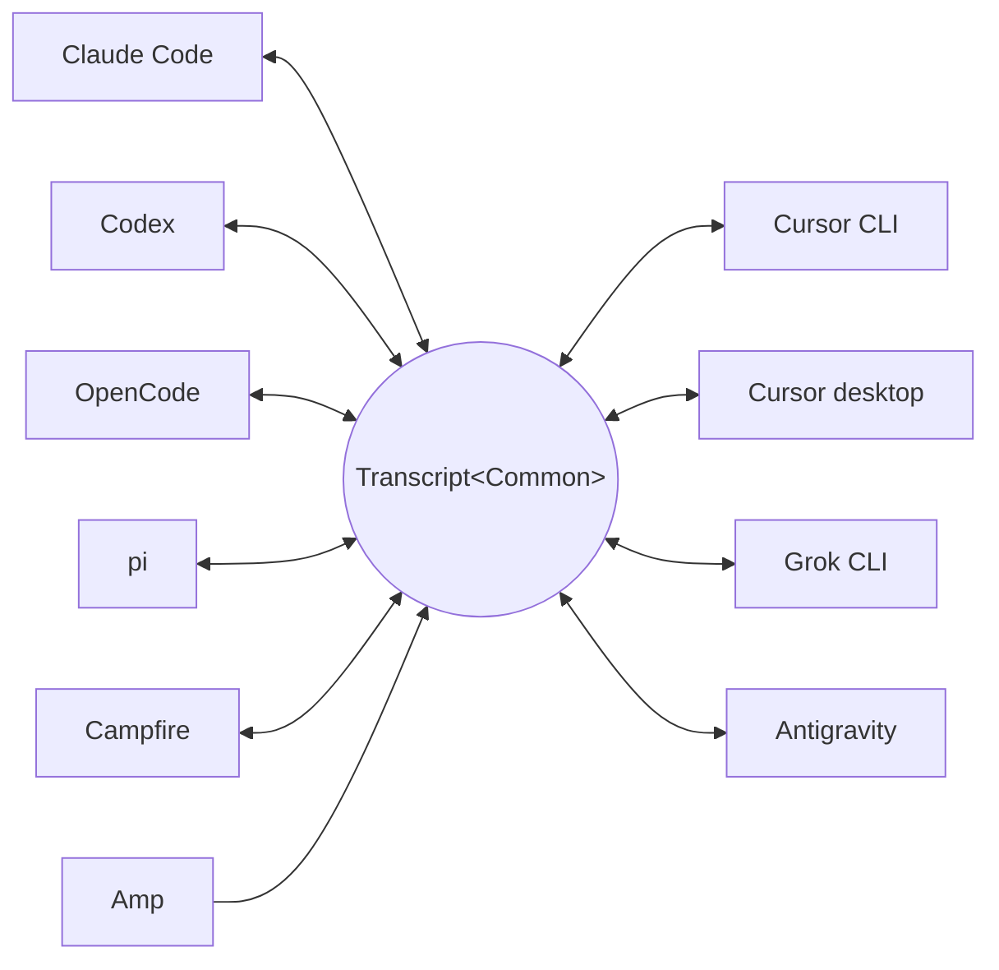

<p align="center">
  <picture>
    <source media="(prefers-color-scheme: dark)" srcset="../assets/wordmark-dark.svg">
    
  </picture>
</p>

<p align="center">Uma biblioteca para mover sessões entre harnesses</p>

<p align="center">
  <a href="../../README.md">English</a> | <a href="README.ja.md">日本語</a> | <a href="README.zh-CN.md">简体中文</a> | <a href="README.zh-TW.md">繁體中文</a> | <a href="README.ko.md">한국어</a> | <a href="README.de.md">Deutsch</a> | <a href="README.es.md">Español</a> | <a href="README.fr.md">Français</a> | <a href="README.it.md">Italiano</a> | Português (Brasil) | <a href="README.ru.md">Русский</a> | <a href="README.mr.md">मराठी</a> | <a href="README.ta.md">தமிழ்</a>
</p>

<p align="center">
  <a href="https://crates.io/crates/txcript"></a>
  <a href="https://www.npmjs.com/package/txcript"></a>
  <a href="https://docs.rs/txcript"></a>
  <a href="https://github.com/skillsynchq/txcript/actions/workflows/ci.yml"></a>
  <a href="../../LICENSE"></a>
</p>

<p align="center">
  <a href="https://claude.com/claude-code"></a>
  &nbsp;&nbsp;&nbsp;&nbsp;
  <a href="https://github.com/openai/codex"></a>
  &nbsp;&nbsp;&nbsp;&nbsp;
  <a href="https://opencode.ai"></a>
  &nbsp;&nbsp;&nbsp;&nbsp;
  <a href="https://pi.dev"></a>
  &nbsp;&nbsp;&nbsp;&nbsp;
  <a href="https://cursor.com"></a>
  &nbsp;&nbsp;&nbsp;&nbsp;
  <a href="https://github.com/xai-org/grok-build"></a>
  &nbsp;&nbsp;&nbsp;&nbsp;
  <a href="https://ampcode.com"></a>
  &nbsp;&nbsp;&nbsp;&nbsp;
  <a href="https://antigravity.google"></a>
</p>

Comece uma sessão no Claude Code, atinja um limite de uso ou um beco sem saída, e retome-a no Codex com toda a conversa, o raciocínio e o histórico de ferramentas intactos:

<p align="center">
  
</p>

O txcript mapeia o formato de transcrição nativo de cada harness por meio de um modelo comum tipado. Carregar/salvar nativo é lossless byte a byte; a conversão entre harnesses preserva mensagens, raciocínio, chamadas de ferramentas, resultados de ferramentas, imagens, metadados e dados de uso, quando disponíveis. É distribuído como [**CLI**](#cli), [**crate Rust**](#crate-rust) e [**pacote npm**](#pacote-npm).

## Destaques

- **10 harnesses, um único modelo**: cada formato converte por meio de `Transcript<Common>`, então adicionar um harness o conecta a todos os outros.
- **Round-trips lossless byte a byte**: carregar e salvar uma sessão em seu próprio formato a reproduz exatamente.
- **Continue em qualquer lugar**: `txcript continue <id> --with <harness>` reescreve uma sessão no formato nativo de outro harness e o inicia. O original nunca é modificado.
- **Pesquise tudo**: busca fuzzy/por substring em todas as sessões da máquina (sintaxe no estilo fzf, com [nucleo](https://github.com/helix-editor/nucleo) por baixo), como API de biblioteca, consulta única na CLI ou seletor interativo.
- **Servidor MCP**: `txcript mcp` expõe as ferramentas somente leitura `list_sessions`, `search_sessions` e `read_session`, para que agentes possam explorar sessões passadas como contexto.
- **Formatos documentados**: o formato em disco de cada harness está descrito em [`docs/formats/`](../formats), com a proveniência de cada afirmação (documentação oficial, permalinks para o código-fonte ou notas de engenharia reversa).

## Harnesses suportados



Descoberta, listagem, pesquisa, `view` e round-trips nativos funcionam para todos os harnesses. As strings de `id` são o que a CLI e as APIs WASM aceitam.

| Harness | id | Sessões em disco | Formato nativo | Conversão | Continuar para | Doc |
|---|---|---|---|:---:|:---:|---|
| [Claude Code](https://claude.com/claude-code) | `claude_code` | `~/.claude/projects/` | JSONL | ⇄ | ✓ | [spec](../formats/claude-code.md) |
| [Codex](https://github.com/openai/codex) | `codex` | `~/.codex/sessions/` | JSONL de rollout | ⇄ | ✓ | [spec](../formats/codex.md) |
| [OpenCode](https://opencode.ai) | `opencode` | `~/.local/share/opencode/opencode.db` | SQLite | ⇄ | ✓ | [spec](../formats/opencode.md) |
| [pi](https://pi.dev) | `pi` | `~/.pi/agent/sessions/` | JSONL | ⇄ | ✓ | [spec](../formats/pi.md) |
| [Campfire](../formats/campfire.md) | `campfire` | `~/.campfire/agent/sessions/` | JSONL | ⇄ | ✓ | [spec](../formats/campfire.md) |
| [Cursor CLI](https://cursor.com/cli) | `cursor` | `~/.cursor/chats/` | SQLite | ⇄ | ✓ | [spec](../formats/cursor.md) |
| [Cursor desktop](https://cursor.com) | `cursor_desktop` | `<Cursor User dir>/globalStorage/` | SQLite | ⇄ | ✓ | [spec](../formats/cursor-desktop.md) |
| [Grok CLI](https://github.com/xai-org/grok-build) | `grok` | `~/.grok/sessions/` | diretório de sessão (JSON) | ⇄ | ✓ | [spec](../formats/grok.md) |
| [Amp](https://ampcode.com) | `amp` | `~/.local/share/amp/threads/` | JSON da thread | → | — <sup>1</sup> | [spec](../formats/amp.md) |
| [Antigravity](https://antigravity.google) | `antigravity` | `~/.gemini/antigravity-cli/` | SQLite | ⇄ | ✓ | [spec](../formats/antigravity.md) |

<sup>1</sup> As threads do Amp ficam no servidor e a CLI não tem importação: as sessões convertem *a partir do* Amp, mas não podem ser continuadas para ele.

## Instalação

**CLI** (instala o binário `txcript`):

```sh
cargo install --git https://github.com/skillsynchq/txcript txcript-cli
# or from a checkout: cargo install --path cli
```

**Crate Rust**:

```sh
cargo add txcript
```

**Pacote npm** (WASM pré-compilado, sem necessidade de toolchain Rust):

```sh
bun add txcript     # or: npm install txcript
```

## CLI

Descubra sessões locais e continue uma delas em qualquer harness:

```sh
txcript list                             # local sessions across every harness
txcript continue <id>[#range]            # continue <id>, then launch its harness
    [--with <harness>]                    #   ...continuing in <harness> instead
    [--from <harness>]                    #   scope the id lookup to one harness
    [--out <dir>]                         #   write under <dir>; implies --no-resume
    [--no-resume]                         #   write the session but don't launch
txcript view <id>[#range]                # print a session as compact text
    [--from <harness>]                    #   scope the id lookup to one harness
txcript export <id>[#range]              # write a session as a Simple document
    [--from <harness>]                    #   scope the id lookup to one harness
    [--out <file>]                        #   write to <file> instead of stdout
```

`continue` grava a sessão onde o harness de destino mantém suas sessões, depois inicia esse harness nela, entregando o terminal:

- Mesmo harness: retoma o original no próprio lugar.
- Entre harnesses (`--with`): ressintetiza a sessão no formato nativo do destino. O que é gravado é sempre uma cópia; a sessão de origem nunca é modificada nem removida.
- O comando de inicialização é por harness e pode ser sobrescrito: defina `TRANSCRIPT_<HARNESS>_RESUME_CMD` como um template `{id}`, por exemplo `TRANSCRIPT_CODEX_RESUME_CMD="codex resume {id}"`.

`view` imprime a sessão como texto compacto, cada mensagem numerada por uma régua `── #N ──`. `#range` seleciona mensagens pelos ordinais impressos, baseados em 1 e inclusivos:

- `abc#7`: apenas a mensagem 7
- `abc#5-12`: mensagens 5 a 12
- `abc#5-`: da mensagem 5 até o final
- `abc#-10`: do início até a mensagem 10

`continue` aceita o mesmo sufixo e continua apenas essas mensagens como uma nova sessão. Um intervalo que separaria uma chamada de ferramenta do seu resultado é recusado, e o erro sugere o intervalo válido mais próximo.

`export` grava a sessão como documento [Simple](../formats/simple.md), em stdout ou em `--out <file>`. O documento é a renderização completa do modelo canônico — tudo que `continue` carrega entre harnesses — independente de onde um harness mantém suas sessões, então ele se move de uma máquina para outra como um arquivo:

```sh
txcript export 0dc114bf --out session.json       # on this machine
txcript continue ./session.json --with claude_code   # on the other one
```

O diretório de trabalho registrado é mantido quando existe na máquina de importação e, caso contrário, substituído pelo diretório em que `continue` é executado. `export` aceita o mesmo sufixo `#range` e o mesmo escopo `--from` que `view`.

### Pesquisa

```sh
txcript query 'relay bug'                # one-shot: ranked hits, highlighted
txcript query                            # fzf-style picker; Enter continues
    [--from <harness>]                   #   search only <harness> (default: all)
    [--with <harness>]                   #   continue the pick in <harness>
```

O seletor não tem dependências (ANSI em raw mode): digite para filtrar com a sintaxe fuzzy no estilo fzf, setas / ctrl-p/n para navegar, Enter para continuar a seleção no seu próprio harness (ou com `--with`), Esc para cancelar. Cada linha mostra que tipo de conteúdo teve correspondência: texto do usuário, texto do assistente, thinking, uso de ferramenta, saída de ferramenta ou metadados da sessão.

### Servidor MCP

```sh
txcript mcp                              # stdio transport
```

Expõe três ferramentas somente leitura; seus filtros opcionais correspondem aos da CLI:

- `list_sessions(from?, cwd?)`
- `search_sessions(pattern, from?, cwd?)`
- `read_session(id, from?)`

<sub>\* Omitir `from` inclui todos os harnesses; omitir `cwd` não aplica nenhum filtro de diretório. Sessões sem um diretório de trabalho registrado só correspondem quando `cwd` é omitido.</sub>

### Completions de shell

```sh
txcript completion zsh > ~/.zfunc/_txcript      # or wherever your fpath looks
source <(txcript completion bash)               # bash, ad hoc
txcript completion fish > ~/.config/fish/completions/txcript.fish
```

## Crate Rust

```toml
[dependencies]
txcript = "0.6"
# Drops the OpenCode SQLite store (rusqlite); the OpenCode codec stays available.
# txcript = { version = "0.6", default-features = false }
```

Três camadas, da menor para a maior:

- `Codec`: `to_common` / `from_common` por harness; `convert::<A, B>` os encadeia através do modelo canônico.
- `TextCodec`: `from_text` / `to_text` para fazer parse e renderizar o texto de sessão nativo de um harness, sem I/O.
- `Store`: descoberta/carregamento/salvamento em um backend real (diretórios de sessão, ou bancos SQLite para OpenCode e os dois Cursors).

Converta em memória (sem sistema de arquivos):

```rust
use txcript::harness::{claude_code, codex};
use txcript::{Codec, TextCodec, convert};

let claude = claude_code::ClaudeCode::from_text(jsonl_text)?;          // Transcript<ClaudeCode>
let codex = convert::<claude_code::ClaudeCode, codex::Codex>(&claude)?; // Transcript<Codex>
let codex_text = codex::Codex::to_text(&codex)?;                       // native rollout JSONL
```

Ou passe pelo disco com um `Store`:

```rust
use txcript::harness::{claude_code, codex};
use txcript::{Store, convert};

let store = claude_code::ClaudeStore::default_root().expect("home dir");
let found = store.discover()?;                       // cheap metadata scan
let claude = store.load(&found[0].reference)?;       // Transcript<ClaudeCode>

let codex = convert::<_, codex::Codex>(&claude)?;
codex::CodexStore::default_root().expect("home dir").save(&codex)?;  // resumable on disk
```

O modelo canônico é `Transcript<Common>`: `Meta` + `Vec<Message>`, em que uma `Message` contém `Block`s tipados (`Text`, `Thinking`, `ToolUse`, `ToolResult`, `Image`) e um enum `Tool` tipado.

Comandos de barra que o usuário executou no harness (`/release patch`) também são canônicos: uma chamada `Tool::Command` no turno do usuário, pareada com o que o comando imprimiu de volta como seu `ToolResult`.

### Pesquisa (feature `search`, ativada por padrão)

`txcript::search` oferece busca fuzzy e por substring em transcrições via [nucleo](https://github.com/helix-editor/nucleo). Busca única:

```rust
use txcript::search::{Query, search};

let hits = search(&common, &Query::fuzzy("relay bug"));   // fzf syntax: 'exact ^prefix !not
for hit in hits {
    // hit.origin: User | Assistant | Thinking | ToolUse | ToolResult | Meta
    // hit.span addresses the message; hit.highlights are char ranges into hit.line
    let messages = common.fragment(&hit.span);            // zero-copy: Option<&[Message]>
}
```

Para busca no estilo seletor, construa um `Index` uma vez e consulte-o a cada tecla digitada:

```rust
use txcript::search::{DocKey, Index, Query};

let mut index = Index::new();
index.insert(DocKey { harness, id }, &common);   // re-insert replaces; caller owns refresh
let matches = index.query(&Query::fuzzy("srch")); // ranked docs, best lines as hits
```

Um padrão vazio retorna os documentos do mais recente para o mais antigo. Saídas de ferramentas são excluídas por padrão; use `Origin::ALL` para incluí-las. `Query.harnesses`, `Query.limit` e `Query.hits_per_doc` restringem os resultados.

### Projeção de texto

`txcript::text::to_text(&common)` é a projeção por trás de [`txcript view`](#cli): uma renderização unidirecional e econômica em tokens de `Transcript<Common>` para uso como contexto de LLM. Mantém mensagens, texto de raciocínio e chamadas/resultados compactos de ferramentas; payloads que só servem para replay (raciocínio criptografado, contabilidade de uso, bytes de imagens inline) são omitidos. `to_text_fragment(&common, &span)` renderiza um `Span` do corpo, mantendo o ordinal de cada mensagem na sessão completa.

## Pacote npm

O pacote npm distribui o codec como WASM pré-compilado para Bun, Node e navegadores. O host JS é dono de todo o I/O e chama o módulo para a transformação; a camada `Store` (sistema de arquivos, SQLite, subprocessos) permanece nativa e fica fora do build WASM.

```ts
import { convert, toCommon, fromCommon, harnesses } from "txcript";
import { readFileSync, writeFileSync } from "node:fs";

const input = readFileSync("rollout.jsonl", "utf8");

// native -> native (e.g. a Codex rollout into Claude Code's JSONL)
writeFileSync("session.jsonl", convert(input, "codex", "claude_code"));

// canonical view, and back
const common = JSON.parse(toCommon(input, "codex"));   // { meta, messages }
const pi = fromCommon(JSON.stringify(common), "pi");

harnesses(); // ["claude_code","codex","opencode","pi","campfire","cursor","cursor_desktop","grok","amp","antigravity"]
```

Texto entra / texto sai: `input` é o texto de sessão nativo do harness de origem, e o resultado é o do destino. Nomes de harness inválidos ou entrada que não pode ser interpretada lançam um `Error` de JS.

| Harness | Texto de sessão |
|---|---|
| `claude_code`, `codex`, `pi`, `campfire` | JSONL da sessão |
| `opencode` | JSON de `opencode export` |
| `cursor` | export JSON do `store.db` da sessão |
| `cursor_desktop` | dump JSON das linhas de `state.vscdb` da sessão |
| `grok` | bundle JSON dos arquivos do diretório de sessão |
| `amp` | JSON de `amp threads export` |
| `antigravity` | dump JSON do banco de conversas, com blobs protobuf codificados em hex |

Para compilar o wasm a partir do código-fonte:

```sh
git clone https://github.com/skillsynchq/txcript.git
cd txcript
bun run setup        # once: wasm target + wasm-bindgen-cli
bun run build        # produces ./pkg
```

## Documentação dos formatos

Nem todos esses formatos de transcrição são documentados por seus fornecedores. [`docs/formats/`](../formats) tem um documento por harness cobrindo onde as sessões ficam em disco, como a descoberta as encontra, uma dissecação de cada parte do formato e suas peculiaridades, cada um marcado com a proveniência do que afirma: documentação oficial, o próprio código de serialização open source do harness (citado com permalinks fixados em commits), ou engenharia reversa.

## Desenvolvimento

```sh
cargo test                                          # native suite
cargo test --no-default-features                    # without the SQLite store
bun run build && bun examples/convert.ts <file> <from> <to>
```

O binário vive em seu próprio crate de workspace (`cli/`, pacote `txcript-cli`), então suas dependências (clap) nunca afetam os consumidores da biblioteca.

## Licença

[Apache-2.0](../../LICENSE)
