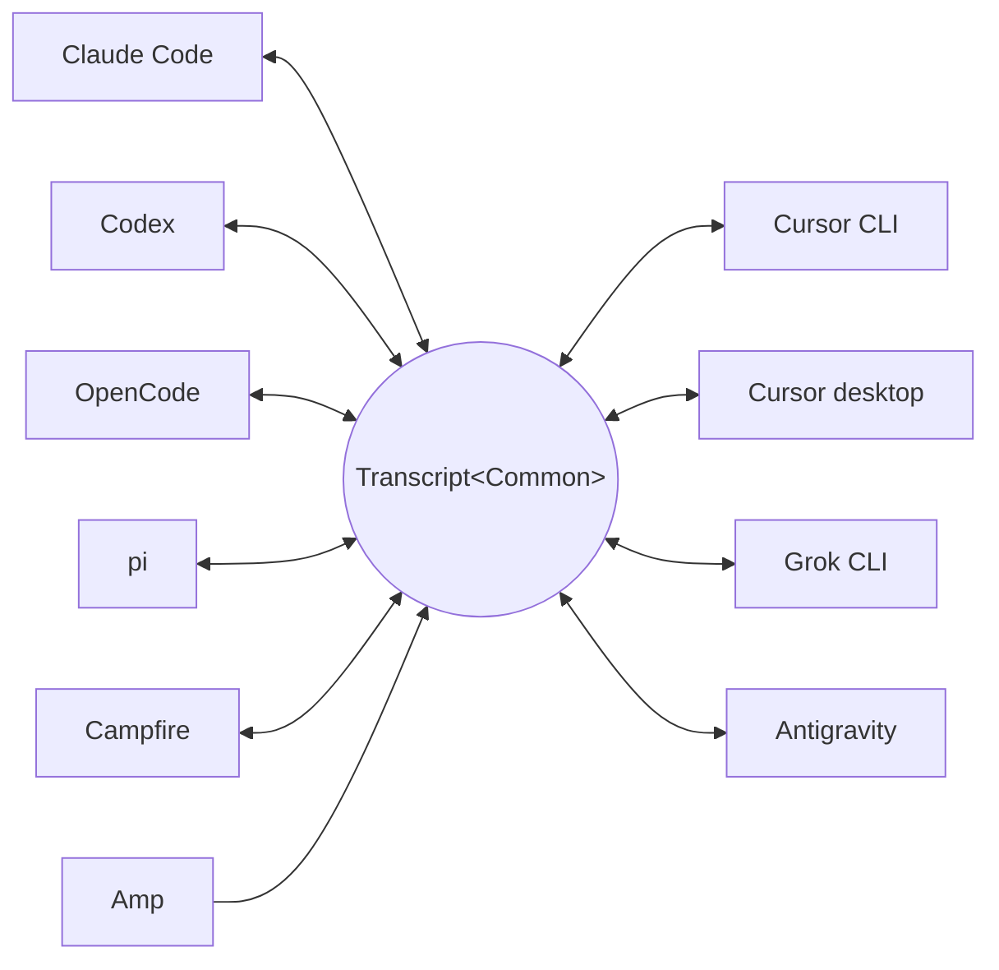

<p align="center">
  <picture>
    <source media="(prefers-color-scheme: dark)" srcset="../assets/wordmark-dark.svg">
    
  </picture>
</p>

<p align="center">Библиотека для переноса сессий между харнессами</p>

<p align="center">
  <a href="../../README.md">English</a> | <a href="README.ja.md">日本語</a> | <a href="README.zh-CN.md">简体中文</a> | <a href="README.zh-TW.md">繁體中文</a> | <a href="README.ko.md">한국어</a> | <a href="README.de.md">Deutsch</a> | <a href="README.es.md">Español</a> | <a href="README.fr.md">Français</a> | <a href="README.it.md">Italiano</a> | <a href="README.pt-BR.md">Português (Brasil)</a> | Русский | <a href="README.mr.md">मराठी</a> | <a href="README.ta.md">தமிழ்</a>
</p>

<p align="center">
  <a href="https://crates.io/crates/txcript"></a>
  <a href="https://www.npmjs.com/package/txcript"></a>
  <a href="https://docs.rs/txcript"></a>
  <a href="https://github.com/skillsynchq/txcript/actions/workflows/ci.yml"></a>
  <a href="../../LICENSE"></a>
</p>

<p align="center">
  <a href="https://claude.com/claude-code"></a>
  &nbsp;&nbsp;&nbsp;&nbsp;
  <a href="https://github.com/openai/codex"></a>
  &nbsp;&nbsp;&nbsp;&nbsp;
  <a href="https://opencode.ai"></a>
  &nbsp;&nbsp;&nbsp;&nbsp;
  <a href="https://pi.dev"></a>
  &nbsp;&nbsp;&nbsp;&nbsp;
  <a href="https://cursor.com"></a>
  &nbsp;&nbsp;&nbsp;&nbsp;
  <a href="https://github.com/xai-org/grok-build"></a>
  &nbsp;&nbsp;&nbsp;&nbsp;
  <a href="https://ampcode.com"></a>
  &nbsp;&nbsp;&nbsp;&nbsp;
  <a href="https://antigravity.google"></a>
</p>

Начните сессию в Claude Code, упритесь в лимит использования или в тупик, и продолжите её в Codex с полной историей разговора, рассуждений и вызовов инструментов:

<p align="center">
  
</p>

txcript отображает нативный формат транскрипта каждого харнесса через типизированную общую модель. Нативные загрузка и сохранение побайтово точны, без потерь; конвертация между харнессами сохраняет сообщения, рассуждения, вызовы инструментов, их результаты, изображения, метаданные и данные об использовании, где они доступны. Проект поставляется как [**CLI**](#cli), [**Rust-крейт**](#rust-крейт) и [**npm-пакет**](#npm-пакет).

## Основные возможности

- **10 харнессов, одна модель** — каждый формат конвертируется через `Transcript<Common>`, поэтому добавление харнесса связывает его со всеми остальными.
- **Побайтово точные round-trip'ы** — загрузка и сохранение сессии в её собственном формате воспроизводит её точно.
- **Продолжайте где угодно** — `txcript continue <id> --with <harness>` переписывает сессию в нативный формат другого харнесса и запускает его. Оригинал никогда не изменяется.
- **Поиск по всему** — нечёткий/подстроковый поиск по всем сессиям на машине (синтаксис в стиле fzf, на основе [nucleo](https://github.com/helix-editor/nucleo)), как библиотечный API, разовый запрос из CLI или интерактивный picker.
- **MCP-сервер** — `txcript mcp` предоставляет read-only-инструменты `list_sessions`, `search_sessions` и `read_session`, так что агенты могут использовать прошлые сессии как контекст.
- **Задокументированные форматы** — формат хранения каждого харнесса описан в [`docs/formats/`](../formats), с указанием источника каждого утверждения (официальная документация, permalink'и на исходный код или заметки по реверс-инжинирингу).

## Поддерживаемые харнессы



Обнаружение, вывод списка, поиск, `view` и нативные round-trip'ы работают для каждого харнесса. Строки `id` — это то, что принимают CLI и WASM API.

| Harness | id | Сессии на диске | Нативный формат | Конвертация | Продолжение в | Док. |
|---|---|---|---|:---:|:---:|---|
| [Claude Code](https://claude.com/claude-code) | `claude_code` | `~/.claude/projects/` | JSONL | ⇄ | ✓ | [спецификация](../formats/claude-code.md) |
| [Codex](https://github.com/openai/codex) | `codex` | `~/.codex/sessions/` | rollout JSONL | ⇄ | ✓ | [спецификация](../formats/codex.md) |
| [OpenCode](https://opencode.ai) | `opencode` | `~/.local/share/opencode/opencode.db` | SQLite | ⇄ | ✓ | [спецификация](../formats/opencode.md) |
| [pi](https://pi.dev) | `pi` | `~/.pi/agent/sessions/` | JSONL | ⇄ | ✓ | [спецификация](../formats/pi.md) |
| [Campfire](../formats/campfire.md) | `campfire` | `~/.campfire/agent/sessions/` | JSONL | ⇄ | ✓ | [спецификация](../formats/campfire.md) |
| [Cursor CLI](https://cursor.com/cli) | `cursor` | `~/.cursor/chats/` | SQLite | ⇄ | ✓ | [спецификация](../formats/cursor.md) |
| [Cursor desktop](https://cursor.com) | `cursor_desktop` | `<Cursor User dir>/globalStorage/` | SQLite | ⇄ | ✓ | [спецификация](../formats/cursor-desktop.md) |
| [Grok CLI](https://github.com/xai-org/grok-build) | `grok` | `~/.grok/sessions/` | каталог сессии (JSON) | ⇄ | ✓ | [спецификация](../formats/grok.md) |
| [Amp](https://ampcode.com) | `amp` | `~/.local/share/amp/threads/` | JSON треда | → | — <sup>1</sup> | [спецификация](../formats/amp.md) |
| [Antigravity](https://antigravity.google) | `antigravity` | `~/.gemini/antigravity-cli/` | SQLite | ⇄ | ✓ | [спецификация](../formats/antigravity.md) |

<sup>1</sup> Треды Amp хранятся на сервере, а у CLI нет импорта: сессии конвертируются *из* Amp, но продолжить их в нём нельзя.

## Установка

**CLI** (устанавливает бинарник `txcript`):

```sh
cargo install --git https://github.com/skillsynchq/txcript txcript-cli
# or from a checkout: cargo install --path cli
```

**Rust-крейт**:

```sh
cargo add txcript
```

**npm-пакет** (готовый WASM, Rust-тулчейн не нужен):

```sh
bun add txcript     # or: npm install txcript
```

## CLI

Найдите локальные сессии и продолжите любую из них в любом харнессе:

```sh
txcript list                             # local sessions across every harness
txcript continue <id>[#range]            # continue <id>, then launch its harness
    [--with <harness>]                    #   ...continuing in <harness> instead
    [--from <harness>]                    #   scope the id lookup to one harness
    [--out <dir>]                         #   write under <dir>; implies --no-resume
    [--no-resume]                         #   write the session but don't launch
txcript view <id>[#range]                # print a session as compact text
    [--from <harness>]                    #   scope the id lookup to one harness
txcript export <id>[#range]              # write a session as a Simple document
    [--from <harness>]                    #   scope the id lookup to one harness
    [--out <file>]                        #   write to <file> instead of stdout
```

`continue` записывает сессию туда, где целевой харнесс хранит свои сессии, а затем запускает этот харнесс на ней, передавая ему терминал:

- Тот же харнесс: возобновляет оригинал на месте.
- Другой харнесс (`--with`): пересинтезирует сессию в нативный формат целевого харнесса. Записывается всегда копия; исходная сессия никогда не изменяется и не удаляется.
- Команда запуска задаётся отдельно для каждого харнесса и переопределяется: установите `TRANSCRIPT_<HARNESS>_RESUME_CMD` в шаблон с `{id}`, например `TRANSCRIPT_CODEX_RESUME_CMD="codex resume {id}"`.

`view` печатает сессию как компактный текст, где каждое сообщение пронумеровано линией `── #N ──`. `#range` выбирает сообщения по этим напечатанным порядковым номерам, нумерация с 1, границы включительно:

- `abc#7`: только сообщение 7
- `abc#5-12`: сообщения с 5 по 12
- `abc#5-`: с сообщения 5 и до конца
- `abc#-10`: с начала по сообщение 10

`continue` принимает тот же суффикс и продолжает только эти сообщения как новую сессию. Диапазон, отрезающий вызов инструмента от его результата, отклоняется, а в ошибке предлагается ближайший допустимый диапазон.

`export` записывает сессию как документ [Simple](../formats/simple.md) в stdout или в `--out <file>`. Документ — это полное представление канонической модели — всё, что `continue` переносит между харнессами — отделённое от хранилища любого харнесса, поэтому он перемещается с одной машины на другую как файл:

```sh
txcript export 0dc114bf --out session.json       # on this machine
txcript continue ./session.json --with claude_code   # on the other one
```

Записанный рабочий каталог сохраняется, если он существует на импортирующей машине, а иначе заменяется каталогом, в котором запускается `continue`. `export` принимает тот же суффикс `#range` и ту же область `--from`, что и `view`.

### Поиск

```sh
txcript query 'relay bug'                # one-shot: ranked hits, highlighted
txcript query                            # fzf-style picker; Enter continues
    [--from <harness>]                   #   search only <harness> (default: all)
    [--with <harness>]                   #   continue the pick in <harness>
```

Picker не требует зависимостей (ANSI в raw-режиме): набирайте текст для фильтрации с нечётким синтаксисом в стиле fzf, стрелки / ctrl-p/n для перемещения, Enter — продолжить выбранную сессию в её родном харнессе (или в указанном через `--with`), Esc — отмена. Каждая строка показывает, какой тип содержимого совпал: текст пользователя, текст ассистента, размышления, вызов инструмента, вывод инструмента или метаданные сессии.

### MCP-сервер

```sh
txcript mcp                              # stdio transport
```

Предоставляет три read-only-инструмента; их необязательные фильтры совпадают с CLI:

- `list_sessions(from?, cwd?)`
- `search_sessions(pattern, from?, cwd?)`
- `read_session(id, from?)`

<sub>\* Если `from` не указан, включаются все харнессы; если не указан `cwd`, фильтр по каталогу не применяется. Сессии без записанного рабочего каталога совпадают только тогда, когда `cwd` опущен.</sub>

### Автодополнение shell

```sh
txcript completion zsh > ~/.zfunc/_txcript      # or wherever your fpath looks
source <(txcript completion bash)               # bash, ad hoc
txcript completion fish > ~/.config/fish/completions/txcript.fish
```

## Rust-крейт

```toml
[dependencies]
txcript = "0.6"
# Drops the OpenCode SQLite store (rusqlite); the OpenCode codec stays available.
# txcript = { version = "0.6", default-features = false }
```

Три слоя, от меньшего к большему:

- `Codec` — `to_common` / `from_common` для каждого харнесса; `convert::<A, B>` связывает их через каноническую модель.
- `TextCodec` — `from_text` / `to_text` для парсинга и рендеринга нативного текста сессии харнесса, без I/O.
- `Store` — обнаружение/загрузка/сохранение поверх реального бэкенда (каталоги сессий или базы SQLite для OpenCode и обоих Cursor'ов).

Конвертация в памяти (без файловой системы):

```rust
use txcript::harness::{claude_code, codex};
use txcript::{Codec, TextCodec, convert};

let claude = claude_code::ClaudeCode::from_text(jsonl_text)?;          // Transcript<ClaudeCode>
let codex = convert::<claude_code::ClaudeCode, codex::Codex>(&claude)?; // Transcript<Codex>
let codex_text = codex::Codex::to_text(&codex)?;                       // native rollout JSONL
```

Или через диск с помощью `Store`:

```rust
use txcript::harness::{claude_code, codex};
use txcript::{Store, convert};

let store = claude_code::ClaudeStore::default_root().expect("home dir");
let found = store.discover()?;                       // cheap metadata scan
let claude = store.load(&found[0].reference)?;       // Transcript<ClaudeCode>

let codex = convert::<_, codex::Codex>(&claude)?;
codex::CodexStore::default_root().expect("home dir").save(&codex)?;  // resumable on disk
```

Каноническая модель — `Transcript<Common>`: `Meta` + `Vec<Message>`, где `Message` содержит типизированные блоки `Block` (`Text`, `Thinking`, `ToolUse`, `ToolResult`, `Image`) и типизированный enum `Tool`.

Slash-команды, которые пользователь выполнил в харнессе (`/release patch`), тоже канонические: вызов `Tool::Command` в пользовательском ходе, в паре с тем, что команда вывела в ответ, как `ToolResult`.

### Поиск (фича `search`, включена по умолчанию)

`txcript::search` поддерживает нечёткий и подстроковый поиск по транскриптам через [nucleo](https://github.com/helix-editor/nucleo). Разовый поиск:

```rust
use txcript::search::{Query, search};

let hits = search(&common, &Query::fuzzy("relay bug"));   // fzf syntax: 'exact ^prefix !not
for hit in hits {
    // hit.origin: User | Assistant | Thinking | ToolUse | ToolResult | Meta
    // hit.span addresses the message; hit.highlights are char ranges into hit.line
    let messages = common.fragment(&hit.span);            // zero-copy: Option<&[Message]>
}
```

Для поиска в стиле picker'а постройте `Index` один раз и запрашивайте его на каждое нажатие клавиши:

```rust
use txcript::search::{DocKey, Index, Query};

let mut index = Index::new();
index.insert(DocKey { harness, id }, &common);   // re-insert replaces; caller owns refresh
let matches = index.query(&Query::fuzzy("srch")); // ranked docs, best lines as hits
```

Пустой паттерн возвращает документы от новых к старым. Вывод инструментов по умолчанию исключён; используйте `Origin::ALL`, чтобы включить его. `Query.harnesses`, `Query.limit` и `Query.hits_per_doc` сужают результаты.

### Текстовая проекция

`txcript::text::to_text(&common)` — проекция, лежащая в основе [`txcript view`](#cli): односторонний, экономный по токенам рендеринг `Transcript<Common>` для использования в качестве контекста LLM. Она сохраняет сообщения, текст рассуждений и компактные вызовы/результаты инструментов; данные, нужные только для реплея (зашифрованные рассуждения, учёт использования, встроенные байты изображений), опускаются. `to_text_fragment(&common, &span)` рендерит `Span` тела, сохраняя порядковый номер каждого сообщения в полной сессии.

## npm-пакет

npm-пакет поставляется с кодеком, собранным в WASM, для Bun, Node и браузеров. JS-хост владеет всем I/O и обращается к модулю только за преобразованием; слой `Store` (файловая система, SQLite, подпроцессы) остаётся нативным и исключён из WASM-сборки.

```ts
import { convert, toCommon, fromCommon, harnesses } from "txcript";
import { readFileSync, writeFileSync } from "node:fs";

const input = readFileSync("rollout.jsonl", "utf8");

// native -> native (e.g. a Codex rollout into Claude Code's JSONL)
writeFileSync("session.jsonl", convert(input, "codex", "claude_code"));

// canonical view, and back
const common = JSON.parse(toCommon(input, "codex"));   // { meta, messages }
const pi = fromCommon(JSON.stringify(common), "pi");

harnesses(); // ["claude_code","codex","opencode","pi","campfire","cursor","cursor_desktop","grok","amp","antigravity"]
```

Текст на входе / текст на выходе: `input` — это нативный текст сессии исходного харнесса, а результат — текст целевого. Неверные имена харнесса или неразбираемый ввод бросают JS-`Error`.

| Harness | Текст сессии |
|---|---|
| `claude_code`, `codex`, `pi`, `campfire` | JSONL сессии |
| `opencode` | JSON из `opencode export` |
| `cursor` | JSON-экспорт `store.db` сессии |
| `cursor_desktop` | JSON-дамп строк `state.vscdb` сессии |
| `grok` | JSON-бандл файлов каталога сессии |
| `amp` | JSON из `amp threads export` |
| `antigravity` | JSON-дамп базы данных разговора, protobuf-блобы в hex-кодировке |

Чтобы собрать wasm из исходников:

```sh
git clone https://github.com/skillsynchq/txcript.git
cd txcript
bun run setup        # once: wasm target + wasm-bindgen-cli
bun run build        # produces ./pkg
```

## Документация форматов

Не все эти форматы транскриптов задокументированы их разработчиками. В [`docs/formats/`](../formats) есть один документ на каждый харнесс, где описано, где сессии лежат на диске, как их находит механизм обнаружения, разбор каждой части формата и его особенности, и каждое утверждение снабжено указанием источника: официальная документация, собственный открытый код сериализации харнесса (со ссылками, закреплёнными за коммитом) или реверс-инжиниринг.

## Разработка

```sh
cargo test                                          # native suite
cargo test --no-default-features                    # without the SQLite store
bun run build && bun examples/convert.ts <file> <from> <to>
```

Бинарник живёт в отдельном workspace-крейте (`cli/`, пакет `txcript-cli`), поэтому его зависимости (clap) никогда не затрагивают потребителей библиотеки.

## Лицензия

[Apache-2.0](../../LICENSE)
