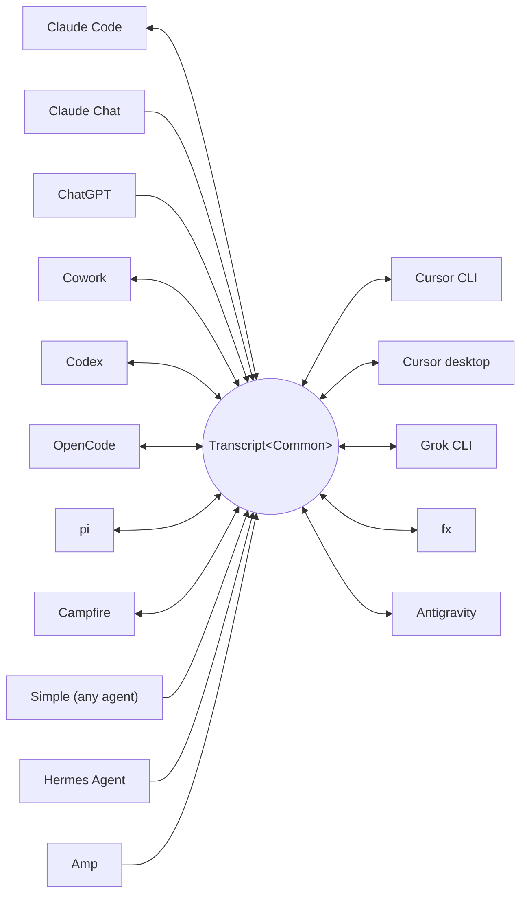

<p align="center">
  <picture>
    <source media="(prefers-color-scheme: dark)" srcset="../assets/wordmark-dark.svg">
    
  </picture>
</p>

<p align="center">Библиотека для переноса сессий между харнессами</p>

<p align="center">
  <a href="../../README.md">English</a> | <a href="README.ja.md">日本語</a> | <a href="README.zh-CN.md">简体中文</a> | <a href="README.zh-TW.md">繁體中文</a> | <a href="README.ko.md">한국어</a> | <a href="README.de.md">Deutsch</a> | <a href="README.es.md">Español</a> | <a href="README.fr.md">Français</a> | <a href="README.it.md">Italiano</a> | <a href="README.pt-BR.md">Português (Brasil)</a> | Русский | <a href="README.mr.md">मराठी</a> | <a href="README.ta.md">தமிழ்</a>
</p>

<p align="center">
  <a href="https://crates.io/crates/txcript"></a>
  <a href="https://www.npmjs.com/package/txcript"></a>
  <a href="https://docs.rs/txcript"></a>
  <a href="https://github.com/skillsynchq/txcript/actions/workflows/ci.yml"></a>
  <a href="../../LICENSE"></a>
</p>

<p align="center">
  <a href="https://claude.com/claude-code"></a>
  &nbsp;&nbsp;&nbsp;&nbsp;
  <a href="https://github.com/openai/codex"></a>
  &nbsp;&nbsp;&nbsp;&nbsp;
  <a href="https://opencode.ai"></a>
  &nbsp;&nbsp;&nbsp;&nbsp;
  <a href="https://pi.dev"></a>
  &nbsp;&nbsp;&nbsp;&nbsp;
  <a href="https://cursor.com"></a>
  &nbsp;&nbsp;&nbsp;&nbsp;
  <a href="https://github.com/xai-org/grok-build"></a>
  &nbsp;&nbsp;&nbsp;&nbsp;
  <a href="https://ampcode.com"></a>
  &nbsp;&nbsp;&nbsp;&nbsp;
  <a href="https://antigravity.google"></a>
</p>

Начните сессию в Claude Code, упритесь в лимит использования или в тупик, и продолжите её в Codex с полной историей разговора, рассуждений и вызовов инструментов:

<p align="center">
  
</p>

txcript отображает нативный формат транскрипта каждого харнесса через типизированную общую модель. Нативные загрузка и сохранение побайтово точны, без потерь; конвертация между харнессами сохраняет сообщения, рассуждения, вызовы инструментов, их результаты, изображения, метаданные и данные об использовании, где они доступны. Проект поставляется как [**CLI**](#cli), [**Rust-крейт**](#rust-крейт) и [**npm-пакет**](#npm-пакет).

## Основные возможности

- **16 харнессов, одна модель** — каждый формат конвертируется через `Transcript<Common>`, поэтому добавление харнесса связывает его со всеми остальными.
- **Формат для всех остальных** — агенты, о которых txcript никогда не слышал, выдают задокументированный JSON-формат обмена [Simple](../formats/simple.md) — файл или поток, передаваемый напрямую в txcript — и их транскрипты продолжаются в любом поддерживаемом харнессе.
- **Побайтово точные round-trip'ы** — загрузка и сохранение сессии в её собственном формате воспроизводит её точно.
- **Продолжайте где угодно** — `txcript continue <id> --with <harness>` переписывает сессию в нативный формат другого харнесса и запускает его. Оригинал никогда не изменяется.
- **Читайте и переносите сессии** — `txcript view` открывает любую сессию во встроенном пейджере, включая изображения на терминалах, которые умеют их рисовать; `txcript export` записывает её как документ Simple, который `continue` подхватывает на другой машине.
- **Поиск по всему** — буквальный поиск без учёта регистра по всем сессиям на машине, как библиотечный API, разовый запрос из CLI или интерактивный picker.
- **MCP-сервер** — `txcript mcp` предоставляет read-only-инструменты `list_sessions`, `search_sessions` и `read_session`, так что агенты могут использовать прошлые сессии как контекст.
- **Задокументированные форматы** — формат хранения каждого харнесса описан в [`docs/formats/`](../formats), с указанием источника каждого утверждения (официальная документация, permalink'и на исходный код или заметки по реверс-инжинирингу).

## Поддерживаемые харнессы



Обнаружение, вывод списка, поиск и `view` работают для каждого харнесса, у которого есть хранилище. Строки `id` — это то, что принимают CLI и WASM API.

| Harness | id | Сессии на диске | Нативный формат | Конвертация | Продолжение в | Док. |
|---|---|---|---|:---:|:---:|---|
| [Claude Code](https://claude.com/claude-code) | `claude_code` | `~/.claude/projects/` | JSONL | ⇄ | ✓ | [спецификация](../formats/claude-code.md) |
| [Claude Chat](https://claude.ai) | `claude_chat` | живой аккаунт `claude.ai` <sup>4</sup> | закрытый веб-API | → | — <sup>4</sup> | [спецификация](../formats/claude-chat.md) |
| [ChatGPT](https://chatgpt.com) | `chatgpt` | живой аккаунт `chatgpt.com` <sup>5</sup> | закрытый веб-API | → | — <sup>5</sup> | [спецификация](../formats/chatgpt.md) |
| [Cowork](https://claude.com/product/cowork) | `cowork` | `<Claude app data>/local-agent-mode-sessions/` | запись сессии + JSONL Claude Code | ⇄ | ✓ | [спецификация](../formats/cowork.md) |
| [Codex](https://github.com/openai/codex) | `codex` | `~/.codex/sessions/` | rollout JSONL | ⇄ | ✓ | [спецификация](../formats/codex.md) |
| [OpenCode](https://opencode.ai) | `opencode` | `~/.local/share/opencode/opencode.db` | SQLite | ⇄ | ✓ | [спецификация](../formats/opencode.md) |
| [pi](https://pi.dev) | `pi` | `~/.pi/agent/sessions/` | JSONL | ⇄ | ✓ | [спецификация](../formats/pi.md) |
| [Campfire](../formats/campfire.md) | `campfire` | `~/.campfire/agent/sessions/` | JSONL | ⇄ | ✓ | [спецификация](../formats/campfire.md) |
| [Cursor CLI](https://cursor.com/cli) | `cursor` | `~/.cursor/chats/` | SQLite | ⇄ | ✓ | [спецификация](../formats/cursor.md) |
| [Cursor desktop](https://cursor.com) | `cursor_desktop` | `<Cursor User dir>/globalStorage/` | SQLite | ⇄ | ✓ | [спецификация](../formats/cursor-desktop.md) |
| [Grok CLI](https://github.com/xai-org/grok-build) | `grok` | `~/.grok/sessions/` | каталог сессии (JSON) | ⇄ | ✓ | [спецификация](../formats/grok.md) |
| [fx](https://fx.sh) | `fx` | `~/.fx/sessions/` | каталог сессии (журнал событий) | ⇄ | ✓ | [спецификация](../formats/fx.md) |
| Hermes Agent | `hermes` | `~/.hermes/state.db` | SQLite | → | — <sup>3</sup> | [спецификация](../formats/hermes.md) |
| [Amp](https://ampcode.com) | `amp` | `~/.local/share/amp/threads/` | JSON треда | → | — <sup>1</sup> | [спецификация](../formats/amp.md) |
| [Antigravity](https://antigravity.google) | `antigravity` | `~/.gemini/antigravity-cli/` | SQLite | ⇄ | ✓ | [спецификация](../formats/antigravity.md) |
| Simple | `simple` | — <sup>2</sup> | JSON-формат обмена | → | — <sup>2</sup> | [спецификация](../formats/simple.md) |

<sup>1</sup> Треды Amp хранятся на сервере, а у CLI нет импорта: сессии конвертируются *из* Amp, но продолжить их в нём нельзя.

<sup>2</sup> Simple — собственный формат обмена txcript, точка входа для любого агента, не указанного выше. Здесь нет ни приложения, ни управляемого каталога: сессия Simple — это документ (файл или stdin), передаваемый напрямую в `txcript continue`, и с этого момента продолженный разговор живёт в целевом харнессе.

<sup>3</sup> `state.db` Hermes в txcript доступна только для чтения, а у Hermes нет команды импорта сессий: сессии конвертируются *из* Hermes, но продолжить их в нём нельзя.

<sup>4</sup> Claude Chat — живой источник, работающий только на извлечение данных. В macOS явный выбор `--from claude_chat` автоматически переиспользует сессию, в которую выполнен вход в Claude Desktop; агрегированное обнаружение к Claude Chat не обращается. Учётные данные, переданные через переменные окружения, не принимаются. Необязательная переменная `TXCRIPT_CLAUDE_CHAT_ORGANIZATION_UUID` ограничивает обнаружение одной организацией; иначе используется активная организация приложения. У Claude Chat нет поддерживаемого API разговоров: txcript читает закрытый эндпоинт, который Anthropic может отслеживать или ограничивать, а Rust-крейт предупреждает при сборке везде, где обнаружение вызывается напрямую. txcript только читает: он отказывает в сохранении, удалении, продолжении в том же харнессе и `--with claude_chat`. Файлы, которые Claude сгенерировал в разговоре, переносятся вместе с ним; при продолжении в Claude Code они записываются рядом с новой сессией и отображаются как артефакты Claude Code. ZIP-архив экспорта данных Claude и `conversations.json` не поддерживаются.

<sup>5</sup> ChatGPT — живой источник, работающий только на извлечение данных. Подобно тому как Claude Chat переиспользует Claude Desktop, явный выбор `--from chatgpt` автоматически переиспользует вход в ChatGPT, которым управляет Codex, из `CODEX_HOME/auth.json` или `~/.codex/auth.json`; этот аккаунт может отличаться от того, в который выполнен вход через браузер. txcript только читает этот файл учётных данных и никогда не обновляет и не перезаписывает его. Агрегированное обнаружение к ChatGPT не обращается, но точный UUID разговора можно прочитать напрямую, не перечисляя аккаунт. txcript только читает: он отказывает в сохранении, удалении, продолжении в том же харнессе и `--with chatgpt`. У ChatGPT нет поддерживаемого API разговоров, поэтому этот доступ может измениться или быть ограничен. Архивы экспорта данных ChatGPT не поддерживаются.

## Установка

**CLI** (устанавливает бинарник `txcript`):

```sh
cargo install --git https://github.com/skillsynchq/txcript txcript-cli
# or from a checkout: cargo install --path cli
```

**Rust-крейт**:

```sh
cargo add txcript
```

**npm-пакет** (готовый WASM, Rust-тулчейн не нужен):

```sh
bun add txcript     # or: npm install txcript
```

## CLI

Найдите локальные сессии и продолжите любую из них в любом харнессе:

```sh
txcript list                             # local sessions across every harness
    [--from <harness>]                    #   only this harness's sessions
    [--cwd <dir>]                         #   only sessions recorded under <dir>
    [-n <N>]                              #   at most N sessions
    [--since <when>] [--until <when>]     #   bound the session start time
txcript continue <id>[#range]            # continue <id>, then launch its harness
    [--with <harness>]                    #   ...continuing in <harness> instead
    [--from <harness>]                    #   scope the id lookup to one harness
    [--out <dir>]                         #   write under <dir>; implies --no-resume
    [--no-resume]                         #   write the session but don't launch
txcript continue <file|->[#range]        # continue a Simple document instead:
    --with <harness> [...]                #   a file, or stdin (`-`), from any agent
txcript view <id>[#range]                # view a session; compact text when piped
    [--from <harness>]                    #   scope the id lookup to one harness
    [--no-pager]                          #   print the terminal view directly
txcript export <id>[#range]              # write a session as a Simple document
    [--from <harness>]                    #   scope the id lookup to one harness
    [--out <file>]                        #   write to <file> instead of stdout
```

Id сессии — это любой однозначный префикс полного id или точный заголовок сессии. `txcript resume` — псевдоним для `continue`. `--since` и `--until` принимают временные метки RFC 3339 или просто даты `YYYY-MM-DD`.

`continue` записывает сессию туда, где целевой харнесс хранит свои сессии, а затем запускает этот харнесс на ней, передавая ему терминал:

- Тот же харнесс: возобновляет оригинал на месте.
- Другой харнесс (`--with`): переписывает сессию в нативный формат целевого харнесса. Записывается всегда копия; исходная сессия никогда не изменяется и не удаляется.
- Документ [Simple](../formats/simple.md) вместо id — `txcript continue ./run.json --with claude_code` или `my-agent | txcript continue - --with claude_code` — таким же образом переносит транскрипт любого агента; `--with` обязателен, поскольку у документа нет собственного харнесса.
- Команда запуска задаётся отдельно для каждого харнесса и переопределяется: установите `TRANSCRIPT_<HARNESS>_RESUME_CMD` в шаблон с `{id}`, например `TRANSCRIPT_CODEX_RESUME_CMD="codex resume {id}"`.

`view` в терминале открывает встроенный пейджер: `u`, `a`, `t` и `r` скрывают или показывают сообщения пользователя, сообщения ассистента, вызовы инструментов и рассуждения; `]` и `[` переходят между сообщениями; `/` ищет по тому, что показано. Изображения рисуются прямо в терминале, если он умеет их показывать (Ghostty, kitty, WezTerm, Konsole). Установите `TXCRIPT_PAGER`, чтобы использовать внешний пейджер, или передайте `--no-pager`, чтобы напечатать представление напрямую. При выводе в pipe или перенаправлении `view` печатает тот же компактный текст, который отдаёт MCP-сервер. В любом случае каждое сообщение пронумеровано линией `── #N ──`, а `#range` выбирает сообщения по этим напечатанным порядковым номерам, нумерация с 1, границы включительно:

- `abc#7`: только сообщение 7
- `abc#5-12`: сообщения с 5 по 12
- `abc#5-`: с сообщения 5 и до конца
- `abc#-10`: с начала по сообщение 10

`continue` принимает тот же суффикс и продолжает только эти сообщения как новую сессию. Диапазон, отрезающий вызов инструмента от его результата, отклоняется, а в ошибке предлагается ближайший допустимый диапазон.

`export` записывает сессию как документ [Simple](../formats/simple.md) в stdout или в `--out <file>`. Документ — это полное представление канонической модели — всё, что `continue` переносит между харнессами — отделённое от хранилища любого харнесса, поэтому он перемещается с одной машины на другую как файл:

```sh
txcript export 0dc114bf --out session.json       # on this machine
txcript continue ./session.json --with claude_code   # on the other one
```

Записанный рабочий каталог сохраняется, если он существует на импортирующей машине, а иначе заменяется каталогом, в котором запускается `continue`. `export` принимает тот же суффикс `#range` и ту же область `--from`, что и `view`.

### Поиск

```sh
txcript query 'relay bug'                # one-shot: ranked hits, highlighted
txcript query                            # interactive picker; Enter continues
    [--from <harness>]                   #   search only <harness> (default: all)
    [--with <harness>]                   #   continue the pick in <harness>
    [--cwd <dir>]                        #   only sessions recorded under <dir>
```

Паттерн совпадает буквально и без учёта регистра: `relay bug` находит строки, содержащие ровно этот текст, включая пробелы.

В picker'е набирайте текст для фильтрации, стрелки / ctrl-p/n для перемещения, Enter — продолжить выбранную сессию в её родном харнессе (или в указанном через `--with`), Esc — отмена. Каждая строка показывает, какой тип содержимого совпал: текст пользователя, текст ассистента, размышления, вызов инструмента, вывод инструмента или метаданные сессии.

Без кэша каждый запуск перечитывает все сессии. Передайте `--cache <path>` (или установите `TXCRIPT_CACHE`), чтобы держать по этому пути постоянный кэш поиска: тогда `query` и инструмент поиска MCP перечитывают только сессии, изменившиеся с прошлого запуска. Флаг принимается каждой подкомандой.

### MCP-сервер

```sh
txcript mcp                              # stdio transport
```

Предоставляет три read-only-инструмента; их необязательные фильтры совпадают с CLI:

- `list_sessions(from?, cwd?, limit?, offset?)`
- `search_sessions(pattern, from?, cwd?)`
- `read_session(id, from?)`

<sub>\* Если `from` не указан, включаются все харнессы; если не указан `cwd`, фильтр по каталогу не применяется. Сессии без записанного рабочего каталога совпадают только тогда, когда `cwd` опущен.</sub>

`list_sessions` разбивает вывод на страницы через `limit` и `offset` и сообщает общее количество до разбиения; живые источники Claude Chat и ChatGPT никогда не попадают в список. `read_session` принимает тот же суффикс `#range`, что и `view`, и возвращает тот же компактный текст; чтение, слишком большое, чтобы вернуть его целиком, отклоняется с предложением поддиапазонов. `--cache` применяется и к серверу.

### Интеграция с shell

```sh
eval "$(txcript init zsh)"                      # in ~/.zshrc; or: txcript init bash
```

`init` печатает автодополнение плюс привязку ctrl+shift+r, которая открывает picker, ограниченный сессиями, записанными в текущей папке. Для одного только автодополнения `completion` поддерживает bash, elvish, fish, powershell и zsh:

```sh
txcript completion zsh > ~/.zfunc/_txcript      # or wherever your fpath looks
source <(txcript completion bash)               # bash, ad hoc
txcript completion fish > ~/.config/fish/completions/txcript.fish
```

## Rust-крейт

```toml
[dependencies]
txcript = "0.12"
# Codecs only: drops the SQLite-backed stores, the live Claude Chat and
# ChatGPT sources, and search. Every codec stays available.
# txcript = { version = "0.12", default-features = false }
```

Фичи по умолчанию: `opencode` (хранилища SQLite: OpenCode, оба Cursor'а, Antigravity), `hermes`, `claude_chat`, `chatgpt` и `search`.

Три слоя, от меньшего к большему:

- `Codec` — `to_common` / `from_common` для каждого харнесса; `convert::<A, B>` связывает их через каноническую модель.
- `TextCodec` — `from_text` / `to_text` для парсинга и рендеринга нативного текста сессии харнесса, без I/O.
- `Store` — обнаружение/загрузка/сохранение поверх реального бэкенда (каталоги сессий или базы SQLite для OpenCode, Hermes, обоих Cursor'ов и Antigravity).

Конвертация в памяти (без файловой системы):

```rust
use txcript::harness::{claude_code, codex};
use txcript::{Codec, TextCodec, convert};

let claude = claude_code::ClaudeCode::from_text(jsonl_text)?;          // Transcript<ClaudeCode>
let codex = convert::<claude_code::ClaudeCode, codex::Codex>(&claude)?; // Transcript<Codex>
let codex_text = codex::Codex::to_text(&codex)?;                       // native rollout JSONL
```

Или через диск с помощью `Store`:

```rust
use txcript::harness::{claude_code, codex};
use txcript::{Store, convert};

let store = claude_code::ClaudeStore::default_root().expect("home dir");
let found = store.discover()?;                       // cheap metadata scan
let claude = store.load(&found[0].reference)?;       // Transcript<ClaudeCode>

let codex = convert::<_, codex::Codex>(&claude)?;
codex::CodexStore::default_root().expect("home dir").save(&codex)?;  // resumable on disk
```

Каноническая модель — `Transcript<Common>`: `Meta` + `Vec<Message>`, где `Message` содержит типизированные блоки `Block` (`Text`, `Thinking`, `ToolUse`, `ToolResult`, `Image`) и типизированный enum `Tool`.

Slash-команды, которые пользователь выполнил в харнессе (`/release patch`), тоже канонические: вызов `Tool::Command` в пользовательском ходе, в паре с тем, что команда вывела в ответ, как `ToolResult`.

### Поиск (фича `search`, включена по умолчанию)

`txcript::search` поддерживает нечёткий (синтаксис в стиле fzf) и подстроковый поиск по транскриптам. Разовый поиск:

```rust
use txcript::search::{Query, search};

let hits = search(&common, &Query::substring("relay bug"));  // or Query::fuzzy for fzf syntax
for hit in hits {
    // hit.origin: User | Assistant | Thinking | ToolUse | ToolResult | Meta
    // hit.span addresses the message; hit.highlights are char ranges into hit.line
    let messages = common.fragment(&hit.span);            // zero-copy: Option<&[Message]>
}
```

Для поиска в стиле picker'а постройте `Index` один раз и запрашивайте его на каждое нажатие клавиши:

```rust
use txcript::search::{DocKey, Index, Query};

let mut index = Index::new();
index.insert(DocKey { harness, id }, &common);   // re-insert replaces; caller owns refresh
let matches = index.query(&Query::fuzzy("srch")); // ranked docs, best lines as hits
```

Пустой паттерн возвращает документы от новых к старым. Вывод инструментов по умолчанию исключён; используйте `Origin::ALL`, чтобы включить его. `Query.harnesses`, `Query.limit` и `Query.hits_per_doc` сужают результаты.

### Текстовая проекция

`txcript::text::to_text(&common)` — проекция, лежащая в основе [`txcript view`](#cli): односторонний, экономный по токенам рендеринг `Transcript<Common>` для использования в качестве контекста LLM. Она сохраняет сообщения, текст рассуждений и компактные вызовы/результаты инструментов; данные, нужные только для реплея (зашифрованные рассуждения, учёт использования, встроенные байты изображений), опускаются. `to_text_fragment(&common, &span)` рендерит `Span` тела, сохраняя порядковый номер каждого сообщения в полной сессии.

## npm-пакет

npm-пакет поставляется с кодеком, собранным в WASM, для Bun и Node. Он конвертирует текст сессии в памяти; обнаружение, чтение и запись сессий на диске — задача вызывающей стороны, поэтому в пакете нет `Store`.

```ts
import { convert, toCommon, fromCommon, harnesses } from "txcript";
import { readFileSync, writeFileSync } from "node:fs";

const input = readFileSync("rollout.jsonl", "utf8");

// native -> native (e.g. a Codex rollout into Claude Code's JSONL)
writeFileSync("session.jsonl", convert(input, "codex", "claude_code"));

// canonical view, and back
const common = JSON.parse(toCommon(input, "codex"));   // { meta, messages }
const pi = fromCommon(JSON.stringify(common), "pi");

harnesses(); // ["claude_code","claude_chat","chatgpt","codex","opencode","pi","campfire","cursor","cursor_desktop","grok","fx","hermes","amp","antigravity","simple","cowork"]
```

Текст на входе / текст на выходе: `input` — это нативный текст сессии исходного харнесса, а результат — текст целевого. Неверные имена харнесса или неразбираемый ввод бросают JS-`Error`.

Поиск тоже входит в пакет. Запрос — это JSON-форма `Query` из крейта: обязателен только `pattern`, а `mode` равен `"fuzzy"`, если не задан `"substring"`:

```ts
import { searchTranscript, Searcher } from "txcript";

// one session, one shot: a JSON array of hits
const hits = JSON.parse(searchTranscript(input, "codex", JSON.stringify({ pattern: "relay bug", mode: "substring" })));

// picker-style: index once, query per keystroke
const index = new Searcher();
index.insert("codex", "0dc114bf", input);          // re-insert replaces
const matches = JSON.parse(index.query(JSON.stringify({ pattern: "relay bug" })));
```

| Harness | Текст сессии |
|---|---|
| `claude_code`, `codex`, `pi`, `campfire` | JSONL сессии |
| `claude_chat` | один ответ с деталями живого разговора (только как источник; массивы экспорта аккаунта не поддерживаются) |
| `chatgpt` | один ответ с деталями живого разговора (только как источник; массивы экспорта аккаунта не поддерживаются) |
| `opencode` | JSON из `opencode export` |
| `cursor` | JSON-экспорт `store.db` сессии |
| `cursor_desktop` | JSON-дамп строк `state.vscdb` сессии |
| `grok` | JSON-бандл файлов каталога сессии |
| `fx` | JSON-бандл файлов каталога сессии |
| `hermes` | JSON-объект из `hermes sessions export` |
| `amp` | JSON из `amp threads export` |
| `antigravity` | JSON-дамп базы данных разговора, protobuf-блобы в hex-кодировке |
| `simple` | JSON-документ обмена [Simple](../formats/simple.md) |
| `cowork` | JSON-бандл записи сессии, транскрипта Claude Code и журнала аудита |

Чтобы собрать wasm из исходников:

```sh
git clone https://github.com/skillsynchq/txcript.git
cd txcript
bun run setup        # once: wasm target + wasm-bindgen-cli
bun run build        # produces ./pkg
```

## Документация форматов

Не все эти форматы транскриптов задокументированы их разработчиками. В [`docs/formats/`](../formats) есть один документ на каждый харнесс, где описано, где сессии лежат на диске, как их находит механизм обнаружения, разбор каждой части формата и его особенности, и каждое утверждение снабжено указанием источника: официальная документация, собственный открытый код сериализации харнесса (со ссылками, закреплёнными за коммитом) или реверс-инжиниринг.

## Разработка

```sh
cargo test --workspace --all-features               # what CI runs
cargo test -p txcript --no-default-features         # codecs only: no SQLite or live stores
bun run build && bun examples/convert.ts <file> <from> <to>
git config core.hooksPath .githooks                 # pre-push runs the CI checks
```

Бинарник живёт в отдельном workspace-крейте (`cli/`, пакет `txcript-cli`); библиотека в корне не несёт ни одной из его зависимостей.

## Лицензия

[Apache-2.0](../../LICENSE)
