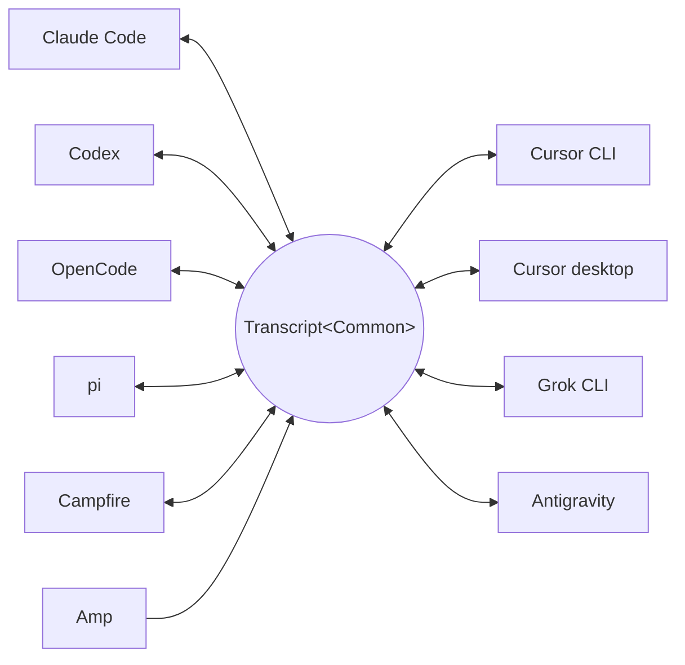

<p align="center">
  <picture>
    <source media="(prefers-color-scheme: dark)" srcset="../assets/wordmark-dark.svg">
    
  </picture>
</p>

<p align="center">ஒரு ஹார்னெஸிலிருந்து இன்னொன்றுக்கு செஷன்களை நகர்த்த ஒரு லைப்ரரி</p>

<p align="center">
  <a href="../../README.md">English</a> | <a href="README.ja.md">日本語</a> | <a href="README.zh-CN.md">简体中文</a> | <a href="README.zh-TW.md">繁體中文</a> | <a href="README.ko.md">한국어</a> | <a href="README.de.md">Deutsch</a> | <a href="README.es.md">Español</a> | <a href="README.fr.md">Français</a> | <a href="README.it.md">Italiano</a> | <a href="README.pt-BR.md">Português (Brasil)</a> | <a href="README.ru.md">Русский</a> | <a href="README.mr.md">मराठी</a> | தமிழ்
</p>

<p align="center">
  <a href="https://crates.io/crates/txcript"></a>
  <a href="https://www.npmjs.com/package/txcript"></a>
  <a href="https://docs.rs/txcript"></a>
  <a href="https://github.com/skillsynchq/txcript/actions/workflows/ci.yml"></a>
  <a href="../../LICENSE"></a>
</p>

<p align="center">
  <a href="https://claude.com/claude-code"></a>
  &nbsp;&nbsp;&nbsp;&nbsp;
  <a href="https://github.com/openai/codex"></a>
  &nbsp;&nbsp;&nbsp;&nbsp;
  <a href="https://opencode.ai"></a>
  &nbsp;&nbsp;&nbsp;&nbsp;
  <a href="https://pi.dev"></a>
  &nbsp;&nbsp;&nbsp;&nbsp;
  <a href="https://cursor.com"></a>
  &nbsp;&nbsp;&nbsp;&nbsp;
  <a href="https://github.com/xai-org/grok-build"></a>
  &nbsp;&nbsp;&nbsp;&nbsp;
  <a href="https://ampcode.com"></a>
  &nbsp;&nbsp;&nbsp;&nbsp;
  <a href="https://antigravity.google"></a>
</p>

Claude Code-இல் ஒரு செஷனைத் தொடங்குங்கள்; usage limit வந்தாலோ, வேலை நடுவில் நின்றாலோ, முழு உரையாடல், reasoning, டூல் ஹிஸ்டரி எல்லாம் அப்படியே இருக்க, அதே செஷனை Codex-இல் தொடருங்கள்:

<p align="center">
  
</p>

txcript ஒவ்வொரு ஹார்னெஸின் நேட்டிவ் டிரான்ஸ்கிரிப்ட் ஃபார்மட்டையும் ஒரு typed பொது மாடல் வழியாக மேப் செய்கிறது. நேட்டிவ் load/save பைட்-அளவில் லாஸ்லெஸ்; ஒரு ஹார்னெஸிலிருந்து இன்னொன்றுக்கு மாற்றும்போது மெசேஜ்கள், reasoning, டூல் கால்கள், டூல் ரிசல்ட்கள், படங்கள், மெட்டாடேட்டா, usage (கிடைக்கும் இடங்களில்) அனைத்தும் பாதுகாக்கப்படுகின்றன. இது [**CLI**](#cli), [**Rust crate**](#rust-crate), [**npm package**](#npm-package) என மூன்று வடிவங்களில் கிடைக்கிறது.

## சிறப்பம்சங்கள்

- **10 ஹார்னெஸ்கள், ஒரே மாடல்**: ஒவ்வொரு ஃபார்மட்டும் `Transcript<Common>` வழியாக மாறுகிறது; ஒரு ஹார்னெஸைச் சேர்த்தால் அது மற்ற எல்லாவற்றுடனும் தானாக இணைகிறது.
- **பைட்-லாஸ்லெஸ் ரவுண்ட்-டிரிப்**: ஒரு செஷனை அதன் சொந்த ஃபார்மட்டில் load செய்து save செய்தால், அது அப்படியே திரும்பக் கிடைக்கிறது.
- **எங்கும் தொடரலாம்**: `txcript continue <id> --with <harness>` செஷனை இன்னொரு ஹார்னெஸின் நேட்டிவ் ஃபார்மட்டில் மீண்டும் எழுதி அந்த ஹார்னெஸை launch செய்கிறது. மூல செஷன் ஒருபோதும் மாற்றப்படாது.
- **எல்லாவற்றையும் தேடுங்கள்**: மெஷினிலுள்ள ஒவ்வொரு செஷனிலும் fuzzy/substring தேடல் (fzf-பாணி syntax, [nucleo](https://github.com/helix-editor/nucleo) அடிப்படையில்) — லைப்ரரி API ஆகவோ, one-shot CLI query ஆகவோ, interactive picker ஆகவோ.
- **MCP சர்வர்**: `txcript mcp` read-only `list_sessions`, `search_sessions`, `read_session` டூல்களை வெளிப்படுத்துகிறது; ஏஜென்ட்கள் பழைய செஷன்களை context ஆகப் பயன்படுத்திக்கொள்ளலாம்.
- **ஆவணப்படுத்தப்பட்ட ஃபார்மட்கள்**: ஒவ்வொரு ஹார்னெஸின் on-disk ஃபார்மட்டும் [`docs/formats/`](../formats)-இல் விரிவாக எழுதப்பட்டுள்ளது; ஒவ்வொரு கூற்றுக்கும் ஆதாரம் (அதிகாரப்பூர்வ ஆவணங்கள், source permalinks அல்லது reverse-engineering குறிப்புகள்) இணைக்கப்பட்டுள்ளது.

## ஆதரிக்கப்படும் ஹார்னெஸ்கள்



டிஸ்கவரி, பட்டியலிடல், தேடல், `view`, நேட்டிவ் ரவுண்ட்-டிரிப் — எல்லா ஹார்னெஸ்களுக்கும் வேலை செய்கின்றன. CLI-க்கும் WASM API-க்கும் கொடுக்க வேண்டியவை இந்த `id` strings தான்.

| ஹார்னெஸ் | id | டிஸ்கில் செஷன்கள் | நேட்டிவ் ஃபார்மட் | மாற்றம் | தொடர | டாக் |
|---|---|---|---|:---:|:---:|---|
| [Claude Code](https://claude.com/claude-code) | `claude_code` | `~/.claude/projects/` | JSONL | ⇄ | ✓ | [ஸ்பெக்](../formats/claude-code.md) |
| [Codex](https://github.com/openai/codex) | `codex` | `~/.codex/sessions/` | rollout JSONL | ⇄ | ✓ | [ஸ்பெக்](../formats/codex.md) |
| [OpenCode](https://opencode.ai) | `opencode` | `~/.local/share/opencode/opencode.db` | SQLite | ⇄ | ✓ | [ஸ்பெக்](../formats/opencode.md) |
| [pi](https://pi.dev) | `pi` | `~/.pi/agent/sessions/` | JSONL | ⇄ | ✓ | [ஸ்பெக்](../formats/pi.md) |
| [Campfire](../formats/campfire.md) | `campfire` | `~/.campfire/agent/sessions/` | JSONL | ⇄ | ✓ | [ஸ்பெக்](../formats/campfire.md) |
| [Cursor CLI](https://cursor.com/cli) | `cursor` | `~/.cursor/chats/` | SQLite | ⇄ | ✓ | [ஸ்பெக்](../formats/cursor.md) |
| [Cursor desktop](https://cursor.com) | `cursor_desktop` | `<Cursor User dir>/globalStorage/` | SQLite | ⇄ | ✓ | [ஸ்பெக்](../formats/cursor-desktop.md) |
| [Grok CLI](https://github.com/xai-org/grok-build) | `grok` | `~/.grok/sessions/` | செஷன் டைரக்டரி (JSON) | ⇄ | ✓ | [ஸ்பெக்](../formats/grok.md) |
| [Amp](https://ampcode.com) | `amp` | `~/.local/share/amp/threads/` | த்ரெட் JSON | → | — <sup>1</sup> | [ஸ்பெக்](../formats/amp.md) |
| [Antigravity](https://antigravity.google) | `antigravity` | `~/.gemini/antigravity-cli/` | SQLite | ⇄ | ✓ | [ஸ்பெக்](../formats/antigravity.md) |

<sup>1</sup> Amp-இன் த்ரெட்கள் சர்வர் பக்கம் இருக்கின்றன; CLI-இல் import இல்லை: செஷன்களை Amp-*இலிருந்து* மாற்றலாம், ஆனால் Amp-க்குள் தொடர முடியாது.

## நிறுவல்

**CLI** (`txcript` பைனரியை நிறுவுகிறது):

```sh
cargo install --git https://github.com/skillsynchq/txcript txcript-cli
# or from a checkout: cargo install --path cli
```

**Rust crate**:

```sh
cargo add txcript
```

**npm package** (முன்பே build செய்யப்பட்ட WASM; Rust toolchain தேவையில்லை):

```sh
bun add txcript     # or: npm install txcript
```

## CLI

லோக்கல் செஷன்களைக் கண்டுபிடித்து, எந்த ஹார்னெஸிலும் தொடருங்கள்:

```sh
txcript list                             # local sessions across every harness
txcript continue <id>[#range]            # continue <id>, then launch its harness
    [--with <harness>]                    #   ...continuing in <harness> instead
    [--from <harness>]                    #   scope the id lookup to one harness
    [--out <dir>]                         #   write under <dir>; implies --no-resume
    [--no-resume]                         #   write the session but don't launch
txcript view <id>[#range]                # print a session as compact text
    [--from <harness>]                    #   scope the id lookup to one harness
txcript export <id>[#range]              # write a session as a Simple document
    [--from <harness>]                    #   scope the id lookup to one harness
    [--out <file>]                        #   write to <file> instead of stdout
```

`continue` டார்கெட் ஹார்னெஸ் தன் செஷன்களை வைக்கும் இடத்திலேயே செஷனை எழுதி, பிறகு அதன் மீது அந்த ஹார்னெஸை launch செய்து டெர்மினலை ஒப்படைக்கிறது:

- அதே ஹார்னெஸ்: மூல செஷன் அந்த இடத்திலேயே resume ஆகிறது.
- ஹார்னெஸ் மாற்றம் (`--with`): செஷன் டார்கெட்டின் நேட்டிவ் ஃபார்மட்டில் மீண்டும் உருவாக்கப்படுகிறது. எழுதப்படுவது எப்போதும் ஒரு நகல்தான்; மூல செஷன் மாற்றப்படவோ நீக்கப்படவோ இல்லை.
- launch கட்டளை ஹார்னெஸுக்கு ஒன்று, override-உம் செய்யலாம்: `TRANSCRIPT_<HARNESS>_RESUME_CMD`-ஐ `{id}` டெம்ப்ளேட்டாக செட் செய்யுங்கள், எ.கா. `TRANSCRIPT_CODEX_RESUME_CMD="codex resume {id}"`.

`view` செஷனை சுருக்கமான டெக்ஸ்டாக அச்சிடுகிறது; ஒவ்வொரு மெசேஜுக்கும் `── #N ──` என்ற கோட்டில் எண் கிடைக்கிறது. `#range` அந்த அச்சிடப்பட்ட எண்களின்படி மெசேஜ்களைத் தேர்கிறது — 1-இல் தொடங்கி, இரு எல்லைகளும் உட்பட:

- `abc#7`: மெசேஜ் 7 மட்டும்
- `abc#5-12`: மெசேஜ் 5 முதல் 12 வரை
- `abc#5-`: மெசேஜ் 5 முதல் இறுதி வரை
- `abc#-10`: தொடக்கம் முதல் மெசேஜ் 10 வரை

`continue`-க்கும் இதே suffix பொருந்தும்; அந்த மெசேஜ்கள் மட்டும் புதிய செஷனாகத் தொடரும். ஒரு டூல் காலை அதன் ரிசல்ட்டிலிருந்து பிரிக்கும் range நிராகரிக்கப்படும்; error-இல் அருகிலுள்ள செல்லுபடியான range பரிந்துரைக்கப்படும்.

`export` செஷனை [Simple](../formats/simple.md) document ஆக, stdout-இல் அல்லது `--out <file>`-இல் எழுதுகிறது. இந்த document, canonical மாடலின் முழு rendering — `continue` ஒரு ஹார்னெஸிலிருந்து இன்னொரு ஹார்னெஸுக்கு கொண்டு போகும் எல்லாமே — ஆகும்; இது எந்த ஹார்னெஸும் தன் செஷன்களை வைக்கும் இடத்திலிருந்தும் தனியாக இருக்கும், அதனால் இது ஒரு மெஷினிலிருந்து இன்னொரு மெஷினுக்கு ஒரு file ஆக நகரும்:

```sh
txcript export 0dc114bf --out session.json       # on this machine
txcript continue ./session.json --with claude_code   # on the other one
```

இம்போர்ட் செய்யும் மெஷினில் பதிவு செய்யப்பட்ட working directory இருந்தால் அது அப்படியே வைக்கப்படும்; இல்லையென்றால் `continue` ரன் ஆகும் directory-ஆல் மாற்றப்படும். `export`-க்கும் `view` போலவே அதே `#range` suffix-உம் `--from` scope-உம் பொருந்தும்.

### தேடல்

```sh
txcript query 'relay bug'                # one-shot: ranked hits, highlighted
txcript query                            # fzf-style picker; Enter continues
    [--from <harness>]                   #   search only <harness> (default: all)
    [--with <harness>]                   #   continue the pick in <harness>
```

picker-க்கு எந்த dependency-யும் தேவையில்லை (raw-mode ANSI): டைப் செய்தால் fzf-பாணி fuzzy syntax-ஆல் filter ஆகிறது; அம்புக்குறிகள் அல்லது ctrl-p/n-ஆல் நகரலாம்; Enter தேர்ந்த செஷனை அதன் சொந்த ஹார்னெஸில் (அல்லது `--with`-இல் குறித்ததில்) தொடர்கிறது; Esc ரத்து செய்கிறது. எந்த வகை உள்ளடக்கத்தில் match கிடைத்தது — யூசர் டெக்ஸ்ட், அசிஸ்டன்ட் டெக்ஸ்ட், thinking, டூல் யூஸ், டூல் அவுட்புட், செஷன் மெட்டாடேட்டா — என்பதை ஒவ்வொரு வரியும் காட்டுகிறது.

### MCP சர்வர்

```sh
txcript mcp                              # stdio transport
```

மூன்று read-only டூல்களை வெளிப்படுத்துகிறது; அவற்றின் optional filter-கள் CLI-உடன் ஒத்தவை:

- `list_sessions(from?, cwd?)`
- `search_sessions(pattern, from?, cwd?)`
- `read_session(id, from?)`

<sub>\* `from`-ஐ விட்டுவிட்டால் எல்லா ஹார்னெஸ்களும் சேரும்; `cwd`-ஐ விட்டுவிட்டால் directory filter எதுவும் இல்லை. working directory பதிவாகாத செஷன்கள் `cwd` விடப்பட்டால் மட்டுமே match ஆகும்.</sub>

### ஷெல் கம்ப்ளீஷன்கள்

```sh
txcript completion zsh > ~/.zfunc/_txcript      # or wherever your fpath looks
source <(txcript completion bash)               # bash, ad hoc
txcript completion fish > ~/.config/fish/completions/txcript.fish
```

## Rust crate

```toml
[dependencies]
txcript = "0.6"
# Drops the OpenCode SQLite store (rusqlite); the OpenCode codec stays available.
# txcript = { version = "0.6", default-features = false }
```

சிறியது முதல் பெரியது வரை மூன்று அடுக்குகள்:

- `Codec`: ஹார்னெஸுக்கு ஒரு `to_common` / `from_common`; `convert::<A, B>` அவற்றை canonical மாடல் வழியாகச் சங்கிலியாக இணைக்கிறது.
- `TextCodec`: `from_text` / `to_text` — ஹார்னெஸின் நேட்டிவ் செஷன் டெக்ஸ்டை parse செய்யவும் render செய்யவும், I/O எதுவும் இல்லாமல்.
- `Store`: உண்மையான backend-இல் (செஷன் டைரக்டரிகள், அல்லது OpenCode மற்றும் இரு Cursor-களுக்கான SQLite DB-கள்) discover/load/save.

மெமரியிலேயே மாற்றம் (filesystem இல்லை):

```rust
use txcript::harness::{claude_code, codex};
use txcript::{Codec, TextCodec, convert};

let claude = claude_code::ClaudeCode::from_text(jsonl_text)?;          // Transcript<ClaudeCode>
let codex = convert::<claude_code::ClaudeCode, codex::Codex>(&claude)?; // Transcript<Codex>
let codex_text = codex::Codex::to_text(&codex)?;                       // native rollout JSONL
```

அல்லது `Store` வழியாக டிஸ்க் மூலம்:

```rust
use txcript::harness::{claude_code, codex};
use txcript::{Store, convert};

let store = claude_code::ClaudeStore::default_root().expect("home dir");
let found = store.discover()?;                       // cheap metadata scan
let claude = store.load(&found[0].reference)?;       // Transcript<ClaudeCode>

let codex = convert::<_, codex::Codex>(&claude)?;
codex::CodexStore::default_root().expect("home dir").save(&codex)?;  // resumable on disk
```

canonical மாடல் `Transcript<Common>`: `Meta` + `Vec<Message>`; ஒரு `Message`-இல் typed `Block`-கள் (`Text`, `Thinking`, `ToolUse`, `ToolResult`, `Image`) மற்றும் typed `Tool` enum இருக்கின்றன.

யூசர் ஹார்னெஸில் ஓட்டிய slash கட்டளைகளும் (`/release patch`) canonical தான்: யூசர் டர்னில் ஒரு `Tool::Command` கால், அந்தக் கட்டளை திருப்பி அச்சிட்டது அதன் `ToolResult` ஆக இணைந்து.

### தேடல் (`search` feature, இயல்பாக இயக்கத்தில்)

`txcript::search` [nucleo](https://github.com/helix-editor/nucleo) மூலம் டிரான்ஸ்கிரிப்ட்களில் fuzzy மற்றும் substring தேடலை ஆதரிக்கிறது. one-shot தேடல்:

```rust
use txcript::search::{Query, search};

let hits = search(&common, &Query::fuzzy("relay bug"));   // fzf syntax: 'exact ^prefix !not
for hit in hits {
    // hit.origin: User | Assistant | Thinking | ToolUse | ToolResult | Meta
    // hit.span addresses the message; hit.highlights are char ranges into hit.line
    let messages = common.fragment(&hit.span);            // zero-copy: Option<&[Message]>
}
```

picker-பாணி தேடலுக்கு, `Index`-ஐ ஒருமுறை கட்டி ஒவ்வொரு keystroke-க்கும் query செய்யுங்கள்:

```rust
use txcript::search::{DocKey, Index, Query};

let mut index = Index::new();
index.insert(DocKey { harness, id }, &common);   // re-insert replaces; caller owns refresh
let matches = index.query(&Query::fuzzy("srch")); // ranked docs, best lines as hits
```

வெற்று pattern கொடுத்தால், ஆவணங்கள் புதியவை முதலில் என்ற வரிசையில் கிடைக்கும். டூல் அவுட்புட்கள் இயல்பாக விலக்கப்படுகின்றன; சேர்க்க வேண்டுமெனில் `Origin::ALL` பயன்படுத்துங்கள். `Query.harnesses`, `Query.limit`, `Query.hits_per_doc` முடிவுகளைச் சுருக்குகின்றன.

### டெக்ஸ்ட் ப்ரொஜெக்ஷன்

`txcript::text::to_text(&common)` தான் [`txcript view`](#cli)-இன் பின்னாலுள்ள projection: `Transcript<Common>`-ஐ LLM context-ஆகப் பயன்படுத்த ஒரு one-way, டோக்கன்-சிக்கனமான rendering. மெசேஜ்கள், reasoning டெக்ஸ்ட், சுருக்கமான டூல் கால்கள்/ரிசல்ட்கள் வைத்துக்கொள்ளப்படுகின்றன; replay-க்கு மட்டுமே தேவையான payload-கள் (encrypted reasoning, usage கணக்கு, inline இமேஜ் பைட்கள்) விடப்படுகின்றன. `to_text_fragment(&common, &span)` செஷன் உள்ளடக்கத்தின் ஒரு `Span`-ஐ render செய்கிறது; ஒவ்வொரு மெசேஜின் முழு-செஷன் எண்ணும் அப்படியே இருக்கும்.

## npm package

npm பேக்கேஜ் கோடெக்கை Bun, Node, browser-களுக்கு முன்பே build செய்யப்பட்ட WASM ஆக வழங்குகிறது. I/O முழுவதும் JS host-இடம்; மாற்றத்துக்காக மட்டும் உள்ளே call செய்கிறது. `Store` அடுக்கு (filesystem, SQLite, subprocess) நேட்டிவ் ஆகவே இருக்கிறது; WASM build-இல் சேர்க்கப்படவில்லை.

```ts
import { convert, toCommon, fromCommon, harnesses } from "txcript";
import { readFileSync, writeFileSync } from "node:fs";

const input = readFileSync("rollout.jsonl", "utf8");

// native -> native (e.g. a Codex rollout into Claude Code's JSONL)
writeFileSync("session.jsonl", convert(input, "codex", "claude_code"));

// canonical view, and back
const common = JSON.parse(toCommon(input, "codex"));   // { meta, messages }
const pi = fromCommon(JSON.stringify(common), "pi");

harnesses(); // ["claude_code","codex","opencode","pi","campfire","cursor","cursor_desktop","grok","amp","antigravity"]
```

டெக்ஸ்ட்-இன் / டெக்ஸ்ட்-அவுட்: `input` என்பது source ஹார்னெஸின் நேட்டிவ் செஷன் டெக்ஸ்ட்; result டார்கெட்டினுடையது. தவறான ஹார்னெஸ் பெயர்களோ parse ஆகாத input-களோ JS `Error` எறியும்.

| ஹார்னெஸ் | செஷன் டெக்ஸ்ட் |
|---|---|
| `claude_code`, `codex`, `pi`, `campfire` | செஷன் JSONL |
| `opencode` | `opencode export` JSON |
| `cursor` | செஷனின் `store.db`-இன் JSON export |
| `cursor_desktop` | செஷனின் `state.vscdb` வரிசைகளின் JSON dump |
| `grok` | செஷன் டைரக்டரியின் கோப்புகளின் JSON bundle |
| `amp` | `amp threads export` JSON |
| `antigravity` | உரையாடல் database-இன் JSON dump; protobuf blob-கள் hex-encoded |

மாறாக wasm-ஐ source-இலிருந்து build செய்ய:

```sh
git clone https://github.com/skillsynchq/txcript.git
cd txcript
bun run setup        # once: wasm target + wasm-bindgen-cli
bun run build        # produces ./pkg
```

## ஃபார்மட் ஆவணங்கள்

இந்த டிரான்ஸ்கிரிப்ட் ஃபார்மட்கள் எல்லாவற்றையும் அவற்றின் vendor-கள் ஆவணப்படுத்தவில்லை. [`docs/formats/`](../formats)-இல் ஹார்னெஸுக்கு ஒரு ஆவணம் உள்ளது: செஷன்கள் டிஸ்கில் எங்கே இருக்கின்றன, discovery அவற்றை எப்படிக் கண்டுபிடிக்கிறது, ஃபார்மட்டின் ஒவ்வொரு பகுதியின் விரிவான விளக்கம், அதன் விநோதங்கள் — ஒவ்வொரு கூற்றுக்கும் அதன் ஆதாரம் குறிக்கப்பட்டுள்ளது: அதிகாரப்பூர்வ ஆவணம், ஹார்னெஸின் சொந்த open-source serialization code (commit-pinned permalink-களுடன்), அல்லது reverse engineering.

## டெவலப்மென்ட்

```sh
cargo test                                          # native suite
cargo test --no-default-features                    # without the SQLite store
bun run build && bun examples/convert.ts <file> <from> <to>
```

பைனரி தனி workspace crate-இல் (`cli/`, பேக்கேஜ் `txcript-cli`) இருக்கிறது; அதனால் அதன் dependencies (clap) லைப்ரரி பயனர்களை ஒருபோதும் தொடுவதில்லை.

## லைசென்ஸ்

[Apache-2.0](../../LICENSE)
