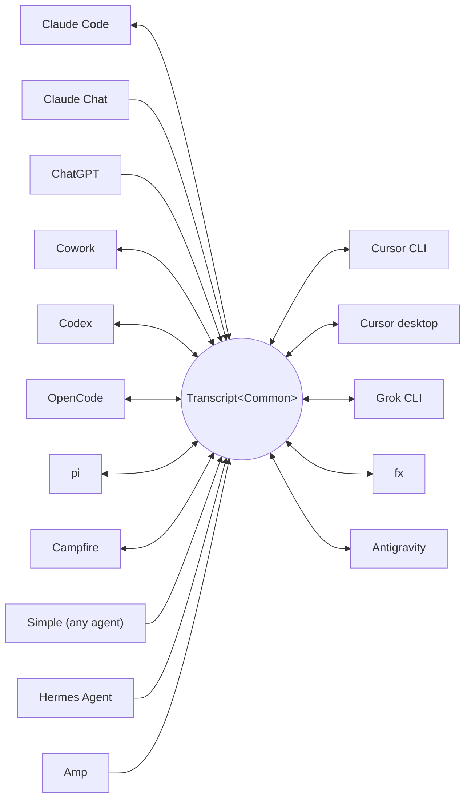

<p align="center">
  <picture>
    <source media="(prefers-color-scheme: dark)" srcset="../assets/wordmark-dark.svg">
    
  </picture>
</p>

<p align="center">一个在 harness 之间迁移会话的库</p>

<p align="center">
  <a href="../../README.md">English</a> | <a href="README.ja.md">日本語</a> | 简体中文 | <a href="README.zh-TW.md">繁體中文</a> | <a href="README.ko.md">한국어</a> | <a href="README.de.md">Deutsch</a> | <a href="README.es.md">Español</a> | <a href="README.fr.md">Français</a> | <a href="README.it.md">Italiano</a> | <a href="README.pt-BR.md">Português (Brasil)</a> | <a href="README.ru.md">Русский</a> | <a href="README.mr.md">मराठी</a> | <a href="README.ta.md">தமிழ்</a>
</p>

<p align="center">
  <a href="https://crates.io/crates/txcript"></a>
  <a href="https://www.npmjs.com/package/txcript"></a>
  <a href="https://docs.rs/txcript"></a>
  <a href="https://github.com/skillsynchq/txcript/actions/workflows/ci.yml"></a>
  <a href="../../LICENSE"></a>
</p>

<p align="center">
  <a href="https://claude.com/claude-code"></a>
  &nbsp;&nbsp;&nbsp;&nbsp;
  <a href="https://github.com/openai/codex"></a>
  &nbsp;&nbsp;&nbsp;&nbsp;
  <a href="https://opencode.ai"></a>
  &nbsp;&nbsp;&nbsp;&nbsp;
  <a href="https://pi.dev"></a>
  &nbsp;&nbsp;&nbsp;&nbsp;
  <a href="https://cursor.com"></a>
  &nbsp;&nbsp;&nbsp;&nbsp;
  <a href="https://github.com/xai-org/grok-build"></a>
  &nbsp;&nbsp;&nbsp;&nbsp;
  <a href="https://ampcode.com"></a>
  &nbsp;&nbsp;&nbsp;&nbsp;
  <a href="https://antigravity.google"></a>
</p>

在 Claude Code 中开始一个会话，遇到用量限制或卡壳时，换到 Codex 里接着做，完整的对话、推理和工具历史原样保留：

<p align="center">
  
</p>

txcript 通过一个带类型的公共模型来映射各个 harness 的原生会话记录格式。原生加载/保存是字节级无损的；跨 harness 转换会保留消息、推理、工具调用、工具结果、图像、元数据，以及在可用时的用量信息。它以 [**CLI**](#cli)、[**Rust crate**](#rust-crate) 和 [**npm 包**](#npm-包) 的形式发布。

## 亮点

- **16 个 harness，一个模型**：所有格式都经由 `Transcript<Common>` 转换，因此新增一个 harness 就等于把它接入其他所有 harness。
- **其他所有智能体通用的格式**：txcript 从未听说过的智能体只需输出有文档记述的 [Simple](../formats/simple.md) 交换 JSON——文件或流，直接交给 txcript——它们的会话记录就能在任意受支持的 harness 中继续。
- **字节级无损往返**：以会话自身的格式加载并保存，可以原样复现。
- **随处继续**：`txcript continue <id> --with <harness>` 会把会话重写为另一个 harness 的原生格式并启动它。原始会话绝不会被修改。
- **阅读并携带会话**：`txcript view` 在内置分页器中打开任意会话，在能绘制图像的终端上连图像一并显示；`txcript export` 把会话写为 Simple 文档，`continue` 可在另一台机器上接着使用。
- **搜索一切**：对本机上的所有会话做字面、不区分大小写的搜索，可作为库 API、一次性 CLI 查询或交互式选择器使用。
- **MCP 服务器**：`txcript mcp` 暴露只读的 `list_sessions`、`search_sessions` 和 `read_session` 工具，让智能体可以把过往会话作为上下文来挖掘。
- **格式文档齐全**：每个 harness 的磁盘格式都在 [`docs/formats/`](../formats) 中有完整记述，且每条论断都注明出处（官方文档、源码 permalink 或逆向工程笔记）。

## 支持的 harness



发现、列表、搜索和 `view` 对每个拥有后端存储的 harness 均可用。CLI 和 WASM API 接受的正是这些 `id` 字符串。

| Harness | id | 磁盘上的会话 | 原生格式 | 转换 | 可继续到 | 文档 |
|---|---|---|---|:---:|:---:|---|
| [Claude Code](https://claude.com/claude-code) | `claude_code` | `~/.claude/projects/` | JSONL | ⇄ | ✓ | [规格](../formats/claude-code.md) |
| [Claude Chat](https://claude.ai) | `claude_chat` | 在线 `claude.ai` 账户 <sup>4</sup> | 私有 Web API | → | — <sup>4</sup> | [规格](../formats/claude-chat.md) |
| [ChatGPT](https://chatgpt.com) | `chatgpt` | 在线 `chatgpt.com` 账户 <sup>5</sup> | 私有 Web API | → | — <sup>5</sup> | [规格](../formats/chatgpt.md) |
| [Cowork](https://claude.com/product/cowork) | `cowork` | `<Claude app data>/local-agent-mode-sessions/` | 会话记录 + Claude Code JSONL | ⇄ | ✓ | [规格](../formats/cowork.md) |
| [Codex](https://github.com/openai/codex) | `codex` | `~/.codex/sessions/` | rollout JSONL | ⇄ | ✓ | [规格](../formats/codex.md) |
| [OpenCode](https://opencode.ai) | `opencode` | `~/.local/share/opencode/opencode.db` | SQLite | ⇄ | ✓ | [规格](../formats/opencode.md) |
| [pi](https://pi.dev) | `pi` | `~/.pi/agent/sessions/` | JSONL | ⇄ | ✓ | [规格](../formats/pi.md) |
| [Campfire](../formats/campfire.md) | `campfire` | `~/.campfire/agent/sessions/` | JSONL | ⇄ | ✓ | [规格](../formats/campfire.md) |
| [Cursor CLI](https://cursor.com/cli) | `cursor` | `~/.cursor/chats/` | SQLite | ⇄ | ✓ | [规格](../formats/cursor.md) |
| [Cursor desktop](https://cursor.com) | `cursor_desktop` | `<Cursor User dir>/globalStorage/` | SQLite | ⇄ | ✓ | [规格](../formats/cursor-desktop.md) |
| [Grok CLI](https://github.com/xai-org/grok-build) | `grok` | `~/.grok/sessions/` | 会话目录（JSON） | ⇄ | ✓ | [规格](../formats/grok.md) |
| [fx](https://fx.sh) | `fx` | `~/.fx/sessions/` | 会话目录（事件日志） | ⇄ | ✓ | [规格](../formats/fx.md) |
| Hermes Agent | `hermes` | `~/.hermes/state.db` | SQLite | → | — <sup>3</sup> | [规格](../formats/hermes.md) |
| [Amp](https://ampcode.com) | `amp` | `~/.local/share/amp/threads/` | 线程 JSON | → | — <sup>1</sup> | [规格](../formats/amp.md) |
| [Antigravity](https://antigravity.google) | `antigravity` | `~/.gemini/antigravity-cli/` | SQLite | ⇄ | ✓ | [规格](../formats/antigravity.md) |
| Simple | `simple` | — <sup>2</sup> | 交换 JSON | → | — <sup>2</sup> | [规格](../formats/simple.md) |

<sup>1</sup> Amp 的线程保存在服务端，且 CLI 没有导入功能：会话可以*从* Amp 转换，但无法继续到 Amp 中。

<sup>2</sup> Simple 是 txcript 自己的交换格式——上表未列出的任何智能体的接入口。它没有应用程序，也没有受管理的目录：一个 Simple 会话就是直接交给 `txcript continue` 的一份文档（文件或 stdin），此后继续的对话就存在于目标 harness 中。

<sup>3</sup> Hermes 的 `state.db` 在 txcript 中是只读的，且 Hermes 没有会话导入命令：会话可以*从* Hermes 转换，但无法继续到 Hermes 中。

<sup>4</sup> Claude Chat 是一个在线的、只拉取的来源。在 macOS 上，显式选择 `--from claude_chat` 会自动复用已登录的 Claude Desktop 会话；聚合发现不会联系 Claude Chat。不接受通过环境变量传入的凭据。可选的 `TXCRIPT_CLAUDE_CHAT_ORGANIZATION_UUID` 把发现范围限制到一个组织；否则使用应用当前活动的组织。Claude Chat 没有受支持的对话 API：txcript 读取的是一个私有端点，Anthropic 可以观测或限制它，且 Rust crate 会在构建时对每一处直接调用发现的位置发出警告。txcript 只读不写：它拒绝保存、删除、同 harness 继续以及 `--with claude_chat`。Claude 在对话中生成的文件会一并带上；继续到 Claude Code 时，它们会被写到新会话旁边，并显示为 Claude Code 的 artifact。不支持 Claude 的数据导出 ZIP 和 `conversations.json`。

<sup>5</sup> ChatGPT 是一个在线的、只拉取的来源。与 Claude Chat 复用 Claude Desktop 一样，显式选择 `--from chatgpt` 会自动复用 Codex 在 `CODEX_HOME/auth.json` 或 `~/.codex/auth.json` 管理的 ChatGPT 登录；该账户可能与在浏览器中登录的账户不同。txcript 只读取该凭据文件，绝不会刷新或改写它。聚合发现不会联系 ChatGPT，而给定精确的对话 UUID 时可以直接读取，无需枚举整个账户。txcript 只读不写：它拒绝保存、删除、同 harness 继续以及 `--with chatgpt`。ChatGPT 没有受支持的对话 API，因此这种访问方式可能变更或受限。不支持 ChatGPT 的数据导出归档。

## 安装

**CLI**（安装 `txcript` 二进制）：

```sh
cargo install --git https://github.com/skillsynchq/txcript txcript-cli
# or from a checkout: cargo install --path cli
```

**Rust crate**：

```sh
cargo add txcript
```

**npm 包**（预编译 WASM，无需 Rust 工具链）：

```sh
bun add txcript     # or: npm install txcript
```

## CLI

发现本地会话，并在任意 harness 中继续其中一个：

```sh
txcript list                             # local sessions across every harness
    [--from <harness>]                    #   only this harness's sessions
    [--cwd <dir>]                         #   only sessions recorded under <dir>
    [-n <N>]                              #   at most N sessions
    [--since <when>] [--until <when>]     #   bound the session start time
txcript continue <id>[#range]            # continue <id>, then launch its harness
    [--with <harness>]                    #   ...continuing in <harness> instead
    [--from <harness>]                    #   scope the id lookup to one harness
    [--out <dir>]                         #   write under <dir>; implies --no-resume
    [--no-resume]                         #   write the session but don't launch
txcript continue <file|->[#range]        # continue a Simple document instead:
    --with <harness> [...]                #   a file, or stdin (`-`), from any agent
txcript view <id>[#range]                # view a session; compact text when piped
    [--from <harness>]                    #   scope the id lookup to one harness
    [--no-pager]                          #   print the terminal view directly
txcript export <id>[#range]              # write a session as a Simple document
    [--from <harness>]                    #   scope the id lookup to one harness
    [--out <file>]                        #   write to <file> instead of stdout
```

会话 id 可以是完整 id 的任意无歧义前缀，或会话的确切标题。`txcript resume` 是 `continue` 的别名。`--since` 和 `--until` 接受 RFC 3339 时间戳或纯 `YYYY-MM-DD` 日期。

`continue` 会把会话写到目标 harness 保存会话的位置，然后启动该 harness 打开它，并把终端交给它：

- 同 harness：就地恢复原会话。
- 跨 harness（`--with`）：把会话重写为目标的原生格式。写出的始终是一份副本；源会话绝不会被修改或删除。
- 用 [Simple](../formats/simple.md) 文档代替 id——`txcript continue ./run.json --with claude_code`，或 `my-agent | txcript continue - --with claude_code`——可以用同样的方式带入任意智能体的会话记录；由于文档本身不属于任何 harness，`--with` 是必需的。
- 启动命令按 harness 各自设定，且可覆盖：将 `TRANSCRIPT_<HARNESS>_RESUME_CMD` 设为一个 `{id}` 模板，例如 `TRANSCRIPT_CODEX_RESUME_CMD="codex resume {id}"`。

在终端中运行 `view` 会打开一个内置分页器：`u`、`a`、`t` 和 `r` 分别隐藏或显示用户消息、助手消息、工具调用和推理；`]` 和 `[` 在消息之间跳转；`/` 在当前显示的内容中搜索。在能显示图像的终端（Ghostty、kitty、WezTerm、Konsole）上，图像会内联绘制。设置 `TXCRIPT_PAGER` 可改用外部分页器，或传入 `--no-pager` 直接打印视图。通过管道或重定向时，`view` 打印的紧凑文本与 MCP 服务器提供的相同。无论哪种方式，每条消息都由一条 `── #N ──` 分隔线编号，`#range` 按这些打印出的序号选择消息，从 1 开始且两端闭合：

- `abc#7`：仅第 7 条消息
- `abc#5-12`：第 5 到第 12 条消息
- `abc#5-`：从第 5 条消息到末尾
- `abc#-10`：从开头到第 10 条消息

`continue` 接受同样的后缀，只把这些消息作为新会话继续。会把工具调用与其结果拆开的范围会被拒绝，错误信息会给出最接近的有效范围建议。

`export` 把会话写为 [Simple](../formats/simple.md) 文档，输出到 stdout 或 `--out <file>`。该文档是规范模型的完整呈现——`continue` 在 harness 之间携带的一切——脱离了任何 harness 保存会话的位置，因此可以作为一个文件从一台机器移动到另一台机器：

```sh
txcript export 0dc114bf --out session.json       # on this machine
txcript continue ./session.json --with claude_code   # on the other one
```

记录的工作目录，如果在导入机器上存在就会保留，否则会被 `continue` 运行所在的目录替换。`export` 接受与 `view` 相同的 `#range` 后缀和 `--from` 范围。

### 搜索

```sh
txcript query 'relay bug'                # one-shot: ranked hits, highlighted
txcript query                            # interactive picker; Enter continues
    [--from <harness>]                   #   search only <harness> (default: all)
    [--with <harness>]                   #   continue the pick in <harness>
    [--cwd <dir>]                        #   only sessions recorded under <dir>
```

模式按字面匹配且不区分大小写：`relay bug` 会找到包含这段确切文本（连同空格）的行。

在选择器中，输入即可过滤，方向键 / ctrl-p/n 移动，Enter 在其自身的 harness（或 `--with` 指定的 harness）中继续所选会话，Esc 取消。每一行都会显示匹配到的内容类型：用户文本、助手文本、思考、工具调用、工具输出或会话元数据。

没有缓存时，每次运行都会重新读取所有会话。传入 `--cache <path>`（或设置 `TXCRIPT_CACHE`）可在该路径维护一个持久化的搜索缓存，这样 `query` 和 MCP 搜索工具只需重新读取自上次运行以来发生变化的会话。所有子命令都接受这个参数。

### MCP 服务器

```sh
txcript mcp                              # stdio transport
```

暴露三个只读工具；它们的可选过滤参数与 CLI 一致：

- `list_sessions(from?, cwd?, limit?, offset?)`
- `search_sessions(pattern, from?, cwd?)`
- `read_session(id, from?)`

<sub>\* 省略 `from` 时包含所有 harness；省略 `cwd` 时不做目录过滤。没有记录工作目录的会话，只有在省略 `cwd` 时才会被匹配。</sub>

`list_sessions` 通过 `limit` 和 `offset` 分页，并报告分页前的总数；在线的 Claude Chat 和 ChatGPT 来源绝不会被列出。`read_session` 接受与 `view` 相同的 `#range` 后缀并返回相同的紧凑文本；大到无法整体返回的读取会被拒绝，并给出建议的子范围。`--cache` 同样适用于服务器。

### Shell 集成

```sh
eval "$(txcript init zsh)"                      # in ~/.zshrc; or: txcript init bash
```

`init` 会打印补全脚本，外加一个 ctrl+shift+r 键绑定，用于打开仅限当前文件夹下记录的会话的选择器。若只需要补全，`completion` 覆盖 bash、elvish、fish、powershell 和 zsh：

```sh
txcript completion zsh > ~/.zfunc/_txcript      # or wherever your fpath looks
source <(txcript completion bash)               # bash, ad hoc
txcript completion fish > ~/.config/fish/completions/txcript.fish
```

## Rust crate

```toml
[dependencies]
txcript = "0.12"
# Codecs only: drops the SQLite-backed stores, the live Claude Chat and
# ChatGPT sources, and search. Every codec stays available.
# txcript = { version = "0.12", default-features = false }
```

默认 feature：`opencode`（SQLite 存储：OpenCode、两种 Cursor、Antigravity）、`hermes`、`claude_chat`、`chatgpt` 和 `search`。

三个层次，由小到大：

- `Codec`：每个 harness 的 `to_common` / `from_common`；`convert::<A, B>` 通过规范模型把它们串联起来。
- `TextCodec`：`from_text` / `to_text`，用于解析和渲染 harness 的原生会话文本，不做任何 I/O。
- `Store`：针对真实后端做发现/加载/保存（会话目录，或 OpenCode、Hermes、两种 Cursor 与 Antigravity 的 SQLite 数据库）。

在内存中转换（不经过文件系统）：

```rust
use txcript::harness::{claude_code, codex};
use txcript::{Codec, TextCodec, convert};

let claude = claude_code::ClaudeCode::from_text(jsonl_text)?;          // Transcript<ClaudeCode>
let codex = convert::<claude_code::ClaudeCode, codex::Codex>(&claude)?; // Transcript<Codex>
let codex_text = codex::Codex::to_text(&codex)?;                       // native rollout JSONL
```

或者通过 `Store` 走磁盘：

```rust
use txcript::harness::{claude_code, codex};
use txcript::{Store, convert};

let store = claude_code::ClaudeStore::default_root().expect("home dir");
let found = store.discover()?;                       // cheap metadata scan
let claude = store.load(&found[0].reference)?;       // Transcript<ClaudeCode>

let codex = convert::<_, codex::Codex>(&claude)?;
codex::CodexStore::default_root().expect("home dir").save(&codex)?;  // resumable on disk
```

规范模型是 `Transcript<Common>`：`Meta` + `Vec<Message>`，其中 `Message` 持有带类型的 `Block`（`Text`、`Thinking`、`ToolUse`、`ToolResult`、`Image`）和一个带类型的 `Tool` 枚举。

用户在 harness 中运行的斜杠命令（`/release patch`）同样是规范的：它是用户轮次上的一次 `Tool::Command` 调用，并与命令打印回来的内容作为其 `ToolResult` 配对。

### 搜索（`search` feature，默认启用）

`txcript::search` 支持对会话记录的模糊（fzf 风格语法）与子串搜索。一次性搜索：

```rust
use txcript::search::{Query, search};

let hits = search(&common, &Query::substring("relay bug"));  // or Query::fuzzy for fzf syntax
for hit in hits {
    // hit.origin: User | Assistant | Thinking | ToolUse | ToolResult | Meta
    // hit.span addresses the message; hit.highlights are char ranges into hit.line
    let messages = common.fragment(&hit.span);            // zero-copy: Option<&[Message]>
}
```

若要做选择器式搜索，先构建一次 `Index`，然后随每次按键查询：

```rust
use txcript::search::{DocKey, Index, Query};

let mut index = Index::new();
index.insert(DocKey { harness, id }, &common);   // re-insert replaces; caller owns refresh
let matches = index.query(&Query::fuzzy("srch")); // ranked docs, best lines as hits
```

空模式会按最新在前返回文档。工具输出默认被排除；使用 `Origin::ALL` 可以包含它们。`Query.harnesses`、`Query.limit` 和 `Query.hits_per_doc` 用来收窄结果。

### 文本投影

`txcript::text::to_text(&common)` 是 [`txcript view`](#cli) 背后的投影：一份单向、注重 token 开销的 `Transcript<Common>` 渲染，用作 LLM 上下文。它保留消息、推理文本和紧凑的工具调用/结果；仅用于回放的载荷（加密推理、用量记账、内联图像字节）会被省略。`to_text_fragment(&common, &span)` 渲染正文的一个 `Span`，并保留每条消息在完整会话中的序号。

## npm 包

npm 包把 codec 编译为面向 Bun 和 Node 的预编译 WASM。它在内存中转换会话文本；在磁盘上发现、读取和写入会话是调用方的事，因此该包没有 `Store`。

```ts
import { convert, toCommon, fromCommon, harnesses } from "txcript";
import { readFileSync, writeFileSync } from "node:fs";

const input = readFileSync("rollout.jsonl", "utf8");

// native -> native (e.g. a Codex rollout into Claude Code's JSONL)
writeFileSync("session.jsonl", convert(input, "codex", "claude_code"));

// canonical view, and back
const common = JSON.parse(toCommon(input, "codex"));   // { meta, messages }
const pi = fromCommon(JSON.stringify(common), "pi");

harnesses(); // ["claude_code","claude_chat","chatgpt","codex","opencode","pi","campfire","cursor","cursor_desktop","grok","fx","hermes","amp","antigravity","simple","cowork"]
```

文本进 / 文本出：`input` 是源 harness 的原生会话文本，结果是目标 harness 的原生会话文本。无效的 harness 名称或无法解析的输入会抛出 JS `Error`。

搜索也一并提供。查询是 crate 中 `Query` 的 JSON 形式：只有 `pattern` 是必需的，`mode` 默认为 `"fuzzy"`，除非设为 `"substring"`：

```ts
import { searchTranscript, Searcher } from "txcript";

// one session, one shot: a JSON array of hits
const hits = JSON.parse(searchTranscript(input, "codex", JSON.stringify({ pattern: "relay bug", mode: "substring" })));

// picker-style: index once, query per keystroke
const index = new Searcher();
index.insert("codex", "0dc114bf", input);          // re-insert replaces
const matches = JSON.parse(index.query(JSON.stringify({ pattern: "relay bug" })));
```

| Harness | 会话文本 |
|---|---|
| `claude_code`, `codex`, `pi`, `campfire` | 会话 JSONL |
| `claude_chat` | 一条在线对话详情响应（仅作为来源；不含账户导出数组） |
| `chatgpt` | 一条在线对话详情响应（仅作为来源；不含账户导出数组） |
| `opencode` | `opencode export` 输出的 JSON |
| `cursor` | 该会话 `store.db` 的 JSON 导出 |
| `cursor_desktop` | 该会话 `state.vscdb` 行的 JSON 转储 |
| `grok` | 会话目录中各文件打包成的 JSON |
| `fx` | 会话目录中各文件打包成的 JSON |
| `hermes` | `hermes sessions export` 输出的 JSON 对象 |
| `amp` | `amp threads export` 输出的 JSON |
| `antigravity` | 对话数据库的 JSON 转储，protobuf blob 以十六进制编码 |
| `simple` | [Simple](../formats/simple.md) 交换 JSON 文档 |
| `cowork` | 会话记录、Claude Code 会话记录和审计日志打包成的 JSON |

若要改为从源码构建 wasm：

```sh
git clone https://github.com/skillsynchq/txcript.git
cd txcript
bun run setup        # once: wasm target + wasm-bindgen-cli
bun run build        # produces ./pkg
```

## 格式文档

这些会话记录格式并非都有厂商提供的官方文档。[`docs/formats/`](../formats) 为每个 harness 提供一份文档，涵盖会话在磁盘上的位置、发现机制如何找到它们、对格式各部分的逐一剖析及其怪癖，并且每条论断都标注了出处：官方文档、harness 自身的开源序列化代码（附有锁定到具体 commit 的 permalink），或逆向工程。

## 开发

```sh
cargo test --workspace --all-features               # what CI runs
cargo test -p txcript --no-default-features         # codecs only: no SQLite or live stores
bun run build && bun examples/convert.ts <file> <from> <to>
git config core.hooksPath .githooks                 # pre-push runs the CI checks
```

二进制程序位于独立的 workspace crate（`cli/`，包名 `txcript-cli`）中；根目录的库不携带它的任何依赖。

## 许可证

[Apache-2.0](../../LICENSE)
