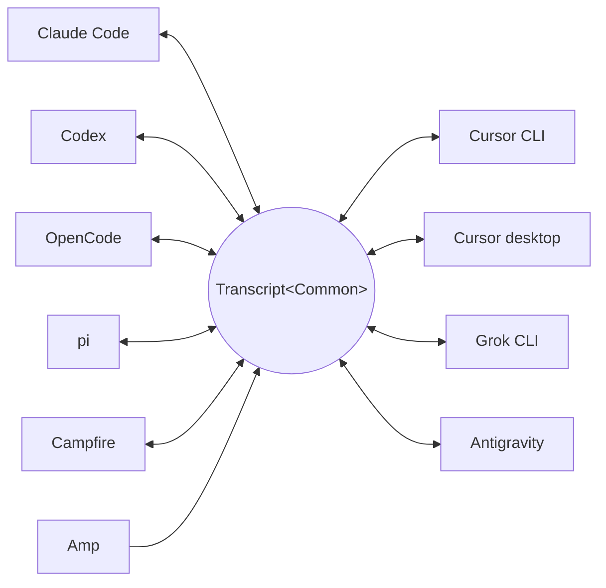

<p align="center">
  <picture>
    <source media="(prefers-color-scheme: dark)" srcset="../assets/wordmark-dark.svg">
    
  </picture>
</p>

<p align="center">一個在 harness 之間搬移工作階段的函式庫</p>

<p align="center">
  <a href="../../README.md">English</a> | <a href="README.ja.md">日本語</a> | <a href="README.zh-CN.md">简体中文</a> | 繁體中文 | <a href="README.ko.md">한국어</a> | <a href="README.de.md">Deutsch</a> | <a href="README.es.md">Español</a> | <a href="README.fr.md">Français</a> | <a href="README.it.md">Italiano</a> | <a href="README.pt-BR.md">Português (Brasil)</a> | <a href="README.ru.md">Русский</a> | <a href="README.mr.md">मराठी</a> | <a href="README.ta.md">தமிழ்</a>
</p>

<p align="center">
  <a href="https://crates.io/crates/txcript"></a>
  <a href="https://www.npmjs.com/package/txcript"></a>
  <a href="https://docs.rs/txcript"></a>
  <a href="https://github.com/skillsynchq/txcript/actions/workflows/ci.yml"></a>
  <a href="../../LICENSE"></a>
</p>

<p align="center">
  <a href="https://claude.com/claude-code"></a>
  &nbsp;&nbsp;&nbsp;&nbsp;
  <a href="https://github.com/openai/codex"></a>
  &nbsp;&nbsp;&nbsp;&nbsp;
  <a href="https://opencode.ai"></a>
  &nbsp;&nbsp;&nbsp;&nbsp;
  <a href="https://pi.dev"></a>
  &nbsp;&nbsp;&nbsp;&nbsp;
  <a href="https://cursor.com"></a>
  &nbsp;&nbsp;&nbsp;&nbsp;
  <a href="https://github.com/xai-org/grok-build"></a>
  &nbsp;&nbsp;&nbsp;&nbsp;
  <a href="https://ampcode.com"></a>
  &nbsp;&nbsp;&nbsp;&nbsp;
  <a href="https://antigravity.google"></a>
</p>

在 Claude Code 中開始一個工作階段，碰到用量上限或卡關時，改用 Codex 接著做 — 完整的對話、推理與工具歷史通通保留：

<p align="center">
  
</p>

txcript 透過一個具型別的共同模型來對應各個 harness 的原生紀錄格式。原生載入/儲存可做到位元組層級無損；跨 harness 轉換會在可用時保留訊息、推理、工具呼叫、工具結果、圖片、中繼資料與用量資訊。它以 [**CLI**](#cli)、[**Rust crate**](#rust-crate) 與 [**npm 套件**](#npm-套件) 形式發佈。

## 特色

- **10 個 harness，一個模型** — 所有格式都經由 `Transcript<Common>` 相互轉換，因此新增一個 harness 就等於把它接上其他所有 harness。
- **位元組層級無損往返** — 以工作階段自身的格式載入並儲存，可以原樣重現。
- **隨處接續** — `txcript continue <id> --with <harness>` 會把工作階段改寫為另一個 harness 的原生格式並啟動它。原始工作階段絕不會被更動。
- **搜尋一切** — 對本機上的所有工作階段做模糊/子字串搜尋（fzf 風格語法，由 [nucleo](https://github.com/helix-editor/nucleo) 驅動），可作為函式庫 API、單次 CLI 查詢或互動式選擇器使用。
- **MCP 伺服器** — `txcript mcp` 提供唯讀的 `list_sessions`、`search_sessions` 與 `read_session` 工具，讓 agent 能把過往的工作階段當作上下文來挖掘。
- **格式文件完備** — 每個 harness 的磁碟格式都寫在 [`docs/formats/`](../formats)，且每項主張都註明出處（官方文件、原始碼 permalink 或逆向工程筆記）。

## 支援的 harness



探索、列表、搜尋、`view` 以及原生往返，對每一個 harness 都適用。CLI 與 WASM API 使用的就是這些 `id` 字串。

| Harness | id | 磁碟上的工作階段 | 原生格式 | 轉換 | 可接續至 | 文件 |
|---|---|---|---|:---:|:---:|---|
| [Claude Code](https://claude.com/claude-code) | `claude_code` | `~/.claude/projects/` | JSONL | ⇄ | ✓ | [規格](../formats/claude-code.md) |
| [Codex](https://github.com/openai/codex) | `codex` | `~/.codex/sessions/` | rollout JSONL | ⇄ | ✓ | [規格](../formats/codex.md) |
| [OpenCode](https://opencode.ai) | `opencode` | `~/.local/share/opencode/opencode.db` | SQLite | ⇄ | ✓ | [規格](../formats/opencode.md) |
| [pi](https://pi.dev) | `pi` | `~/.pi/agent/sessions/` | JSONL | ⇄ | ✓ | [規格](../formats/pi.md) |
| [Campfire](../formats/campfire.md) | `campfire` | `~/.campfire/agent/sessions/` | JSONL | ⇄ | ✓ | [規格](../formats/campfire.md) |
| [Cursor CLI](https://cursor.com/cli) | `cursor` | `~/.cursor/chats/` | SQLite | ⇄ | ✓ | [規格](../formats/cursor.md) |
| [Cursor desktop](https://cursor.com) | `cursor_desktop` | `<Cursor User dir>/globalStorage/` | SQLite | ⇄ | ✓ | [規格](../formats/cursor-desktop.md) |
| [Grok CLI](https://github.com/xai-org/grok-build) | `grok` | `~/.grok/sessions/` | JSON 工作階段目錄 | ⇄ | ✓ | [規格](../formats/grok.md) |
| [Amp](https://ampcode.com) | `amp` | `~/.local/share/amp/threads/` | 對話串 JSON | → | — <sup>1</sup> | [規格](../formats/amp.md) |
| [Antigravity](https://antigravity.google) | `antigravity` | `~/.gemini/antigravity-cli/` | SQLite | ⇄ | ✓ | [規格](../formats/antigravity.md) |

<sup>1</sup> Amp 的對話串保存在伺服器端，且 CLI 沒有匯入功能：工作階段可以*從* Amp 轉換，但無法接續至 Amp。

## 安裝

**CLI**（安裝 `txcript` 執行檔）：

```sh
cargo install --git https://github.com/skillsynchq/txcript txcript-cli
# or from a checkout: cargo install --path cli
```

**Rust crate**：

```sh
cargo add txcript
```

**npm 套件**（預先建置的 WASM，不需要 Rust 工具鏈）：

```sh
bun add txcript     # or: npm install txcript
```

## CLI

探索本機工作階段，並在任一 harness 中接續其中之一：

```sh
txcript list                             # local sessions across every harness
txcript continue <id>[#range]            # continue <id>, then launch its harness
    [--with <harness>]                    #   ...continuing in <harness> instead
    [--from <harness>]                    #   scope the id lookup to one harness
    [--out <dir>]                         #   write under <dir>; implies --no-resume
    [--no-resume]                         #   write the session but don't launch
txcript view <id>[#range]                # print a session as compact text
    [--from <harness>]                    #   scope the id lookup to one harness
txcript export <id>[#range]              # write a session as a Simple document
    [--from <harness>]                    #   scope the id lookup to one harness
    [--out <file>]                        #   write to <file> instead of stdout
```

`continue` 會把工作階段寫到目標 harness 存放工作階段的位置，然後啟動該 harness 並把終端機交給它：

- 同一 harness：就地恢復原工作階段。
- 跨 harness（`--with`）：將工作階段重新合成為目標的原生格式。寫出的永遠是一份副本；來源工作階段絕不會被修改或移除。
- 啟動指令依 harness 而異，且可覆寫：將 `TRANSCRIPT_<HARNESS>_RESUME_CMD` 設為一個 `{id}` 樣板，例如 `TRANSCRIPT_CODEX_RESUME_CMD="codex resume {id}"`。

`view` 會把工作階段輸出為精簡文字，每則訊息以 `── #N ──` 分隔線編號。`#range` 依這些印出的序號選取訊息，序號從 1 起算且頭尾皆含：

- `abc#7`：只取第 7 則訊息
- `abc#5-12`：第 5 到第 12 則訊息
- `abc#5-`：從第 5 則到結尾
- `abc#-10`：從開頭到第 10 則

`continue` 接受同樣的後綴，只把這些訊息作為新的工作階段接續。會把工具呼叫與其結果拆開的範圍會被拒絕，錯誤訊息會建議最接近的有效範圍。

`export` 會把工作階段寫為 [Simple](../formats/simple.md) 文件，輸出到 stdout 或 `--out <file>`。此文件是標準模型的完整呈現——`continue` 在 harness 之間攜帶的一切——脫離了任何 harness 存放工作階段的位置，因此可以作為一個檔案從一台機器移到另一台機器：

```sh
txcript export 0dc114bf --out session.json       # on this machine
txcript continue ./session.json --with claude_code   # on the other one
```

已記錄的工作目錄，如果在匯入端的機器上存在就會保留，否則會被 `continue` 執行所在的目錄取代。`export` 接受與 `view` 相同的 `#range` 後綴與 `--from` 範圍。

### 搜尋

```sh
txcript query 'relay bug'                # one-shot: ranked hits, highlighted
txcript query                            # fzf-style picker; Enter continues
    [--from <harness>]                   #   search only <harness> (default: all)
    [--with <harness>]                   #   continue the pick in <harness>
```

選擇器不依賴任何外部函式庫（raw 模式 ANSI）：輸入即可用 fzf 風格的模糊語法過濾，以方向鍵 / ctrl-p/n 移動，Enter 在其原本的 harness（或 `--with` 指定者）中接續所選項目，Esc 取消。每一列都會顯示比對到的內容種類：使用者文字、助理文字、思考、工具呼叫、工具輸出，或工作階段中繼資料。

### MCP 伺服器

```sh
txcript mcp                              # stdio transport
```

提供三個唯讀工具；其可選的篩選參數與 CLI 一致：

- `list_sessions(from?, cwd?)`
- `search_sessions(pattern, from?, cwd?)`
- `read_session(id, from?)`

<sub>\* 省略 `from` 會涵蓋所有 harness；省略 `cwd` 則不套用目錄篩選。沒有記錄工作目錄的工作階段，只有在省略 `cwd` 時才會被比對到。</sub>

### Shell 自動補全

```sh
txcript completion zsh > ~/.zfunc/_txcript      # or wherever your fpath looks
source <(txcript completion bash)               # bash, ad hoc
txcript completion fish > ~/.config/fish/completions/txcript.fish
```

## Rust crate

```toml
[dependencies]
txcript = "0.6"
# Drops the OpenCode SQLite store (rusqlite); the OpenCode codec stays available.
# txcript = { version = "0.6", default-features = false }
```

三個層次，由小到大：

- `Codec`：各 harness 的 `to_common` / `from_common`；`convert::<A, B>` 透過標準模型將它們串接起來。
- `TextCodec`：`from_text` / `to_text`，解析並輸出 harness 的原生工作階段文字，不涉及 I/O。
- `Store`：針對實際後端進行探索/載入/儲存（工作階段目錄，或 OpenCode 與兩種 Cursor 共用的 SQLite 資料庫）。

在記憶體中轉換（不經過檔案系統）：

```rust
use txcript::harness::{claude_code, codex};
use txcript::{Codec, TextCodec, convert};

let claude = claude_code::ClaudeCode::from_text(jsonl_text)?;          // Transcript<ClaudeCode>
let codex = convert::<claude_code::ClaudeCode, codex::Codex>(&claude)?; // Transcript<Codex>
let codex_text = codex::Codex::to_text(&codex)?;                       // native rollout JSONL
```

或者透過 `Store` 經由磁碟：

```rust
use txcript::harness::{claude_code, codex};
use txcript::{Store, convert};

let store = claude_code::ClaudeStore::default_root().expect("home dir");
let found = store.discover()?;                       // cheap metadata scan
let claude = store.load(&found[0].reference)?;       // Transcript<ClaudeCode>

let codex = convert::<_, codex::Codex>(&claude)?;
codex::CodexStore::default_root().expect("home dir").save(&codex)?;  // resumable on disk
```

標準模型是 `Transcript<Common>` — 即 `Meta` + `Vec<Message>`，其中 `Message` 持有具型別的 `Block`（`Text`、`Thinking`、`ToolUse`、`ToolResult`、`Image`）與一個具型別的 `Tool` 列舉。

使用者在 harness 中執行的斜線指令（`/release patch`）同樣是標準格式的一部分：在使用者回合上是一次 `Tool::Command` 呼叫，並與該指令回印的內容配對，作為它的 `ToolResult`。

### 搜尋（`search` feature，預設啟用）

`txcript::search` 透過 [nucleo](https://github.com/helix-editor/nucleo) 支援對紀錄的模糊與子字串搜尋。單次搜尋：

```rust
use txcript::search::{Query, search};

let hits = search(&common, &Query::fuzzy("relay bug"));   // fzf syntax: 'exact ^prefix !not
for hit in hits {
    // hit.origin: User | Assistant | Thinking | ToolUse | ToolResult | Meta
    // hit.span addresses the message; hit.highlights are char ranges into hit.line
    let messages = common.fragment(&hit.span);            // zero-copy: Option<&[Message]>
}
```

若要做選擇器式搜尋，先建立一次 `Index`，再於每次按鍵時查詢：

```rust
use txcript::search::{DocKey, Index, Query};

let mut index = Index::new();
index.insert(DocKey { harness, id }, &common);   // re-insert replaces; caller owns refresh
let matches = index.query(&Query::fuzzy("srch")); // ranked docs, best lines as hits
```

空的模式會以最新在前回傳文件。工具輸出預設被排除；使用 `Origin::ALL` 可將其納入。`Query.harnesses`、`Query.limit` 與 `Query.hits_per_doc` 可縮小結果範圍。

### 文字投影

`txcript::text::to_text(&common)` 是 [`txcript view`](#cli) 背後的投影：以單向、節省 token 的方式呈現 `Transcript<Common>`，供作為 LLM 上下文使用。它保留訊息、推理文字與精簡的工具呼叫/結果；僅供重播用的內容（加密推理、用量統計、內嵌圖片位元組）則會省略。`to_text_fragment(&common, &span)` 會輸出內文的一個 `Span`，並保留每則訊息在完整工作階段中的序號。

## npm 套件

npm 套件將 codec 部分建置成預先編譯的 WASM，供 Bun、Node 與瀏覽器使用。所有 I/O 由 JS 宿主負責，只在需要轉換時呼叫進來；`Store` 層（檔案系統、SQLite、子行程）維持原生實作，不包含在 WASM 建置中。

```ts
import { convert, toCommon, fromCommon, harnesses } from "txcript";
import { readFileSync, writeFileSync } from "node:fs";

const input = readFileSync("rollout.jsonl", "utf8");

// native -> native (e.g. a Codex rollout into Claude Code's JSONL)
writeFileSync("session.jsonl", convert(input, "codex", "claude_code"));

// canonical view, and back
const common = JSON.parse(toCommon(input, "codex"));   // { meta, messages }
const pi = fromCommon(JSON.stringify(common), "pi");

harnesses(); // ["claude_code","codex","opencode","pi","campfire","cursor","cursor_desktop","grok","amp","antigravity"]
```

文字進 / 文字出：`input` 是來源 harness 的原生工作階段文字，結果則是目標的。無效的 harness 名稱或無法解析的輸入會擲回 JS `Error`。

| Harness | 工作階段文字 |
|---|---|
| `claude_code`, `codex`, `pi`, `campfire` | 工作階段 JSONL |
| `opencode` | `opencode export` 輸出的 JSON |
| `cursor` | 該工作階段 `store.db` 的 JSON 匯出 |
| `cursor_desktop` | 該工作階段 `state.vscdb` 資料列的 JSON 傾印 |
| `grok` | 工作階段目錄中各檔案打包成的 JSON |
| `amp` | `amp threads export` 輸出的 JSON |
| `antigravity` | 對話資料庫的 JSON 傾印，protobuf blob 以十六進位編碼 |

若要改為從原始碼建置 wasm：

```sh
git clone https://github.com/skillsynchq/txcript.git
cd txcript
bun run setup        # once: wasm target + wasm-bindgen-cli
bun run build        # produces ./pkg
```

## 格式文件

這些紀錄格式並非都有官方文件。[`docs/formats/`](../formats) 為每個 harness 提供一份文件，內容涵蓋工作階段在磁碟上的位置、探索機制如何找到它們、對格式各部分的逐一剖析及其特殊之處，且每項主張都標註了出處：官方文件、harness 自身的開源序列化程式碼（附有釘選到特定 commit 的 permalink），或逆向工程。

## 開發

```sh
cargo test                                          # native suite
cargo test --no-default-features                    # without the SQLite store
bun run build && bun examples/convert.ts <file> <from> <to>
```

執行檔位於獨立的 workspace crate（`cli/`，套件名 `txcript-cli`），因此它的相依套件（clap）不會影響函式庫的使用者。

## 授權條款

[Apache-2.0](../../LICENSE)
