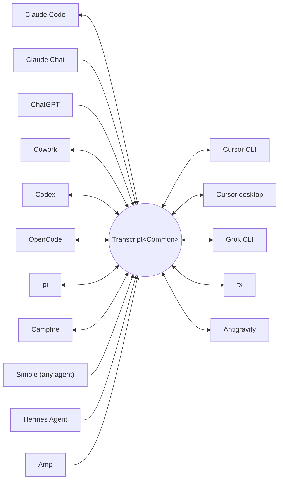

<p align="center">
  <picture>
    <source media="(prefers-color-scheme: dark)" srcset="../assets/wordmark-dark.svg">
    
  </picture>
</p>

<p align="center">一個在 harness 之間搬移工作階段的函式庫</p>

<p align="center">
  <a href="../../README.md">English</a> | <a href="README.ja.md">日本語</a> | <a href="README.zh-CN.md">简体中文</a> | 繁體中文 | <a href="README.ko.md">한국어</a> | <a href="README.de.md">Deutsch</a> | <a href="README.es.md">Español</a> | <a href="README.fr.md">Français</a> | <a href="README.it.md">Italiano</a> | <a href="README.pt-BR.md">Português (Brasil)</a> | <a href="README.ru.md">Русский</a> | <a href="README.mr.md">मराठी</a> | <a href="README.ta.md">தமிழ்</a>
</p>

<p align="center">
  <a href="https://crates.io/crates/txcript"></a>
  <a href="https://www.npmjs.com/package/txcript"></a>
  <a href="https://docs.rs/txcript"></a>
  <a href="https://github.com/skillsynchq/txcript/actions/workflows/ci.yml"></a>
  <a href="../../LICENSE"></a>
</p>

<p align="center">
  <a href="https://claude.com/claude-code"></a>
  &nbsp;&nbsp;&nbsp;&nbsp;
  <a href="https://github.com/openai/codex"></a>
  &nbsp;&nbsp;&nbsp;&nbsp;
  <a href="https://opencode.ai"></a>
  &nbsp;&nbsp;&nbsp;&nbsp;
  <a href="https://pi.dev"></a>
  &nbsp;&nbsp;&nbsp;&nbsp;
  <a href="https://cursor.com"></a>
  &nbsp;&nbsp;&nbsp;&nbsp;
  <a href="https://github.com/xai-org/grok-build"></a>
  &nbsp;&nbsp;&nbsp;&nbsp;
  <a href="https://ampcode.com"></a>
  &nbsp;&nbsp;&nbsp;&nbsp;
  <a href="https://antigravity.google"></a>
</p>

在 Claude Code 中開始一個工作階段，碰到用量上限或卡關時，改用 Codex 接著做 — 完整的對話、推理與工具歷史通通保留：

<p align="center">
  
</p>

txcript 透過一個具型別的共同模型來對應各個 harness 的原生紀錄格式。原生載入/儲存可做到位元組層級無損；跨 harness 轉換會在可用時保留訊息、推理、工具呼叫、工具結果、圖片、中繼資料與用量資訊。它以 [**CLI**](#cli)、[**Rust crate**](#rust-crate) 與 [**npm 套件**](#npm-套件) 形式發佈。

## 特色

- **16 個 harness，一個模型** — 所有格式都經由 `Transcript<Common>` 相互轉換，因此新增一個 harness 就等於把它接上其他所有 harness。
- **給其他所有人的格式** — txcript 從未聽過的 agent，只要輸出有文件說明的 [Simple](../formats/simple.md) 交換 JSON（一個檔案或一道串流，直接交給 txcript），其紀錄就能在任何支援的 harness 中接續。
- **位元組層級無損往返** — 以工作階段自身的格式載入並儲存，可以原樣重現。
- **隨處接續** — `txcript continue <id> --with <harness>` 會把工作階段改寫為另一個 harness 的原生格式並啟動它。原始工作階段絕不會被更動。
- **閱讀並攜帶工作階段** — `txcript view` 會在內建分頁器中開啟任一工作階段，在能繪製圖片的終端機上也會顯示圖片；`txcript export` 則把它寫成 Simple 文件，讓 `continue` 能在另一台機器上接手。
- **搜尋一切** — 對本機上的所有工作階段做逐字、不分大小寫的搜尋，可作為函式庫 API、單次 CLI 查詢或互動式選擇器使用。
- **MCP 伺服器** — `txcript mcp` 提供唯讀的 `list_sessions`、`search_sessions` 與 `read_session` 工具，讓 agent 能把過往的工作階段當作上下文來挖掘。
- **格式文件完備** — 每個 harness 的磁碟格式都寫在 [`docs/formats/`](../formats)，且每項主張都註明出處（官方文件、原始碼 permalink 或逆向工程筆記）。

## 支援的 harness



探索、列表、搜尋與 `view`，對每一個有後端儲存的 harness 都適用。CLI 與 WASM API 使用的就是這些 `id` 字串。

| Harness | id | 磁碟上的工作階段 | 原生格式 | 轉換 | 可接續至 | 文件 |
|---|---|---|---|:---:|:---:|---|
| [Claude Code](https://claude.com/claude-code) | `claude_code` | `~/.claude/projects/` | JSONL | ⇄ | ✓ | [規格](../formats/claude-code.md) |
| [Claude Chat](https://claude.ai) | `claude_chat` | 線上 `claude.ai` 帳號 <sup>4</sup> | 私有 web API | → | — <sup>4</sup> | [規格](../formats/claude-chat.md) |
| [ChatGPT](https://chatgpt.com) | `chatgpt` | 線上 `chatgpt.com` 帳號 <sup>5</sup> | 私有 web API | → | — <sup>5</sup> | [規格](../formats/chatgpt.md) |
| [Cowork](https://claude.com/product/cowork) | `cowork` | `<Claude app data>/local-agent-mode-sessions/` | 工作階段紀錄 + Claude Code JSONL | ⇄ | ✓ | [規格](../formats/cowork.md) |
| [Codex](https://github.com/openai/codex) | `codex` | `~/.codex/sessions/` | rollout JSONL | ⇄ | ✓ | [規格](../formats/codex.md) |
| [OpenCode](https://opencode.ai) | `opencode` | `~/.local/share/opencode/opencode.db` | SQLite | ⇄ | ✓ | [規格](../formats/opencode.md) |
| [pi](https://pi.dev) | `pi` | `~/.pi/agent/sessions/` | JSONL | ⇄ | ✓ | [規格](../formats/pi.md) |
| [Campfire](../formats/campfire.md) | `campfire` | `~/.campfire/agent/sessions/` | JSONL | ⇄ | ✓ | [規格](../formats/campfire.md) |
| [Cursor CLI](https://cursor.com/cli) | `cursor` | `~/.cursor/chats/` | SQLite | ⇄ | ✓ | [規格](../formats/cursor.md) |
| [Cursor desktop](https://cursor.com) | `cursor_desktop` | `<Cursor User dir>/globalStorage/` | SQLite | ⇄ | ✓ | [規格](../formats/cursor-desktop.md) |
| [Grok CLI](https://github.com/xai-org/grok-build) | `grok` | `~/.grok/sessions/` | JSON 工作階段目錄 | ⇄ | ✓ | [規格](../formats/grok.md) |
| [fx](https://fx.sh) | `fx` | `~/.fx/sessions/` | 事件記錄工作階段目錄 | ⇄ | ✓ | [規格](../formats/fx.md) |
| Hermes Agent | `hermes` | `~/.hermes/state.db` | SQLite | → | — <sup>3</sup> | [規格](../formats/hermes.md) |
| [Amp](https://ampcode.com) | `amp` | `~/.local/share/amp/threads/` | 對話串 JSON | → | — <sup>1</sup> | [規格](../formats/amp.md) |
| [Antigravity](https://antigravity.google) | `antigravity` | `~/.gemini/antigravity-cli/` | SQLite | ⇄ | ✓ | [規格](../formats/antigravity.md) |
| Simple | `simple` | — <sup>2</sup> | 交換 JSON | → | — <sup>2</sup> | [規格](../formats/simple.md) |

<sup>1</sup> Amp 的對話串保存在伺服器端，且 CLI 沒有匯入功能：工作階段可以*從* Amp 轉換，但無法接續至 Amp。

<sup>2</sup> Simple 是 txcript 自有的交換格式，也是上表未列出的任何 agent 的入口。它沒有應用程式，也沒有受管理的目錄：Simple 工作階段就是一份文件（檔案或 stdin），直接交給 `txcript continue`，之後接續的對話便存在於目標 harness 中。

<sup>3</sup> Hermes 的 `state.db` 在 txcript 中為唯讀，且 Hermes 沒有工作階段匯入指令：工作階段可以*從* Hermes 轉換，但無法接續至 Hermes。

<sup>4</sup> Claude Chat 是線上、僅能拉取的來源。在 macOS 上，明確指定 `--from claude_chat` 會自動沿用已登入的 Claude Desktop 工作階段；彙總探索不會連線 Claude Chat。不接受透過環境變數傳入的憑證。可選的 `TXCRIPT_CLAUDE_CHAT_ORGANIZATION_UUID` 會把探索限制在單一組織；否則使用應用程式目前作用中的組織。Claude Chat 沒有受支援的對話 API：txcript 讀取的是一個 Anthropic 可以觀察或限制的私有端點，且凡是直接呼叫探索的地方，Rust crate 都會在建置時發出警告。txcript 只讀不寫：它拒絕儲存、刪除、同一 harness 接續以及 `--with claude_chat`。Claude 在對話中產生的檔案會一併帶上；接續至 Claude Code 時，它們會寫在新工作階段旁邊，並以 Claude Code 的 artifact 形式呈現。不支援 Claude 的資料匯出 ZIP 與 `conversations.json`。

<sup>5</sup> ChatGPT 是線上、僅能拉取的來源。如同 Claude Chat 沿用 Claude Desktop，明確指定 `--from chatgpt` 會自動沿用 Codex 在 `CODEX_HOME/auth.json` 或 `~/.codex/auth.json` 管理的 ChatGPT 登入；該帳號可能與瀏覽器中登入的帳號不同。txcript 只會讀取該憑證檔案，絕不會更新或改寫它。彙總探索不會連線 ChatGPT，但可以直接讀取確切的對話 UUID，而不必列舉整個帳號。txcript 只讀不寫：它拒絕儲存、刪除、同一 harness 接續以及 `--with chatgpt`。ChatGPT 沒有受支援的對話 API，因此這種存取方式可能變更或受到限制。不支援 ChatGPT 的資料匯出封存檔。

## 安裝

**CLI**（安裝 `txcript` 執行檔）：

```sh
cargo install --git https://github.com/skillsynchq/txcript txcript-cli
# or from a checkout: cargo install --path cli
```

**Rust crate**：

```sh
cargo add txcript
```

**npm 套件**（預先建置的 WASM，不需要 Rust 工具鏈）：

```sh
bun add txcript     # or: npm install txcript
```

## CLI

探索本機工作階段，並在任一 harness 中接續其中之一：

```sh
txcript list                             # local sessions across every harness
    [--from <harness>]                    #   only this harness's sessions
    [--cwd <dir>]                         #   only sessions recorded under <dir>
    [-n <N>]                              #   at most N sessions
    [--since <when>] [--until <when>]     #   bound the session start time
txcript continue <id>[#range]            # continue <id>, then launch its harness
    [--with <harness>]                    #   ...continuing in <harness> instead
    [--from <harness>]                    #   scope the id lookup to one harness
    [--out <dir>]                         #   write under <dir>; implies --no-resume
    [--no-resume]                         #   write the session but don't launch
txcript continue <file|->[#range]        # continue a Simple document instead:
    --with <harness> [...]                #   a file, or stdin (`-`), from any agent
txcript view <id>[#range]                # view a session; compact text when piped
    [--from <harness>]                    #   scope the id lookup to one harness
    [--no-pager]                          #   print the terminal view directly
txcript export <id>[#range]              # write a session as a Simple document
    [--from <harness>]                    #   scope the id lookup to one harness
    [--out <file>]                        #   write to <file> instead of stdout
```

工作階段 id 可以是完整 id 的任何不會混淆的前綴，或該工作階段的確切標題。`txcript resume` 是 `continue` 的別名。`--since` 與 `--until` 接受 RFC 3339 時間戳記或純 `YYYY-MM-DD` 日期。

`continue` 會把工作階段寫到目標 harness 存放工作階段的位置，然後啟動該 harness 並把終端機交給它：

- 同一 harness：就地恢復原工作階段。
- 跨 harness（`--with`）：將工作階段改寫為目標的原生格式。寫出的永遠是一份副本；來源工作階段絕不會被修改或移除。
- 以 [Simple](../formats/simple.md) 文件取代 id — `txcript continue ./run.json --with claude_code`，或 `my-agent | txcript continue - --with claude_code` — 可用同樣方式帶入任何 agent 的紀錄；由於文件本身沒有所屬的 harness，`--with` 為必填。
- 啟動指令依 harness 而異，且可覆寫：將 `TRANSCRIPT_<HARNESS>_RESUME_CMD` 設為一個 `{id}` 樣板，例如 `TRANSCRIPT_CODEX_RESUME_CMD="codex resume {id}"`。

在終端機中，`view` 會開啟內建分頁器：`u`、`a`、`t` 與 `r` 分別隱藏或顯示使用者訊息、助理訊息、工具呼叫與推理；`]` 與 `[` 在訊息之間跳躍；`/` 搜尋目前顯示的內容。在能顯示圖片的終端機（Ghostty、kitty、WezTerm、Konsole）上，圖片會直接內嵌繪製。設定 `TXCRIPT_PAGER` 可改用外部分頁器，或傳入 `--no-pager` 直接印出檢視內容。經由管線或重新導向時，`view` 會印出與 MCP 伺服器提供的相同精簡文字。無論哪種方式，每則訊息都以 `── #N ──` 分隔線編號，`#range` 依這些印出的序號選取訊息，序號從 1 起算且頭尾皆含：

- `abc#7`：只取第 7 則訊息
- `abc#5-12`：第 5 到第 12 則訊息
- `abc#5-`：從第 5 則到結尾
- `abc#-10`：從開頭到第 10 則

`continue` 接受同樣的後綴，只把這些訊息作為新的工作階段接續。會把工具呼叫與其結果拆開的範圍會被拒絕，錯誤訊息會建議最接近的有效範圍。

`export` 會把工作階段寫為 [Simple](../formats/simple.md) 文件，輸出到 stdout 或 `--out <file>`。此文件是標準模型的完整呈現——`continue` 在 harness 之間攜帶的一切——脫離了任何 harness 存放工作階段的位置，因此可以作為一個檔案從一台機器移到另一台機器：

```sh
txcript export 0dc114bf --out session.json       # on this machine
txcript continue ./session.json --with claude_code   # on the other one
```

已記錄的工作目錄，如果在匯入端的機器上存在就會保留，否則會被 `continue` 執行所在的目錄取代。`export` 接受與 `view` 相同的 `#range` 後綴與 `--from` 範圍。

### 搜尋

```sh
txcript query 'relay bug'                # one-shot: ranked hits, highlighted
txcript query                            # interactive picker; Enter continues
    [--from <harness>]                   #   search only <harness> (default: all)
    [--with <harness>]                   #   continue the pick in <harness>
    [--cwd <dir>]                        #   only sessions recorded under <dir>
```

模式會逐字且不分大小寫地比對：`relay bug` 會找出包含這段確切文字（含空格）的行。

在選擇器中，輸入即可過濾，以方向鍵 / ctrl-p/n 移動，Enter 在其原本的 harness（或 `--with` 指定者）中接續所選項目，Esc 取消。每一列都會顯示比對到的內容種類：使用者文字、助理文字、思考、工具呼叫、工具輸出，或工作階段中繼資料。

沒有快取時，每次執行都會重新讀取所有工作階段。傳入 `--cache <path>`（或設定 `TXCRIPT_CACHE`）可在該路徑保留持久的搜尋快取，讓 `query` 與 MCP 搜尋工具只重新讀取自上次執行以來有變動的工作階段。所有子指令都接受這個旗標。

### MCP 伺服器

```sh
txcript mcp                              # stdio transport
```

提供三個唯讀工具；其可選的篩選參數與 CLI 一致：

- `list_sessions(from?, cwd?, limit?, offset?)`
- `search_sessions(pattern, from?, cwd?)`
- `read_session(id, from?)`

<sub>\* 省略 `from` 會涵蓋所有 harness；省略 `cwd` 則不套用目錄篩選。沒有記錄工作目錄的工作階段，只有在省略 `cwd` 時才會被比對到。</sub>

`list_sessions` 以 `limit` 與 `offset` 分頁，並在分頁前回報總數；線上的 Claude Chat 與 ChatGPT 來源絕不會被列出。`read_session` 接受與 `view` 相同的 `#range` 後綴並回傳相同的精簡文字；大到無法一次完整回傳的讀取會被拒絕，並附上建議的子範圍。`--cache` 同樣適用於伺服器。

### Shell 整合

```sh
eval "$(txcript init zsh)"                      # in ~/.zshrc; or: txcript init bash
```

`init` 會印出自動補全，外加一個 ctrl+shift+r 快捷鍵，用來開啟只涵蓋目前資料夾中所記錄工作階段的選擇器。若只需要自動補全，`completion` 支援 bash、elvish、fish、powershell 與 zsh：

```sh
txcript completion zsh > ~/.zfunc/_txcript      # or wherever your fpath looks
source <(txcript completion bash)               # bash, ad hoc
txcript completion fish > ~/.config/fish/completions/txcript.fish
```

## Rust crate

```toml
[dependencies]
txcript = "0.12"
# Codecs only: drops the SQLite-backed stores, the live Claude Chat and
# ChatGPT sources, and search. Every codec stays available.
# txcript = { version = "0.12", default-features = false }
```

預設 feature：`opencode`（SQLite 儲存：OpenCode、兩種 Cursor、Antigravity）、`hermes`、`claude_chat`、`chatgpt` 與 `search`。

三個層次，由小到大：

- `Codec`：各 harness 的 `to_common` / `from_common`；`convert::<A, B>` 透過標準模型將它們串接起來。
- `TextCodec`：`from_text` / `to_text`，解析並輸出 harness 的原生工作階段文字，不涉及 I/O。
- `Store`：針對實際後端進行探索/載入/儲存（工作階段目錄，或 OpenCode、Hermes、兩種 Cursor 與 Antigravity 的 SQLite 資料庫）。

在記憶體中轉換（不經過檔案系統）：

```rust
use txcript::harness::{claude_code, codex};
use txcript::{Codec, TextCodec, convert};

let claude = claude_code::ClaudeCode::from_text(jsonl_text)?;          // Transcript<ClaudeCode>
let codex = convert::<claude_code::ClaudeCode, codex::Codex>(&claude)?; // Transcript<Codex>
let codex_text = codex::Codex::to_text(&codex)?;                       // native rollout JSONL
```

或者透過 `Store` 經由磁碟：

```rust
use txcript::harness::{claude_code, codex};
use txcript::{Store, convert};

let store = claude_code::ClaudeStore::default_root().expect("home dir");
let found = store.discover()?;                       // cheap metadata scan
let claude = store.load(&found[0].reference)?;       // Transcript<ClaudeCode>

let codex = convert::<_, codex::Codex>(&claude)?;
codex::CodexStore::default_root().expect("home dir").save(&codex)?;  // resumable on disk
```

標準模型是 `Transcript<Common>` — 即 `Meta` + `Vec<Message>`，其中 `Message` 持有具型別的 `Block`（`Text`、`Thinking`、`ToolUse`、`ToolResult`、`Image`）與一個具型別的 `Tool` 列舉。

使用者在 harness 中執行的斜線指令（`/release patch`）同樣是標準格式的一部分：在使用者回合上是一次 `Tool::Command` 呼叫，並與該指令回印的內容配對，作為它的 `ToolResult`。

### 搜尋（`search` feature，預設啟用）

`txcript::search` 支援對紀錄的模糊搜尋（fzf 風格語法）與子字串搜尋。單次搜尋：

```rust
use txcript::search::{Query, search};

let hits = search(&common, &Query::substring("relay bug"));  // or Query::fuzzy for fzf syntax
for hit in hits {
    // hit.origin: User | Assistant | Thinking | ToolUse | ToolResult | Meta
    // hit.span addresses the message; hit.highlights are char ranges into hit.line
    let messages = common.fragment(&hit.span);            // zero-copy: Option<&[Message]>
}
```

若要做選擇器式搜尋，先建立一次 `Index`，再於每次按鍵時查詢：

```rust
use txcript::search::{DocKey, Index, Query};

let mut index = Index::new();
index.insert(DocKey { harness, id }, &common);   // re-insert replaces; caller owns refresh
let matches = index.query(&Query::fuzzy("srch")); // ranked docs, best lines as hits
```

空的模式會以最新在前回傳文件。工具輸出預設被排除；使用 `Origin::ALL` 可將其納入。`Query.harnesses`、`Query.limit` 與 `Query.hits_per_doc` 可縮小結果範圍。

### 文字投影

`txcript::text::to_text(&common)` 是 [`txcript view`](#cli) 背後的投影：以單向、節省 token 的方式呈現 `Transcript<Common>`，供作為 LLM 上下文使用。它保留訊息、推理文字與精簡的工具呼叫/結果；僅供重播用的內容（加密推理、用量統計、內嵌圖片位元組）則會省略。`to_text_fragment(&common, &span)` 會輸出內文的一個 `Span`，並保留每則訊息在完整工作階段中的序號。

## npm 套件

npm 套件將 codec 部分建置成預先編譯的 WASM，供 Bun 與 Node 使用。它在記憶體中轉換工作階段文字；在磁碟上探索、讀取與寫入工作階段是呼叫端的工作，因此這個套件沒有 `Store`。

```ts
import { convert, toCommon, fromCommon, harnesses } from "txcript";
import { readFileSync, writeFileSync } from "node:fs";

const input = readFileSync("rollout.jsonl", "utf8");

// native -> native (e.g. a Codex rollout into Claude Code's JSONL)
writeFileSync("session.jsonl", convert(input, "codex", "claude_code"));

// canonical view, and back
const common = JSON.parse(toCommon(input, "codex"));   // { meta, messages }
const pi = fromCommon(JSON.stringify(common), "pi");

harnesses(); // ["claude_code","claude_chat","chatgpt","codex","opencode","pi","campfire","cursor","cursor_desktop","grok","fx","hermes","amp","antigravity","simple","cowork"]
```

文字進 / 文字出：`input` 是來源 harness 的原生工作階段文字，結果則是目標的。無效的 harness 名稱或無法解析的輸入會擲回 JS `Error`。

搜尋功能也一併提供。查詢是 crate 中 `Query` 的 JSON 形式：只有 `pattern` 為必填，`mode` 除非設為 `"substring"`，否則為 `"fuzzy"`：

```ts
import { searchTranscript, Searcher } from "txcript";

// one session, one shot: a JSON array of hits
const hits = JSON.parse(searchTranscript(input, "codex", JSON.stringify({ pattern: "relay bug", mode: "substring" })));

// picker-style: index once, query per keystroke
const index = new Searcher();
index.insert("codex", "0dc114bf", input);          // re-insert replaces
const matches = JSON.parse(index.query(JSON.stringify({ pattern: "relay bug" })));
```

| Harness | 工作階段文字 |
|---|---|
| `claude_code`, `codex`, `pi`, `campfire` | 工作階段 JSONL |
| `claude_chat` | 單一線上對話的詳細回應（僅作為來源；不含帳號匯出陣列） |
| `chatgpt` | 單一線上對話的詳細回應（僅作為來源；不含帳號匯出陣列） |
| `opencode` | `opencode export` 輸出的 JSON |
| `cursor` | 該工作階段 `store.db` 的 JSON 匯出 |
| `cursor_desktop` | 該工作階段 `state.vscdb` 資料列的 JSON 傾印 |
| `grok` | 工作階段目錄中各檔案打包成的 JSON |
| `fx` | 工作階段目錄中各檔案打包成的 JSON |
| `hermes` | `hermes sessions export` 輸出的 JSON 物件 |
| `amp` | `amp threads export` 輸出的 JSON |
| `antigravity` | 對話資料庫的 JSON 傾印，protobuf blob 以十六進位編碼 |
| `simple` | [Simple](../formats/simple.md) 交換 JSON 文件 |
| `cowork` | 工作階段紀錄、Claude Code 紀錄與稽核記錄打包成的 JSON |

若要改為從原始碼建置 wasm：

```sh
git clone https://github.com/skillsynchq/txcript.git
cd txcript
bun run setup        # once: wasm target + wasm-bindgen-cli
bun run build        # produces ./pkg
```

## 格式文件

這些紀錄格式並非都有官方文件。[`docs/formats/`](../formats) 為每個 harness 提供一份文件，內容涵蓋工作階段在磁碟上的位置、探索機制如何找到它們、對格式各部分的逐一剖析及其特殊之處，且每項主張都標註了出處：官方文件、harness 自身的開源序列化程式碼（附有釘選到特定 commit 的 permalink），或逆向工程。

## 開發

```sh
cargo test --workspace --all-features               # what CI runs
cargo test -p txcript --no-default-features         # codecs only: no SQLite or live stores
bun run build && bun examples/convert.ts <file> <from> <to>
git config core.hooksPath .githooks                 # pre-push runs the CI checks
```

執行檔位於獨立的 workspace crate（`cli/`，套件名 `txcript-cli`）；位於根目錄的函式庫不帶有它的任何相依套件。

## 授權條款

[Apache-2.0](../../LICENSE)
